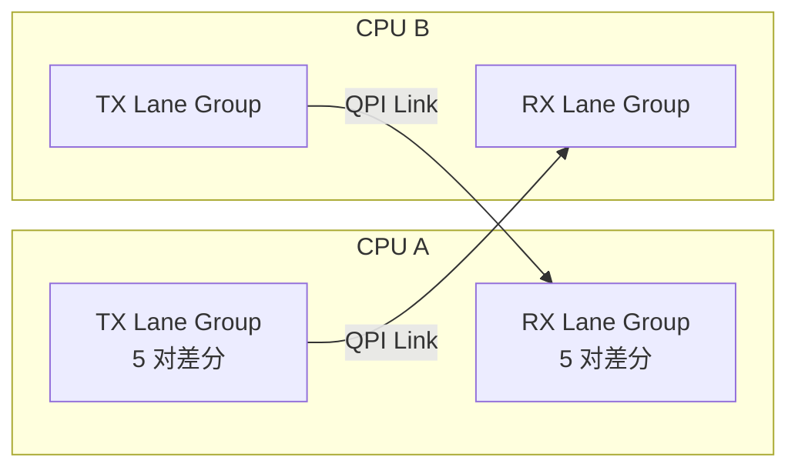
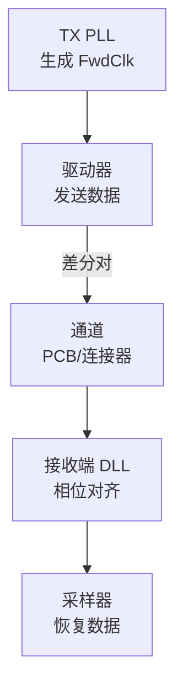

# QPI 电气特性与速率 [E]

> **本章学习目标**：
> - 理解QPI 信号定义的电气参数与差分传输机制
> - 掌握 QPI 各速率等级的带宽计算与时钟架构
> - 了解 QPI 与 UPI 在信号设计与速率上的关键差异

---

## QPI 信号定义

---

### <strong>总线架构与信号分组</strong>

E 
QPI（QuickPath Interconnect）是 Intel 推出的点对点处理器互联总线，替代传统的共享前端总线（FSB）。 
每条 QPI 链路（Link）由 20 对差分信号组成，分为数据传输与链路控制两组。 

QPI 的点对点架构消除了 FSB 时代的总线仲裁瓶颈，为 NUMA 架构奠定电气基础。 

---

### <strong>信号定义详解</strong>

E 
QPI 信号线按功能分为三大组：数据 Lane、时钟/控制 Lane、电源/地。 

**表 2-1：QPI 信号定义表**

| 信号组 | 信号名 | 方向 | 对数 | 功能说明 |
| --- | --- | --- | --- | --- |
| 数据 | Dn[19:0] | 双向 | 20 | 20 对差分数据 Lane |
| 时钟 | FwdClk | 单向×2 | 2 | 发送端前向时钟 |
| 控制 | TxSB/RxSB | 双向 | 2 | 链路状态边带信号 |
| 电源 | VCC/VCCQ | — | — | 核心/IO 电源 |
| 地 | VSS | — | — | 信号/电源地 |

<strong>1. 数据 Lane（Dn[19:0]）</strong> 
* 每对差分线承载 1 bit 数据，共 20 bit 并行传输。 
* 采用嵌入式时钟架构，数据流中嵌入时钟恢复信息，无需独立高速时钟线。 

<strong>2. 前向时钟（FwdClk）</strong> 
* 由发送端产生，与数据保持固定相位关系，供接收端进行 CDP（Clock Data Recovery）。 
* FwdClk 频率为数据速率的一半（DDR 架构）。 

<strong>3. 边带信号（TxSB/RxSB）</strong> 
* 用于链路初始化、复位、电源管理与错误上报。 
* 工作于低速 CMOS 电平，独立于主数据通道。 

---

### <strong>电气参数</strong>

E 
QPI 电气规范定义了差分摆幅、共模电压、终端匹配等关键参数。 

**表 2-2：QPI 电气参数**

| 参数 | 最小值 | 典型值 | 最大值 | 单位 |
| --- | --- | --- | --- | --- |
| 差分摆幅（Vdiff） | 400 | — | 800 | mV |
| 共模电压（Vcm） | 600 | — | 900 | mV |
| 上升/下降时间 | — | — | 50 | ps |
| 通道插入损耗 | — | — | -12 | dB |
| 终端电阻（RT） | — | 50 | — | Ω |
| 工作温度 | 0 | — | 85 | ℃ |

QPI 采用 AC 耦合与片内终端匹配，接收端需在片内完成共模电压恢复。 

---

## QPI 速率等级

---

### <strong>速率演进历程</strong>

E 
QPI 速率从第一代 4.8 GT/s 发展到第三代 9.6 GT/s，每代带宽翻倍。 

**表 2-3：QPI 速率演进表**

| 代际 | 速率 | 编码方式 | 有效带宽/Link | 推出年份 | 代表平台 |
| --- | --- | --- | --- | --- | --- |
| QPI 1.0 | 4.8 GT/s | 80b/64b | 19.2 GB/s | 2008 | Nehalem |
| QPI 1.1 | 6.4 GT/s | 80b/64b | 25.6 GB/s | 2010 | Westmere |
| QPI 2.0 | 8.0 GT/s | 80b/64b | 32.0 GB/s | 2012 | Sandy Bridge-EP |
| QPI 2.0+ | 9.6 GT/s | 80b/64b | 38.4 GB/s | 2014 | Haswell-EP |

类比：QPI 的速率演进如同高速公路从四车道扩建为八车道——车道数（Lane）不变，但每辆车的速度（GT/s）翻倍，总通行量随之翻倍。 

<strong>1. 带宽计算方法</strong> 
* 单 Link 带宽 = 速率（GT/s）× 每 Transfer 承载的有效字节 × 方向数。 
* 80b/64b 编码：每 80 bit 传输 64 bit 有效数据，编码效率 80%。 
* 以 9.6 GT/s 为例：9.6 × 10⁹ × 8 Byte × 2（双发）× 0.8 = 38.4 GB/s。 

<strong>2. 时钟架构</strong> 
* QPI 采用源同步时钟（Source Synchronous Clocking），时钟与数据同源输出。 
* 接收端通过 DLL（Delay Locked Loop）对齐采样时刻，补偿通道延迟。 

---

## QPI 与 UPI 的差异

---

### <strong>从 QPI 到 UPI 的演进</strong>

E 
UPI（Ultra Path Interconnect）是 Intel 在 Skylake-SP 平台推出的 QPI 继任者，面向多路服务器。 

**表 2-4：QPI 与 UPI 关键差异对比**

| 特性 | QPI 2.0 | UPI 1.0 | UPI 2.0 |
| --- | --- | --- | --- |
| 最高速率 | 9.6 GT/s | 10.4 GT/s | 16.0 GT/s |
| 编码方式 | 80b/64b | 128b/130b | 128b/130b |
| 编码效率 | 80% | 98.4% | 98.4% |
| 每 Link Lane 数 | 20 | 20 | 20 |
| 缓存一致性协议 | MESIF | MESIF+ | MESIF+ |
| 电压摆幅 | 差分 800mV | 差分 600mV | 差分 500mV |
| 引入年份 | 2014 | 2017 | 2020 |

UPI 的核心改进是引入 128b/130b 编码（类似 PCIe 3.0），将编码效率从 80% 提升至 98.4%，相同速率下有效带宽提升约 23%。 

<strong>1. 编码效率差异</strong> 
* QPI 的 80b/64b 编码开销较大，每传输 64 bit 数据需附带 16 bit 控制信息。 
* UPI 的 128b/130b 仅附加 2 bit Sync 头，Payload 占比极高。 

<strong>2. 电气差异</strong> 
* UPI 降低了差分摆幅（从 800 mV 降至 500 mV），进一步降低功耗与 EMI。 
* 但更低的摆幅对通道噪声裕量（Noise Margin）要求更严苛，需更高质量的 PCB 与连接器。 

<strong>3. 兼容性</strong> 
* QPI 与 UPI 在物理引脚层面不兼容，SoC 与主板需同步更换。 
* 但软件层面的缓存一致性协议保持向后兼容，操作系统无需修改。 

---

## 本章小结

| 小节 | 核心要点 |
| --- | --- |
| QPI 信号定义 | 20 对差分数据+2 对 FwdClk+边带，AC 耦合终端匹配 |
| QPI 速率等级 | 4.8→6.4→8.0→9.6 GT/s 四代演进，80b/64b 编码 |
| QPI 与 UPI 差异 | UPI 采用 128b/130b 编码，效率 98.4%，摆幅更低 |

---

## 练习

1. **带宽计算**：某双路服务器使用 QPI 2.0（9.6 GT/s），每 CPU 有 2 条 QPI Link。计算 CPU 间最大理论互联带宽。若升级为 UPI 2.0（16.0 GT/s），带宽提升百分比是多少？

2. **信号分析**：QPI 与 DDR 内存总线在电气层面有何异同？从差分/单端、终端匹配、编码方式三个维度进行对比。

3. **故障排查**：某 QPI Link 在 9.6 GT/s 下偶发 CRC 错误，降至 8.0 GT/s 后错误消失。列出 3 个可能的物理层原因及排查方法。
