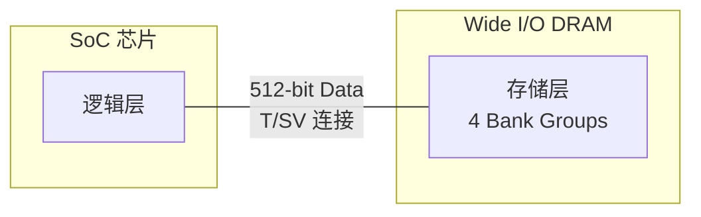
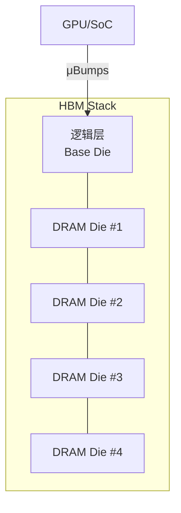

# OPI 与宽 I/O DRAM [M]

> **本章学习目标**：
> - 理解OPI（On-Package Interface）的引脚数优势与封装集成方式
> - 掌握 Wide I/O DRAM 的 4 倍引脚宽度与功耗降低原理
> - 了解 3D 堆叠内存（HBM）的硅通孔技术与带宽突破

---

## OPI 引脚数对比

---

### <strong>OPI 的定义与定位</strong>

M 
OPI（On-Package Interface）是 Intel 为低功耗封装内互联定义的接口标准，面向移动与嵌入式 SoC。
 
OPI 的核心设计目标是在极短距离内实现高带宽、低引脚数、低功耗的数据传输。
 

类比：OPI 如同公寓楼内的内部电梯——距离短、速度快、无需复杂的对外交通系统。 

**表 4-1：OPI 与传统内存接口引脚数对比**

| 接口 | 数据引脚数 | 地址/命令引脚数 | 总引脚数 | 典型带宽 | 应用场景 |
| --- | --- | --- | --- | --- | --- |
| DDR4 | 64 | ~40 | ~104 | 25.6 GB/s | 台式机/服务器 |
| LPDDR4 | 32 | ~20 | ~52 | 17.1 GB/s | 手机/平板 |
| OPI | 16 | ~8 | ~24 | 25.6 GB/s | 嵌入式 SoC |
| Wide I/O | 512 | ~40 | ~552 | 12.8 GB/s | 移动 GPU |
| HBM2 | 1024 | ~80 | ~1104 | 307 GB/s | 高性能计算 |

<strong>1. 引脚效率对比</strong> 
* OPI 以 24 根引脚实现与 DDR4 相近的带宽，引脚效率提升约 4 倍。 
* 引脚数的减少直接降低封装成本与 PCB 层数需求。 

<strong>2. 短距传输优势</strong> 
* OPI 用于封装内（On-Package）或相邻封装间，走线长度 < 25 mm。 
* 短距允许更低的驱动电压与更简化的终端匹配。 

---

### <strong>OPI 电气与协议特征</strong>

M 
OPI 电气规范针对封装内环境优化，与板级接口有显著差异。 

**表 4-2：OPI 电气参数**

| 参数 | 数值 | 说明 |
| --- | --- | --- |
| 信号电平 | 0.4V | 低摆幅降低功耗 |
| 单端/差分 | 单端 | 短距无需差分抗干扰 |
| 速率/引脚 | 1.6 Gbps | 每数据引脚 |
| 编码 | 8b/10b | 保证 DC 平衡 |
| 功耗/GB/s | ~0.5 pJ/bit | 远低于 DDR4 的 ~5 pJ/bit |

OPI 的功耗优势源于两点：极低电压摆幅 + 无 PCB 长距离驱动器。 

---

## Wide I/O DRAM

---

### <strong>Wide I/O 架构</strong>

M 
Wide I/O DRAM（JEDEC JESD229）是面向移动设备的低功耗内存标准，核心特征是超宽数据总线。 

Wide I/O 的 512-bit 总线宽度是 DDR4 的 8 倍，在较低频率下即可实现高带宽，同时大幅降低每 bit 功耗。 

**表 4-3：Wide I/O 关键参数**

| 参数 | Wide I/O 1 | Wide I/O 2 |
| --- | --- | --- |
| 数据宽度 | 512 bit | 512 bit |
| 频率 | 200 MHz | 400 MHz |
| 带宽 | 12.8 GB/s | 25.6 GB/s |
| 通道数 | 4 | 4 |
| 每通道 Bank | 4 | 8 |
| 电压 | 1.2V | 1.1V |
| 封装方式 | PoP（Package on Package） | 3D TSV |

<strong>1. 4× 通道并行</strong> 
* 512-bit 总线分为 4 个独立 128-bit 通道，可独立访问不同 Bank。 
* 支持多通道并发读写，提升总线利用率。 

<strong>2. PoP 封装</strong> 
* Wide I/O 1 采用 Package on Package 堆叠，DRAM 叠放在 SoC 上方。 
* 通过金球（Solder Ball）阵列连接，引脚密度极高。 

---

## 3D 堆叠内存

---

### <strong>HBM 堆叠结构</strong>

M 
HBM（High Bandwidth Memory）是 Wide I/O 技术的商业化延伸，面向 GPU/AI 加速器。 

HBM 通过 TSV（Through-Silicon Via）穿透硅片实现垂直互联，每层 Die 通过微凸点（μBump）与相邻层连接。 

**表 4-4：HBM 代际演进**

| 代际 | HBM1 | HBM2 | HBM2E | HBM3 | HBM3E |
| --- | --- | --- | --- | --- | --- |
| 堆叠层数 | 4 | 4/8 | 8 | 12 | 12 |
| 每堆叠容量 | 1 GB | 4/8 GB | 16 GB | 24 GB | 36 GB |
| 总带宽 | 128 GB/s | 307 GB/s | 460 GB/s | 819 GB/s | 1.2 TB/s |
| 引脚数 | 1024 | 1024 | 1024 | 1024 | 1024 |
| 电压 | 1.2V | 1.2V | 1.2V | 1.1V | 1.1V |

<strong>1. TSV 技术</strong> 
* TSV 直径约 5~10 μm，贯穿整个硅片厚度（约 50~100 μm）。 
* 每颗 HBM Die 含数万个 TSV，实现极高的垂直互联密度。 

<strong>2. 硅中介层（Silicon Interposer）</strong> 
* GPU/SoC 与 HBM 通过硅中介层连接，而非传统 PCB。 
* 中介层走线精度达亚微米级，支持数千引脚的高密度布线。 

<strong>3. 热管理挑战</strong> 
* 多层堆叠导致散热路径长，中心 Die 温度最高。 
* 需采用微流道液冷或热电制冷（TEC）辅助散热。 

---

## 本章小结

| 小节 | 核心要点 |
| --- | --- |
| OPI 引脚数对比 | 24 引脚实现 25.6 GB/s，引脚效率是 DDR4 的 4 倍，0.4V 低摆幅 |
| Wide I/O DRAM | 512-bit 超宽总线，4 通道并行，PoP/TSV 封装，面向移动端 |
| 3D 堆叠内存 | HBM 通过 TSV 垂直堆叠，HBM3E 达 1.2 TB/s，硅中介层互联 |

---

## 练习

1. **引脚效率计算**：对比 DDR4-3200（64 bit，104 引脚）与 OPI（16 bit，24 引脚）的每引脚带宽效率。假设 DDR4 带宽 25.6 GB/s，OPI 带宽 25.6 GB/s，计算 MB/s per pin。

2. **热设计**：某 HBM2E 堆叠含 8 层 Die，每层功耗 3W。若仅通过顶部散热，中心 Die 的温升估算约为多少？给出 2 个改善散热的封装级方案。

3. **成本分析**：Wide I/O 2 的 TSV 封装成本约为传统 PoP 的 3 倍。从带宽、功耗、面积三个维度论证，在什么场景下 TSV 封装具有总成本优势？
