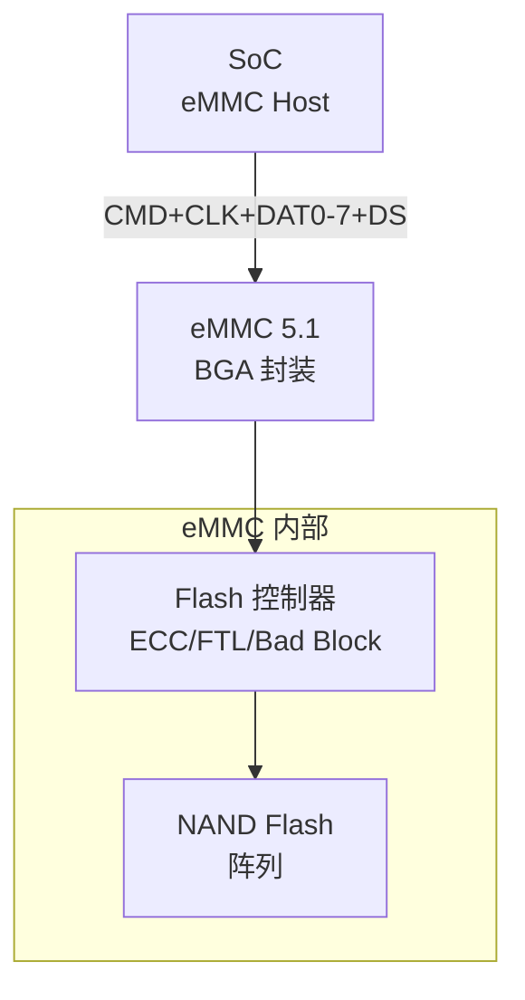
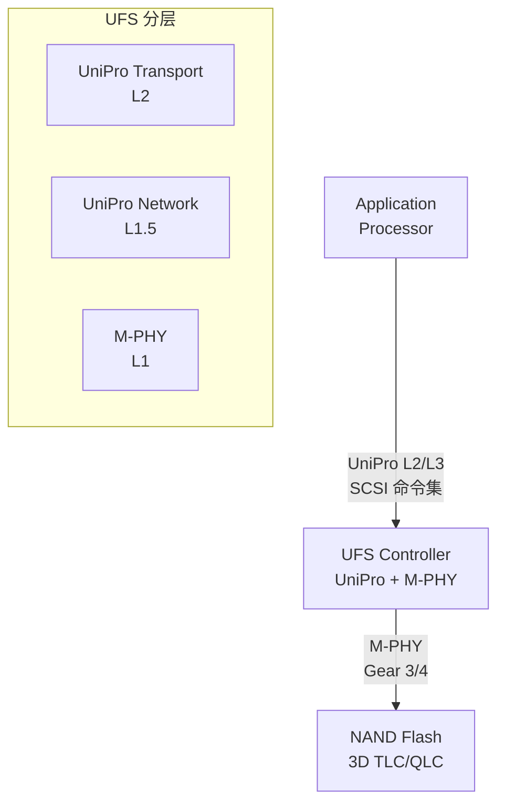
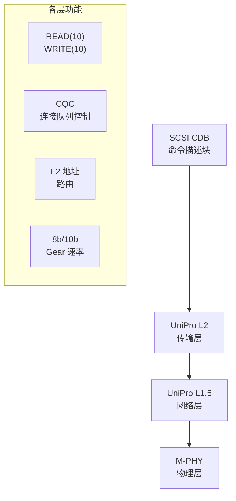

# eMMC 与 UFS 基础认知与演进 [I→E]

[I] [E]

> **本章学习目标**：
> - 理解 eMMC 从 MMC 演进的完整脉络与 HS400 时序
> - 掌握 UFS（Universal Flash Storage） 的 M-PHY + UniPro 分层架构
> - 了解 UFS 相比 eMMC 的性能优势与手机存储演进路线

---

## eMMC 的诞生：嵌入式封装的存储标准

---

### <strong>为什么需要 eMMC：统一嵌入式 NAND 接口</strong>

eMMC由 JEDEC 在 2006 年发布标准，
前身是 1997 年的 MMC（MultiMediaCard）。

在 eMMC 出现之前，嵌入式 NAND Flash 的接口各家不同：
 
* NAND 裸片：需要 SoC 集成复杂的 Flash 控制器（ECC/Bad Block/FTL）
 
* OneNAND：三星私有，已淘汰
 
* Raw NAND：不同厂商的时序不同，驱动难以通用
 

eMMC 的核心创新：将 NAND Flash + Flash 控制器 + 标准接口封装在一起，SoC 只需实现标准 MMC 控制器即可。
 

类比：eMMC 如同"自带操作系统的硬盘"——你不需要关心硬盘内部怎么寻道、怎么纠错，只需按标准接口发命令即可。
 

---

### <strong>eMMC 的物理层：153-ball BGA 与信号定义</strong>

eMMC使用 153-ball BGA 封装（11×11mm 或 14×18mm）：

| 信号组 | 引脚 | 说明 |
| --- | --- | --- |
| DAT0-7 | 8 | 数据线（HS400 用 8-bit） |
| CMD | 1 | 命令/响应线 |
| CLK | 1 | 时钟（0~200MHz） |
| DS | 1 | Data Strobe（HS400 专用，读数据同步） |
| VCC/VCCQ/VSS | 多 | 核心/IO/地电源 |

HS400 的关键改进：引入 Data Strobe（DS）信号，与 CLK 同频但专门用于读数据同步，消除 CLK 到数据的路径延迟。
 

---

### <strong>从 eMMC 到 UFS：手机存储的性能革命</strong>

UFS由 JEDEC 在 2011 年发布（UFS 1.0），
定位是替代 eMMC 成为旗舰手机存储标准。

| 特性 | eMMC 5.1 | UFS 3.1 | UFS 4.0 | 差异原因 |
| --- | --- | --- | --- | --- |
| 接口 | 并行 8-bit | 串行 M-PHY | 串行 M-PHY | 串行抗干扰更好 |
| 双工 | 半双工 | 全双工 | 全双工 | 同时读写 |
| 速率 | 400 MB/s | 2.9 GB/s | 4.6 GB/s | 串行速率更高 |
| 命令队列 | 单队列 | 32 队列 | 32 队列 | NCQ 类似 SATA |
| 低功耗 | 无 | 深度睡眠 | 深度睡眠 | 手机续航需求 |

UFS 使用 SCSI 命令集（与 SATA SSD 相同），而非 eMMC 的 MMC 命令集。这带来了更成熟的队列管理和错误处理机制。
 

---

## UFS 的分层架构

---

### <strong>UniPro + M-PHY：三层堆栈</strong>

UFS 协议栈分为三层：

| 层级 | 协议 | 功能 |
| --- | --- | --- |
| 应用层 | SCSI | 命令集（READ/WRITE/INQUIRY） |
| 传输层 | UniPro L2 | 流量控制、差错控制、重传 |
| 物理层 | M-PHY | 高速串行传输、低功耗状态 |

---

## 本章小结

| 概念 | 一句话总结 |
| --- | --- |
| eMMC | 嵌入式 MMC，BGA 封装，HS400 达 400MB/s |
| UFS | JEDEC 2011 年发布的串行存储标准，全双工 |
| M-PHY | MIPI 物理层，Gear 1/2/3/4 速率 |
| UniPro | MIPI 传输层，流量控制 + 差错控制 |
| SCSI | UFS 使用 SCSI 命令集，非 MMC 命令 |
| Gear 速率 | M-PHY 速率等级，Gear 3=5.8Gbps，Gear 4=11.6Gbps |

---

## 练习

1. 为什么 UFS 使用串行接口但带宽比并行的 eMMC 更高？画出两者信号线对比。
2. UFS 的 SCSI 命令集与 eMMC 的 MMC 命令集各有什么优劣？
3. 在手机主板上，eMMC 和 UFS 的 BGA 封装引脚数分别是多少？为什么 UFS 引脚更少但带宽更高？
