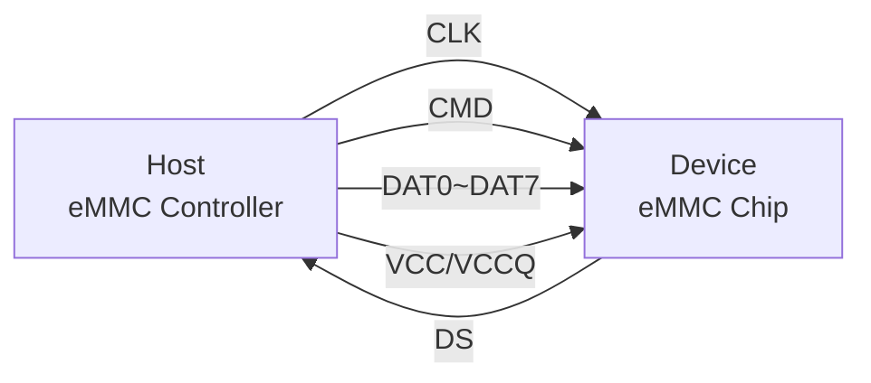
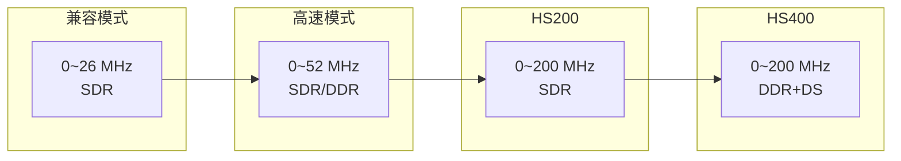
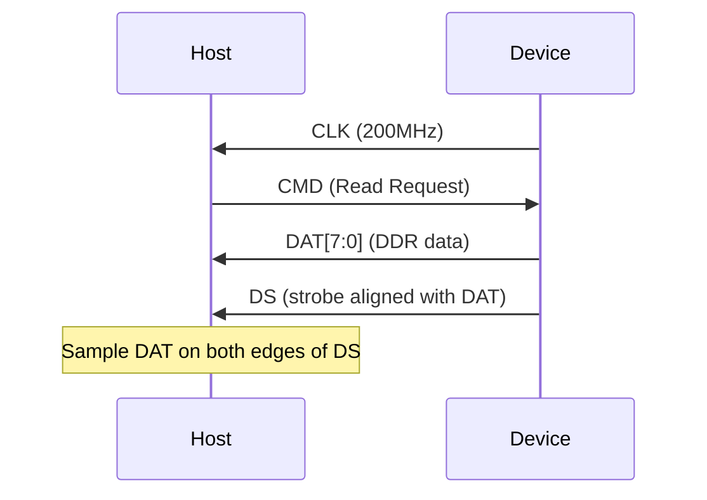

# eMMC 时序与 HS400 [I]

> **本章学习目标**：
> - 理解<span class="red">eMMC 总线时序</span>的各阶段信号关系与时序约束
> - 掌握 HS200 与 HS400 模式的电气差异与速率演进
> - 理解 Data Strobe 信号在 HS400 模式中的核心作用

---

## eMMC 总线时序基础

---

### <strong>总线架构与信号定义</strong>

<span class="badge-i">I</span><br>
<span class="red">eMMC 总线</span>采用 11 线并行架构，由主机（eMMC Host）与设备（eMMC Device）点对点连接。<br>
信号线分为时钟、命令、数据与电源四大类，每条信号线均有严格的时序约束。<br>



<span class="blue">总线信号的电气耦合方式直接决定了时序分析的复杂度。</span><br>

<span class="orange"><strong>1. 时钟信号 CLK</strong></span><br>
CLK 是全部总线操作的时序基准，由 Host 持续输出。<br>
在 HS400 模式下，CLK 最高可达 200 MHz。<br>
设备在 CLK 的上升沿或下降沿采样 CMD/DAT，取决于工作模式。<br>

<span class="orange"><strong>2. 命令信号 CMD</strong></span><br>
CMD 为双向开漏/推挽信号，用于传输命令帧与响应帧。<br>
初始化阶段使用开漏模式（OD），上拉电阻决定上升时间。<br>
数据传输阶段切换为推挽模式（PP），以获得更快的边沿速率。<br>

<span class="orange"><strong>3. 数据信号 DAT0~DAT7</strong></span><br>
DAT 总线同样为双向，支持 1-bit、4-bit、8-bit 三种总线宽度。<br>
在 DDR（双倍数据速率）模式下，DAT 在 CLK 的上升沿与下降沿均传输数据。<br>

<span class="orange"><strong>4. Data Strobe 信号 DS</strong></span><br>
DS 是 eMMC 5.0 引入的新信号，仅用于 HS400 模式。<br>
由 Device 输出，Host 利用 DS 进行接收数据的精确对齐。<br>

---

### <strong>时序参数体系</strong>

<span class="badge-i">I</span><br>
eMMC 规范定义了一套完整的<span class="red">时序参数</span>，覆盖命令响应、数据读写、总线切换等全生命周期。<br>
核心参数均以 ns（纳秒）或 UI（Unit Interval，即时钟周期）为单位。<br>

**表 2-1：eMMC 关键时序参数汇总**

| 参数名 | 说明 | 兼容模式 | HS200 | HS400 |
| --- | --- | --- | --- | --- |
| f_CLK | 时钟频率 | 0~52 MHz | 0~200 MHz | 0~200 MHz |
| t_is | 输入建立时间 | 3 ns | 1.4 ns | 0.8 ns |
| t_ih | 输入保持时间 | 3 ns | 0.8 ns | 0.8 ns |
| t_odly | 输出延迟 | 14 ns | 1.5 ns | 参考 DS |
| t_R | 信号上升时间 | ≤3 ns | ≤0.85 ns | ≤0.85 ns |
| t_F | 信号下降时间 | ≤3 ns | ≤0.85 ns | ≤0.85 ns |
| t_SU | CMD 响应建立时间 | 2 ns | 1.4 ns | 1.4 ns |

<span class="blue">建立时间与保持时间共同构成数据可靠采样的时序窗口。</span><br>

<span class="green">t_is</span> 表示数据在 CLK 采样沿之前必须稳定的最短时间。<br>
<span class="green">t_ih</span> 表示数据在 CLK 采样沿之后必须保持不变的最短时间。<br>
若数据变化发生在窗口内，将触发亚稳态，导致采样错误。<br>

---

## HS200 与 HS400 模式差异

---

### <strong>速率演进与模式定义</strong>

<span class="badge-i">I</span><br>
eMMC 规范从 4.3 到 5.1 经历了数次速率跃升，<span class="red">HS200 与 HS400</span>是其中最关键的两个高速里程碑。<br>

<span class="blue">类比：eMMC 速率演进如同高速公路的车道扩建——从单车道到双车道，再到带专用引导车的超车道。</span><br>



**表 2-2：eMMC 工作模式对比**

| 特性 | 兼容模式 | 高速模式 | HS200 | HS400 |
| --- | --- | --- | --- | --- |
| 最高 CLK | 26 MHz | 52 MHz | 200 MHz | 200 MHz |
| 数据速率 | 26 MB/s | 104 MB/s | 200 MB/s | 400 MB/s |
| 采样边沿 | 上升沿 | 双沿(DDR) | 上升沿 | 双沿(DDR) |
| 信号电平 | 3.3V | 1.8V/3.3V | 1.8V | 1.8V |
| 总线宽度 | 1/4/8 bit | 1/4/8 bit | 4/8 bit | 8 bit |
| Data Strobe | 无 | 无 | 无 | 有 |
| 引入版本 | MMC 3.31 | MMC 4.0 | eMMC 4.5 | eMMC 5.0 |

<span class="blue">HS400 的 400 MB/s 理论带宽是高速模式的近 4 倍，但信号完整性挑战也同步放大。</span><br>

---

### <strong>HS200 模式时序特征</strong>

<span class="badge-i">I</span><br>
<span class="red">HS200 模式</span>在 SDR（单倍数据速率）架构下将 CLK 推升至 200 MHz。<br>
所有数据仅在 CLK 上升沿被采样，8-bit 总线宽度下理论带宽为 200 MB/s。<br>

<span class="orange"><strong>1. 信号电平降至 1.8V</strong></span><br>
HS200 强制使用 1.8V 信号电平（VCCQ=1.8V）。<br>
相比 3.3V，1.8V 的电压摆幅更小，对噪声更敏感，但更易于实现高速切换。<br>

<span class="orange"><strong>2. 推挽模式全程使用</strong></span><br>
HS200 下 CMD 与 DAT 全程工作于推挽模式，不再使用开漏模式。<br>
推挽驱动器可提供对称的上升/下降时间，边沿速率更快。<br>

<span class="orange"><strong>3. 无 Data Strobe，Host 负责对齐</strong></span><br>
HS200 没有 DS 信号，Host 需依赖内部延迟线（Delay Line）或锁相环（PLL）对齐采样时刻。<br>
这增加了 Host 控制器的复杂度，且对齐精度受 PVT（工艺、电压、温度）影响。<br>

---

### <strong>HS400 模式时序特征</strong>

<span class="badge-i">I</span><br>
<span class="red">HS400 模式</span>在 HS200 的基础上引入 DDR 与 Data Strobe，实现带宽翻倍。<br>

<span class="orange"><strong>1. DDR 双沿采样</strong></span><br>
DAT 总线在 CLK 的上升沿与下降沿均传输数据。<br>
8-bit 总线 × 2 次采样/周期 × 200 MHz = 400 MB/s 理论峰值。<br>

<span class="orange"><strong>2. Data Strobe 信号引入</strong></span><br>
DS 信号由 Device 产生，与 DAT 保持固定的相位关系。<br>
Host 利用 DS 作为数据采样参考，而非直接依赖 CLK。<br>
这消除了 CLK-to-DATA 的布线延迟差异问题。<br>

<span class="orange"><strong>3. HS400 初始化序列</strong></span><br>
进入 HS400 需严格的命令序列：<br>

```bash
# 简化的 HS400 模式切换命令流
CMD0          # 复位设备
CMD1          # 发送 OCR，查询电压范围
CMD2          # 获取 CID
CMD3          # 分配 RCA
CMD7          # 选中设备
CMD6          # 切换 HS200 模式（bus speed selection）
CMD6          # 切换 HS400 模式（Device 产生 DS）
CMD19         # 调谐（Tuning）过程
```

---

## Data Strobe 信号详解

---

### <strong>DS 信号的电气特性</strong>

<span class="badge-i">I</span><br>
<span class="red">Data Strobe（DS）</span>是 eMMC 5.0 规范引入的专用回波信号。<br>
Device 在发送数据的同时输出 DS，Host 以 DS 为参考采样 DAT。<br>



<span class="blue">DS 的本质是 Device 向 Host 提供的"数据就绪"节拍器，消除了 Host 侧的不确定性。</span><br>

**表 2-3：DS 信号电气参数**

| 参数 | 最小值 | 典型值 | 最大值 | 单位 |
| --- | --- | --- | --- | --- |
| DS 频率 | — | 200 | — | MHz |
| DS 周期 | 5 | — | — | ns |
| DS 占空比 | 45 | 50 | 55 | % |
| DS 上升时间 | — | — | 0.85 | ns |
| DS 下降时间 | — | — | 0.85 | ns |
| DS 到 DAT 延迟 | 0 | — | 1.5 | ns |

---

### <strong>DS 在接收对齐中的作用</strong>

<span class="badge-i">I</span><br>
在 HS400 模式下，<span class="red">DS 信号</span>承担了 CLK 在低速模式下的时序基准角色。<br>
Host 不再使用 CLK 直接采样 DAT，而是使用 DS 的边沿作为采样触发。<br>

<span class="orange"><strong>1. 消除布线延迟差异</strong></span><br>
CLK 与 DAT 在 PCB 上的走线长度可能不同，导致 skew（偏移）。<br>
DS 与 DAT 从同一芯片（Device）输出，走线通常等长，skew 极小。<br>

<span class="orange"><strong>2. 简化 Host 接收器设计</strong></span><br>
无需复杂的 Delay Line 调谐或 DLL（延迟锁定环）。<br>
Host 只需在 DS 边沿附近开窗采样，降低了模拟电路设计难度。<br>

<span class="orange"><strong>3. Tuning 过程</strong></span><br>
Host 仍需执行 <span class="green">CMD19</span> Tuning 命令，扫描最佳采样点。<br>
Device 返回固定 Pattern，Host 在不同相位尝试采样，选出正确窗口。<br>

```c
// 简化的 HS400 Tuning 伪代码
// 文件：drivers/mmc/host/sdhci.c（示意）

for (phase = 0; phase < 360; phase += 22.5) {
    set_sampling_phase(phase);
    send_cmd19();           // 发送 Tuning 命令
    ret = read_tuning_block(); // 读取固定 Pattern
    if (pattern_match(ret))
        mark_phase_valid(phase);
}
best_phase = select_center_of_valid_window();
```

---

## 本章小结

| 小节 | 核心要点 |
| --- | --- |
| eMMC 总线时序基础 | CLK/CMD/DAT/DS 四组信号，建立/保持时间定义采样窗口 |
| HS200 与 HS400 差异 | HS200 为 200MB/s SDR；HS400 为 400MB/s DDR+DS，1.8V 电平 |
| Data Strobe 详解 | DS 由 Device 输出，Host 用其边沿采样 DAT，消除 skew |

---

## 练习

1. **时序计算**：HS400 模式下，8-bit 总线宽度，CLK=200 MHz，DDR 传输，理论峰值带宽是多少？考虑 10% 的协议开销，有效带宽约为多少？

2. **信号分析**：在 HS200 与 HS400 两种模式下，Host 分别采用什么机制对齐数据采样时刻？对比两者的优劣。

3. **故障排查**：某 eMMC 5.1 设备在 HS400 模式下偶发 CRC 错误，Tuning 已通过。列出 3 个可能的硬件层原因（从信号完整性角度）。
