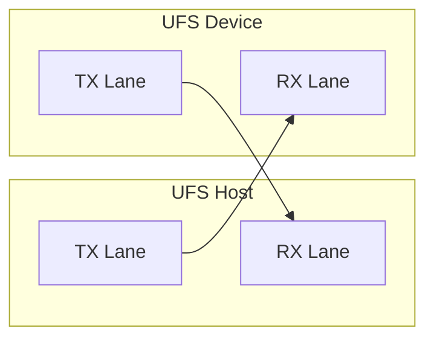
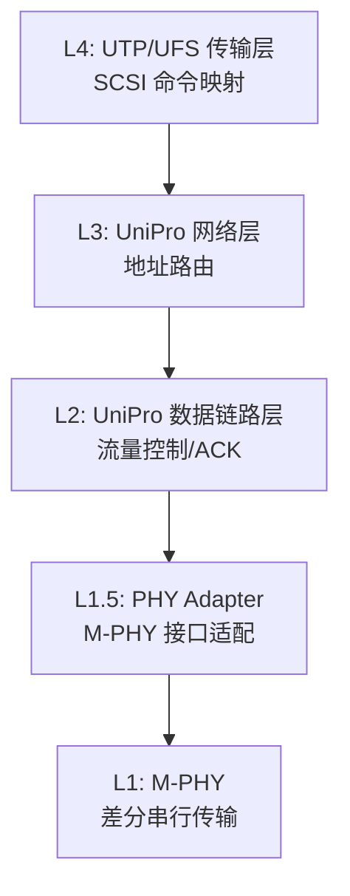
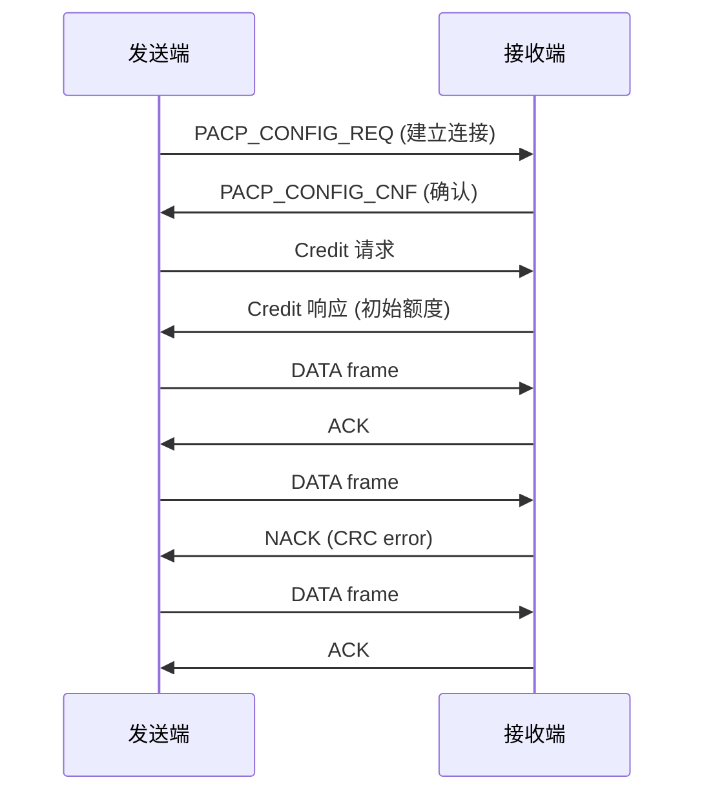
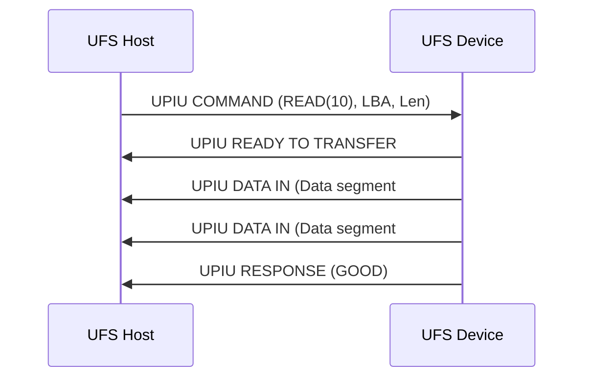

# UFS M-PHY 与 UniPro [E]

> **本章学习目标**：
> - 理解M-PHY Gear 速率的分级机制与电气特征
> - 掌握 UniPro L2 流量控制的 ACK/CREDIT 机制
> - 了解 UFS SCSI 命令集与传输层映射关系

---

## M-PHY Gear 速率体系

---

### <strong>M-PHY 物理层架构</strong>

E 
M-PHY是 MIPI 联盟定义的串行物理层标准，UFS 采用其作为物理传输介质。 
与 eMMC 的并行总线不同，M-PHY 采用差分对进行串行数据传输，每条链路（Lane）包含 TX+ / TX- 与 RX+ / RX- 两对信号。 

M-PHY 的核心设计目标是在功耗与速率之间实现可配置平衡。 

<strong>1. 差分信号传输</strong> 
M-PHY 使用低摆幅差分信号，大幅降低 EMI 与串扰。 
高速模式（HS-MODE）下差分摆幅约 240 mV，低速 PWM 模式下约 1.2 V。 

<strong>2. 双速率模式体系</strong> 
M-PHY 定义了两种工作状态：HS-MODE（高速模式）与LS-MODE（低速模式）。 
HS-MODE 用于大流量数据传输，LS-MODE 用于低功耗待机与链路初始化。 

---

### <strong>Gear 速率分级</strong>

E 
Gear 速率是 M-PHY 对 HS-MODE 的细分等级，每级对应固定的线路速率。 
从 Gear1 到 Gear4，单 Lane 速率逐代翻倍，同时电气要求也更为严苛。 

**表 3-1：M-PHY Gear 速率对比**

| Gear | 速率（单 Lane） | 每方向 Lane 数 | UFS 总带宽 | 引入版本 |
| --- | --- | --- | --- | --- |
| Gear1 | 1.5 Gbps | 2 | ~300 MB/s | UFS 1.0 |
| Gear2 | 3.0 Gbps | 2 | ~600 MB/s | UFS 1.1 |
| Gear3 | 6.0 Gbps | 2 | ~1.2 GB/s | UFS 2.0 |
| Gear4 | 11.6 Gbps | 2 | ~2.3 GB/s | UFS 2.1 |
| Gear5 | 23.2 Gbps | 2 | ~4.6 GB/s | UFS 3.1 |
| Gear5B | 29.7 Gbps | 2 | ~5.9 GB/s | UFS 4.0 |

UFS 总带宽 = 单 Lane 速率 × 2（双发双收）÷ 8（8b/10b 编码）× 方向数。 

<strong>1. 速率演进规律</strong> 
每代 Gear 的速率约为前代的 2 倍，通过提升信号调制阶数与优化均衡器实现。 
Gear5B 引入 PAM3（三电平脉冲幅度调制），在相同波特率下承载更多比特。 

<strong>2. 功耗与速率的 trade-off</strong> 
高速 Gear 的功耗显著增加，UFS 控制器支持动态 Gear 切换。 
空闲时降速至 Gear1 或进入 LS-MODE，数据传输时升至目标 Gear。 

---

## UniPro L2 流量控制

---

### <strong>UniPro 协议栈分层</strong>

E 
UniPro（Unified Protocol）是 UFS 的链路层协议，负责可靠的数据帧传输与流量控制。 
其协议栈分为 L1.5（物理适配）、L2（数据链路）、L3（网络）与 L4（传输）四层。 

UniPro 的核心价值在于将不可靠的物理链路抽象为可靠的数据帧通道。 

---

### <strong>L2 流量控制机制</strong>

E 
UniPro L2 流量控制基于 Credit（信用额度）机制，防止接收端缓冲区溢出。 
发送端只有在获得 Credit 后才能发送数据帧，类似于 TCP 的滑动窗口。 

<strong>1. TX 端 Credit 管理</strong> 
接收端定期向发送端通告可用缓冲区大小（Credit）。 
发送端维护本地 Credit 计数器，每发送一帧递减，收到 ACK 后递增。 

<strong>2. ACK/NACK 帧</strong> 
接收端正确收到数据后返回 ACK 控制帧。 
若 CRC 校验失败，返回 NACK，触发发送端重传。 

<strong>3. 连接建立流程</strong> 

Credit 机制确保链路两端速率不匹配时也不会丢帧，是工业总线可靠性的关键保障。 

---

## UFS SCSI 命令集

---

### <strong>UPIU 与 SCSI 映射</strong>

E 
UFS 传输层将上层 SCSI 命令封装为 UPIU（UFS Protocol Information Unit）帧，交由 UniPro 传输。 
这种设计使 UFS 可直接复用成熟的 SCSI 软件生态。 

类比：UPIU 如同国际包裹的标准纸箱——内部装的是 SCSI 命令（货物），外层贴的是 UFS 地址标签（路由信息）。 

**表 3-2：UPIU 类型与 SCSI 命令映射**

| UPIU 类型 | 方向 | 对应 SCSI 阶段 | 说明 |
| --- | --- | --- | --- |
| COMMAND | Host→Device | CDB 下发 | 携带 16-byte SCSI CDB |
| RESPONSE | Device→Host | 状态响应 | 返回 SCSI 状态与 Sense Data |
| DATA IN | Device→Host | 数据读取 | 读命令的数据 payload |
| DATA OUT | Host→Device | 数据写入 | 写命令的数据 payload |
| READY TO TRANSFER | Device→Host | XFER_RDY | 设备准备好接收数据 |
| TASK MANAGEMENT | 双向 | 任务控制 | 中止/重置指定命令 |

---

### <strong>读写命令时序</strong>

E 
以 SCSI READ(10) 命令为例，完整时序涉及多次 UPIU 交换。 

<strong>1. 命令下发阶段</strong> 
Host 构造 COMMAND UPIU，填入 16-byte CDB（包含 LBA 与传输长度）。 
通过 UniPro L2 的可靠帧传输发送至 Device。 

<strong>2. 数据阶段</strong> 
Device 准备好数据后，通过 DATA IN UPIU 分段返回。 
大容量传输被拆分为多个 UPIU，每段独立进行 CRC 校验。 

<strong>3. 响应阶段</strong> 
全部数据发送完毕后，Device 返回 RESPONSE UPIU。 
SCSI Status 字段为 GOOD（0x00）表示成功，否则携带 Sense Key。 

---

## 本章小结

| 小节 | 核心要点 |
| --- | --- |
| M-PHY Gear 速率 | Gear1~Gear5B 逐代翻倍，PAM3 调制提升频谱效率 |
| UniPro L2 流量控制 | Credit/ACK/NACK 机制确保可靠传输，防止缓冲区溢出 |
| UFS SCSI 命令集 | UPIU 封装 SCSI CDB，COMMAND→DATA→RESPONSE 三段式时序 |

---

## 练习

1. **速率计算**：UFS 3.1 采用 Gear5，双 Lane，8b/10b 编码，理论双向总带宽是多少？若编码效率为 90%（含协议开销），实际有效带宽约为多少？

2. **协议分析**：UniPro L2 的 Credit 机制与 TCP 滑动窗口有何异同？从实时性角度分析哪种机制更适合嵌入式存储场景。

3. **命令构造**：写一段伪代码，构造一个 SCSI READ(10) UPIU，指定 LBA=0x1234，读取 8 个逻辑扇区（每扇区 4KB）。
