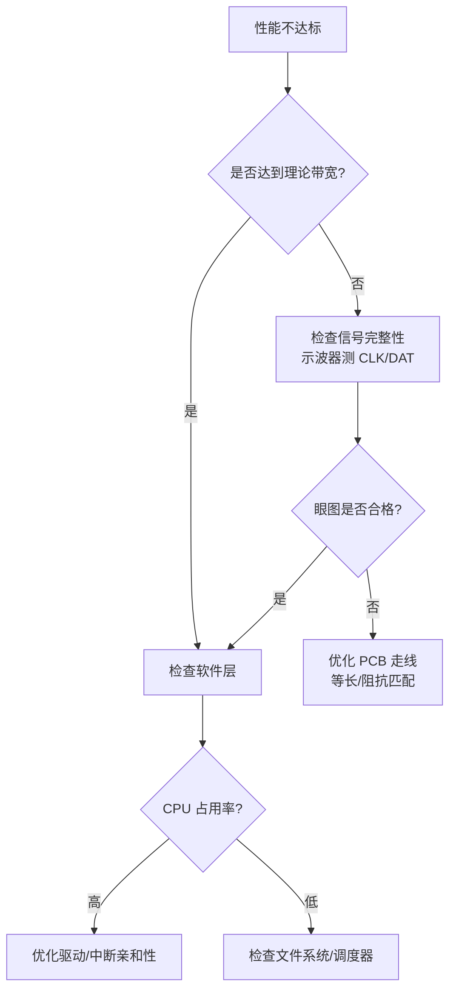

# eMMC/UFS 嵌入式实战与选型 [I]

> **本章学习目标**：
> - 理解<span class="red">手机存储选型</span>的决策维度与关键参数
> - 掌握 eMMC 与 UFS 在嵌入式系统中的兼容性与迁移策略
> - 了解存储性能测试的标准方法与工具链

---

## 手机存储选型

---

### <strong>选型决策维度</strong>

<span class="badge-i">I</span><br>
<span class="red">嵌入式存储选型</span>需综合评估性能、容量、功耗、成本、供应链五大维度。<br>
智能手机领域，eMMC 与 UFS 是当前两种主流方案。<br>

<span class="blue">类比：存储选型如同为车队选发动机——eMMC 是经济型自吸引擎，UFS 是涡轮增压引擎，前者便宜够用，后者澎湃昂贵。</span><br>

**表 4-1：eMMC vs UFS 选型决策表**

| 决策维度 | eMMC 5.1 | UFS 2.1 | UFS 3.1 | UFS 4.0 |
| --- | --- | --- | --- | --- |
| 顺序读 | 250 MB/s | 800 MB/s | 2.1 GB/s | 4.2 GB/s |
| 顺序写 | 125 MB/s | 200 MB/s | 1.2 GB/s | 2.8 GB/s |
| 随机读 (IOPS) | 10K | 50K | 150K | 280K |
| 待机功耗 | 低 | 中 | 中 | 低 |
| 成本/GB | 低 | 中 | 中高 | 高 |
| 适用档位 | 入门/中端 | 中端 | 中高端 | 旗舰 |
| 所需引脚 | 11 (8+CMD+CLK) | 2 Lane | 2 Lane | 2 Lane |

<span class="orange"><strong>1. 性能需求分析</strong></span><br>
* 应用冷启动时间：UFS 的随机读 IOPS 是 eMMC 的 10~20 倍，直接影响 App 启动速度。<br>
* 多任务并发：UFS 支持全双工，可同时处理读写请求；eMMC 为半双工，读写串行。<br>

<span class="orange"><strong>2. 容量规划</strong></span><br>
* 当前主流配置：入门 64GB eMMC，中端 128GB UFS，旗舰 256/512GB UFS。<br>
* 需预留 15%~20% 的 OP（Over-Provisioning）空间用于垃圾回收与坏块管理。<br>

<span class="orange"><strong>3. 功耗与散热</strong></span><br>
* UFS 高速传输时功耗显著高于 eMMC，需评估 PCB 散热能力。<br>
* UFS 支持深度睡眠（Deep Sleep）与活动状态快速切换，空闲功耗可控。<br>

---

### <strong>供应链与验证</strong>

<span class="badge-i">I</span><br>
<span class="red">存储芯片选型</span>不仅是技术决策，更是供应链风险管理。<br>

<span class="orange"><strong>1. 主流供应商格局</strong></span><br>
* Samsung、SK hynix、Kioxia（原东芝）、Micron、Western Digital 五家占据全球 95% 以上市场份额。<br>
* 国产替代：长江存储（YMTC）在 NAND 颗粒领域快速崛起，主控领域有慧荣、群联。<br>

<span class="orange"><strong>2. 验证清单</strong></span><br>

| 验证项 | 方法 | 通过标准 |
| --- | --- | --- |
| 基本读写 | dd / iozone | 达到标称带宽 90% |
| 压力测试 | fio 随机读写 24h | 无 CRC 错误、无超时 |
| 掉电保护 | 随机断电 1000 次 | 数据完整性通过 fsck |
| 温度循环 | -40°C ~ +85°C | 性能衰减 < 10% |
| 寿命测试 | TBW 擦写 | 达到标称寿命 80% |

---

## eMMC/UFS 兼容性

---

### <strong>硬件兼容性</strong>

<span class="badge-i">I</span><br>
<span class="red">硬件兼容性</span>涵盖引脚定义、封装尺寸、电源域与信号完整性四个层面。<br>

eMMC 采用 153-ball BGA 封装（11.5mm×13mm），引脚标准化程度极高。<br>
UFS 采用多种封装：153-ball、254-ball、以及最新 UFS 4.0 的细间距封装。<br>

**表 4-2：eMMC 与 UFS 引脚/封装对比**

| 特性 | eMMC 5.1 | UFS 2.1/3.1 | UFS 4.0 |
| --- | --- | --- | --- |
| 封装 | 153-ball BGA | 153/254-ball BGA | 细间距 MPN |
| 信号引脚 | 11 | 12 (2 Lane×2+REF_CLK+RST) | 12 |
| 电源域 | VCC(3.3V)+VCCQ(1.8V) | VCC(3.3V)+VCCQ(1.2V) | VCC(3.3V)+VCCQ(1.2V) |
| 是否兼容 eMMC 焊盘 | — | 部分 153-ball 兼容 | 不兼容 |

<span class="orange"><strong>1. 电源域差异</strong></span><br>
* eMMC VCCQ 为 1.8V 或 3.3V，UFS VCCQ 为 1.2V。<br>
* 控制器需支持动态电压切换或提供独立电源轨。<br>

<span class="orange"><strong>2. 控制器兼容性</strong></span><br>
* 部分 SoC 的 eMMC 控制器不支持 UFS，需确认控制器 IP 能力。<br>
* 高通的 SDM 系列、联发科天玑系列、三星 Exynos 均内置 UFS 控制器。<br>

---

### <strong>软件迁移策略</strong>

<span class="badge-i">I</span><br>
从 eMMC 迁移到 <span class="red">UFS</span> 涉及驱动层、文件系统层与应用层的协同调整。<br>

<span class="orange"><strong>1. 驱动层迁移</strong></span><br>
* Linux 内核中，eMMC 使用 `drivers/mmc/core/`，UFS 使用 `drivers/scsi/ufs/`。<br>
* 设备树节点需从 `mmc@xxx` 改为 `ufshcd@xxx`，并增加 `lanes` 属性。<br>

```c
// eMMC 设备树节点（旧）
mmc0: mmc@11000000 {
    compatible = "vendor,emmc";
    bus-width = <8>;
};

// UFS 设备树节点（新）
ufshc: ufshcd@11200000 {
    compatible = "vendor,ufs";
    lanes-per-direction = <2>;
    gear = <3>;
};
```

<span class="orange"><strong>2. 文件系统层适配</strong></span><br>
* UFS 原生支持 SCSI 命令集，上层可直接使用 ext4/f2fs，无需修改。<br>
* f2fs（Flash-Friendly File System）对 UFS 的随机写优化更友好。<br>

<span class="orange"><strong>3. 分区表兼容</strong></span><br>
* Android 采用 GPT 分区表，eMMC 与 UFS 在分区层面无差异。<br>
* 需注意 UFS 的 Boot 分区（LU0/LU1）与 RPMB 分区的访问方式。<br>

---

## 性能测试

---

### <strong>测试工具与方法论</strong>

<span class="badge-i">I</span><br>
<span class="red">存储性能测试</span>需区分顺序/随机、读/写、不同块大小、不同队列深度等维度。<br>

<span class="orange"><strong>1. fio 标准测试脚本</strong></span><br>

```bash
# 顺序读测试
fio --name=seq_read --directory=/data --rw=read \
    --bs=128k --size=1g --numjobs=1 --iodepth=32 \
    --direct=1 --ioengine=libaio --runtime=60

# 随机读测试 (4KB, QD32)
fio --name=rand_read --directory=/data --rw=randread \
    --bs=4k --size=1g --numjobs=1 --iodepth=32 \
    --direct=1 --ioengine=libaio --runtime=60

# 混合读写 (70% 读, 30% 写)
fio --name=mix --directory=/data --rw=rw \
    --rwmixread=70 --bs=4k --size=512m \
    --numjobs=4 --iodepth=16 --direct=1
```

<span class="orange"><strong>2. Android 专用测试</strong></span><br>

| 工具 | 用途 | 关键指标 |
| --- | --- | --- |
| AndroBench | 综合存储测试 | Seq Read/Write, Rnd Read/Write |
| PCMark | 应用场景模拟 | 应用启动、照片编辑、视频回放 |
| A1 SD Bench | 外置存储测试 | SD卡/UFS 性能 |

---

### <strong>性能瓶颈定位</strong>

<span class="badge-i">I</span><br>
当实测性能远低于标称值时，需从 <span class="red">硬件层</span> 逐层排查。<br>



<span class="orange"><strong>1. 硬件层排查</strong></span><br>
* 用示波器测量 CLK 眼图，确认上升/下降时间符合规范。<br>
* 检查 DAT 走线是否等长，差分对阻抗是否为 100Ω。<br>

<span class="orange"><strong>2. 驱动层排查</strong></span><br>
* 查看 `dmesg` 中是否有 CRC 错误或超时重试。<br>
* 确认控制器时钟门控（Clock Gating）是否过度激进。<br>

<span class="orange"><strong>3. 文件系统层排查</strong></span><br>
* ext4 的日志模式（journal/data=ordered）对写入性能影响显著。<br>
* f2fs 的 GC（垃圾回收）在空闲时会触发后台擦写，影响前台 IO。<br>

---

## 本章小结

| 小节 | 核心要点 |
| --- | --- |
| 手机存储选型 | 性能/功耗/成本/供应链四维决策，UFS 替代 eMMC 已成旗舰趋势 |
| eMMC/UFS 兼容性 | 引脚/电源/控制器/软件四层兼容验证，迁移需关注设备树与驱动 |
| 性能测试 | fio 多维度测试，硬件→驱动→文件系统逐层瓶颈定位 |

---

## 练习

1. **选型决策**：为一款中端 5G 手机（售价 2000~2500 元）设计存储方案。给出 eMMC 5.1 与 UFS 2.1 两个方案的 BOM 成本差异与性能差异对比。

2. **兼容性分析**：某平板项目原计划使用 eMMC 5.1，现需升级到 UFS 3.1。列出硬件改版的最小改动清单（含电源、控制器、PCB 走线）。

3. **性能调优**：某 UFS 2.1 设备实测顺序读仅 450 MB/s（标称 800 MB/s），使用示波器测得 CLK 眼图合格。列出 3 个可能的软件层原因及排查命令。
