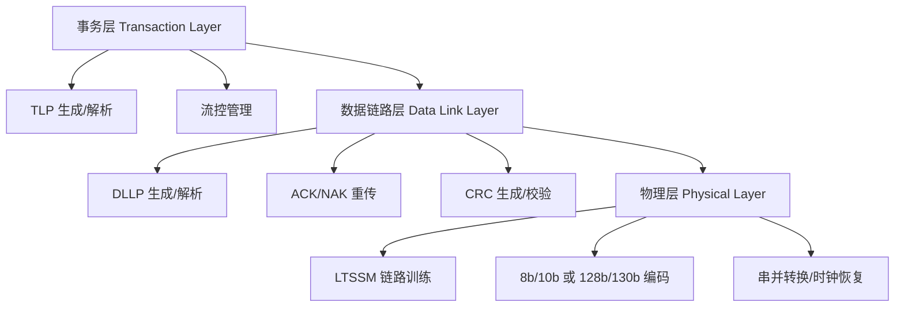

# PCIe基础认知与TLP

[I] [E]

核心概念 PCIe（Peripheral Component Interconnect Express，高速外围组件互连）是取代 PCI 和 PCI-X 的串行点对点互连标准，用差分信号对替代并行总线，支持热插拔和动态链路扩展。

---

## PCIe定位：高速串行点对点互连

核心概念 PCIe 把并行总线拆分为多条独立的串行链路（Lane），每条 Lane 是一对差分收发线，各设备通过交换 fabric 点对点连接，不再有共享总线的竞争问题。

传统 PCI 是**共享总线**：所有设备挂在同一条地址/数据线上，
 
仲裁器决定谁在当前周期获得总线使用权。
 
这类似于多人共用一个麦克风——大家轮流发言，其他人必须等待。
 
设备越多，等待时间越长，总线效率随负载急剧下降。

---

PCIe 是**交换网络**：每个设备独占一条连接到 Root Complex 或 Switch 的链路，
 
数据包通过交换机路由到目标。
 
这像每个人都有一部直通电话，不需要抢麦克风，
 
带宽是独享的，延迟是确定的。

---

## 分层架构：物理层/数据链路层/事务层

核心概念 PCIe 协议栈分为三层，每层有独立的职责：物理层管电气和链路训练，数据链路层管可靠传输，事务层管请求/响应语义。

---

**事务层**负责把 CPU 或设备的读写请求封装为 TLP（Transaction Layer Packet，事务层包），
 
也负责把收到的 TLP 解析为内存读写或配置空间操作。
 
事务层管理流控（Flow Control），确保接收端不会因为缓冲区溢出而丢包。

---

**数据链路层**在 TLP 前后加上 Sequence Number 和 LCRC（Link CRC），
 
接收端校验通过则回 ACK DLLP（Data Link Layer Packet），失败则回 NAK 触发重传。
 
DLLP 不经过事务层，只在相邻两个链路端口之间交互。

---

**物理层**把数据链路层的字节流转换为串行比特流，经过加扰（Scrambling）、
 
编码（8b/10b 或 128b/130b）和驱动差分对发送。
 
接收端则做时钟恢复、解串、解码、解扰，还原为字节流。

---

结论/易错点 8b/10b 编码每 8-bit 数据映射为 10-bit 线路码，效率 80%；
 
PCIe 3.0 引入的 128b/130b 编码效率提升至 98.5%，这是 3.0 相比 2.0 在同等线路速率下带宽翻倍的关键。
 
不是线路频率翻倍，而是编码效率大幅提升。

---

## TLP格式：Header+Data+ECRC

核心概念 TLP 是 PCIe 的基本传输单元，由 Header（3-4 DW）、可选的 Data Payload（0-1024 DW）和可选的 ECRC（1 DW）组成。

| 字段 | 位宽 | 说明 |
|------|------|------|
| Fmt[2:0] | 3 | 格式：是否有数据、Header 长度 |
| Type[4:0] | 5 | TLP 类型：Mem/IO/Config/Msg |
| Length[9:0] | 10 | Data Payload 长度（以 DW 计） |
| Requester ID | 16 | 发起设备的 Bus/Device/Function |
| Tag | 8 | 事务标签，用于匹配完成包 |
| Address | 32/64 | 目标内存或 IO 地址 |

---

Fmt 和 Type 共同决定 TLP 的完整语义：
 
Fmt=0b000, Type=0b00000 表示 3DW Header 的 Memory Read 请求；
 
Fmt=0b010, Type=0b00000 表示 3DW Header + Data 的 Memory Write 请求；
 
Fmt=0b001, Type=0b00101 表示 4DW Header 的 Completion with Data。

---

Requester ID 是 BDF（Bus:Device:Function）格式，共 16-bit：
 
Bus[7:0] + Device[4:0] + Function[2:0]。
 
这是 PCIe 枚举过程中分配给每个逻辑设备的唯一地址。

---

Tag 字段允许最多 256 个未完成的 Non-Posted 请求同时存在。
 
Posted 请求（如 Memory Write）不需要完成包，因此 Tag 无关紧要；
 
Non-Posted 请求（如 Memory Read）必须携带 Tag，以便 Completion 返回时能匹配到原始请求。

---

## TLP类型：MRd/MWr/CplD/CfgRd/Msg

核心概念 PCIe 定义了多种 TLP 类型，覆盖内存访问、IO 访问、配置空间访问、消息传递和中断投递。

| TLP 类型 | Fmt | Type | 方向 | 是否需要完成 |
|----------|-----|------|------|------------|
| Memory Read (MRd) | 000/001 | 00000 | 请求者→目标 | 是 |
| Memory Write (MWr) | 010/011 | 00000 | 请求者→目标 | 否 |
| Completion (Cpl/CplD) | 000/010 | 01010/01011 | 目标→请求者 | - |
| Config Read (CfgRd0/1) | 000 | 00100/00101 | 请求者→目标 | 是 |
| Config Write (CfgWr0/1) | 010 | 00100/00101 | 请求者→目标 | 是 |
| Message (Msg/MsgD) | 001/011 | 10xxx | 双向 | 否 |

---

Memory Read/Write 是最常见的 TLP，访问系统主存或设备 BAR 映射的内存。 
Memory Write 是 Posted 操作，发送后无需等待完成，吞吐率高； 
Memory Read 是 Non-Posted 操作，必须等待 CplD 返回数据，延迟敏感。

---

Config Read/Write 用于访问设备的 256-byte 或 4KB 配置空间。 
Type 0 用于目标设备本身，Type 1 用于穿过 Switch 路由到下游设备。 
枚举阶段 Root Complex 用 Type 1 扫描所有 Bus，发现设备后改用 Type 0 读写其配置头。

---

Message TLP 是 PCIe 替代 PCI 中断线（INTx）和边带信号的方式。 
INTx 中断用 Assert_INTx/Deassert_INTx Message； 
MSI/MSI-X 中断用 MSI Message； 
电源管理事件、错误报告也走 Message TLP。

---

## 与PCI并行总线的关键差异

核心概念 PCIe 与 PCI 在设计哲学上有根本区别：PCI 是总线共享、并行传输、边带信号；PCIe 是点对点、串行传输、包交换。

| 特性 | PCI | PCIe |
|------|-----|------|
| 拓扑 | 共享总线 | 点对点 + Switch |
| 信号 | 并行 32/64-bit | 串行 Lane×N |
| 时钟 | 公共时钟 | 嵌入式时钟（8b/10b） |
| 中断 | 4 条 INTx 边带线 | Message TLP |
| DMA | 集中式 | 端点自主发起 MRd/MWr |
| 热插拔 | 复杂 | 原生支持 |
| 带宽 | 共享递减 | 独享保证 |

---

扩展 PCIe 的 DMA 能力远超 PCI：传统 PCI DMA 需要中央 DMA 控制器仲裁，
 
PCIe 设备可以直接发起 Memory Read/Write TLP 访问任意内存，不需要额外 DMA 引擎。
 
现代网卡和 NVMe SSD 的"零拷贝"传输就是基于 PCIe 端点的原生 DMA 能力。
