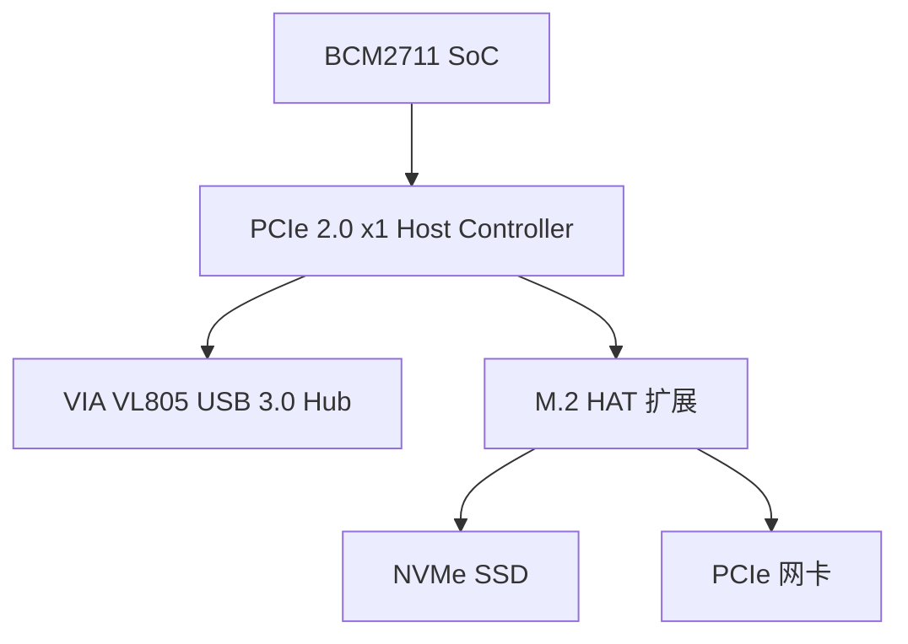

# PCIe是什么——从PCI到PCIe的演进史

<span class="badge-b">[B]</span> <span class="badge-i">[I]</span> <span class="badge-e">[E]</span> <span class="badge-m">[M]</span>

PCIe 是现代计算的"中央动脉"。
从 PCI 的并行共享总线到 PCIe 的串行点对点包交换，
这是一次从"公共汽车"到"快递网络"的架构革命。

---

## 核心定义与价值

<span class="red">PCIe（Peripheral Component Interconnect Express）</span> 是 Intel 于 2001 年提出、2003 年随 Intel 915 芯片组普及的高速串行扩展总线。
它彻底抛弃了 PCI 的并行共享总线架构，改用串行差分对、点对点连接和包交换路由。

**PCIe 的三层分离架构：**

- <span class="green">物理层（Physical Layer）</span>：差分信号、链路训练、时钟恢复
- <span class="green">数据链路层（Data Link Layer）</span>：TLP 封装、ACK/NAK 重传、CRC 校验
- <span class="green">事务层（Transaction Layer）</span>：请求/完成包路由、流量控制、排序规则

---

### 类比：从公共汽车站到快递物流网络

PCI 像一座城市的公共汽车站：

- <span class="green">并行总线</span> = 一条宽阔的马路，所有公交车（设备）共用
- <span class="green">共享仲裁</span> = 到站后抢停车位，谁先到谁停
- <span class="green">时钟同步</span> = 所有公交车必须以相同速度行驶
- <span class="green">负载电容</span> = 停的车越多，路越堵（33MHz 上限）
- <span class="green">插槽有限</span> = 主板只有 3-5 个物理插槽

PCIe 像顺丰/京东的物流网络：

- <span class="green">串行差分对</span> = 每条路只跑一辆车，双向专用车道
- <span class="green">点对点</span> = 每个站点直连调度中心，不与其他站点争路
- <span class="green">包交换</span> = 包裹（TLP）贴地址标签，路由器自动分拣
- <span class="green">速率独立</span> = Gen1 设备插到 Gen4 插槽上，自动协商到 Gen1
- <span class="green">拓扑灵活</span> = Switch 可以扩展出上百个 Endpoint

---

## 核心机制原理解析

### <strong>1. PCI 时代的终结：并行总线的物理极限</strong>

<br>

PCI 总线的关键参数：

| 参数 | PCI 33MHz | PCI 66MHz | PCI-X 133MHz | PCI-X 533MHz |
|------|-----------|-----------|--------------|--------------|
| 总线宽度 | 32-bit | 32/64-bit | 64-bit | 64-bit |
| 时钟 | 33 MHz | 66 MHz | 133 MHz | 533 MHz |
| 峰值带宽 | 133 MB/s | 266/533 MB/s | 1.06 GB/s | 4.26 GB/s |
| 信号线数 | 49 pin | 49/82 pin | 82 pin | 82 pin |
| 共享仲裁 | 是 | 是 | 是 | 是 |
| 负载限制 | 4-5 设备 | 4-5 设备 | 2-3 设备 | 1-2 设备 |

<br>

PCI 的致命问题：

- <span class="green">信号完整性</span>：32-bit 并行线同时翻转产生严重串扰和 EMI
- <span class="green">负载限制</span>：每增加一个设备，总线电容增加，信号边沿变慢
- <span class="green">时钟 skew</span>：不同插槽的时钟到达时间不同，限制频率提升
- <span class="green">仲裁开销</span>：多个设备共享总线，仲裁周期浪费带宽

---

### <strong>2. PCIe 速率演进：从 2.5GT/s 到 64GT/s</strong>

<br>

| 代际 | 年份 | 原始速率 | 编码 | 有效速率 ×1 | ×4 | ×8 | ×16 |
|------|------|---------|------|------------|-----|-----|------|
| Gen1 | 2003 | 2.5 GT/s | 8b/10b | 250 MB/s | 1 GB/s | 2 GB/s | 4 GB/s |
| Gen2 | 2007 | 5.0 GT/s | 8b/10b | 500 MB/s | 2 GB/s | 4 GB/s | 8 GB/s |
| Gen3 | 2010 | 8.0 GT/s | 128b/130b | 985 MB/s | 3.94 GB/s | 7.88 GB/s | 15.75 GB/s |
| Gen4 | 2017 | 16.0 GT/s | 128b/130b | 1.97 GB/s | 7.88 GB/s | 15.75 GB/s | 31.5 GB/s |
| Gen5 | 2019 | 32.0 GT/s | 128b/130b | 3.94 GB/s | 15.75 GB/s | 31.5 GB/s | 63 GB/s |
| Gen6 | 2022 | 64.0 GT/s | PAM4 + FLIT | 7.56 GB/s | 30.26 GB/s | 60.5 GB/s | 121 GB/s |

<br>

**编码效率的关键差异：**

- <span class="green">8b/10b</span>（Gen1/2）：20% 开销，每 8 bit 数据发送 10 bit 线路码
- <span class="green">128b/130b</span>（Gen3/4/5）：1.54% 开销，每 128 bit 数据加 2 bit 同步头
- <span class="green">PAM4 + FLIT</span>（Gen6）：每符号 2 bit，FLIT 模式（Fixed Length Information Transfer）

<br>
<span class="blue">Gen3 引入 128b/130b 是速率翻倍的关键：
如果继续使用 8b/10b，Gen3 要达到 8GT/s 的有效速率，原始速率需要 10GT/s，信号完整性难以实现。
128b/130b 让原始速率直接等于标称速率（8GT/s），大幅降低了 PHY 设计难度。</span>

---

### <strong>3. PCIe 与 PCI 的根本差异</strong>

<br>

| 维度 | PCI | PCIe |
|------|-----|------|
| 信号 | 并行单端 | 串行差分 |
| 拓扑 | 共享总线 | 点对点 |
| 仲裁 | 中央仲裁器 | 无需仲裁 |
| 传输单位 | 总线周期 | TLP（Transaction Layer Packet） |
| 地址空间 | IO/Memory/Config | IO/Memory/Config/Message |
| 热插拔 | 不支持 | 原生支持 |
| 错误处理 | 奇偶校验 | ECRC + ACK/NAK 重传 |
| 时钟 | 公共时钟 | 嵌入式时钟（8b/10b 或 CDR） |
| 扩展 | 插槽有限 | Switch 可扩展上百端口 |

<br>

**PCIe 新增 Message 路由类型：**

PCIe 不再使用 PCI 的边带信号（INTA/B/C/D），
而是将中断、电源管理、热插拔等事件封装为 <span class="green">Message TLP</span> 通过数据链路传输。

| Message 类型 | 用途 |
|-------------|------|
| ASSERT_INTx/DEASSERT_INTx | 兼容 legacy PCI 中断 |
| PM_PME | 电源管理事件 |
| PME_TO_ACK | PME Turn Off Acknowledge |
| ERR_COR/ERR_NONFATAL/ERR_FATAL | 错误报告 |
| UNLOCK | 锁定请求 |
| SET_SLOT_PWR_LIMIT | 设置插槽功率限制 |

---

## 技术教学与实战

### Linux 识别 PCIe 设备

```bash
# 列出所有 PCIe 设备
lspci
00:00.0 Host bridge: Intel Corporation 8th Gen Core Processor Host Bridge
00:02.0 VGA compatible controller: Intel Corporation UHD Graphics 620
00:1c.0 PCI bridge: Intel Corporation Sunrise Point-LP PCI Express Root Port
01:00.0 Non-Volatile memory controller: Samsung Electronics Co Ltd NVMe SSD Controller SM981/PM981

# 详细设备信息（含链路状态）
lspci -vv -s 01:00.0
	LnkCap: Port #0, Speed 8GT/s, Width x4, ASPM L1, Exit Latency L1 <8us
	        ClockPM+ Surprise- LLActRep+ BwNot+ ASPMOptComp+
	LnkCtl: ASPM L1 Enabled; RCB 64 bytes, Disabled- CommClk+
	        ExtSynch- ClockPM+ AutWidDis- BWInt- AutBWInt-
	LnkSta: Speed 8GT/s (ok), Width x4 (ok)
	        TrErr- Train- SlotClk+ DLActive- BWMgmt- ABWMgmt-
```

<br>

关键字段：

| 字段 | 值 | 含义 |
|------|-----|------|
| LnkCap Speed | 8GT/s | 设备能力：支持 Gen3 |
| LnkCap Width | x4 | 设备能力：4 通道 |
| LnkSta Speed | 8GT/s | 当前链路速率：Gen3 |
| LnkSta Width | x4 | 当前链路宽度：4 通道 |
| ASPM | L1 Enabled | 活动状态电源管理已启用 |

<br>
<span class="blue">如果 LnkSta Speed < LnkCap Speed，说明链路训练降级（可能是信号完整性差或 Root Port 限制）。</span>

---

## 嵌入式专属实战场景

### 场景：Raspberry Pi 4 的 PCIe 架构

Raspberry Pi 4 是嵌入式领域最广泛使用的 PCIe 应用案例：



<br>

关键参数：

| 参数 | 值 |
|------|-----|
| SoC | Broadcom BCM2711 |
| PCIe 版本 | Gen2 ×1 |
| 有效带宽 | ~500 MB/s |
| 共享总线 | PCIe 与 USB3 共享，通过 VL805 扩展 |
| M.2 扩展 | 通过 GPIO HAT 或计算模块 CM4 实现 |

<br>
<span class="blue">Raspberry Pi 4 的 PCIe 是 Gen2 ×1，实际持续读写约 350-400 MB/s。
对于 NVMe SSD 来说这是严重瓶颈，但对于嵌入式应用绰绰有余。</span>

---

## 历史演进与前沿

### PCIe 的完整代际演进

| 年份 | 版本 | 核心创新 |
|------|------|---------|
| 2003 | PCIe 1.0 / Gen1 | 2.5GT/s，8b/10b，点对点，TLP |
| 2007 | PCIe 2.0 / Gen2 | 5GT/s，8b/10b， doubled rate |
| 2010 | PCIe 3.0 / Gen3 | 8GT/s，128b/130b，首次编码革新 |
| 2014 | PCIe 3.1 | M-PCIe（移动版本），低功耗优化 |
| 2017 | PCIe 4.0 / Gen4 | 16GT/s，128b/130b，信号完整性挑战 |
| 2019 | PCIe 5.0 / Gen5 | 32GT/s，128b/130b，Retimer 成为必需 |
| 2022 | PCIe 6.0 / Gen6 | 64GT/s，PAM4，FLIT，FEC，前向纠错 |
| 2025+ | PCIe 7.0 / Gen7 | 规划中，预计 128GT/s，光互联 |

<br>

<span class="red">Gen6 的 PAM4 调制：</span>

- Gen5 及之前使用 NRZ（Non-Return-to-Zero），每符号 1 bit
- Gen6 使用 PAM4（Pulse Amplitude Modulation 4-level），每符号 2 bit
- 代价：SNR 要求更高，误码率增加，必须引入 FEC（Forward Error Correction）
- FLIT 模式：固定 256B 包格式，替代变长 TLP，简化流水线

---

## 本章小结

| 主题 | 关键要点 |
|------|---------|
| PCI 终结 | 并行总线受限于信号完整性、负载电容、时钟 skew |
| PCIe 革命 | 串行差分、点对点、包交换、三层分离架构 |
| 速率演进 | Gen1 2.5G → Gen2 5G → Gen3 8G（128b/130b）→ Gen4 16G → Gen5 32G → Gen6 64G（PAM4+FLIT） |
| 编码效率 | 8b/10b=80%，128b/130b=98.5%，PAM4 每符号 2 bit |
| Message | 替代 PCI 边带信号，中断/电源/错误均封装为 TLP |
| lspci | LnkCap 看能力，LnkSta 看实际速率，比较两者排查降级 |

---

## 练习

1. 为什么 PCIe Gen3 能在 Gen2 的基础上速率翻倍（5G→8G），而 Gen4 又能翻倍（8G→16G）？
   128b/130b 编码相比 8b/10b 具体节省了什么？
2. 计算 PCIe Gen3 ×4 的有效带宽。如果用来连接一个读取速度 3.5GB/s 的 NVMe SSD，
   这个接口是否会成为瓶颈？
3. PCIe 的"点对点"拓扑相比 PCI 的"共享总线"，在电气层面解决了什么问题？
   为什么点对点可以支持更高的时钟频率？
4. 某设备的 lspci 显示 LnkCap Speed=16GT/s, Width=x4，但 LnkSta Speed=8GT/s, Width=x4。
   列举 3 个可能导致链路降级的根因。
5. PCIe Gen6 的 PAM4 调制相比 NRZ 有什么优势和代价？为什么必须引入 FEC？
