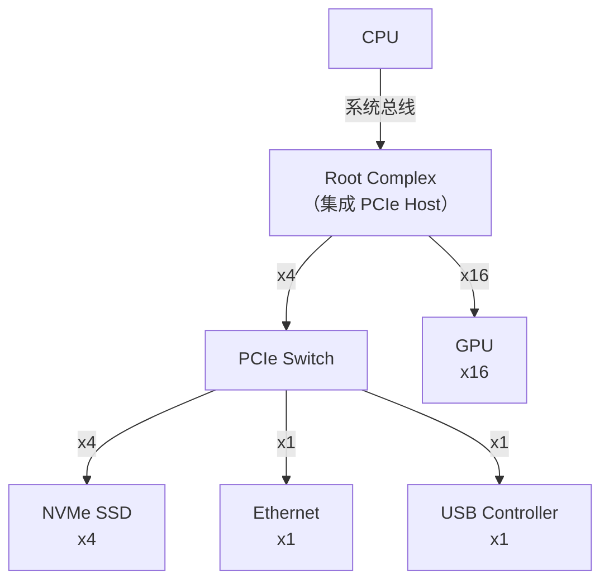

# PCI 与 PCIe 基础认知与 TLP [I→M]

> **本章学习目标**：
> - 理解 <span class="red">PCI（Peripheral Component Interconnect）</span> 从并行到串行的演进
> - 掌握 <span class="red">PCIe TLP（Transaction Layer Packet）</span> 的包格式与路由机制
> - 了解 PCIe 在嵌入式 SoC 中的典型配置与限制

---

## PCI 的诞生：从 ISA 到现代高速总线

---

### <strong>为什么需要 PCI：ISA 的带宽瓶颈</strong>

<span class="red">PCI</span>由 Intel 在 <span class="green">1992 年</span>提出，
<br>
定位是替代 <span class="green">ISA（Industry Standard Architecture）</span>总线。
<br>

ISA 的问题在 1990 年代已非常明显：
<br>
* 16-bit 数据宽度，最高 8MB/s
<br>
* 无自动配置，需手动设置 IRQ/DMA/IO 地址（跳线帽）
<br>
* 总线主控（Bus Mastering）支持差
<br>

<span class="blue">PCI 带来三大革命：32-bit/64-bit 数据宽度、即插即用（Plug and Play）、总线主控。带宽从 8MB/s 提升到 133MB/s（33MHz × 32-bit）。</span>
<br>

<span class="blue">类比：ISA 如同"手动换挡的老式卡车"——每次装卸货都要人工调整；PCI 如同"自动挡的现代货车"——自动识别货物类型，自动分配最优路线。</span>
<br>

---

### <strong>从 PCI 到 PCIe：并行到串行的革命</strong>

<span class="red">PCIe（PCI Express）</span>由 Intel/AMD/IBM 等联合设计，<span class="green">2003 年</span>发布：
<br>

| 特性 | PCI | PCIe | 差异原因 |
| --- | --- | --- | --- |
| 信号 | 并行（32/64 bit） | 串行差分对（Lane） | 串行抗干扰更好 |
| 时钟 | 共享总线时钟 | 嵌入式时钟（8b/10b） | 无时钟偏斜 |
| 拓扑 | 共享总线 | 点对点交换 | 无仲裁竞争 |
| 带宽 | 133MB/s（33MHz） | 250MB/s/Lane（Gen1） | 串行速率更高 |
| 扩展 | 插槽数量有限 | 可通过 Switch 扩展 | 灵活 |



<span class="blue">PCIe 使用点对点拓扑，每个设备独享带宽，不像 PCI 共享总线带宽。</span>
<br>

---

### <strong>PCIe TLP 包格式：四层架构解析</strong>

<span class="red">PCIe 协议</span>分为四层：
<br>

| 层级 | 功能 | 典型处理 |
| --- | --- | --- |
| 应用层 | 设备驱动 | 内核/用户态 |
| 事务层（TL） | TLP 生成/解析 | 地址翻译、路由 |
| 数据链路层（DLL） | ACK/NAK、重传 | 链路可靠性 |
| 物理层（PHY） | 编解码、串并转换 | SerDes |

```text
TLP Header 格式（3 DW = 12 byte）：

Byte 0:   [FMT[2:0] | TYPE[4:0]]  -- 格式和类型
Byte 1:   [R | TC[2:0] | R | ATTR[1:0] | R | TH | TD | EP]  -- 流量控制
Byte 2-3: [Length[9:0]]  -- 数据长度
Byte 4-7: [Requester ID]  -- 请求方 ID
Byte 8-11:[Address[31:0]]  -- 地址（Memory Read/Write）
```

<span class="blue">TLP 类型决定路由方式：Memory TLP 按地址路由，Configuration TLP 按 ID 路由，Message TLP 按消息代码路由。</span>
<br>

---

### <strong>PCIe 在嵌入式 SoC 中的典型配置</strong>

嵌入式 SoC 通常只集成少量 PCIe Lane：
<br>

| SoC | PCIe 配置 | 典型用途 |
| --- | --- | --- |
| Raspberry Pi 4 | PCIe 2.0 x1 | USB 3.0 Hub（Via VL805） |
| NVIDIA Jetson Nano | PCIe 2.0 x4 + x1 | WiFi + NVMe |
| NXP i.MX8 | PCIe 3.0 x1 | 扩展高速外设 |
| Rockchip RK3588 | PCIe 3.0 x4 + x2 + x1 | NVMe + SATA + WiFi |

<span class="blue">嵌入式 SoC 的 PCIe 通常不直接引出到外部插槽，而是连接板载芯片（如 NVMe SSD、USB Hub、以太网控制器）。</span>
<br>

---

## 本章小结

| 概念 | 一句话总结 |
| --- | --- |
| PCI | Intel 1992 年提出的并行外设总线，替代 ISA |
| PCIe | 2003 年发布的串行点对点总线，Lane 为基本单位 |
| TLP | 事务层包，按类型（Memory/Config/Message）路由 |
| Root Complex | PCIe 的根节点，连接 CPU 和 PCIe 设备 |
| Switch | 扩展 PCIe 端口，类似网络交换机 |
| MSI-X | 扩展消息中断，支持 2048 个中断向量 |

---

## 练习

1. 为什么 PCIe 使用点对点拓扑而不是 PCI 的共享总线？这带来了什么优势？
2. 在 Linux 中，`lspci -vv` 命令输出的 TLP 信息如何解读？
3. 设计一个嵌入式网关：RK3588 的 PCIe 3.0 x4 连接 NVMe SSD，x1 连接 Intel I225 千兆网卡，画出拓扑。
