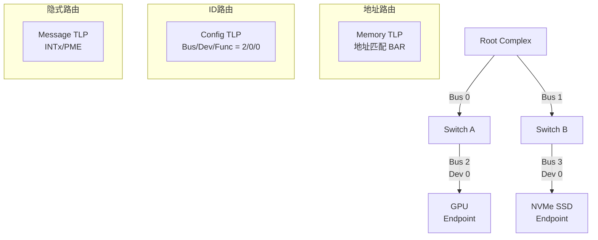
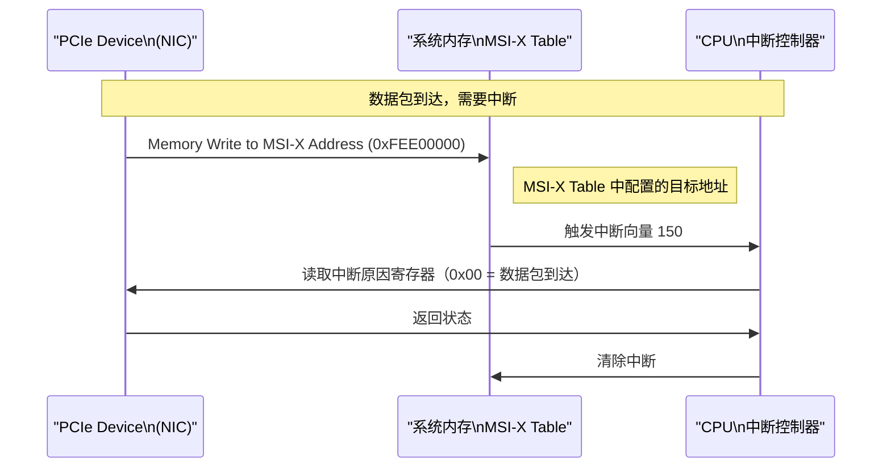
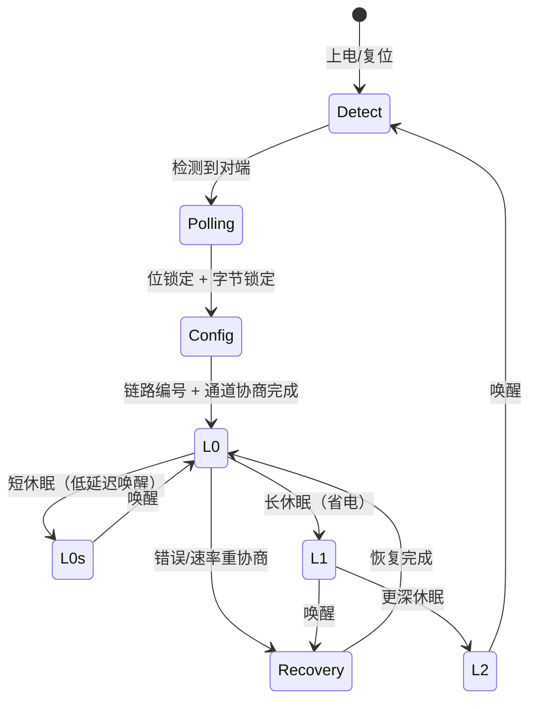

# PCIe TLP 路由与 MSI-X 中断 [E]

> **本章学习目标**：
> - 理解 <span class="red">PCIe TLP 路由</span> 的三种方式（地址/ID/隐式）
> - 掌握 <span class="red">MSI-X</span> 扩展消息中断的配置与优势
> - 了解 PCIe 链路训练（Link Training）与 LTSSM 状态机

---

## PCIe TLP 路由机制

---

### <strong>为什么需要三种路由：灵活适配不同场景</strong>

<span class="red">PCIe TLP</span>支持三种路由方式，取决于 TLP 类型：

| 路由方式 | TLP 类型 | 路由依据 | 典型场景 |
| --- | --- | --- | --- |
| 地址路由 | Memory Read/Write | 目标地址 | DMA、设备寄存器访问 |
| ID 路由 | Configuration Read/Write | Bus/Dev/Func | 枚举阶段配置设备 |
| 隐式路由 | Message（INTx/PME/Error）| 消息代码 | 中断、电源管理、错误报告 |



---

### <strong>地址路由：BAR 与内存映射</strong>

<span class="red">PCIe 设备</span>通过 BAR（Base Address Register）向系统汇报内存/IO 需求：

```c
// BAR 配置示例（NVMe SSD）
// BAR0: 64-bit Memory BAR，大小 16KB
BAR0 = 0x00000000  // 低 32-bit，可写
BAR1 = 0x00000000  // 高 32-bit（64-bit BAR 时有效）

// 系统分配地址后
BAR0 = 0xA0000000  // 基地址低 32-bit
BAR1 = 0x00000000  // 基地址高 32-bit
// 设备寄存器映射到 0xA0000000~0xA0003FFF
```

| BAR 类型 | bit 0 | bit 1~2 | 含义 |
| --- | --- | --- | --- |
| 32-bit Memory | 0 | 00 | 32-bit 内存空间 |
| 64-bit Memory | 0 | 10 | 64-bit 内存空间 |
| IO Space | 1 | — | IO 空间（已淘汰） |

<span class="blue">TLP 地址路由：Root Complex 检查 TLP 的地址字段，匹配到某个设备的 BAR 范围后，转发给对应设备。</span>
<br>

---

## MSI-X：从传统中断到消息中断

---

### <strong>为什么 MSI-X 优于传统 INTx：并行中断 + 无共享</strong>

<span class="red">MSI-X</span>（Message Signaled Interrupts Extended）是 PCIe 的中断机制：

| 特性 | INTx（传统） | MSI | MSI-X |
| --- | --- | --- | --- |
| 中断线数 | 4 根（INTA~INTD）共享 | 32 个 | <span class="blue">2048 个</span> |
| 触发方式 | 边沿/电平触发 | 内存写（Message） | 内存写 |
| 共享 | 多个设备共享一根线 | 每设备独立 | 每设备独立 |
| 性能 | 需轮询确认中断源 | 直接写 MSI 地址 | 直接写 MSI 地址 |
| 虚拟化 | 不支持 | 不支持 | <span class="blue">支持 VF（虚拟功能）</span> |



---

### <strong>MSI-X 表：BAR 中的中断配置区</strong>

```c
// MSI-X Capability Structure
struct msix_capability {
    u16 cap_id;      // 0x11 = MSI-X
    u16 ctrl;        // bit 15 = Enable, bit 14 = Function Mask
    u16 table_offset;// Table BIR + Offset
    u16 pba_offset;  // PBA BIR + Offset
};

// MSI-X Table Entry（每个中断 16 byte）
struct msix_entry {
    u32 msg_addr_lo;  // 目标地址低 32-bit
    u32 msg_addr_hi;  // 目标地址高 32-bit
    u32 msg_data;     // 写入的数据（中断向量）
    u32 ctrl;         // bit 0 = Mask
};

// 配置 MSI-X（Linux 内核）
static int configure_msix(struct pci_dev *pdev, int nvec)
{
    struct msix_entry *entries;
    int ret, i;
    
    entries = kcalloc(nvec, sizeof(*entries), GFP_KERNEL);
    for (i = 0; i < nvec; i++)
        entries[i].entry = i;  // 请求向量 0~nvec-1
    
    ret = pci_enable_msix_exact(pdev, entries, nvec);
    if (ret)
        return ret;
    
    // 每个向量绑定一个中断处理函数
    for (i = 0; i < nvec; i++)
        request_irq(entries[i].vector, handler[i], 0, "dev", dev);
    
    return 0;
}
```

---

## PCIe 链路训练：LTSSM 状态机

---

### <strong>从 Detect 到 L0：链路建立的全过程</strong>

<span class="red">LTSSM（Link Training and Status State Machine）</span>是 PCIe 物理层的核心：



| 状态 | 含义 | 典型延迟 |
| --- | --- | --- |
| Detect | 发送 Beacon，检测对端是否存在 | 数 ms |
| Polling | 位锁定、字节锁定、极性翻转 | 数 ms |
| Config | 链路编号、通道数协商、Lane 反转 | 数 ms |
| L0 | 正常工作，可传输 TLP | — |
| Recovery | 重新训练（速率/宽度变化）| 数 ms |
| L0s | 短休眠，仅关闭 SerDes 发送器 | < 1μs |
| L1 | 长休眠，关闭更多电路 | ~1μs |
| L2 | 最深休眠，仅保留唤醒逻辑 | ~100μs |

<span class="blue">链路训练的关键：Detect → Polling → Config → L0 是上电必经路径，耗时约 50~100ms。Recovery 用于热插拔或速率重协商。</span>
<br>

---

## 本章小结

| 概念 | 一句话总结 |
| --- | --- |
| 地址路由 | Memory TLP 按目标地址匹配 BAR 范围 |
| ID 路由 | Configuration TLP 按 Bus/Dev/Func 路由 |
| MSI-X | 内存写触发中断，2048 个向量，支持虚拟化 |
| LTSSM | 链路训练状态机，Detect→Polling→Config→L0 |
| L0s/L1/L2 | PCIe 低功耗状态，逐级关闭电路 |

---

## 练习

1. 为什么 PCIe 配置空间访问使用 ID 路由而不是地址路由？
2. MSI-X 相比传统 INTx 有哪些优势？为什么虚拟化场景必须用 MSI-X？
3. 在 Linux 中，如何查看 PCIe 设备的链路状态（速率/宽度/LTSSM）？
