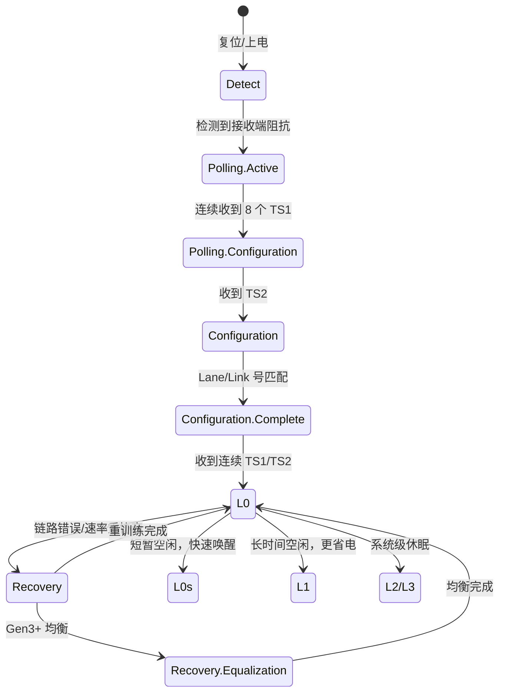
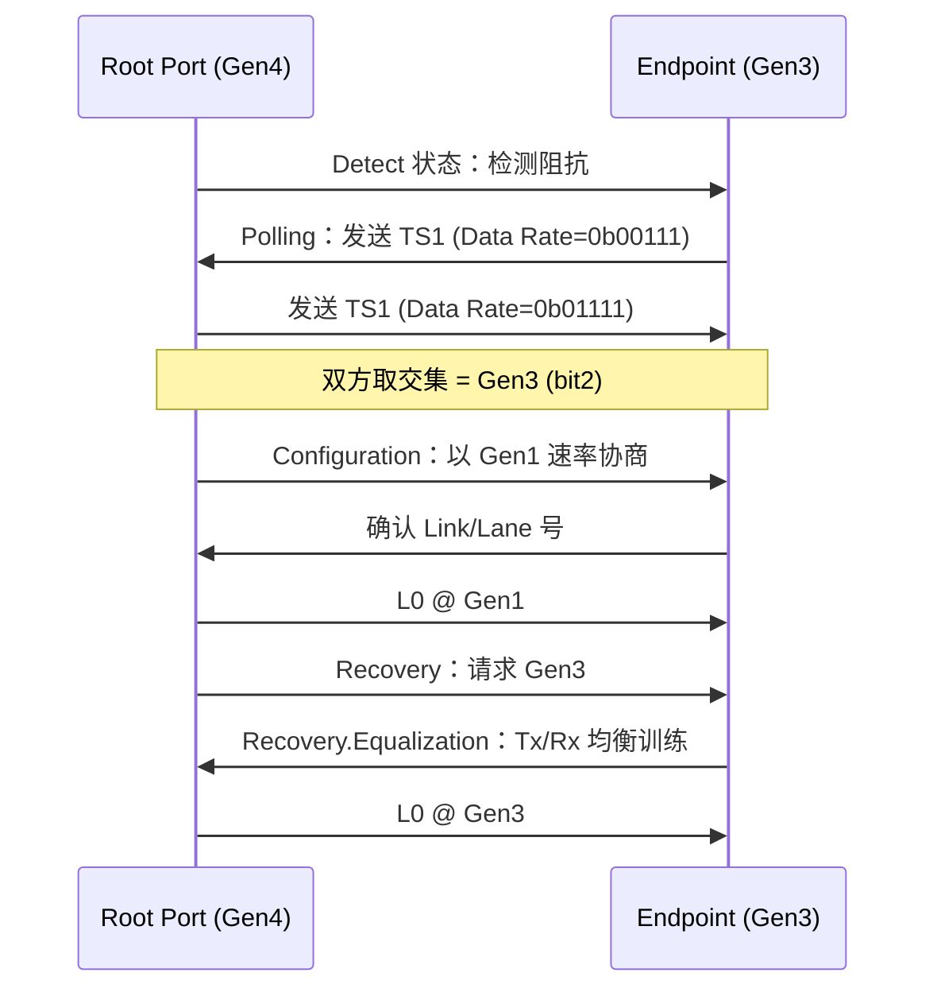

# PCIe怎么做——物理层、链路与训练

<span class="badge-b">[B]</span> <span class="badge-i">[I]</span> <span class="badge-e">[E]</span> <span class="badge-m">[M]</span>

PCIe 的物理层是速率奇迹的根基。
本章拆解差分信号电气规范、链路训练状态机 LTSSM、速率协商和时钟架构，
让你理解为什么 PCIe 能自动从 Gen1 "长"到 Gen4。

---

## 核心定义与价值

<span class="red">LTSSM（Link Training and Status State Machine）</span> 是 PCIe 物理层的核心状态机。
它负责在设备上电或复位后，自动完成链路伙伴发现、速率协商、极性校正和链路宽度协商。

**链路训练的目标：**

- 找到链路伙伴（Link Partner）
- 确定最高可工作的速率（Gen1/2/3/4/5/6）
- 确定可用的 Lane 数（×1/×2/×4/×8/×16）
- 校正差分对的极性（Polarity Inversion）
- 调整均衡器参数（Equalization，Gen3+）

---

### 类比：两条高速公路的对讲机握手

想象两条新建的高速公路（TX 和 RX）需要对接：

- <span class="green">Detect</span> = 对讲机开机，搜索附近有没有另一台对讲机
- <span class="green">Polling</span> = "收到请回答"——发送 TS1 Ordered Set，等对方回复
- <span class="green">Configuration</span> = 确认双方能用同样的语速（速率）和车道数（宽度）通话
- <span class="green">L0</span> = 正式通车，开始正常运输
- <span class="green">Recovery</span> = 信号不好了，重新握手调整参数
- <span class="green">L0s/L1</span> = 暂时没车，关对讲机省电，有车上路时秒开

如果一方说英语一方说法语（协议版本不匹配），
双方会自动降到都能听懂的语速（降级到 Gen1）。

---

## 核心机制原理解析

### <strong>1. 物理层：差分对、AC 耦合电容与电气规范</strong>

<br>

PCIe 链路由 1-32 个 Lane 组成，每个 Lane 是一对发送差分对 + 一对接收差分对：

| 信号 | 引脚 | 方向 | 说明 |
|------|------|------|------|
| TX+ | 发送正 | Root→Endpoint | 差分对正端 |
| TX- | 发送负 | Root→Endpoint | 差分对负端 |
| RX+ | 接收正 | Endpoint→Root | 差分对正端 |
| RX- | 接收负 | Endpoint→Root | 差分对负端 |

<br>

**AC 耦合电容：**

- 每个差分对串联 75-200nF 的 AC 耦合电容
- 作用：隔离 DC 偏置，允许发送端和接收端使用不同的共模电压
- <span class="blue">位置：通常放在发送端侧（主板或插卡），规范推荐 75-265nF，常见 100nF</span>

<br>

**关键电气参数：**

| 参数 | Gen1/2 | Gen3/4/5 | Gen6 |
|------|--------|----------|------|
| 信号电平 | ±800 mV 差分 | ±800 mV 差分 | PAM4 四电平 |
| 摆率 | 0.6-4 V/ns | 0.6-10 V/ns | — |
| 阻抗 | 100 Ω ±15% | 100 Ω ±10% | 100 Ω ±10% |
| 插损 @奈奎斯特 | — | -28 dB @ 8GHz | -28 dB @ 16GHz |
| 通道长度 | ≤ 20 inch | ≤ 8-12 inch | ≤ 4-6 inch |

<br>
<span class="blue">Gen5 的通道长度限制（4-6 inch）使得 Retimer 芯片成为必需：信号在 PCB 上走 6 inch 后衰减过大，必须通过 Retimer 重新整形。</span>

---

### <strong>2. LTSSM 状态机：从 Detect 到 L0 的完整流程</strong>

<br>



<br>

**关键状态的精确行为：**

| 状态 | 行为 | 退出条件 |
|------|------|---------|
| Detect | 发送端检测接收端是否存在（通过阻抗检测） | 检测到 50Ω 负载 |
| Polling.Active | 双方发送 TS1 Ordered Set，含 Link/Lane 号 | 连续收到 8 个有效 TS1 |
| Polling.Config | 发送 TS2，确认链路参数 | 收到 8 个 TS2 |
| Configuration | 协商 Link 号、Lane 号、极性 | Lane/Lane 号匹配 |
| L0 | 正常数据传输 | 链路错误或电源管理请求 |
| Recovery | 重新训练链路，可能是速率重协商 | 训练成功 |
| Recovery.Equalization | Gen3+ 调整 Tx/Rx 均衡器系数 | 均衡系数收敛 |

<br>

**TS1 Ordered Set 的字段（16 Byte）：**

| Byte | 字段 | 说明 |
|------|------|------|
| 0-3 | K28.5 (COM) | 逗号对齐符号 |
| 4 | Link Number | 链路编号（0-255，0xFF=未配置） |
| 5 | Lane Number | 通道编号（0-31，0xFF=未配置） |
| 6 | N_FTS | 快速训练序列数量 |
| 7 | Data Rate Identifier | 支持的速率位图 |
| 8 | Training Control | 链路控制标志 |
| 9-11 | TS1 ID | 固定值 0x4A/0x4A/0x4A |
| 12-13 | 保留 | — |
| 14 | Equalization | 均衡控制 |
| 15 | EC | 均衡系数请求 |

<br>
<span class="blue">Data Rate Identifier 的 bit 定义：bit0=2.5G(Gen1), bit1=5G(Gen2), bit2=8G(Gen3), bit3=16G(Gen4), bit4=32G(Gen5), bit5=64G(Gen6)。双方取交集决定最终速率。</span>

---

### <strong>3. 速率协商：Gen1→Gen2→Gen3 的链路重训练</strong>

<br>

当 Gen3 设备插入 Gen4 Root Port 时，协商流程如下：



<br>

**速率升级必须经历 Recovery 的原因：**

Gen1/2 使用 8b/10b 编码，Gen3+ 使用 128b/130b 编码，
信号完整性的要求完全不同。
Gen3+ 需要 Tx 发送端和 Rx 接收端的均衡器协同调整，
这个过程称为 <span class="green">Link Equalization</span>，包含 4 个 Phase：

| Phase | 内容 |
|-------|------|
| Phase 0 | 以 Gen1/2 速率交换均衡参数 |
| Phase 1 | 粗调预设（Preset）系数 |
| Phase 2 | 精调 Tx 系数 |
| Phase 3 | 精调 Rx 系数 |

<br>
<span class="blue">如果链路质量差（如廉价延长线、接口氧化），Phase 2/3 可能无法收敛，导致链路停留在 Gen1 或 Gen2。</span>

---

### <strong>4. 时钟架构：Common Clock vs SRNS</strong>

<br>

PCIe 支持两种时钟分配方式：

| 模式 | 名称 | 时钟偏差 | 适用场景 |
|------|------|---------|---------|
| CC | Common Clock | 0 ppm | 主板集成设备 |
| SRNS | Separate Refclk with No SSC | ±300 ppm | 独立时钟源 |
| SRIS | Separate Refclk Independent SSC | ±600 ppm | 使用 SSC 的独立时钟 |

<br>

**Common Clock（CC）：**

- Root Port 和 Endpoint 共享同一个 100MHz 参考时钟
- 通过 PCB 走线或时钟缓冲器分发
- 偏差接近 0 ppm，SSC（扩频时钟）同步
- <span class="blue">最稳定，但时钟走线最长只能 12 inch（约 30cm）</span>

**SRNS（Separate Refclk No Spread）：**

- Root Port 和 Endpoint 各自使用独立的时钟源（如晶振）
- 允许 ±300 ppm 的频率偏差
- 不需要时钟走线，适合插卡和外置设备
- <span class="blue">大多数 PCIe 插卡（显卡、NVMe、网卡）使用 SRNS</span>

**SRIS（Separate Refclk Independent SSC）：**

- 双方各自使用带 SSC 的独立时钟
- 允许 ±600 ppm 偏差
- 主要用于需要 EMI 优化的场景
- 增加了时钟恢复电路的复杂度

<br>

**SSC（Spread Spectrum Clocking）：**

- 将时钟频率在 100MHz 附近缓慢调制（±0.5%），分散频谱能量
- 降低 EMI 峰值，满足 FCC/CE 认证要求
- CC 模式下，Root Port 和 Endpoint 的 SSC 必须同步
- SRIS 模式下，SSC 可以独立

---

## 技术教学与实战

### Linux 读取 PCIe 链路状态

```c
/* 通过 sysfs 读取链路状态 */
#include <stdio.h>

void read_pcie_link(const char *device)
{
    char path[256];
    char buf[64];
    FILE *fp;

    /* 当前链路速率 */
    snprintf(path, sizeof(path),
             "/sys/bus/pci/devices/%s/current_link_speed", device);
    fp = fopen(path, "r");
    if (fp) {
        fgets(buf, sizeof(buf), fp);
        printf("Current Link Speed: %s", buf);  /* e.g. "8.0 GT/s" */
        fclose(fp);
    }

    /* 当前链路宽度 */
    snprintf(path, sizeof(path),
             "/sys/bus/pci/devices/%s/current_link_width", device);
    fp = fopen(path, "r");
    if (fp) {
        fgets(buf, sizeof(buf), fp);
        printf("Current Link Width: %s", buf);  /* e.g. "4" */
        fclose(fp);
    }
}
```

<br>
等效命令行：

```bash
cat /sys/bus/pci/devices/0000:01:00.0/current_link_speed
8.0 GT/s

cat /sys/bus/pci/devices/0000:01:00.0/current_link_width
4
```

---

## 嵌入式专属实战场景

### 场景：排查 PCIe NVMe SSD 速率降级

某 ARM 开发板插入 NVMe SSD 后，读写速度只有 300MB/s，远低于预期的 900MB/s。

排查流程：

| 步骤 | 命令 | 发现 |
|------|------|------|
| 1 | lspci -vv -s 01:00.0 \| grep LnkSta | Speed 2.5GT/s, Width x4 |
| 2 | cat /sys/.../current_link_speed | 2.5 GT/s |
| 3 | 对比 LnkCap | LnkCap Speed=8GT/s |
| 4 | 检查走线 | M.2 延长线 30cm，无屏蔽 |
| 5 | 更换直连 | Speed 恢复到 8GT/s |

<br>
根因：延长线过长导致信号完整性差，LTSSM 在 Recovery.Equalization 阶段无法收敛，降级到 Gen1。

修复方案：
- 缩短走线至 < 6 inch
- 或增加 PCIe Retimer 芯片（如 DS160PR810）
- 或使用更高质量的同轴延长线

---

## 历史演进与前沿

### 均衡技术的演进

| 代际 | 均衡技术 | 说明 |
|------|---------|------|
| Gen1/2 | 无 | 8b/10b 编码自带足够的跳变密度 |
| Gen3 | Tx FIR + Rx CTLE/DFE | 首次引入链路均衡 |
| Gen4 | Tx FIR + Rx CTLE/DFE + 16 Presets | 更复杂的预设选择 |
| Gen5 | Tx FIR + Rx CTLE/DFE + Retimer | Retimer 成为必需 |
| Gen6 | PAM4 + Tx/Rx MLSE + FEC | 四电平调制 + 机器学习均衡 |

<br>
<span class="blue">Gen5 的 32GT/s NRZ 信号在 PCB 上的损耗极大，Retimer 芯片（如 Texas Instruments DS160PR810、Microchip PM8542）成为主板设计标配。</span>

---

## 本章小结

| 主题 | 关键要点 |
|------|---------|
| 物理层 | TX+/TX-/RX+/RX- 差分对，100Ω 阻抗，AC 耦合电容 |
| LTSSM | Detect→Polling→Configuration→L0；错误时进入 Recovery |
| TS1 | 含 Link/Lane 号、Data Rate 位图、均衡参数 |
| 速率协商 | 双方取 Data Rate 交集；Gen3+ 需 Equalization Phase 0-3 |
| 时钟 | CC（0ppm 共享）/ SRNS（±300ppm 独立）/ SRIS（±600ppm+SSC） |
| 降级排查 | 延长线/连接器/氧化 → 信号完整性差 → LTSSM 无法收敛 |

---

## 练习

1. LTSSM 的 Detect 状态如何"检测"到链路伙伴？是通过电压检测还是信号握手？具体电气机制是什么？
2. 为什么 PCIe 速率升级必须经过 Recovery 状态，而不能在 L0 中直接切换？从编码方式和均衡器两个角度解释。
3. 某主板使用 Common Clock，时钟走线长度 15 inch（约 38cm）。这会带来什么问题？与 SRNS 相比，哪种时钟模式更适合这个场景？
4. PCIe Gen5 的 Retimer 芯片解决了什么问题？如果没有 Retimer，主板设计需要做哪些妥协？
5. 读取 /sys/bus/pci/devices/xxx/current_link_speed 显示 2.5GT/s，但设备的 LnkCap 是 16GT/s。设计一个系统的排查清单，从硬件到软件列出所有可能的降级原因。
