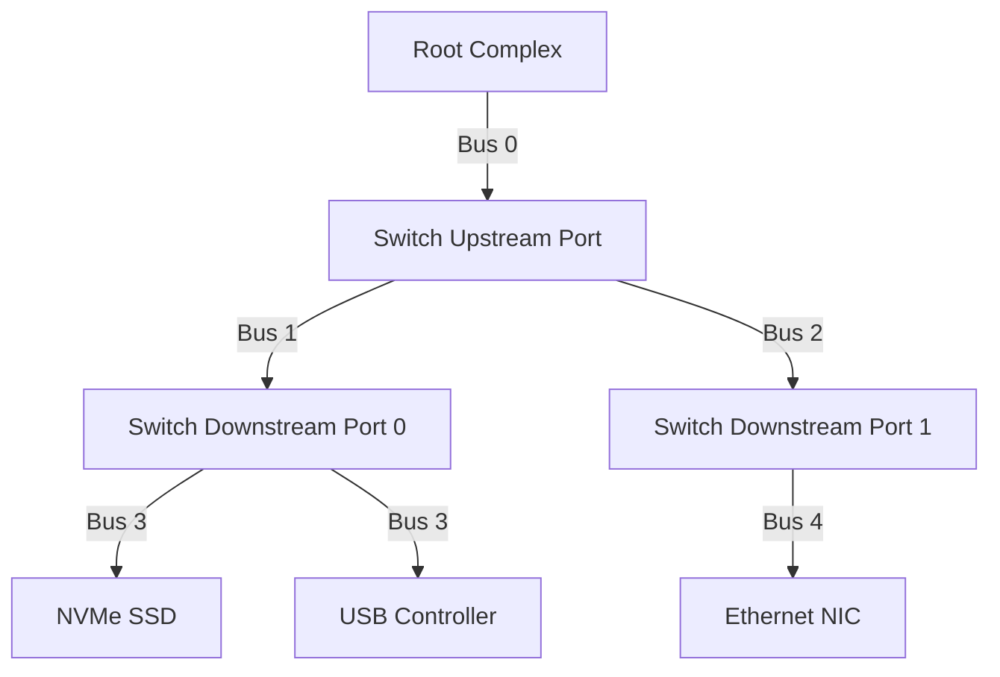

# PCIe配置空间与BAR

<span class="red">核心概念</span> PCIe 设备通过配置空间暴露自身能力，操作系统在枚举阶段读取配置头、解析 BAR（Base Address Register）、分配资源，这是设备驱动能正常工作的前提。

---

## 配置空间：256B/4KB

<span class="red">核心概念</span> 每个 PCIe 功能（Function）都有独立的配置空间，传统 PCI 兼容区是前 256 byte，PCIe 扩展区可达 4KB，通过扩展能力链表（Capability List）组织。

| 区域 | 偏移 | 长度 | 内容 |
|------|------|------|------|
| Type0/Type1 Header | 0x00-0x3F | 64 B | 设备ID、命令、状态、BAR、中断 |
| Device Capability | 0x40-0xFF | 192 B | Power Mgmt、MSI、PCIe Capability |
| Extended Config | 0x100-0xFFF | 3.75 KB | AER、SR-IOV、ACS、ATS 等 |

---

**Type0 Header**（Endpoint 设备）关键字段：
<br>
Vendor ID（0x00-0x01）：厂商标识，如 Intel=0x8086，NVIDIA=0x10DE
<br>
Device ID（0x02-0x03）：具体产品型号
<br>
Revision ID（0x08）：硬件修订版本
<br>
Class Code（0x09-0x0B）：设备大类/子类/编程接口，如 0x010802=NVMe
<br>
Header Type（0x0E）：0x00=Type0，0x01=Type1，bit7=多功能标志

---

**Type1 Header**（Switch/Bridge 设备）额外字段：<br>
Primary Bus Number、Secondary Bus Number、Subordinate Bus Number
<br>
用于路由 Type1 Configuration Request 到下游总线。
<br>
Root Complex 和 Switch 的上游端口用 Type1，下游端口用 Type0。

---

<span class="green">术语</span> **Capability List** 是从偏移 0x34（Type0）或 0x34（Type1）开始的链表，
每个 Capability 结构有 1-byte ID 和 1-byte Next Pointer。
<br>
常见 Capability ID：0x01=Power Management，0x05=MSI，0x11=MSI-X，
0x10=PCIe Capability。

---

## BAR：Base Address Register

<span class="red">核心概念</span> BAR 是设备向主机申报"我需要多少 I/O 或内存空间"的机制，主机通过向 BAR 写全 1 再读回，计算设备需要的地址范围大小。

| BAR | 偏移 | 用途 | 位宽 |
|-----|------|------|------|
| BAR0 | 0x10 | 32-bit Memory 或 I/O | 32-bit |
| BAR1 | 0x14 | 32-bit Memory 或 BAR0 的高32位 | 32/64-bit |
| BAR2 | 0x18 | 32-bit Memory | 32-bit |
| BAR3 | 0x1C | 32-bit Memory 或 BAR2 的高32位 | 32/64-bit |
| BAR4 | 0x20 | 32-bit Memory 或 I/O | 32-bit |
| BAR5 | 0x24 | 32-bit Memory 或 BAR4 的高32位 | 32/64-bit |

---

BAR 的最低位决定类型：bit0=0 表示 Memory Space，bit0=1 表示 I/O Space。
<br>
Memory BAR 的 bit1-2 是类型字段：00=32-bit，10=64-bit。
<br>
64-bit Memory BAR 需要占用两个连续 BAR（如 BAR0+BAR1），用于映射超过 4GB 的地址空间。

---

BAR 大小探测的标准流程：<br>
1. 读取原始 BAR 值保存；<br>
2. 向 BAR 写 0xFFFFFFFF；<br>
3. 读回 BAR，从最低位开始扫描第一个置位的 1，其位置决定空间大小（如读回 0xFFFFF000，则大小为 4KB）；<br>
4. 恢复原始 BAR 值。

---

<span class="blue">结论/易错点</span> I/O Space BAR 在现代系统上已基本废弃，x86 的 I/O 端口空间只有 64KB，PCIe 设备基本都申请 Memory Space。
<br>
ARM 架构没有独立的 I/O 空间概念，所有 BAR 都必须是 Memory Space。
<br>
某些老旧 x86 驱动代码如果直接访问 I/O BAR 的 inb/outb，在 ARM 上移植时会直接崩溃。

---

## 枚举流程：Root Complex到设备发现

<span class="red">核心概念</span> PCIe 枚举是操作系统启动时扫描总线拓扑的过程，从 Root Complex 的 Bus 0 出发，递归发现所有 Bridge 和 Endpoint，分配 Bus Number 和 Memory/I/O 资源。



---

枚举算法是深度优先搜索：<br>
1. 从 Root Complex 的 Bus 0、Device 0、Function 0 开始读配置空间；<br>
2. 如果读到 Vendor ID != 0xFFFF，说明设备存在；<br>
3. 如果是 Type1 Header（Bridge/Switch），分配新的 Secondary Bus Number，递归扫描该总线；<br>
4. 如果是 Type0 Header（Endpoint），读取 BAR，分配资源；<br>
5. 继续扫描下一个 Device/Function，直到所有 Bus 遍历完成。

---

Linux 内核的枚举代码在 `drivers/pci/probe.c` 中，
<br>
`pci_scan_root_bus()` 启动扫描，`pci_scan_bridge()` 递归处理 Switch/Bridge，
<br>
`pci_setup_device()` 读取并解析 BAR，
<br>
`pci_assign_resource()` 分配内存窗口。

---

<span class="green">术语</span> **BDF**（Bus:Device:Function）是 PCIe 设备的唯一标识，格式为 XX:YY.Z。
<br>
例如 01:00.0 表示 Bus 1、Device 0、Function 0。
<br>
多功能设备可以占用同一个 Device 的多个 Function（0-7），
<br>
如 NVMe SSD 可能把控制器放在 01:00.0，管理接口放在 01:00.1。

---

## MSI/MSI-X中断

<span class="red">核心概念</span> MSI（Message Signaled Interrupt）和 MSI-X 是 PCIe 取代传统 INTx 边带中断的现代中断机制，通过 Memory Write TLP 投递中断，支持多向量和中断亲和性。

| 特性 | INTx | MSI | MSI-X |
|------|------|-----|-------|
| 信号方式 | 4 条边带线 | Memory Write TLP | Memory Write TLP |
| 向量数 | 4 (A/B/C/D) | 1-32 | 1-2048 |
| 中断号共享 | 是 | 否（通常） | 否 |
| 亲和性绑定 | 不支持 | 支持 | 支持 |
| 配置复杂度 | 低 | 中 | 高 |

---

MSI 的配置过程：<br>
1. 驱动向 OS 申请 MSI 向量数；<br>
2. OS 分配 Message Address 和 Message Data；<br>
3. 驱动写配置空间的 MSI Capability 寄存器（Message Address、Message Data、Mask Bits）；<br>
4. 设备需要发中断时，向 Message Address 写入 Message Data，产生一个 Memory Write TLP；<br>
5. Root Complex 截获该 TLP，转化为 CPU 中断。

---

MSI-X 相比 MSI 的主要优势是每个向量有独立的 Message Address/Data 和 Mask 位，
<br>
支持把不同事件（TX、RX、Error、Admin）绑定到不同 CPU 核心。
<br>
现代网卡和 NVMe SSD 通常申请 8-32 个 MSI-X 向量，实现中断负载均衡。

---

<span class="blue">结论/易错点</span> 某些老旧 BIOS 默认关闭 MSI/MSI-X，强制设备回退到 INTx 共享中断模式，
<br>
导致高负载时中断风暴和性能暴跌。
<br>
Linux 启动参数 `pci=nomsi` 会全局禁用 MSI，只在调试时使用；
<br>
如果设备性能异常，先检查 `lspci -vvv` 中 MSI/MSI-X 的 Enable 状态。

---

## 命令：lspci与setpci完整输出解读

<span class="red">核心概念</span> `lspci` 是读取 PCIe 设备配置空间的瑞士军刀，`setpci` 则可以写入配置寄存器，两者组合可以完成设备调试和低级配置。

```bash
# 详细查看单个设备
$ lspci -s 01:00.0 -vvv
01:00.0 Non-Volatile memory controller: Samsung Electronics Co Ltd NVMe SSD Controller SM981/PM981/PM983
	Subsystem: Samsung Electronics Co Ltd NVMe SSD Controller SM981/PM981/PM983
	Control: I/O- Mem+ BusMaster+ SpecCycle- MemWINV- VGASnoop- ParErr- Stepping- SERR- FastB2B- DisINTx+
	Status: Cap+ 66MHz- UDF- FastB2B- ParErr- DEVSEL=fast >TAbort- <TAbort- <MAbort- >SERR- <PERR- INTx-
	Latency: 0, Cache Line Size: 64 bytes
	Interrupt: pin A routed to IRQ 16
	Region 0: Memory at f7000000 (64-bit, non-prefetchable) [size=16K]
	Capabilities: [40] Power Management version 3
	Capabilities: [50] MSI: Enable+ Count=1/32 Maskable- 64bit+
	Capabilities: [70] Express Endpoint, MSI 00
	Capabilities: [b0] MSI-X: Enable+ Count=33 Masked-
	Capabilities: [100] Latency Tolerance Reporting
	Capabilities: [158] L1 PM Substates
	Kernel driver in use: nvme
	Kernel modules: nvme
```

---

关键字段解读：<br>
`Control: Mem+ BusMaster+` — 设备启用了内存访问和总线主控（DMA）能力；<br>
`Region 0: Memory at f7000000` — BAR0 映射到物理地址 0xF7000000，大小 16KB；<br>
`MSI: Enable+ Count=1/32` — MSI 已启用，当前分配 1 个向量，最多支持 32 个；<br>
`MSI-X: Enable+ Count=33` — MSI-X 已启用，33 个向量（0-32）；<br>
`Express Endpoint` — 这是一个 PCIe Endpoint 设备。

---

```bash
# 用 setpci 读取特定寄存器
$ setpci -s 01:00.0 0x00.w
144d

# 读取 Class Code
$ setpci -s 01:00.0 0x0a.b
02

# 读取 BAR0
$ setpci -s 01:00.0 0x10.l
f7000004
```

---

<span class="purple">扩展</span> `setpci` 写入操作必须极其谨慎，错误的配置值可能导致设备无法工作或系统崩溃。
<br>
调试 PCIe 设备时，建议先用 `lspci -xxx` 导出完整 256-byte 配置空间做备份，
<br>
再逐步修改并观察效果。
<br>
热插拔场景下，`setpci` 还可以触发设备的 Secondary Bus Reset，强制重新枚举。
