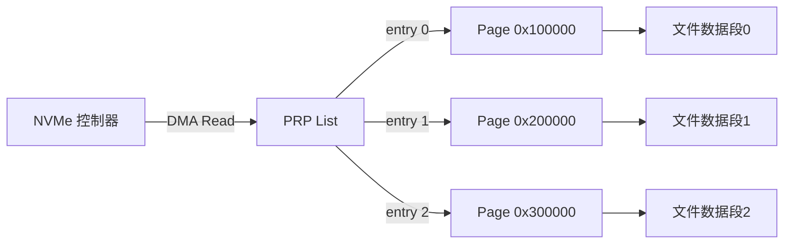

# PCIe实战：NVMe与DMA

<span class="red">核心概念</span> NVMe SSD 是 PCIe 总线上最典型的 Endpoint 设备，它通过 PCIe 的 DMA 能力直接读写系统内存，绕过 CPU 数据搬运，实现微秒级延迟和 GB/s 级带宽。

---

## NVMe SSD PCIe接口形态

<span class="red">核心概念</span> NVMe SSD 有多种物理形态，嵌入式领域最常见的是 M.2 和 U.2，数据中心正在向 EDSFF（E1.S/E1.L/E3.S）过渡。

| 形态 | 接口 | 尺寸 | 功率 | 场景 |
|------|------|------|------|------|
| M.2 2280 | PCIe x4 | 22×80 mm | 7-10 W | 笔记本/嵌入式 |
| M.2 2230 | PCIe x4 | 22×30 mm | 3-5 W | 平板/掌机 |
| U.2 | PCIe x4 | 2.5 inch | 12-25 W | 企业级服务器 |
| E1.S | PCIe x4/x8 | 25×111 mm | 12-25 W | 数据中心存储 |
| E3.S | PCIe x4/x8 | 7.5×112 mm | 20-40 W | 高密度全闪存阵列 |

---

M.2 插槽的 Key 定义决定了电气连接：<br>
B Key 支持 SATA + PCIe x2，M Key 支持 PCIe x4。<br>
NVMe SSD 必须是 M Key 或 B+M Key，纯 B Key 插槽无法跑满 PCIe x4 带宽。

---

嵌入式主板通常焊死一个 M.2 2280 或 2230 插槽，<br>
直接连接到 SoC 的 PCIe Root Complex。<br>
走线长度控制在 6 inch（约 15cm）以内，超过则需要 Retimer 芯片。

---

<span class="blue">结论/易错点</span> M.2 插槽有两种螺钉固定位置（2242/2260/2280/22110 对应不同长度），
<br>
如果 SSD 是 2280 但主板只支持 2242，物理上装不进去；
<br>
反之如果主板是 2280 但 SSD 是 2230，可以使用转接支架，但要注意散热——
<br>
短卡散热面积小，持续高负载可能触发温控降速。

---

## DMA引擎：描述符链与散集列表

<span class="red">核心概念</span> NVMe SSD 的 DMA 通过 PRP（Physical Region Page）或 SGL（Scatter-Gather List）描述主机内存，控制器根据描述符直接读写物理内存，不需要 CPU 介入数据搬运。



---

PRP 是 NVMe 最简单的 DMA 描述机制：<br>
每个 PRP Entry 是一个 64-bit 物理地址，指向一个 4 KiB 页。<br>
如果数据小于 8 KiB 且跨两页，可以直接放在命令的 PRP1 和 PRP2 字段；<br>
如果数据更大，PRP2 指向一个 PRP List，List 中每个 Entry 都是 4 KiB 页地址。

---

SGL 更灵活，支持任意长度的段和不连续内存：<br>
每个 SGL Segment 包含多个 Descriptor，每个 Descriptor 有 Address、Length、Flag。<br>
Segment 末尾的 Descriptor 可以指向下一个 Segment，形成链表。<br>
SGL 是 NVMe 1.1 引入的，对文件系统和数据库的随机 IO 更友好。

---

<span class="green">术语</span> **CMB**（Controller Memory Buffer，控制器内存缓冲区）是某些高端 NVMe 控制器在 BAR 空间内暴露的 SRAM 区域，
<br>
主机可以直接 MMIO 访问这片内存，绕过 PCIe TLP 往返延迟，用于存放频繁访问的元数据。
<br>
CMB 对嵌入式实时系统很有价值，因为它提供了确定性的访问延迟。

---

## Linux NVMe驱动：命令提交与完成

<span class="red">核心概念</span> Linux NVMe 驱动通过 `nvme_submit_cmd()` 把块层请求转化为 SQE（Submission Queue Entry），通过 `nvme_complete_rq()` 处理 CQE（Completion Queue Entry）完成回调。

```c
#include <linux/nvme.h>

/* NVMe 命令提交 */
static int nvme_submit_io(struct nvme_queue *nvmeq,
                          struct request *req)
{
    struct nvme_command cmnd = { };
    u16 control = 0;
    u32 dsmgmt = 0;

    if (req_op(req) == REQ_OP_WRITE) {
        cmnd.rw.opcode = nvme_cmd_write;
        control |= NVME_RW_FUA;
    } else {
        cmnd.rw.opcode = nvme_cmd_read;
    }

    cmnd.rw.nsid = cpu_to_le32(nvmeq->q_dmadev->ns_id);
    cmnd.rw.slba = cpu_to_le64(nvme_lba(req));
    cmnd.rw.length = cpu_to_le16((nvme_block_bytes(req) >> 9) - 1);
    cmnd.rw.control = cpu_to_le16(control);
    cmnd.rw.dsmgmt = cpu_to_le32(dsmgmt);
    cmnd.rw.prp1 = cpu_to_le64(nvme_prp1(req));
    cmnd.rw.prp2 = cpu_to_le64(nvme_prp2(req));

    /* 写入 SQ 并更新 Tail Doorbell */
    nvmeq->sq_tail = nvme_submit_cmd(nvmeq, &cmnd);
    writel(nvmeq->sq_tail, nvmeq->q_db + nvmeq->dbq_stride);
    return 0;
}

/* NVMe 完成处理 */
static inline void nvme_complete_rq(struct request *req, u16 status)
{
    if (unlikely(status)) {
        nvme_req(req)->status = status;
        nvme_end_req(req);
    } else {
        __blk_mq_end_request(req, 0);
    }
}
```

---

`nvme_submit_cmd()` 把 64-byte 的 SQE 拷贝到 Submission Queue 的 Tail 位置，<br>
然后返回新的 Tail 索引。<br>
随后驱动写 Doorbell 寄存器通知控制器"有新命令"，控制器立即开始处理。

---

完成时，控制器在 CQ 中写入 CQE，包含命令标识、状态码和结果。<br>
如果启用了中断，控制器通过 MSI-X 通知主机；<br>
如果轮询模式（Polling），驱动直接读 CQ Head 判断是否有新完成。
<br>
高并发场景通常用中断+轮询混合模式（Hybrid Polling）。

---

<span class="blue">结论/易错点</span> NVMe 驱动中 Doorbell 更新必须是写内存映射寄存器，
<br>
不能只是把值存入变量——控制器看不到变量，只看硬件 Doorbell。
<br>
某些优化过度的代码可能缓存 Doorbell 值批量写入，
<br>
结果导致命令在 SQ 中躺了数微秒才被控制器发现，延迟暴涨。

---

## 性能测量：fio与iostat

<span class="red">核心概念</span> 测量 NVMe SSD 性能的标准工具组合是 `fio`（Flexible I/O Tester）发负载和 `iostat` 看实时统计，两者配合可以定位瓶颈在设备、驱动还是文件系统层。

```bash
# 4K 随机读，队列深度 128，4 个线程，跑 60 秒
$ fio --name=randread --ioengine=libaio --iodepth=128 \
      --rw=randread --bs=4k --direct=1 --size=4G \
      --numjobs=4 --runtime=60 --group_reporting \
      --filename=/dev/nvme0n1
```

---

```
randread: (groupid=0, jobs=4): err= 0: pid=12345
  read: IOPS=850k, BW=3320MiB/s (3481MB/s)
    slat (usec): min=2, max=200, avg=5.50, stdev=1.20
    clat (usec): min=50, max=5000, avg=580.20, stdev=120.50
    lat (usec): min=55, max=5200, avg=585.70, stdev=120.80
```

---

关键指标解读：<br>
`IOPS=850k` — 每秒 85 万次 4K 随机读，这是 SSD 的并发能力指标；<br>
`BW=3320MiB/s` — 实际带宽约 3.3 GB/s；<br>
`slat` — submission latency，从 fio 发请求到驱动提交到 SQ 的时间；<br>
`clat` — completion latency，从提交到收到完成通知的时间，即设备真实延迟；<br>
`lat` — total latency，slat + clat。

---

```bash
# 实时观察设备级统计
$ iostat -x 1 /dev/nvme0n1
Device            r/s     w/s     rkB/s     wkB/s   rrqm/s   wrqm/s  %rrqm  %wrqm
nvme0n1       850000.00    0.00 3400000.00     0.00     0.00     0.00   0.00   0.00
              await  r_await  w_await  svctm  %util
              0.58     0.58     0.00   0.58  99.50
```

---

`%util=99.50` 表示设备接近饱和，但还没到 100%，说明队列深度还有余量。<br>
如果 `await` 远大于 `svctm`，说明请求在队列中等待的时间远大于实际服务时间，
<br>
瓶颈可能在队列调度或中断处理。

---

## 前沿：CXL.mem缓存一致性内存扩展

<span class="red">核心概念</span> CXL（Compute Express Link）是 PCIe 的扩展协议，CXL.mem 子协议允许外设（如加速器、内存扩展卡）与 CPU 共享缓存一致的内存空间，这是 PCIe 传统 DMA 无法做到的。

传统 PCIe DMA 的局限：<br>
设备读内存时，如果数据在 CPU Cache 中，必须先 Flush Cache 到内存，设备才能读到最新值；<br>
设备写内存后，CPU 读之前必须先 Invalidate Cache。<br>
这对 AI 训练场景是巨大开销，因为模型参数和梯度需要在 GPU 和 CPU 之间频繁同步。

---

CXL.mem 通过三种机制解决这一问题：<br>
1. **CXL.cache**：设备可以像 CPU 核心一样缓存内存行，参与缓存一致性协议；<br>
2. **CXL.mem**：设备直接访问系统内存，内存控制器把 CXL 设备当作另一个 NUMA 节点；<br>
3. **CXL.io**：兼容 PCIe IO 语义，用于设备初始化和配置。

---

<span class="purple">扩展</span> CXL 目前主要在数据中心和高端 AI 加速器中使用，<br>
嵌入式领域尚未普及。<br>
但 CXL 的演进方向对嵌入式有启示：未来的异构计算系统（CPU+FPGA+NPU）
<br>
可能需要类似 CXL 的缓存一致性互连，而不是简单的 PCIe DMA。<br>
Intel 的 UCIe（Universal Chiplet Interconnect Express）和 CXL 正在向 chiplet 级别渗透。
