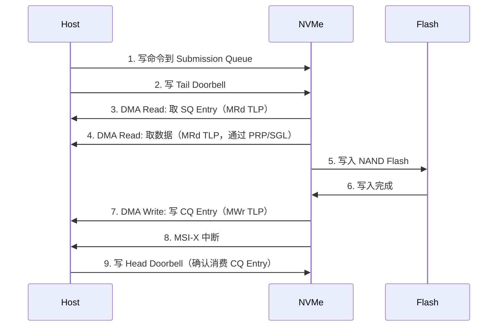

# PCIe实战——NVMe SSD与DMA引擎

<span class="badge-b">[B]</span> <span class="badge-i">[I]</span> <span class="badge-e">[E]</span> <span class="badge-m">[M]</span>

PCIe 的价值最终体现在实际设备上。
本章以 NVMe SSD 为核心案例，拆解队列对、PRP/SGL、DMA 传输路径，
并通过 nvme-cli 和 fio 完成一次完整的性能实测。

---

## 核心定义与价值

<span class="red">NVMe（Non-Volatile Memory Express）</span> 是为 NAND Flash 原生设计的存储协议。
它运行在 PCIe 之上，用极简的命令集和并行的队列对机制，
将 SSD 的 4K 随机读延迟从 SATA 的 ~100μs 压缩到 ~10μs。

**NVMe 的核心设计：**

- <span class="green">队列对（SQ/CQ）</span>：最多 64K 个 Submission Queue + Completion Queue
- <span class="green">Doorbell</span>：内存写通知，零寄存器交互
- <span class="green">PRP/SGL</span>：描述数据缓冲区位置
- <span class="green">Admin Queue</span>：管理命令（创建/删除队列、获取日志）
- <span class="green">I/O Queue</span>：读写命令

---

### 类比：全自动仓储分拣系统

NVMe 像 Amazon 的无人仓库：

- <span class="green">Submission Queue</span> = 订单投放口（驱动写入命令）
- <span class="green">Doorbell</span> = "叮咚"通知（告知控制器有新订单）
- <span class="green">控制器</span> = 分拣机器人（自动取订单、搬货、确认）
- <span class="green">Completion Queue</span> = 完成确认台（控制器写入结果）
- <span class="green">Interrupt</span> = 短信通知（告诉司机货已备好）
- <span class="green">PRP/SGL</span> = 货位地图（告诉机器人货放在哪个货架的哪个格子）

SATA AHCI 像传统仓库：一次只能处理一个订单，分拣完才能收下一个。

---

## 核心机制原理解析

### <strong>1. NVMe 队列对：SQ 和 CQ 的内存布局</strong>

<br>

```mermaid
graph LR
    A[Host Memory] --
    B[Admin SQ]
    B -- Doorbell
    C[NVMe Controller]
    C -- Completion Doorbell
    D[Admin CQ]
    D -- MSI-X
    A
    A --
    E[I/O SQ 0]
    E -- Doorbell
    C
    C -- Completion Doorbell
    F[I/O CQ 0]
    F -- MSI-X
    A
    A --
    G[I/O SQ N]
    G -- Doorbell
    C
    C -- Completion Doorbell
    H[I/O CQ N]
    H -- MSI-X
    A
```

<br>

**队列对的属性：**

| 属性 | Admin Queue | I/O Queue |
|------|-------------|-----------|
| 数量 | 1 对 | 最多 64K 对 |
| 深度 | 2-4096 个条目 | 2-64K 个条目 |
| 用途 | 管理命令 | 读写命令 |
| 创建方式 | 控制器初始化时自动创建 | 通过 Admin 命令 Create I/O CQ/SQ |
| Doorbell 寄存器 | 固定偏移 | 通过 BAR 计算 |

<br>

**Submission Queue Entry（64 byte）：**

```
Byte 0:    Opcode (8 bit)    - 命令码，如 0x01=Flush, 0x02=Write, 0x04=Read
Byte 1:    Fused Operation   - 融合操作标志
Byte 2-3:  Command ID        - 唯一标识，用于匹配 CQ Entry
Byte 4-7:  Namespace ID      - 命名空间标识
Byte 8-15: Reserved
Byte 16-23: Metadata Pointer - 元数据地址（PRP 或 SGL）
Byte 24-31: PRP Entry 1      - 数据缓冲区第一段
Byte 32-39: PRP Entry 2      - 数据缓冲区第二段或指向 PRP List
Byte 40-63: Command Dword 10-15 - 命令特定参数（LBA, Length, etc.）
```

<br>

**Completion Queue Entry（16 byte）：**

```
Byte 0-3:   Command Specific  - 完成时写入的返回值（如读取字节数）
Byte 4-7:   Reserved
Byte 8-11:  SQ Head Doorbell - SQ 头指针（控制器消费的位置）
Byte 12-13: SQ Identifier     - 对应的 SQ ID
Byte 14-15: Command ID        - 匹配的命令 ID
Byte 15:    Status Field      - Phase bit + Status Code
```

<br>
<span class="blue">Phase bit 是 CQ 的"新旧标记"：控制器在写入 CQ Entry 时翻转 Phase bit，
驱动通过检查 Phase bit 是否与上一轮相同，判断该 Entry 是否已被更新。
这避免了驱动和控制器之间的锁竞争。</span>

---

### <strong>2. PRP vs SGL：数据缓冲区的两种描述方式</strong>

<br>

NVMe 支持两种散集（Scatter-Gather）机制：

| 特性 | PRP（Physical Region Page） | SGL（Scatter-Gather List） |
|------|----------------------------|----------------------------|
| 粒度 | 4KB 页对齐 | 任意字节对齐 |
| 描述方式 | 64-bit 物理地址指针 | 链表，每个节点含地址+长度 |
| 最大传输 | 4KB × PRP 列表长度 | 无限制（受内存限制） |
| 硬件复杂度 | 低 | 高 |
| 适用场景 | 常规块 I/O | 大数据块、非对齐传输 |

<br>

**PRP 的工作原理：**

- PRP Entry 是一个 64-bit 物理地址
- 每个 PRP Entry 指向一个 4KB 页（低 12 bit 必须为 0）
- PRP List 是内存中的 PRP Entry 数组
- 如果数据在一个页内：使用 PRP1，PRP2=0
- 如果数据跨 2 页：PRP1=第一页，PRP2=第二页
- 如果数据跨 >2 页：PRP1=第一页，PRP2=指向 PRP List 的指针

<br>

**SGL 的链表节点（16 byte）：**

```
Byte 0-1:   Segment Descriptor Type - 0x0=Data Block, 0x4=Segment, 0x5=Last Segment
Byte 2-3:   Reserved
Byte 4-11:  Address - 64-bit 数据地址
Byte 12-15: Length - 数据长度（字节）
```

<br>
<span class="blue">SGL 的优势是灵活性：可以描述任意长度的非对齐数据块。
但 SGL 需要控制器遍历链表，增加了 DMA 引擎的复杂度。
大多数 NVMe SSD 同时支持 PRP 和 SGL，但 PRP 是默认方式。</span>

---

### <strong>3. DMA 引擎：Read/Write 请求通过 TLP 传输</strong>

<br>

NVMe 控制器作为 PCIe Endpoint，通过 DMA 读写 Host 内存：



<br>

**NVMe 读操作的 TLP 流向：**

| 步骤 | TLP 类型 | 方向 | 内容 |
|------|---------|------|------|
| 取命令 | Memory Read (MRd) | Host→NVMe | SQ Entry 64 byte |
| 取数据 | Memory Read (MRd) | Host→NVMe | 数据页（4KB 每 TLP） |
| 写结果 | Memory Write (MWr) | NVMe→Host | CQ Entry 16 byte |
| 中断 | MSI-X Message | NVMe→Host | Doorbell 写 |

<br>
<span class="blue">NVMe 的卓越性能来自"零拷贝"：数据从 Host 内存通过 DMA 直接进入 SSD 控制器，
再写入 NAND Flash，全程不需要 CPU 参与数据搬运。
SATA 的 AHCI 需要 CPU 设置 PRD 表、轮询状态寄存器，每一步都增加了延迟。</span>

---

## 技术教学与实战

### nvme-cli 完整输出解读

```bash
# 列出所有 NVMe 控制器
nvme list
Node          SN              Model                  Namespace Usage              Format    FW Rev
------------  --------------  ---------------------  --------- -----------------  --------  --------
/dev/nvme0n1  S5G2NC0R123456  Samsung SSD 980 PRO 1TB  1       1.00 TB / 1.00 TB  512 B + 0 B  4B2QGXA7

# 读取控制器信息
nvme id-ctrl /dev/nvme0
vid     : 0x144d                  # Vendor ID (Samsung)
svid    : 0x144d                  # Subsystem Vendor ID
sn      : S5G2NC0R123456         # Serial Number
mn      : Samsung SSD 980 PRO 1TB # Model Number
fr      : 4B2QGXA7               # Firmware Revision
rab     : 4                       # Recommended Arbitration Burst
ieee    : 0x002538               # IEEE OUI (Samsung)
cntlid  : 0                       # Controller ID
ver     : 0x10400                # NVMe Version 1.4
rtd3r   : 2000000                # Resume Latency
rtd3e   : 10000000               # Exit Latency
oaes    : 0x200                  # Async Events Supported
ctratt  : 0x28                   # Controller Attributes

cmbsz   : 0                      # Controller Memory Buffer Size (0=不支持)
cmdset  : 0                      # Admin Command Set

# 关键性能参数
nn      : 1                       # Number of Namespaces
oncs    : 0x1f                   # Optional NVM Commands Supported
fuses   : 0                      # Fused Operations
awun    : 7                       # Atomic Write Unit Normal
awupf   : 0                       # Atomic Write Unit Power Fail
nvscc   : 1                       # NVM Vendor Specific Command Config
```

<br>

关键字段：

| 字段 | 值 | 含义 |
|------|-----|------|
| ver | 0x10400 | NVMe 1.4 版本 |
| nn | 1 | 1 个命名空间 |
| oncs | 0x1f | 支持 Compare, Write Uncorrectable, Write Zeroes, Dataset Management, Reservations |
| cmbsz | 0 | 不支持 Controller Memory Buffer |

---

```bash
# 读取命名空间信息
nvme id-ns /dev/nvme0n1
nsze    : 0x1d1c11fb0            # Namespace Size (总扇区数)
ncap    : 0x1d1c11fb0            # Namespace Capacity
nuse    : 0x1d1c11fb0            # Namespace Utilization
nsfeat  : 0x18                   # Thin Provisioning + Multipath
nlbaf   : 2                       # Number of LBA Formats
flbas   : 0x02                   # Formatted LBA Size = 2

lbaf 0 : ms:0   lbads:9  rp:0x02 (512B + 0B, Good)
lbaf 1 : ms:8   lbads:9  rp:0x02 (512B + 8B, Good)
lbaf 2 : ms:0   lbads:12 rp:0x01 (4KiB + 0B, Better)

# 当前使用 Format 2: 4KB LBA，无元数据
```

<br>

<span class="blue">lbads=12 表示 LBA Data Size = 2^12 = 4096 byte。
4KB 原生页是 NVMe SSD 的最佳格式，避免了 512B 模拟带来的写放大。</span>

---

### fio 性能测试与结果解读

```bash
# 4K 随机读，队列深度 1
fio --name=randread --ioengine=io_uring --iodepth=1 \\
    --rw=randread --bs=4k --direct=1 --size=100G \\
    --runtime=60 --filename=/dev/nvme0n1 \\
    --output-format=json

# 结果：
# iops=10,500, bw=42 MiB/s, lat=95.2 usec

# 4K 随机读，队列深度 128
fio --name=randread --ioengine=io_uring --iodepth=128 \\
    --rw=randread --bs=4k --direct=1 --size=100G \\
    --runtime=60 --filename=/dev/nvme0n1 \\
    --numjobs=4 \\
    --output-format=json

# 结果：
# iops=850,000, bw=3.32 GiB/s, lat=602 usec
```

<br>

| 场景 | iops | 延迟 | 说明 |
|------|------|------|------|
| QD1 随机读 | 10.5K | 95 μs | 单队列，延迟最低 |
| QD128 随机读 | 850K | 602 μs | 高并行，吞吐量最大 |
| QD1 顺序读 | ~3,500 | — | 受控制器前端带宽限制 |
| QD32 顺序读 | ~800MB/s | — | PCIe Gen3 ×4 接近饱和 |

---

## 嵌入式专属实战场景

### 场景：ARM 嵌入式平台的 NVMe 启动

ARM64 平台从 NVMe 启动需要：

1. **UEFI/UBoot 支持 NVMe 驱动**
2. **PCIe 控制器初始化**
3. **NVMe 命名空间作为 boot 设备**

```bash
# U-Boot 中扫描 NVMe
nvme scan
nvme info

# 输出：
Device 0: Samsung SSD 980 PRO 1TB
           Namespace 1: 1TB (512B × 1953525168 blocks)

# 从 NVMe 加载内核
nvme read 0x80000000 0x1000 0x20000   # 读取 64MB 到内存
booti 0x80000000 - 0x90000000          # 启动内核
```

<br>

常见启动问题：

| 问题 | 根因 | 修复 |
|------|------|------|
| U-Boot 无法识别 NVMe | PCIe 控制器未初始化 | 确保 REFCLK 和 PERST# 时序正确 |
| 内核 panic：找不到 rootfs | NVMe 驱动未编译进内核 | CONFIG_NVME_CORE=y, CONFIG_NVME_FABRICS=y |
| 启动慢 | NVMe 初始化 + 枚举耗时 | 优化 U-Boot 中的 PCIe 延迟 |
| 热插拔不工作 | 需要 Surprise Down 支持 | 检查设备树 pcie-reset-gpios 配置 |

---

## 历史演进与前沿

### NVMe 的演进

| 年份 | 版本 | 核心特性 |
|------|------|---------|
| 2011 | NVMe 1.0 | 基础队列对、Admin/I/O 命令 |
| 2012 | NVMe 1.1 | 多命名空间、SR-IOV |
| 2014 | NVMe 1.2 | 电源管理、端到端数据保护 |
| 2017 | NVMe 1.3 | Sanitize、Boot Partition |
| 2019 | NVMe 1.4 | Predictable Latency、Namespace Write Protect |
| 2021 | NVMe 2.0 | 模块化规范（命令集/传输/管理分离） |
| 2023 | NVMe 2.1 | CXL 支持、Zoned Namespace 扩展 |

<br>
<span class="red">NVMe 2.0 的模块化是重大变革：
规范被拆分为 Base、Command Set（NVM/ZNS/Key-Value）、Transport（PCIe/TCP/RDMA）和管理接口，
使得 NVMe-oF（over Fabrics）和 CXL.mem 可以更灵活地扩展。</span>

---

## 本章小结

| 主题 | 关键要点 |
|------|---------|
| SQ/CQ | Submission Queue 写入命令，Completion Queue 返回结果，Doorbell 通知 |
| SQ Entry | 64 byte：Opcode + NSID + PRP1 + PRP2 + Command Dwords |
| CQ Entry | 16 byte：Status + SQ Head + Command ID，Phase bit 防竞争 |
| PRP | 4KB 页对齐，64-bit 物理地址，支持列表扩展 |
| SGL | 链表节点，任意字节对齐，适合非对齐大数据 |
| DMA 路径 | MRd 取命令+数据，MWr 写完成，MSI-X 通知 |
| nvme-cli | id-ctrl 读控制器，id-ns 读命名空间，list 枚举 |
| fio | io_uring + iodepth 128 + numjobs 4，测满 NVMe 并行能力 |

---

## 练习

1. NVMe 的 Phase bit 机制如何工作？为什么它能避免驱动和控制器之间的锁竞争？
2. 比较 PRP 和 SGL：如果一个写请求需要传输 1MB 数据，且缓冲区是物理连续的，应该使用 PRP 还是 SGL？如果缓冲区分散在 256 个 4KB 页中呢？
3. 计算 PCIe Gen3 ×4 的理论带宽（3.94GB/s），与 fio 实测的 3.32GB/s 相比，差额的 16% 去了哪里？列举所有开销来源。
4. 某 NVMe SSD 的 id-ctrl 输出中 cmbsz=0。CMB（Controller Memory Buffer）如果存在，能带来什么性能优势？
5. NVMe 2.0 的模块化规范对 NVMe-oF 和 CXL.mem 有什么意义？为什么说这是"面向未来的架构"？
