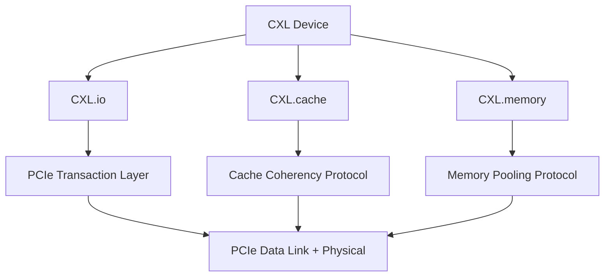

# PCIe往哪去——CXL、Gen6与前沿

<span class="badge-b">[B]</span> <span class="badge-i">[I]</span> <span class="badge-e">[E]</span> <span class="badge-m">[M]</span>

PCIe 仍在进化，但方向已经不仅是"更快"。
本章聚焦 CXL（Compute Express Link）、Gen6 的 PAM4+FLIT、Chiplet 时代的 UCIe，
以及嵌入式 PCIe 的最新实践。

---

## 核心定义与价值

<span class="red">CXL</span> 是 PCIe 的"超集"，在兼容 PCIe 事务层的基础上，
新增 Cache 一致性和内存扩展协议，
让 CPU、GPU、FPGA 和专用加速器可以共享同一个物理内存池。

**CXL 的三协议栈：**

- <span class="green">CXL.io</span>：兼容 PCIe 事务层，用于 I/O 设备
- <span class="green">CXL.cache</span>：Cache 一致性协议，用于加速器访问 CPU Cache
- <span class="green">CXL.memory</span>：内存扩展协议，用于 CPU 访问远程内存

---

### 类比：从高速公路到综合物流港

PCIe 像连接城市的高速公路：
- 只能运"包裹"（TLP）
- 每辆车独立，不能互相借用货物

CXL 像综合物流港：
- <span class="green">CXL.io</span> = 高速公路（兼容原有车流）
- <span class="green">CXL.cache</span> = 货物互借协议（A 车可以从 B 车取零件）
- <span class="green">CXL.memory</span> = 共享仓库（所有车共用同一个货仓）

这使得 GPU 不需要把数据搬回 CPU 内存再处理，
可以直接在共享内存池上工作。

---

## 核心机制原理解析

### <strong>1. CXL 协议栈：io / cache / mem 的分层架构</strong>

<br>



<br>

| 协议 | 功能 | 替代方案 | 兼容层 |
|------|------|---------|--------|
| CXL.io | I/O、配置、中断、DMA | PCIe TLP | 完全兼容 PCIe 5.0 |
| CXL.cache | 加速器缓存一致性 | CCIX、UPI | 需要 CXL Root Port |
| CXL.memory | 内存扩展、池化 | 传统 DIMM | 需要 CXL Memory Controller |

<br>

**CXL 版本演进：**

| 版本 | 年份 | 核心特性 |
|------|------|---------|
| CXL 1.0/1.1 | 2019 | CXL.io + CXL.cache，32GT/s |
| CXL 2.0 | 2020 | CXL.memory 引入，Switching，池化 |
| CXL 3.0 | 2022 | 64GT/s，多级 Switch，Mem 扩展 |
| CXL 3.1 | 2023 | Mem 扩展增强，P2P DMA |

<br>

<span class="blue">CXL 2.0 的 Memory Pooling 是革命性创新：
传统服务器每个 CPU 有固定的本地内存，CXL 2.0 允许通过 CXL Switch 将内存设备池化，
CPU 按需动态分配远程内存，类似于 NVMe-oF 对存储的池化。
</span>

---

### <strong>2. PCIe Gen6：PAM4 调制与 FLIT 模式</strong>

<br>

Gen6 为了实现 64GT/s，引入了根本性的物理层变革：

| 特性 | Gen5 及之前 | Gen6 |
|------|-------------|------|
| 调制 | NRZ（2 电平） | PAM4（4 电平） |
| 每符号 bit | 1 | 2 |
| 奈奎斯特频率 | 16 GHz @32GT/s | 16 GHz @64GT/s |
| 编码 | 128b/130b | FLIT（256B Fixed） |
| 错误检测 | ECRC + LCRC | FEC（Reed-Solomon） |
| 流控 | Credit-Based | Credit-Based + FLIT Ack |

<br>

**PAM4 的代价：**

- NRZ 的眼图有 1 个开口（判断 0/1），PAM4 有 3 个开口（判断 00/01/10/11）
- 相同电压摆幅下，PAM4 的噪声裕量（Noise Margin）是 NRZ 的 1/3
- 必须引入 <span class="green">FEC（Forward Error Correction）</span> 纠正误码
- Gen6 使用 Reed-Solomon RS(544,514) 编码，可以纠正 15 个符号错误

<br>

**FLIT（Fixed Length Information Transfer）模式：**

- 传统 PCIe 使用变长 TLP（最大 4096B payload）
- Gen6 FLIT 固定为 256B，其中 236B payload + 8B DLP + 12B FEC
- 固定长度简化了 PHY 流水线，允许更高效的并行处理
- <span class="blue">FLIT 模式牺牲了 TLP 的灵活性，换取了更高的线路利用率和更低的延迟抖动。</span>

---

### <strong>3. 竞争与融合：CCIX、Gen-Z、OpenCAPI 的兴衰</strong>

<br>

在 CXL 之前，业界有过多次 Cache 一致性互连标准的尝试：

| 标准 | 主导厂商 | 状态 | 与 CXL 的关系 |
|------|---------|------|--------------|
| CCIX | ARM、AMD、Xilinx | 2016-2020 | 被 CXL 吸收兼容 |
| Gen-Z | AMD、HPE、ARM | 2016-2021 | 被 CXL 吸收兼容 |
| OpenCAPI | IBM | 2017-2021 | 被 CXL 吸收兼容 |
| CXL | Intel、AMD、Google | 2019-至今 | 行业标准 |
| UCIe | Intel、AMD、ARM | 2022-至今 | Chiplet 互连标准 |

<br>

<span class="red">为什么 CXL 赢了？</span>

- CXL 基于 PCIe 物理层，复用了整个 PCIe 生态（Retimer、Switch、Connector）
- Intel、AMD、ARM 三大阵营全部支持
- 云厂商（Google、Microsoft、Meta）推动标准化
- 2019 年后，CCIX/Gen-Z/OpenCAPI 联盟成员陆续转投 CXL

---

### <strong>4. 嵌入式中的 PCIe：Raspberry Pi 4 与 i.MX8</strong>

<br>

| 平台 | PCIe 版本 | 带宽 | 典型用途 |
|------|-----------|------|---------|
| Raspberry Pi 4 | Gen2 ×1 | ~500 MB/s | USB3 扩展、NVMe HAT |
| Raspberry Pi 5 | Gen2 ×1 | ~500 MB/s | 官方 NVMe 扩展 |
| i.MX8M Plus | Gen3 ×1 | ~985 MB/s | 工业 NVMe、5G 模组 |
| i.MX93 | Gen3 ×1 | ~985 MB/s | AI 推理加速器 |
| RK3588 | Gen3 ×4 | ~3.94 GB/s | 高性能嵌入式 |
| Jetson Orin | Gen4 ×8 | ~31.5 GB/s | AI 边缘计算 |

<br>

**Raspberry Pi 4 的 PCIe 实践：**

```bash
# 启用 PCIe 扩展（config.txt）
dtparam=pciex1
dtoverlay=pcie-32bit-dma

# 查看 PCIe 树
lspci -tv
-[0000:00]-+-00.0  Broadcom Inc. BCM2711 PCIe Root Complex
           \-01.0-[01]--+-00.0  VIA VL805 USB 3.0 Host Controller
                         \-00.1  VIA VL805 USB 3.0 Host Controller
```

<br>

<span class="blue">Raspberry Pi 5 的改进：官方 PCIe FPC 连接器，直接引出 Gen2 ×1 到 M.2 HAT，无需 GPIO 飞线。</span>

---

### <strong>5. UCIe：Chiplet 时代的终极互连</strong>

<br>

<span class="green">UCIe（Universal Chiplet Interconnect Express）</span> 是 2022 年由 Intel、AMD、ARM、TSMC 等联合推出的 Chiplet 互连标准。

| 特性 | 值 |
|------|-----|
| 目标 | 片上 Die-to-Die 互连 |
| 物理层 | 先进封装（2.5D/3D/CoWoS/EMIB） |
| 协议栈 | 基于 PCIe 和 CXL 协议 |
| 带宽目标 | 2-4 TB/s/mm（边缘带宽密度） |
| 延迟目标 | < 1 ns |

<br>

UCIe 与 PCIe/CXL 的关系：
- UCIe 定义了物理层和链路层，适配片上互连的特殊需求
- UCIe 的适配层直接映射到 PCIe 和 CXL 协议
- 这意味着：用 UCIe 互连的 Chiplet，软件层面仍然看到的是标准 PCIe/CXL 设备

<span class="blue">UCIe 的意义：CPU、GPU、NPU、内存控制器可以分别制造为独立 Chiplet，然后通过 UCIe 灵活组合，极大降低芯片设计成本和风险。</span>

---

## 技术教学与实战

### 识别 CXL 设备

```bash
# CXL 设备在 lspci 中显示为 Memory 控制器
lspci | grep -i cxl
00:01.0 Memory controller: Intel Corporation CXL.mem Controller

# 查看 CXL 能力
cat /sys/bus/cxl/devices/root0/ports/endpoint0/serial_number
cat /sys/bus/cxl/devices/root0/ports/endpoint0/firmware_version
```

<br>

Linux 内核从 5.12 开始引入 CXL 子系统，主要 sysfs 路径：

| 路径 | 内容 |
|------|------|
| /sys/bus/cxl/devices/ | CXL 设备树 |
| /sys/bus/cxl/drivers/ | CXL 驱动 |
| /sys/class/cxl/ | CXL 内存区域 |

---

## 嵌入式专属实战场景

### 场景：为 RK3588 设计 PCIe 扩展板

RK3588 提供 PCIe 3.0 ×4（或拆分为 2××2 / 4××1），设计扩展板时需要考虑：

| 方案 | 拆分方式 | 连接设备 | 评价 |
|------|---------|---------|------|
| A | ×4 直通 | 1× NVMe ×4 | 最高带宽，最简单 |
| B | ×2 + ×2 | 2× NVMe ×2 | 双盘，每盘 2GB/s |
| C | ×1×4 | 4× NVMe ×1 / 4× 网卡 | 多设备，共享带宽 |
| D | ×4 Switch | 4× NVMe ×4 + 网卡 | 需要 Switch 芯片，成本高 |

<br>

推荐方案 B（双 NVMe ×2）用于 NAS：
- 每盘 2GB/s 足以跑满 SATA SSD 或中低端 NVMe
- 双盘可以做 RAID1/RAID0
- 不需要 Switch 芯片，直连 SoC Root Port

```c
/* RK3588 设备树 PCIe 拆分配置 */
&pcie3x4 {
    num-lanes = <4>;
    /* 如需拆分： */
    /* pcie3x4 拆分为 pcie3x2 + pcie3x1 + pcie3x1 */
    /* 在设备树中定义 sub-node */
};
```

---

## 历史演进与前沿

### PCIe 生态的未来 10 年

| 时间 | 技术 | 意义 |
|------|------|------|
| 2023-2025 | CXL 2.0/3.0 普及 | 数据中心内存池化 |
| 2025-2027 | PCIe Gen6 量产 | 64GT/s，PAM4+FLIT |
| 2027-2029 | CXL 4.0 | 统一内存架构（UMA） |
| 2028-2030 | PCIe Gen7 规划 | 预计 128GT/s，光互联 |
| 2030+ | UCIe 普及 | Chiplet 成为标准设计范式 |

<br>

<span class="red">嵌入式工程师的关键认知：</span>

- PCIe 不会消失，但会从"高速扩展总线"变成"片上互连协议的适配层"
- 未来 SoC 内部用 UCIe 互连 Chiplet，对外仍通过 PCIe 连接外部设备
- CXL.mem 可能在高端嵌入式（AI 边缘服务器）中出现
- 消费级嵌入式（树莓派级别）至少 10 年内仍使用传统 PCIe

---

## 本章小结

| 主题 | 关键要点 |
|------|---------|
| CXL.io | 兼容 PCIe 5.0，用于 I/O 设备 |
| CXL.cache | 加速器缓存一致性，替代 CCIX |
| CXL.memory | 内存池化，类似 NVMe-oF 对存储的池化 |
| Gen6 | 64GT/s，PAM4 四电平，FLIT 256B 固定包，FEC 纠错 |
| UCIe | Chiplet Die-to-Die 互连，2-4TB/s/mm，基于 PCIe/CXL 协议 |
| 嵌入式 | Pi 4 Gen2×1，Pi 5 官方 M.2，i.MX8 Gen3×1，RK3588 Gen3×4，Jetson Gen4×8 |

---

## 练习

1. 为什么 CXL 能赢得 Cache 一致性互连标准之战，而 CCIX/Gen-Z/OpenCAPI 失败了？从生态、厂商支持、物理层复用三个角度分析。
2. PCIe Gen6 的 PAM4 调制相比 NRZ，误码率增加了多少？为什么必须引入 FEC？Reed-Solomon RS(544,514) 能纠正多少个符号错误？
3. FLIT 模式固定 256B 长度，相比变长 TLP 有什么优势和劣势？在什么场景下 FLIT 会降低效率？
4. 某 RK3588 开发板需要将 PCIe 3.0 ×4 拆分为 2××2。从设备树角度，需要修改哪些属性？拆分后每个端口的最大带宽是多少？
5. UCIe 与 PCIe/CXL 的关系是什么？如果 UCIe 普及，嵌入式工程师的 PCIe 知识是否还有价值？为什么？
