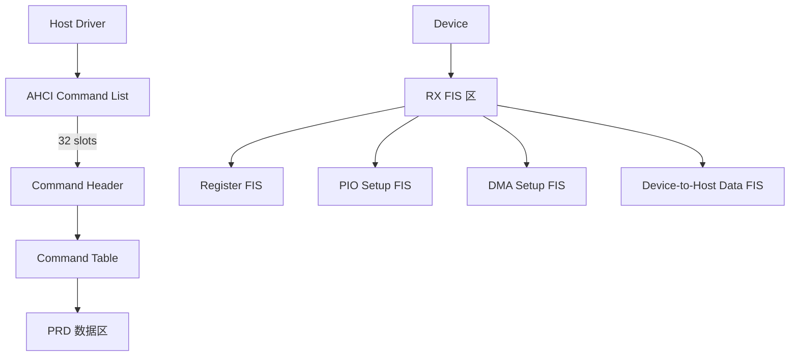

# SATA基础认知与AHCI

核心概念 SATA（Serial Advanced Technology Attachment，串行高级技术附件）是取代 PATA（并行ATA）的存储接口标准，用串行差分信号替代并行总线，解决了并行传输的信号串扰和时钟偏移问题。

---

## 为什么SATA取代PATA

核心概念 PATA（也称 IDE）使用 40 针或 80 针扁平电缆并行传输 16-bit 数据，最高速率 133 MB/s，但已经触及物理极限。

PATA 的问题不是带宽不够，而是**并行总线的物理困境**：
 
- 信号线之间串扰严重，80 针电缆的额外 40 根全是地线，用来隔离串扰
 
- 各数据线长度差异导致时钟偏移（Skew），高速时数据对不齐
 
- 扁平电缆宽大笨拙，阻碍机箱风道，限制设备数量（一条总线最多 2 个设备）

---

串行总线天然免疫串扰和时钟偏移，因为数据按顺序一比特一比特发送。
 
类比来说，PATA 像一条多车道拥堵路，每条车道（信号线）必须保持同步；
 
SATA 像单车道高速公路，车流按顺序通行，不需要担心并行车道的干扰。
 
虽然只有一条车道，但车速（时钟频率）可以无限提升。

---

## SATA物理层：7-pin接口

核心概念 SATA 数据线只有 7 根引脚：2 对差分信号线（TX+/- 和 RX+/-）加 3 根地线，接口小巧、支持热插拔。

| 引脚 | 信号 | 方向 | 说明 |
|------|------|------|------|
| 1 | GND | - | 地线 |
| 2 | A+ | 发 | 差分发送正 |
| 3 | A- | 发 | 差分发送负 |
| 4 | GND | - | 地线 |
| 5 | B- | 收 | 差分接收负 |
| 6 | B+ | 收 | 差分接收正 |
| 7 | GND | - | 地线 |

---

差分对的抗共模噪声能力极强：外部干扰同时作用于 A+ 和 A-，
 
接收端只关心两者的差值，共模分量被抵消。
 
SATA 使用 8b/10b 编码，每 8-bit 数据映射为 10-bit 线路码，保证 DC 平衡和足够的边沿密度供时钟恢复。

---

术语 **OOB**（Out of Band，带外信号）是 SATA 链路初始化时使用的低频信号序列，
 
用于检测对端是否存在、协商速率和建立通信。
 
OOB 由 COMINIT/COMRESET 和 COMWAKE 组成，使用 1.5GHz 载波附近的突发脉冲。

---

## AHCI控制器：Command List与FIS

核心概念 AHCI（Advanced Host Controller Interface，高级主机控制器接口）是 Intel 定义的 SATA 控制器软件接口规范，它把硬件寄存器抽象为命令列表、端口控制寄存器和 FIS 接收区。

---

AHCI 的核心数据结构是 Command List，每个 Port 有 1-32 个 Command Slot。
 
每个 Slot 包含一个 Command Header（16 DW），指向 Command Table（存放 ATA 命令和 PRD 表）。
 
PRD（Physical Region Descriptor，物理区域描述符）列表描述散集内存，支持不连续的 DMA 传输。

---

术语 **FIS**（Frame Information Structure，帧信息结构）是 SATA 层和设备层之间的数据包格式，
 
类似网络中的帧概念。Register FIS 用于传输 ATA 寄存器值，
 
DMA Setup FIS 用于编程 DMA 引擎，Data FIS 用于实际数据传输。

---

Port Multiplier（端口倍增器）是 AHCI 的可选特性，
 
允许一个 SATA 端口连接多达 15 个设备，通过 FIS 中的 PM Port 字段区分目标设备。
 
这在 NAS 和存储服务器中很常见，但在嵌入式领域较少使用。

---

## SATA速度演进

核心概念 SATA 从 1.0 到 3.0 只经历了三代，有效带宽翻倍增长，但协议层基本保持向后兼容。

| 版本 | 线路速率 | 编码方式 | 有效带宽 | 发布年份 |
|------|---------|---------|---------|---------|
| SATA 1.0 | 1.5 Gbps | 8b/10b | 150 MB/s | 2003 |
| SATA 2.0 | 3.0 Gbps | 8b/10b | 300 MB/s | 2004 |
| SATA 3.0 | 6.0 Gbps | 8b/10b | 600 MB/s | 2009 |

---

结论/易错点 SATA 3.0 的 6 Gbps 是线路速率，经过 8b/10b 编码后有效数据率为 4.8 Gbps（600 MB/s），
 
还要扣除协议开销，实际持续传输约 550 MB/s。
 
一些标称 SATA SSD 的产品用 6Gb/s 做营销，实际读写只有 500+ MB/s，这是正常的。

---

SATA 3.0 之后没有定义 SATA 4.0，因为 AHCI 的 1 队列/32 深度架构已成为瓶颈。
 
 industry's 方向直接转向 NVMe + PCIe，而不是继续升级 SATA。
 
SATA 在嵌入式领域仍有一席之地，因为成本低、兼容性广、功耗可控。

---

## 与NVMe的选型对比

核心概念 NVMe（Non-Volatile Memory Express，非易失性内存主机控制器接口规范）基于 PCIe，专为 SSD 设计，延迟和并发能力远超 SATA/AHCI。

| 维度 | SATA/AHCI | NVMe/PCIe |
|------|-----------|-----------|
| 队列数 | 1 | 64K |
| 队列深度 | 32 | 64K |
| 协议开销 | 高（ATA封装） | 低（直达闪存） |
| 延迟 | ~100μs | ~10μs |
| 最大带宽 | 600 MB/s | 7+ GB/s |
| 功耗 | 较低 | 较高 |
| 成本 | 低 | 高 |

---

扩展 嵌入式产品的存储选型不是一味追新：
 
工业网关、边缘计算盒子如果只需要顺序写入日志，SATA SSD 成本比 NVMe 低 30% 以上；
 
只有 AI 推理、数据库缓存这类需要高并发随机 I/O 的场景，NVMe 才是刚需。
 
eMMC 和 NVMe BGA 封装的中间地带，还有 UFS（主要用于手机，嵌入式较少见）。
