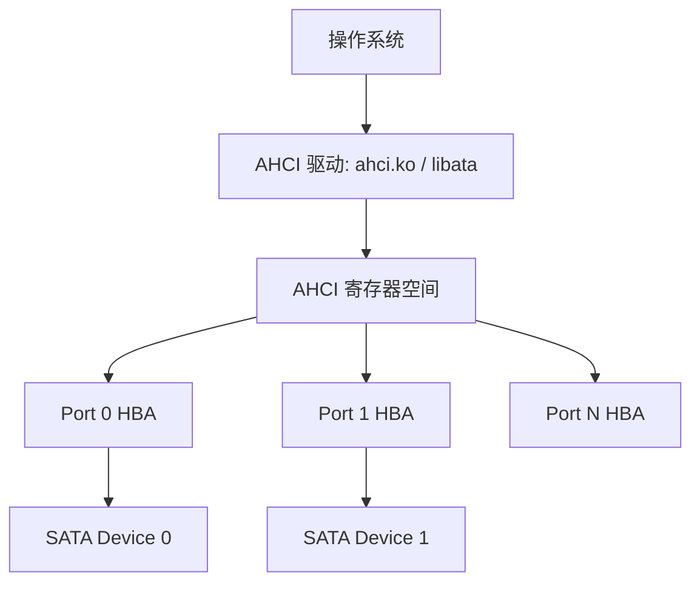

# SATA是什么——串行ATA与AHCI控制器

<span class="badge-b">[B]</span> <span class="badge-i">[I]</span> <span class="badge-e">[E]</span> <span class="badge-m">[M]</span>

SATA 是嵌入式和 PC 存储的"老兵"。
本章从 PATA 的终结开始，拆解 SATA 物理层、AHCI 控制器架构，
并与 NVMe 做正面交锋，建立速率认知的基准线。

---

## 核心定义与价值

<span class="red">SATA（Serial Advanced Technology Attachment）</span> 是取代 PATA（Parallel ATA，即 IDE）的串行存储接口标准。
它用两根差分线替代了 40/80 根并行线，在 2003 年随 Intel ICH5 南桥普及。

**SATA 的核心价值：**

- 电缆从 40-pin 扁平排线变成 7-pin 细线缆，极大改善了机箱风道和可靠性
- 点对点拓扑替代共享总线，每个设备独享链路带宽
- 原生支持热插拔和 NCQ（Native Command Queuing）
- AHCI 标准化了 Host 控制器接口，让驱动开发跨平台

---

### 类比：单车道高速公路

SATA 像一条单向双车道的州际公路：

- <span class="green">TX+ 差分对</span> = 去程车道（Host→Device 数据）
- <span class="green">RX+ 差分对</span> = 回程车道（Device→Host 数据）
- <span class="green">3 根地线</span> = 路肩和隔离带（屏蔽 EMI）
- <span class="green">速率演进</span> = 从限速 60mph（1.5G）到 120mph（3G）到 240mph（6G）
- <span class="green">AHCI</span> = 公路管理局（统一收费规则、车道调度）

但 SATA 始终是单车道，而 NVMe 像 64 条并行的高速铁路。

---

## 核心机制原理解析

### <strong>1. SATA 物理层：7-pin 线缆的精确解剖</strong>

<br>

SATA 数据线仅有 7 根引脚：

| 引脚 | 信号 | 类型 | 说明 |
|------|------|------|------|
| 1 | GND | 地 | 屏蔽层接地 |
| 2 | A+ (SATA_TX+) | 差分对 A | Host 发送 → Device 接收 |
| 3 | A- (SATA_TX-) | 差分对 A | Host 发送 → Device 接收 |
| 4 | GND | 地 | 信号隔离 |
| 5 | B- (SATA_RX-) | 差分对 B | Device 发送 → Host 接收 |
| 6 | B+ (SATA_RX+) | 差分对 B | Device 发送 → Host 接收 |
| 7 | GND | 地 | 屏蔽层接地 |

<br>

SATA 电源线单独提供 15-pin 供电：

| 引脚组 | 功能 | 电压 |
|--------|------|------|
| 1-3 | V33 | +3.3V |
| 4-6 | V33 | +3.3V |
| 7-9 | V5 | +5V |
| 10-12 | V5 | +5V |
| 13-15 | V12 | +12V（仅 3.5" 硬盘） |

<br>
<span class="blue">2.5" SATA SSD 通常只使用 +5V（引脚 7-12），3.5" HDD 额外需要 +12V 供电机驱动。</span>

---

### <strong>2. SATA 速率演进与编码</strong>

<br>

| 代际 | 名称 | 原始速率 | 编码 | 有效速率 | 发布年份 |
|------|------|---------|------|---------|---------|
| Gen1 | SATA 1.5G | 1.5 Gbps | 8b/10b | 150 MB/s | 2003 |
| Gen2 | SATA 3G | 3.0 Gbps | 8b/10b | 300 MB/s | 2004 |
| Gen3 | SATA 6G | 6.0 Gbps | 8b/10b | 600 MB/s | 2009 |
| Gen4 | SATA 12G | — | — | — | 未发布（被 NVMe 截胡） |

<br>
8b/10b 编码将每 8 bit 数据映射为 10 bit 线路码，确保 DC 平衡和时钟恢复。
<span class="blue">编码开销是 20%，因此 SATA 6G 的有效速率是 600 MB/s，而非 750 MB/s。</span>

---

### <strong>3. AHCI：Advanced Host Controller Interface</strong>

<br>

AHCI 是 Intel 于 2004 年定义的 SATA 控制器寄存器级标准。
它规定了 OS 与 SATA 控制器之间的编程接口，使一个驱动就能适配所有 AHCI 兼容芯片。



<br>

**AHCI 寄存器空间布局（内存映射）：**

| 区域 | 偏移 | 大小 | 内容 |
|------|------|------|------|
| Generic Host Control | 0x00 | 0x2C | CAP/GHC/IS/PI/VS 全局寄存器 |
| Port 0 | 0x100 | 0x80 | 端口控制、命令列表、接收 FIS |
| Port 1 | 0x180 | 0x80 | 同上 |
| Port N | 0x100 + N×0x80 | 0x80 | 同上 |

<br>

**关键全局寄存器：**

| 寄存器 | 偏移 | 位宽 | 功能 |
|--------|------|------|------|
| HBA_CAP (CAP) | 0x00 | 32 | 控制器能力：端口数、NCQ 支持、64-bit 支持 |
| GHC | 0x04 | 32 | 全局控制：AHCI 使能、中断使能、复位 |
| IS (Interrupt Status) | 0x08 | 32 | 端口中断状态，每 bit 对应一个端口 |
| PI (Ports Implemented) | 0x0C | 32 | 实际实现的端口位图 |
| VS (Version) | 0x10 | 32 | AHCI 版本号（1.0100 = 1.0，1.0300 = 1.3.1） |

<br>

**CAP 寄存器关键位：**

| 位 | 名称 | 说明 |
|----|------|------|
| [31:24] | NP | 支持的端口数 - 1 |
| 18 | SAM | Supports AHCI Mode Only |
| 17 | SPM | Supports Port Multiplier |
| 16 | PMD | PIO Multiple DRQ Block |
| 15 | SSC | Slumber State Capable |
| 14 | PSC | Partial State Capable |
| 13 | NOL | Supports NCQ + unload |
| 12 | NZO | Supports Non-Zero DMA Offsets |
| 8 | AMP | Supports AHCI Mode |
| 7 | SS | Supports Staggered Spin-up |
| 6 | SCLO | Supports Command List Override |
| 5 | ISS | Interface Speed Support |
| 4 | SNZO | Supports Non-Zero DMA Offsets |
| [3:0] | NP | 端口数（与 [31:24] 相同） |

<br>
<span class="blue">CAP[13]（NOL）是最重要的标志位：如果为 0，说明控制器不支持 NCQ，性能将大打折扣。</span>

---

### <strong>4. SATA vs NVMe：一场不平等的较量</strong>

<br>

| 维度 | SATA AHCI | NVMe |
|------|-----------|------|
| 接口 | 串行，单队列 | PCIe，多队列 |
| 队列深度 | 1 队列 × 32 深度 | 64K 队列 × 64K 深度 |
| 中断 | 单中断 per port | MSI-X，每队列独立中断 |
| 延迟 | ~100 μs（4K 随机读） | ~10 μs（4K 随机读） |
| 命令开销 | 寄存器轮询 | Doorbell + 内存提交 |
| 带宽上限 | 600 MB/s | 7+ GB/s（PCIe 4.0 ×4） |
| 4K 随机读 IOPS | ~100K | ~1M |
| 软件栈 | AHCI → libata → SCSI | NVMe → blk-mq → PCIe |

<br>
<span class="red">NVMe 的本质优势不是带宽，而是并行度：</span>
AHCI 的瓶颈在于单队列 + 单中断 + 寄存器轮询，
CPU 需要不断查询端口状态寄存器，产生大量中断开销。
NVMe 的 Submission Queue / Completion Queue 直接映射到内存，
Doorbell 通知机制让 CPU 开销趋近于零。

---

## 技术教学与实战

### 读取 AHCI 控制器信息

```bash
# lspci 识别 AHCI 控制器
lspci | grep -i ahci
00:17.0 SATA controller: Intel Corporation Q170/Q150/B150/H170/H110/Z170/
                         HM170/QM170 Series SATA Controller [AHCI Mode]

# 详细寄存器信息
lspci -vv -s 00:17.0
	Control: I/O+ Mem+ BusMaster+ SpecCycle- MemWINV- VGASnoop- 
	           ParErr- Stepping- SERR- FastB2B- DisINTx+
	Status: Cap+ 66MHz+ UDF- FastB2B+ ParErr- DEVSEL=medium 
	        >TAbort- <TAbort- <MAbort- >SERR- <PERR- INTx-
	Capabilities: [80] MSI: Enable+ Count=1/1 Maskable- 64bit-
	Capabilities: [70] Power Management version 3
	Capabilities: [a8] SATA HBA v1.0 BAR4 Offset=00000004
```

<br>
<span class="blue">lspci 输出中的 "SATA HBA v1.0" 表示该控制器实现了 AHCI 1.0 规范，支持完整的 SATA 功能集。</span>

---

## 嵌入式专属实战场景

### 场景：在嵌入式 Linux 中识别 SATA 控制器

```bash
# 查看 AHCI 端口状态
cat /sys/class/ata_port/ata0/device/dev/dev
# 输出: 8:0

# 查看连接的 SATA 设备
cat /sys/class/ata_device/dev.0/model
SAMSUNG MZ7LN256HCHP-000L7

cat /sys/class/ata_device/dev.0/queue_depth
31

# 确认 NCQ 是否启用
cat /sys/class/ata_port/ata0/ncq
1   # 1 = 启用，0 = 禁用
```

<br>
queue_depth = 31 表示 NCQ 队列深度为 31（AHCI 最大 32，减去 1 个保留槽）。
如果 ncq = 0，说明控制器或设备不支持 NCQ，性能会显著下降。

---

## 历史演进与前沿

### SATA 的完整历史

| 年份 | 事件 | 意义 |
|------|------|------|
| 1986 | IDE（Integrated Drive Electronics）发布 | 硬盘控制器集成到驱动器 |
| 1994 | ATA-2 / EIDE | 引入 LBA，突破 504MB 限制 |
| 2000 | ATA-6 / Ultra DMA 133 | PATA 的极限：133 MB/s |
| 2003 | SATA 1.5G | 串行替代并行 |
| 2004 | SATA 3G + AHCI 1.0 | NCQ 引入 |
| 2009 | SATA 6G | 600 MB/s 上限 |
| 2011 | SATA Express 提出 | PCIe ×2 借壳 SATA 连接器 |
| 2017 | SATA Express 消亡 | 市场被 M.2 NVMe 全面占领 |

<br>
<span class="blue">SATA 在 2009 年到达 6G 后再无物理层升级，因为 SATA 12G 的复杂度与收益不成正比，业界资源全面转向 NVMe。</span>

---

## 本章小结

| 主题 | 关键要点 |
|------|---------|
| 物理层 | 7-pin 差分对（TX+/TX-/RX+/RX- + 3 GND），点对点拓扑 |
| 速率 | Gen1 150MB/s → Gen2 300MB/s → Gen3 600MB/s，8b/10b 编码 |
| AHCI | 全局寄存器 CAP/GHC/IS/PI/VS，端口寄存器每端口 0x80 |
| CAP 标志 | NP（端口数）、NOL（NCQ 支持）、ISS（速率支持） |
| NVMe 对比 | 单队列 vs 64K 队列，~100μs vs ~10μs 延迟 |
| 未来 | SATA 6G 是终点，NVMe 全面替代 |

---

## 练习

1. SATA 的 7-pin 线缆中，为什么需要 3 根地线而不是 1 根？从信号完整性和 EMI 角度分析。
2. AHCI 的 CAP 寄存器中，如何读取支持的端口数？如果 CAP = 0xC722FF03，控制器有多少个端口？
3. 为什么 SATA 6G 的有效速率是 600 MB/s 而非 750 MB/s？8b/10b 编码在什么场景下会引入额外开销？
4. 对比 AHCI 和 NVMe 的中断机制：AHCI 的 "单中断 per port" 与 NVMe 的 MSI-X 每队列独立中断，在 4K 随机读高 IOPS 场景下各有什么瓶颈？
5. 在嵌入式设备（如 NAS 或工业控制器）中，SATA 仍然被大量使用。列举 3 个 SATA 在嵌入式场景中优于 NVMe 的理由。
