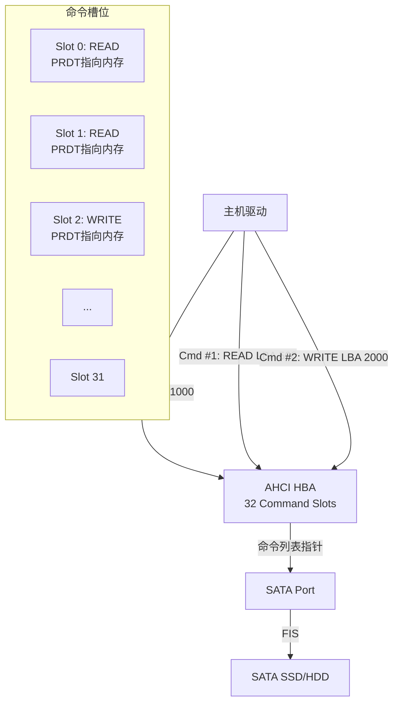
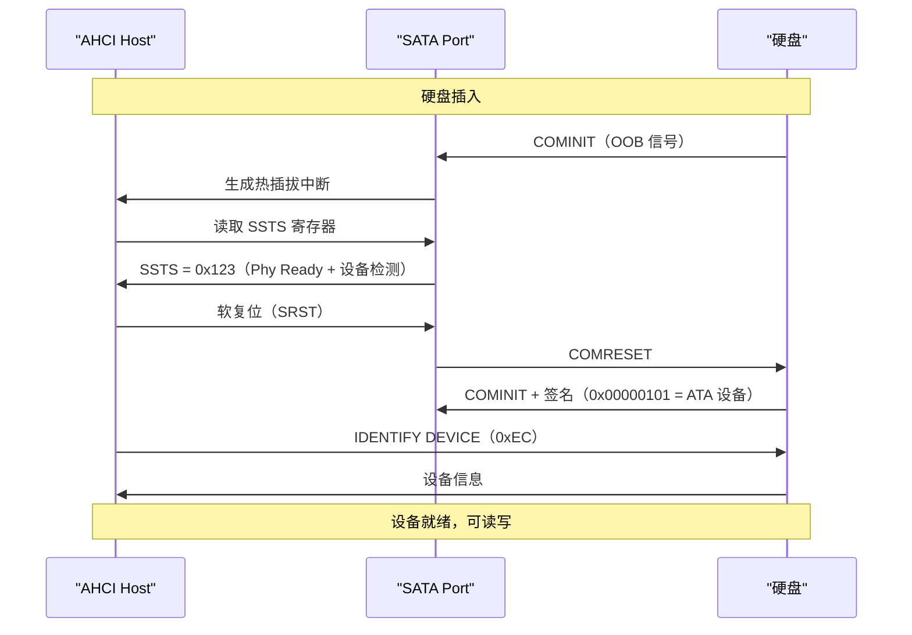

# SATA AHCI 与 NCQ 原理解析 [E]

> **本章学习目标**：
> - 理解 <span class="red">AHCI 寄存器接口</span> 的 HBA 内存映射结构
> - 掌握 <span class="red">NCQ（Native Command Queuing）</span> 的命令重排序机制
> - 了解 SATA 热插拔的物理检测与软件处理

---

## AHCI 寄存器接口：标准化的 SATA 控制器

---

### <strong>为什么需要 AHCI：从 IDE 兼容到现代存储控制</strong>

<span class="red">AHCI</span>由 Intel 在 <span class="green">2004 年</span>提出，定义了 SATA 控制器的标准寄存器接口。

在 AHCI 之前，SATA 控制器使用 IDE 兼容模式：
<br>
* 寄存器映射到固定 IO 地址（0x1F0/0x170）
<br>
* 不支持热插拔
<br>
* 单命令队列，CPU 必须等待命令完成
<br>

<span class="blue">AHCI 将寄存器映射到内存（MMIO），支持 32 命令槽位、NCQ、热插拔、端口多路器（Port Multiplier）。</span>
<br>

<span class="blue">类比：IDE 兼容模式如同"单窗口银行柜台"——一次只能办一个业务，后面的人排队等；AHCI 如同"多窗口智能叫号系统"——32 个窗口同时办理，系统智能调度。</span>
<br>

---

### <strong>AHCI HBA 内存映射结构</strong>

<span class="red">AHCI Host Bus Adapter</span>的寄存器分布：

| 区域 | 偏移 | 大小 | 内容 |
| --- | --- | --- | --- |
| Global Registers | 0x00 | 0x100 | 全局控制（CAP、GHC、IS、PI） |
| Reserved | 0x100 | 0x100 | 保留 |
| Port 0 Registers | 0x100 | 0x80 | 端口 0 控制（CMD、TFD、SIG、SSTS） |
| Port 1 Registers | 0x180 | 0x80 | 端口 1 控制 |
| ... | ... | 0x80 | 最多 32 个端口 |

```c
// AHCI 全局寄存器（Linux 内核定义）
struct ahci_host_priv {
    void __iomem *mmio;           // HBA MMIO 基地址
    u32 cap;                      // CAP: 能力寄存器
    u32 cap2;                     // CAP2: 扩展能力
    u32 port_map;                 // PI: 端口实现掩码
    u32 n_ports;                  // 有效端口数
    u32 flags;                    // 控制器标志
    
    // CAP 寄存器关键位
    // bit 31~28: 端口数-1
    // bit 18: NCQ 支持
    // bit 17: 热插拔支持
    // bit 8~0: 命令槽位数-1（通常 31）
};
```

---

### <strong>命令槽位（Command Slot）：32 队列的核心</strong>

<span class="red">AHCI 命令槽位</span>是 NCQ 的基础：



| 结构 | 大小 | 说明 |
| --- | --- | --- |
| Command List | 1KB（32 × 32 byte） | 每个槽位一个 CFIS 指针 + PRDT 指针 |
| Command Table | 可变（最大 8KB） | 包含 FIS 和 PRDT（Physical Region Descriptor Table） |
| PRDT | 每段 16 byte | 描述 DMA 内存区域（地址 + 长度） |

---

## NCQ：原生命令队列的优化魔法

---

### <strong>为什么 NCQ 能提升机械硬盘性能</strong>

<span class="red">NCQ</span>允许硬盘内部重排序命令，减少磁头寻道时间。

```text
无 NCQ 的顺序执行：
请求队列：LBA 10000 → LBA 500 → LBA 20000 → LBA 600
磁头轨迹：10000 → 500 → 20000 → 600
总寻道距离：9500 + 19500 + 19400 = 48400 cylinders

有 NCQ 的内部重排序：
请求队列：LBA 10000 → LBA 500 → LBA 20000 → LBA 600
硬盘重排序：LBA 500 → LBA 600 → LBA 10000 → LBA 20000
磁头轨迹：500 → 600 → 10000 → 20000
总寻道距离：100 + 9400 + 10000 = 19500 cylinders
优化效果：寻道减少 60%
```

<span class="blue">对于 SSD，NCQ 提升 IOPS 而非带宽——SSD 没有机械延迟，但 NCQ 允许控制器并行处理多个 NAND 操作。</span>
<br>

---

### <strong>NCQ Tag：命令的身份标识</strong>

```c
// NCQ READ FIS（Host to Device）
struct sata_fis_h2d {
    u8 type;        // 0x27 = H2D Register FIS
    u8 flags;       // bit 7 = 1 (Update Command Register)
    u8 command;     // 0x60 = READ FPDMA QUEUED (NCQ Read)
    u8 features;    // bit 7~3 = NCQ Tag (0~31)
                    // bit 2~0 = Reserved
    u8 lba_low;     // LBA[7:0]
    u8 lba_mid;     // LBA[15:8]
    u8 lha_high;    // LBA[23:16]
    u8 device;      // LBA[27:24] + LBA mode
    u8 lba_low_exp; // LBA[31:24]
    u8 lba_mid_exp; // LBA[39:32]
    u8 lba_high_exp;// LBA[47:40]
    u8 features_exp;//
    u8 sector_count; // Sector Count[7:0]
    u8 sector_count_exp;
    u8 reserved;
    u8 control;
    u8 pad[4];
} __attribute__((packed));
```

<span class="blue">NCQ Tag 范围 0~31，对应 AHCI 的 32 个命令槽位。硬盘完成命令后，通过 Set Device Bits FIS 通知主机哪个 Tag 已完成。</span>
<br>

---

## SATA 热插拔

---

### <strong>物理检测：COMINIT 与 Phy Ready</strong>

<span class="red">SATA 热插拔</span>的物理检测流程：



---

## 本章小结

| 概念 | 一句话总结 |
| --- | --- |
| AHCI | SATA 控制器的标准 MMIO 寄存器接口，32 命令槽位 |
| Command Slot | 32 个槽位，每个对应一个命令 + PRDT |
| NCQ | 硬盘内部重排序命令，减少机械寻道 |
| NCQ Tag | 0~31，标识命令身份，完成后通知主机 |
| 热插拔 | COMINIT 检测插入，COMRESET 初始化 |

---

## 练习

1. AHCI 的 32 命令槽位与 NCQ 的 32 Tag 有什么关系？
2. 为什么 SSD 也有 NCQ？SSD 没有机械延迟，NCQ 优化什么？
3. 在 Linux 中，如何查看 SATA 硬盘的 NCQ 队列深度是否启用？
