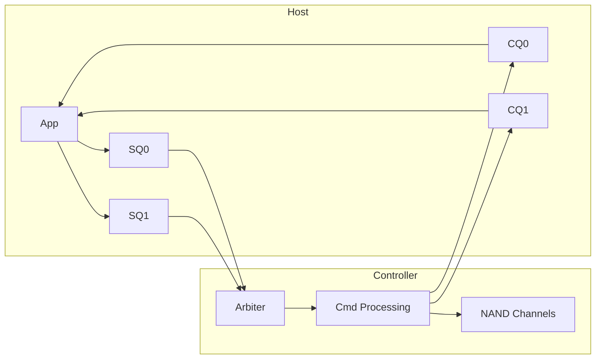

# AHCI瓶颈与NVMe替代

<span class="red">核心概念</span> AHCI 诞生于机械硬盘时代，设计目标是在单队列中管理 32 个命令。当 SSD 取代 HDD 成为主流，AHCI 的架构成为 PCIe SSD 性能的枷锁，NVMe 应运而生。

---

## AHCI瓶颈分析

<span class="red">核心概念</span> AHCI 的核心瓶颈不是带宽，而是并发架构：整个控制器只有 1 个 Submission Queue 和 1 个 Completion Queue，队列深度最多 32。

| 维度 | AHCI | NVMe | 差距 |
|------|------|------|------|
| Submission Queue | 1 | 64K | 64000x |
| Queue Depth | 32 | 64K per queue | 2048x |
| 并发命令数 | 32 | ~4M | 131072x |
| 寄存器访问 | 多次 MMIO | Doorbell 批处理 | 10x+ |
| 延迟开销 | ~6μs | ~2.5μs | 2.4x |

---

AHCI 每发一条命令需要多次 MMIO（Memory-Mapped I/O，内存映射 I/O）写寄存器：
<br>
更新 Command List、写 Port CI 位、等待中断、读取完成状态。
<br>
对机械硬盘的毫秒级延迟来说这微不足道，但对微秒级延迟的 SSD 就是巨大开销。

---

另一个隐性瓶颈是 ATA 命令集本身。<br>
ATA 命令是为磁头寻道设计的，每个命令只能操作连续 LBA 范围；<br>
SSD 内部是 NAND 闪存，没有磁头，ATA 的语义反而限制了 FTL 的并行调度空间。
<br>
NVMe 的命令格式更接近裸闪存操作，64-byte 的 SQE（Submission Queue Entry）直接包含 LBA、长度、PRP List 指针。

---

<span class="blue">结论/易错点</span> 把 NVMe SSD 插在 SATA 转接卡上（通过 SATA Express 或早期 U.2 转接），
<br>
性能会被 SATA 6Gbps 封顶在 600 MB/s，NVMe 的优势完全丧失。
<br>
判断 SSD 是不是真 NVMe，最可靠的方法是看接口协议，不是看外形尺寸。

---

## NVMe协议：Submission Queue与Completion Queue

<span class="red">核心概念</span> NVMe 采用多队列架构，每个 CPU 核心可以拥有独立的 Submission Queue（SQ）和 Completion Queue（CQ），通过 Doorbell 寄存器实现无锁通知。



---

SQ 和 CQ 是主机内存中的环形缓冲区，由主机分配、控制器直接 DMA 访问。
<br>
主机通过写 Doorbell 寄存器通知控制器"有新的命令提交"；
<br>
控制器处理完命令后，在 CQ 中写入完成条目，并通过 MSI-X 中断或轮询方式通知主机。

---

NVMe 的队列深度由主机在创建队列时指定，典型值是 64、128、256。<br>
数据库场景通常配 256-1024 深度，以充分利用 SSD 内部的并行 Channel。<br>
桌面场景 32-64 已经足够，过深的队列会增加延迟抖动。

---

<span class="green">术语</span> **PRP**（Physical Region Page，物理区域页）和 **SGL**（Scatter-Gather List，散集列表）是 NVMe 描述 DMA 内存的两种机制。
<br>
PRP 用固定 4 KiB 页表，适合对齐的连续块；
<br>
SGL 支持任意长度的链表，适合复杂 IO 模式。
<br>
NVMe 1.0 只支持 PRP，1.1 起引入 SGL。

---

## SATA Express与M.2接口

<span class="red">核心概念</span> SATA Express 是 SATA-IO 尝试兼容 SATA 和 PCIe 的过渡方案，用标准 SATA 连接器叠加 PCIe 信号；M.2 则是最终胜出的多协议物理接口标准。

| 接口 | 协议支持 | 引脚数 | 尺寸 | 现状 |
|------|---------|--------|------|------|
| SATA Express | SATA / PCIe x2 | 18 | 2.5" / Add-in Card | 已淘汰 |
| M.2 (B+M Key) | SATA / PCIe x2 | 75 | 22×30~110mm | 主流 |
| M.2 (M Key) | PCIe x4 | 75 | 22×80mm | 主流NVMe |
| U.2 | PCIe x4 | 68 | 2.5" | 企业级 |

---

SATA Express 的问题在于设计两头不讨好：
<br>
对 SATA 用户来说连接器变大变贵，对 PCIe 用户来说带宽只有 x2。
<br>
市场很快用脚投票，SATA Express 推出 3 年后基本退出消费级市场。

---

M.2 的 Key 定义决定了支持的协议：
<br>
B Key 缺口靠左，支持 SATA + PCIe x2；
<br>
M Key 缺口靠右，支持 PCIe x4；
<br>
B+M Key 双缺口同时兼容两种插槽。
<br>
嵌入式主板通常只焊 M Key 插槽，因为 PCIe x4 是 NVMe 的最低要求。

---

## 嵌入式场景：eMMC vs NVMe SSD选型

<span class="red">核心概念</span> 嵌入式系统的存储选型要在带宽、功耗、成本、体积之间做权衡，eMMC 和 NVMe BGA SSD 分别占据低功耗和高性能两端。

| 场景 | 推荐方案 | 理由 |
|------|---------|------|
| 物联网传感器网关 | eMMC 8-32GB | 成本低，功耗<1W，容量够用 |
| 工业边缘计算盒子 | NVMe BGA 128-512GB | 高并发随机读，AI 模型加载 |
| 车载信息娱乐 | eMMC 或 UFS | 车规级温度范围，BGA 抗震动 |
| 网络视频录像机 | SATA SSD 或 NVMe | 多路视频并发写入，带宽优先 |

---

eMMC 的典型功耗是 100-300mW（读写时），待机 1-3mW；
<br>
NVMe SSD 的典型功耗是 3-7W（活跃时），待机 10-50mW。
<br>
对于电池供电的便携式设备，NVMe 的功耗可能直接吃掉续航时间的 30% 以上。

---

<span class="purple">扩展</span> 2023 年后出现的 PCIe 4.0/5.0 NVMe SSD 在嵌入式领域还面临散热难题：
<br>
7GB/s 级别的持续读写能让 SSD 主控温度超过 90°C，密闭外壳内必须加导热垫和金属外壳散热。
<br>
很多嵌入式产品回退到 PCIe 3.0 x4（3.5GB/s），因为性价比和散热更可控。

---

## 命令：nvme-cli实战输出

<span class="red">核心概念</span> `nvme-cli` 是 Linux 下管理 NVMe 设备的标准工具，可以读取设备信息、SMART 日志、格式化、固件升级。

```bash
# 列出所有 NVMe 设备
$ nvme list
Node             SN                   Model                                    Namespace Usage                      Format           FW Rev
---------------- -------------------- ---------------------------------------- --------- -------------------------- ---------------- --------
/dev/nvme0n1     ABC123456789         Samsung SSD 990 PRO 1TB                  1         1.00  TB /   1.00  TB    512   B +  0 B   2B2QJXD7
```

---

```bash
# 读取控制器身份信息
$ nvme id-ctrl /dev/nvme0
vid       : 0x144d
ssvid     : 0x144d
sn        : ABC123456789
mn        : Samsung SSD 990 PRO 1TB
fr        : 2B2QJXD7
rab       : 4
ieee      : 002538
mic       : 0
mdts      : 5
ctrlid    : 1
ver       : 0x20000
rtd3r     : 186a0
rtd3e     : 7a1200
oaes      : 0x200
oacs      : 0x17
```

---

```bash
# 读取 SMART 健康日志
$ nvme smart-log /dev/nvme0
SMART/Health Information Log
==============================
Critical Warning            : 0
Temperature                 : 35 Celsius
Available Spare             : 100%
Available Spare Threshold   : 10%
Percentage Used             : 2%
Data Units Read             : 12345678
Data Units Written          : 9876543
Host Read Commands          : 234567890
Host Write Commands         : 123456789
Controller Busy Time        : 12345
Power Cycles                : 234
Power On Hours              : 3456
Unsafe Shutdowns            : 12
Media Errors                : 0
Num Err Log Entries         : 3
```

---

<span class="blue">结论/易错点</span> `Percentage Used` 是判断 SSD 寿命的核心指标，基于 P/E Cycle（Program/Erase Cycle，编程/擦除周期）计数。
<br>
达到 100% 不代表立刻损坏，而是说明已消耗完厂商保修周期内的额定写入量。
<br>
企业级 SSD 这个值到 120-150% 还能正常工作，但数据可靠性不再受官方保证。
