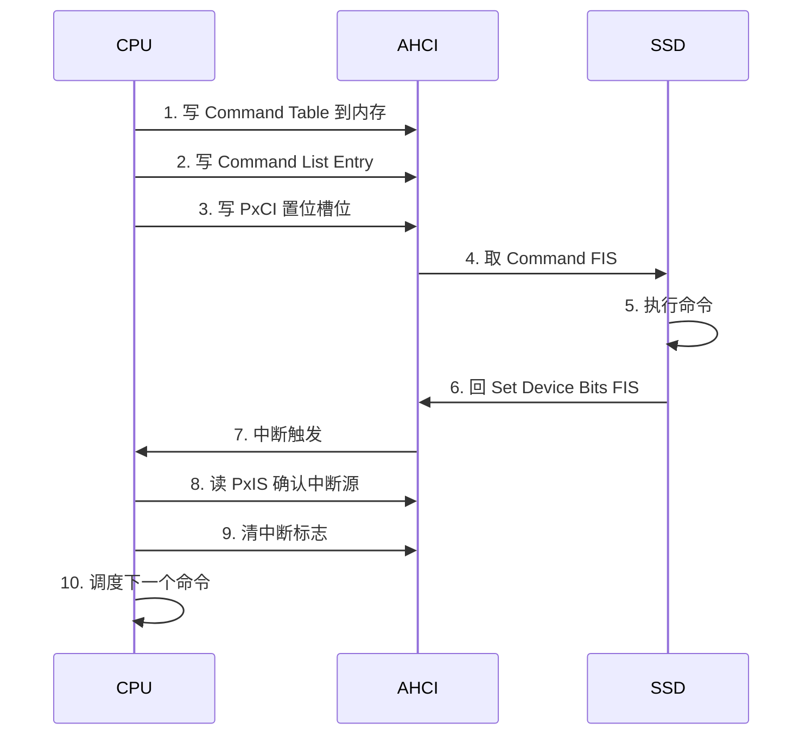
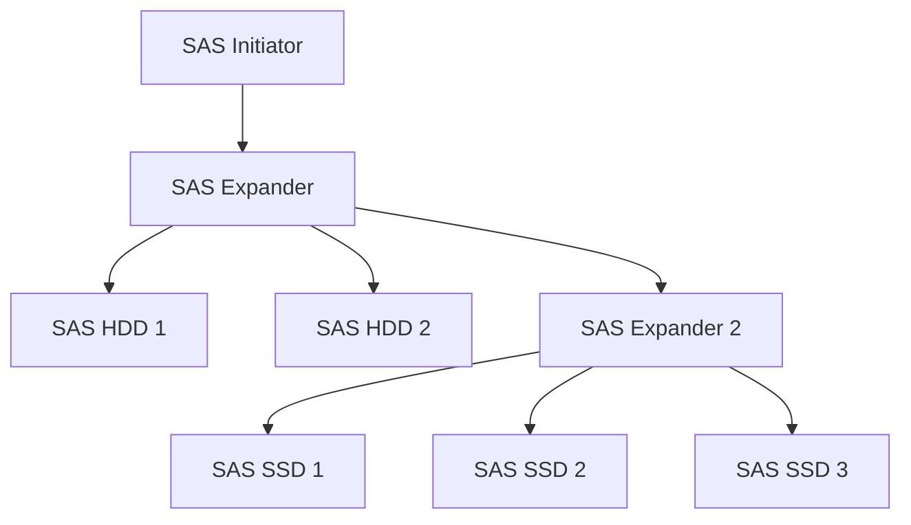

# SATA为什么慢——AHCI瓶颈与NVMe替代

<span class="badge-b">[B]</span> <span class="badge-i">[I]</span> <span class="badge-e">[E]</span> <span class="badge-m">[M]</span>

SATA 曾经是存储接口的王者。
本章从 AHCI 的架构瓶颈出发，量化 SATA 与 NVMe 的性能鸿沟，
并解释为什么 SATA 在嵌入式领域仍有不可替代的位置。

---

## 核心定义与价值

<span class="red">AHCI 瓶颈</span> 不是某个寄存器设计错误，而是整个架构的时代局限。
AHCI 诞生于 2004 年，设计目标是优化机械硬盘的命令调度，
而非为 NAND Flash 的并行特性服务。

**AHCI 的三个致命瓶颈：**

- <span class="green">单队列</span>：每个端口只有一个 Command List，CPU 需要轮询或中断处理
- <span class="green">寄存器交互</span>：每次提交命令都要读写 MMIO 寄存器，延迟高
- <span class="green">中断开销</span>：一个端口共享一个中断，高 IOPS 下中断风暴严重

---

### 类比：单窗口银行 vs 全自助银行

AHCI 像只有一个柜员的银行：

- <span class="green">排队</span> = Command List 的 32 个槽位
- <span class="green">柜员处理</span> = AHCI 控制器逐条解析命令
- <span class="green">叫号广播</span> = 每完成一个命令触发一次中断
- <span class="green">客户等不及</span> = 高 IOPS 下 CPU 被中断淹没

NVMe 像全自助银行：

- <span class="green">64K 台 ATM</span> = 64K 个 Submission Queue
- <span class="green">客户自己操作</span> = Doorbell 写入内存，零寄存器交互
- <span class="green">完成自动通知</span> = MSI-X 中断精确到队列，无广播风暴
- <span class="green">几乎不需要柜员</span> = CPU 开销趋近于零

---

## 核心机制原理解析

### <strong>1. AHCI 单队列瓶颈的量化分析</strong>

<br>

AHCI 每个端口只有一个 Command List（32 槽位），
OS 驱动通过以下步骤提交命令：



<br>

| 步骤 | 操作 | 典型延迟 |
|------|------|---------|
| 1 | 内存写 Command Table | ~50 ns |
| 2 | 内存写 Command List | ~50 ns |
| 3 | MMIO 写 PxCI | ~100 ns |
| 4 | DMA 取 FIS | ~500 ns |
| 5 | SSD 执行 4K 读 | ~100 μs |
| 6 | DMA 写 FIS | ~500 ns |
| 7 | 中断触发 | ~1 μs |
| 8 | MMIO 读 PxIS | ~100 ns |
| 9 | MMIO 写 PxIS | ~100 ns |
| 10 | 调度 | ~1 μs |

<br>

单次命令往返延迟 ≈ <span class="blue">103 μs</span>

在 4K 随机读场景下，最大 IOPS = 1 / 103μs ≈ <span class="blue">9,700 IOPS</span>

这就是 AHCI 单队列的理论上限。
实际中 SATA SSD 通过内部并行可以达到 ~100K IOPS，
但 CPU 的开销和延迟已无法进一步降低。

---

### <strong>2. NVMe 的并行架构：为什么能快 10 倍</strong>

<br>

NVMe 通过三个设计彻底消除了 AHCI 瓶颈：

| 维度 | AHCI | NVMe |
|------|------|------|
| 队列数 | 1 per port | 64K per controller |
| 队列深度 | 32 | 64K |
| 命令提交 | MMIO 寄存器写 | 内存写 + Doorbell |
| 完成通知 | 共享中断 + 轮询 | MSI-X per queue |
| 数据定位 | PRD 表 | PRP / SGL |
| 延迟 | ~100 μs | ~10 μs |

<br>

NVMe 的 Doorbell 机制：

- Submission Queue 和 Completion Queue 是 Host 内存中的环形缓冲区
- Host 写命令到 SQ 后，写一次 <span class="green">Tail Doorbell</span> 通知控制器
- 控制器取命令、执行、写完成到 CQ
- 控制器写一次 <span class="green">Head Doorbell</span> 通知 Host
- <span class="blue">整个过程中没有寄存器轮询，只有两次 Doorbell 写</span>

---

### <strong>3. SAS：企业级的 SATA 兄弟</strong>

<br>

<span class="red">SAS（Serial Attached SCSI）</span> 与 SATA 共享物理层（差分信号、7-pin 线缆），
但协议层完全不同。

| 特性 | SATA | SAS |
|------|------|-----|
| 协议 | ATA | SCSI |
| 拓扑 | 点对点 | 扩展器（Expander）拓扑 |
| 端口数 | 单端口 | 双端口（冗余） |
| 多 Initiator | 不支持 | 支持 |
| 速率 | 6 Gbps | 12 / 22.5 Gbps |
| 命令队列 | NCQ 32 | TCQ 256+ |
| 热插拔 | 支持 | 支持 |
| 典型场景 | 消费级存储 | 企业级 SAN / RAID |

<br>

SAS 的扩展器（Expander）拓扑允许一个 SAS 控制器连接上百个设备，
这是 SATA 点对点拓扑无法实现的。



<br>

SAS 向后兼容 SATA：
<span class="blue">SATA 设备可以插入 SAS 背板，但 SAS 设备不能插入 SATA 控制器。
这是因为 SAS 扩展器内部有一个 STP（SATA Tunneling Protocol）桥接层。</span>

---

### <strong>4. SATA 在嵌入式中的不可替代性</strong>

<br>

尽管 NVMe 在性能上碾压 SATA，但在嵌入式场景中 SATA 仍有优势：

| 场景 | SATA 优势 | NVMe 劣势 |
|------|----------|-----------|
| NAS / 软路由 | 成本低、2.5" 盘位标准化 | M.2 散热差、U.2 成本高 |
| 工业控制器 | 宽温 SATA SSD 成熟、易更换 | 工业级 NVMe 选择少 |
| 媒体播放器 | 足够带宽播放 4K、低功耗 | NVMe 高性能 = 高发热 |
| 旧设备升级 | SATA 接口普遍存在 | 需要 PCIe 插槽或 M.2 |
| 开发板 | USB-SATA 桥接芯片便宜 | USB-NVMe 桥接贵且复杂 |

<br>

<span class="blue">嵌入式系统的选型逻辑不是"最快"，而是"够用 + 便宜 + 可靠"。
SATA 600MB/s 的带宽对大多数嵌入式应用绰绰有余。</span>

---

## 技术教学与实战

### smartctl 完整输出解读

```bash
smartctl -a /dev/sda

=== START OF INFORMATION SECTION ===
Device Model:     SAMSUNG MZ7LN256HCHP-000L7
Serial Number:    S2ZNNB0HAxxxxx
Firmware Version: MVT03L6Q
User Capacity:    256,060,514,304 bytes [256 GB]
Sector Size:      512 bytes logical/physical
Rotation Rate:    Solid State Device
Form Factor:      2.5 inches
TRIM Command:     Available
Device is:        Not in smartctl database [for details use: -P showall]
ATA Version is:   ACS-2, ATA8-ACS T13/1699-D revision 4c
SATA Version is:  SATA 3.1, 6.0 Gb/s (current: 6.0 Gb/s)
Local Time is:    Mon May  3 10:00:00 2026 CST

=== START OF READ SMART DATA SECTION ===
SMART overall-health self-assessment test result: PASSED

SMART Attributes Data Structure revision number: 1
Vendor Specific SMART Attributes with Thresholds:
ID# ATTRIBUTE_NAME          FLAG     VALUE WORST THRESH TYPE      UPDATED  RAW_VALUE
  5 Reallocated_Sector_Ct   0x0033   100   100   010    Pre-fail  Always       0
  9 Power_On_Hours          0x0032   099   099   000    Old_age   Always    1234
 12 Power_Cycle_Count       0x0032   099   099   000    Old_age   Always     567
177 Wear_Leveling_Count     0x0013   098   098   000    Pre-fail  Always      23
179 Used_Rsvd_Blk_Cnt_Tot   0x0013   100   100   010    Pre-fail  Always       0
181 Program_Fail_Cnt_Total 0x0032   100   100   010    Old_age   Always       0
182 Erase_Fail_Count_Total  0x0032   100   100   010    Old_age   Always       0
183 Runtime_Bad_Block       0x0013   100   100   010    Pre-fail  Always       0
187 Reported_Uncorrect      0x0032   100   100   000    Old_age   Always       0
190 Airflow_Temperature_Cel 0x0032   067   058   000    Old_age   Always      33
195 Hardware_ECC_Recovered  0x001a   200   200   000    Old_age   Always       0
199 CRC_Error_Count         0x003e   100   100   000    Old_age   Always       0

SMART Error Log not supported
```

<br>

关键字段解读：

| 字段 | 含义 | 健康判断 |
|------|------|---------|
| SATA Version | 3.1 @ 6.0 Gb/s | 确认运行在最高速率 |
| Reallocated_Sector_Ct | 重映射坏块数 | >0 说明有坏块，需关注 |
| Wear_Leveling_Count | 磨损均衡计数 | 越低越好，接近 0 说明快耗尽 |
| Power_On_Hours | 通电小时数 | 1234h ≈ 51 天 |
| CRC_Error_Count | 接口 CRC 错误 | >0 说明线缆或信号完整性问题 |
| Program/Erase_Fail | 编程/擦除失败 | >0 说明 Flash 退化 |

<br>
<span class="blue">CRC_Error_Count 是最常被忽视的字段：如果它持续增长，说明 SATA 线缆质量差、接触不良或信号完整性有问题，而非磁盘本身故障。</span>

---

## 嵌入式专属实战场景

### 场景：排查 SATA SSD 在嵌入式设备中的性能骤降

某工业网关使用 SATA SSD 存储日志，运行 6 个月后写入速度从 400MB/s 降至 20MB/s。

排查过程：

| 步骤 | 命令 | 发现 |
|------|------|------|
| 1 | smartctl -a | Wear_Leveling_Count = 2，接近寿命极限 |
| 2 | fio --rw=randwrite | 4K 随机写 IOPS 从 80K 降至 2K |
| 3 | iostat -x 1 | %util = 100%，但吞吐量极低 |
| 4 | dmesg | "ata1.00: exception Emask 0x0 SAct 0x0 SErr 0x40000000" |

<br>
根因：SSD 的预留空间（Over-Provisioning）耗尽，
垃圾回收（GC）无法有效合并空闲页，导致写放大急剧增加。

修复：
- 更换新 SSD
- 启用 fstrim（Linux）定期释放未使用块
- 在嵌入式系统中，预留 10-20% 未分区空间作为隐藏 OP

---

## 历史演进与前沿

### SATA 与 NVMe 的替代时间线

| 年份 | SATA 地位 | NVMe 进展 |
|------|----------|-----------|
| 2011 | 绝对主流 | NVMe 1.0 发布，仅企业级 |
| 2015 | 消费级主流 | NVMe M.2 SSD 价格下降 |
| 2017 | 高端被侵蚀 | NVMe 成为游戏本标配 |
| 2020 | 中低端仍主流 | NVMe 占新出货 SSD 70% |
| 2023 | 边缘化 | 新主板仅保留 1-2 SATA 口 |
| 2026+ | 嵌入式/存量 | SATA 在 NAS/工业/旧改中持续存在 |

<br>
<span class="blue">SATA 不会消失，会像并行口、串口一样，在特定嵌入式场景中持续存在 10-15 年。</span>

---

## 本章小结

| 主题 | 关键要点 |
|------|---------|
| AHCI 瓶颈 | 单队列 + 寄存器交互 + 共享中断 = ~100μs 延迟 |
| NVMe 优势 | 64K 队列 + Doorbell + MSI-X = ~10μs 延迟 |
| SAS | 企业级 SCSI，扩展器拓扑，双端口冗余，向后兼容 SATA |
| 嵌入式 | SATA 在 NAS/工业/媒体播放器中仍有成本/功耗/兼容性优势 |
| smartctl | SATA Version 确认速率；CRC_Error 排查信号问题；Wear_Level 排查寿命 |

---

## 练习

1. 计算 AHCI 单队列的理论最大 IOPS：假设每次命令往返 100μs，NCQ 深度 32，能否达到 320K IOPS？为什么实际只有 ~100K？
2. NVMe 的 Doorbell 机制相比 AHCI 的 MMIO 寄存器写，延迟优势来自哪里？从 CPU 缓存和 PCIe TLP 两个角度分析。
3. SAS 的 STP（SATA Tunneling Protocol）桥接层是如何让 SATA 设备接入 SAS 扩展器的？数据帧需要经过怎样的转换？
4. 某工业设备使用 SATA SSD 存储日志，发现写入速度随时间逐渐下降。列举所有可能的根因，并按优先级排序排查。
5. 假设你要设计一款嵌入式 NAS，目标支持 4 盘位 RAID5。选择 SATA 还是 NVMe？列举 5 个决策因素。
