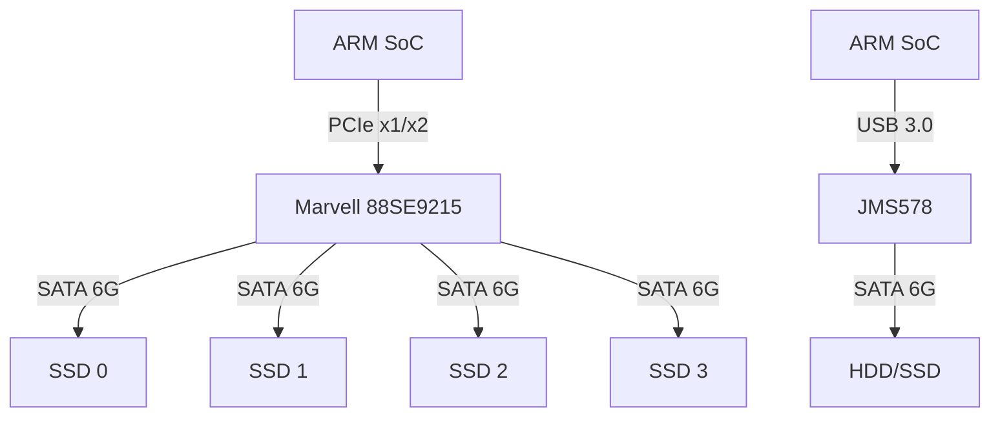
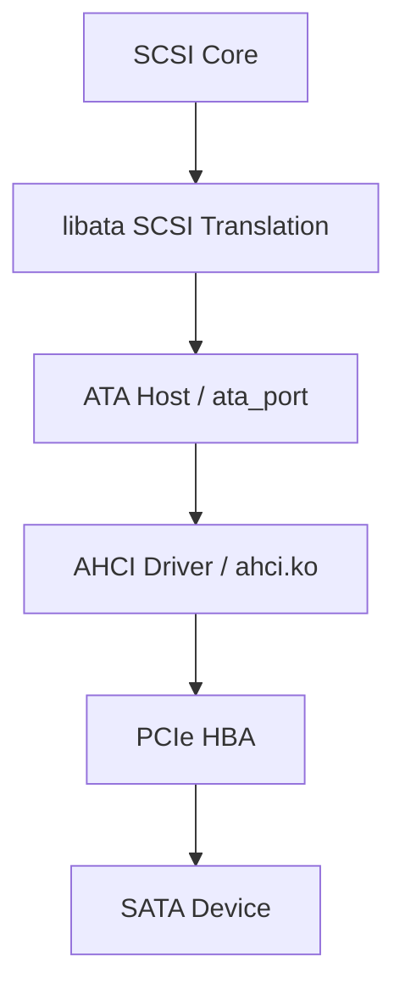

# SATA往哪去——实战应用与协议演进

<span class="badge-b">[B]</span> <span class="badge-i">[I]</span> <span class="badge-e">[E]</span> <span class="badge-m">[M]</span>

SATA 的终点已近，但嵌入式世界仍有大量 SATA 设备在运行。
本章聚焦嵌入式 SATA 控制器芯片、Linux libata 调试、SATA Express 的失败教训，
以及 SATA 在嵌入式中的最终归宿。

---

## 核心定义与价值

<span class="red">嵌入式 SATA 控制器</span> 是连接 ARM SoC 与 SATA 设备的桥接芯片。
由于大多数 ARM SoC 没有原生 SATA 接口，需要通过 PCIe-SATA 或 USB-SATA 桥接实现。

**主流桥接方案：**

- <span class="green">PCIe → SATA</span>：Marvell 88SE91xx、ASM1061/1062/1166
- <span class="green">USB → SATA</span>：JMS578、ASM1153E、VL817
- <span class="green">SoC 原生 SATA</span>：Amlogic S905X、Rockchip RK3399（部分型号）

---

### 类比：老式火车站的改造

SATA 像一座建于 1950 年的火车站：

- <span class="green">轨道还在</span> = SATA 接口和线缆仍在生产
- <span class="green">新车借旧轨</span> = SATA SSD 仍在出货，但芯片是 NVMe 架构降级
- <span class="green">站台加盖</span> = Marvell/ASMedia 持续推出新的 SATA 控制器芯片
- <span class="green">终点站已确定</span> = 没有 SATA 4.0，终点是 SATA 6G
- <span class="green">但火车还在跑</span> = 嵌入式/工业/存量市场继续使用 10-15 年

---

## 核心机制原理解析

### <strong>1. 嵌入式 SATA 控制器芯片架构</strong>

<br>



<br>

**Marvell 88SE9215 特性：**

| 参数 | 值 |
|------|-----|
| 上游接口 | PCIe 2.0 ×1 |
| 下游端口 | 4 × SATA 6G |
| AHCI 版本 | 1.0 |
| 支持特性 | NCQ、热插拔、PM（Port Multiplier） |
| 功耗 | ~1W active |
| 封装 | QFN-64 |

<br>

<span class="blue">88SE9215 的限制：PCIe 2.0 ×1 的有效带宽是 500 MB/s，4 个 SATA 端口共享这 500 MB/s。
如果 4 个 SSD 同时满载，每个端口只能分到 ~125 MB/s，远低于 SATA 6G 的 600 MB/s。</span>

---

### <strong>2. Linux libata 驱动调试</strong>

<br>

libata 是 Linux 的 ATA/SATA 子系统，分层如下：



<br>

**关键调试命令：**

```bash
# 查看 ATA 端口状态
cat /sys/class/ata_port/ata0/idle_irq
# 输出: 23  (空闲中断次数)

cat /sys/class/ata_port/ata0/sata_spd
# 输出: 3  (1=1.5G, 2=3G, 3=6G)

# 查看设备 NCQ 状态
cat /sys/class/ata_device/dev.0/queue_depth
# 输出: 31

cat /sys/class/ata_device/dev.0/ncq_enabled
# 输出: 1

# 查看链路错误
cat /sys/class/ata_link/link0/sata_spd
# 输出: 3

cat /sys/class/ata_link/link0/phy_event_count
# 输出: 0  (非零说明有物理层错误)
```

<br>

<span class="blue">phy_event_count 非零说明 SATA 线缆或连接器有问题，
常见原因：线缆弯折过度、连接器氧化、信号完整性差。</span>

---

### <strong>3. SATA Express：一场失败的联姻</strong>

<br>

SATA Express 于 2013 年提出，试图在 SATA 物理连接器中融合 PCIe 信号：

| 特性 | SATA Express |
|------|--------------|
| 物理形态 | 与 SATA 相同的连接器，但新增 PCIe 引脚 |
| 接口 | PCIe 2.0/3.0 ×2 |
| 峰值速率 | 2 GB/s |
| 兼容 | 兼容 SATA 设备（降速运行） |
| 发布时间 | 2013 |
| 消亡时间 | 2017 |

<br>

**失败原因：**

- 连接器设计臃肿：既要塞 SATA 信号又要塞 PCIe 差分对，物理空间紧张
- 市场需求真空：消费级用户直接选 M.2 NVMe，企业级用户选 U.2/U.3
- 芯片支持不足：主板厂商不愿为边缘需求增加 BOM 成本
- 标准定位模糊：既不是纯 SATA 也不是纯 PCIe，两边不讨好

<br>

<span class="blue">SATA Express 的教训：接口标准的演进要么彻底向前（NVMe），要么彻底向后兼容（USB Type-C），
"中间路线"往往两边都不买账。</span>

---

### <strong>4. SATA 在嵌入式中的最终角色</strong>

<br>

| 嵌入式场景 | SATA 角色 | 替代可能性 |
|-----------|----------|-----------|
| NAS / 私有云 | 2.5" / 3.5" 盘位标准 | 低，硬盘形态决定接口 |
| 工业控制器 | 宽温 SATA SSD，易更换 | 中，M.2 工业级逐渐增多 |
| 数字标牌 | 视频播放，带宽足够 | 高，eMMC/UFS 已足够 |
| 网络设备 | 日志存储、固件分区 | 中，大容量场景仍用 SATA |
| 车载系统 | 导航地图、媒体库 | 低，车规认证周期长 |
| 安防 NVR | 24/7 录像写入 | 低，SATA 硬盘成本最低 |

---

## 技术教学与实战

### 识别桥接芯片的 lspci 输出

```bash
# Marvell 88SE9215
lspci -nn | grep SATA
03:00.0 SATA controller [0106]: Marvell Technology Group Ltd. 
       88SE9215 PCIe 2.0 x1 4-port SATA 6 Gb/s Controller [1b4b:9215]

# ASMedia ASM1062
04:00.0 SATA controller [0106]: ASMedia Technology Inc. 
       ASM1062 Serial ATA Controller [1b21:0612] (rev 02)

# JMicron JMB585 (USB-SATA)
lsusb | grep JMicron
Bus 002 Device 003: ID 152d:0562 JMicron Technology Corp. / JMicron USA Technology Corp. JMS567 SATA 3Gb/s bridge
```

<br>

<span class="blue">桥接芯片的固件版本会影响兼容性和性能。
某些旧版 Marvell 固件在热插拔时会触发 AHCI 复位 bug，需要升级固件或补丁驱动。</span>

---

## 嵌入式专属实战场景

### 场景：为 ARM NAS 选择 SATA 控制器

需求：4 盘位 SATA NAS，基于 RK3568（无原生 SATA）。

方案对比：

| 方案 | 芯片 | 接口 | 带宽 | 成本 | 评价 |
|------|------|------|------|------|------|
| A | 88SE9215 | PCIe 2.0 ×1 | 500MB/s 共享 | ¥25 | 便宜但瓶颈明显 |
| B | 88SE9235 | PCIe 2.0 ×2 | 1GB/s 共享 | ¥45 | 性价比最优 |
| C | ASM1166 | PCIe 3.0 ×2 | 2GB/s 共享 | ¥60 | 高性能但贵 |
| D | USB-SATA 桥 ×4 | USB 3.0 | 5Gbps 共享 | ¥20 | 不推荐，UAS 兼容性差 |

<br>

推荐方案 B：88SE9235。
RK3568 的 PCIe 2.0 ×2 提供 1GB/s 带宽，4 盘位共享时单盘可达 250MB/s，
满足千兆网口（125MB/s）的吞吐需求，且成本可控。

---

## 历史演进与前沿

### SATA 控制器芯片的兴衰

| 年份 | 里程碑 | 意义 |
|------|--------|------|
| 2003 | Intel ICH5 原生 SATA | SATA 进入主流 |
| 2008 | Marvell 88SE61xx | 首批 PCIe-SATA 桥接芯片 |
| 2011 | ASMedia ASM106x | 低成本替代 Marvell |
| 2015 | SATA SSD 控制器爆发 | SandForce、Marvell、Phison 竞争 |
| 2018 | 主控转向 NVMe | Phison E12、SMI SM2262 放弃 SATA |
| 2022 | ASM1166 发布 | 可能是最后一代 PCIe-SATA 扩展芯片 |
| 2025+ | 存量维护 | 无新 SATA 控制器研发 |

<br>

<span class="red">趋势：</span>

- SATA 控制器芯片将在 2025-2028 年进入"维护模式"，不再出新
- 嵌入式市场仍需要 SATA，但主要通过旧芯片库存和二手渠道满足
- USB4 / Thunderbolt 外置存储可能最终替代 SATA 外置盒

---

## 本章小结

| 主题 | 关键要点 |
|------|---------|
| 桥接芯片 | Marvell 88SE9xxx、ASMedia ASM10xx，PCIe 带宽是瓶颈 |
| libata 调试 | /sys/class/ata_port/、ata_device/、ata_link/ 的 sysfs 节点 |
| phy_event_count | 非零 = 物理层信号问题，排查线缆和连接器 |
| SATA Express | 2013-2017，连接器臃肿，定位模糊，市场拒绝 |
| 嵌入式角色 | NAS/工业/安防/车载中持续存在 10-15 年 |

---

## 练习

1. 计算 88SE9215（PCIe 2.0 ×1）连接 4 个 SATA SSD 时的单盘最大带宽。
   如果 NAS 的网口是 2.5Gbps，这个方案是否够用？
2. 为什么 SATA Express 被市场拒绝？从连接器设计、市场需求、芯片生态三个角度分析。
3. 在嵌入式 Linux 中，如何通过 sysfs 确认当前 SATA 链路速率是 1.5G/3G/6G 中的哪一个？
4. 某 RK3568 开发板使用 88SE9215 扩展 SATA，发现热插拔后设备消失。
   列举 3 个可能的根因和对应的排查命令。
5. 假设你要设计一款 8 盘位 NAS，基于 x86 平台。在 SATA 和 NVMe 之间如何选择？
   分别列出纯 SATA、纯 NVMe、混合方案各自的优劣。
