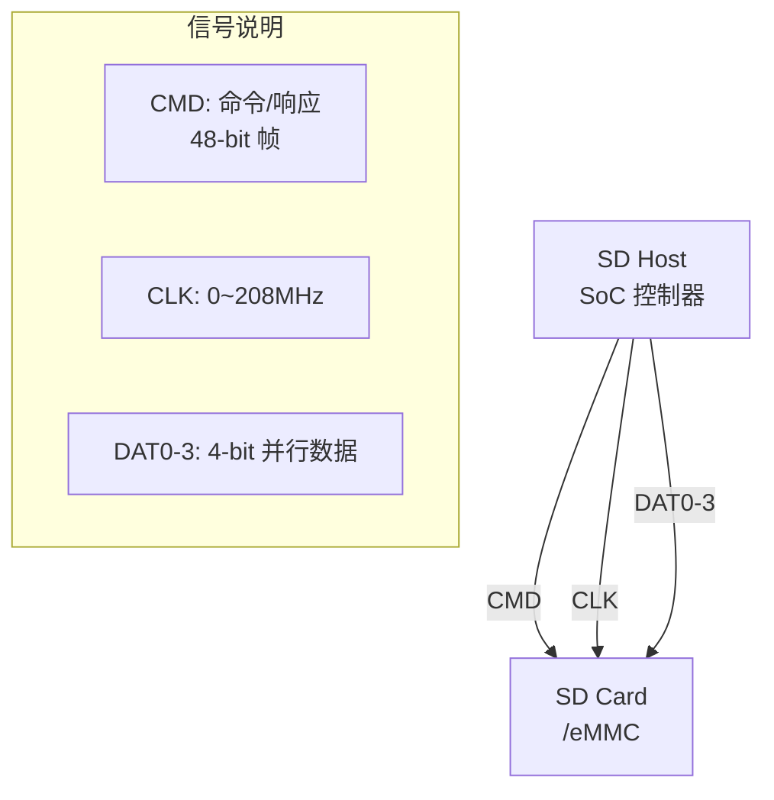
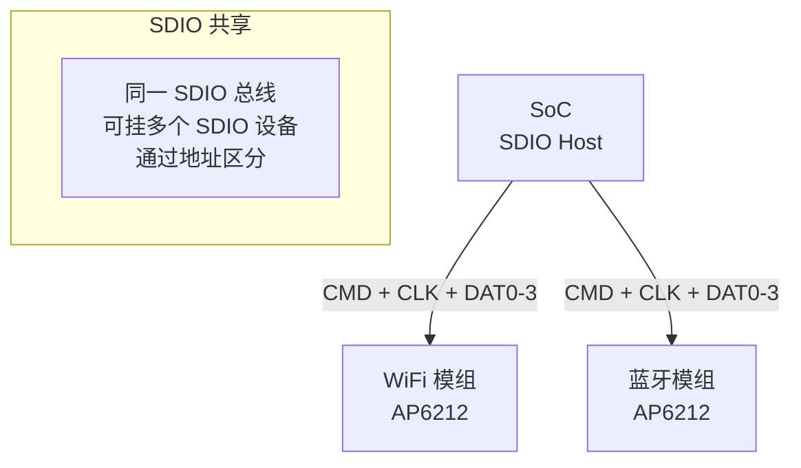

# SD 与 MMC 与 SDIO 基础认知与协议 [I→E]

> **本章学习目标**：
> - 理解 SD（Secure Digital） 从 MMC 演进的完整脉络
> - 掌握 命令/响应协议 与 SDR/DDR 传输模式
> - 了解 SDIO 在 WiFi/BT 模组中的典型应用

---

## SD/MMC 的诞生：从闪存卡到嵌入式存储

---

### <strong>为什么需要 SD：统一闪存卡标准</strong>

SD 卡由 SanDisk、Panasonic、Toshiba 在 1999 年联合推出，
 
前身是 1997 年的 MMC（MultiMediaCard）。
 

在 SD 出现之前，数码相机使用各种私有格式：
 
* CompactFlash（CF，1994，体积大）
 
* SmartMedia（1995，东芝，已淘汰）
 
* Memory Stick（1998，索尼，封闭生态）
 

SD 通过开放标准 + 小型化 + 安全版权保护（DRM），统一了消费电子存储卡市场。
 

类比：SD 如同"USB 闪存盘的鼻祖"——在 USB 闪存盘普及之前（2000 年后），SD 卡是数码相机、MP3 播放器的通用存储介质。
 

---

### <strong>SD 的物理层：9-pin 接口与信号定义</strong>

SD 卡使用 9 根引脚：
 

| 引脚 | 名称 | 方向 | 说明 |
| --- | --- | --- | --- |
| 1 | DAT3/CS | 双向 | 数据线 3（SD 模式）/ 片选（SPI 模式） |
| 2 | CMD | 双向 | 命令/响应线 |
| 3 | VSS | — | 地 |
| 4 | VDD | — | 电源（2.7~3.6V） |
| 5 | CLK | 主机→卡 | 时钟（0~208MHz） |
| 6 | VSS | — | 地 |
| 7 | DAT0 | 双向 | 数据线 0 |
| 8 | DAT1 | 双向 | 数据线 1 / IRQ（SDIO） |
| 9 | DAT2 | 双向 | 数据线 2 / 读等待 |

SD 协议支持两种模式：SD 模式（4-bit 并行，高性能）和 SPI 模式（1-bit 串行，兼容低成本 MCU）。
 

---

### <strong>从 SD 到 eMMC：嵌入式封装的演进</strong>

eMMC（embedded MultiMediaCard）是 SD 协议的嵌入式版本：
 

| 特性 | SD 卡 | eMMC | 差异原因 |
| --- | --- | --- | --- |
| 封装 | 可插拔 | BGA 贴片 | eMMC 固定焊接 |
| 引脚 | 9 pin | 153 ball BGA | 更多电源/地 |
| 速率 | UHS-I 104MB/s | HS400 400MB/s | eMMC 走 PCB 更短 |
| 容量 | 2TB max | 256GB typical | 嵌入式场景需求 |
| 可靠性 | 消费级 | 工业级可选 | eMMC 支持 pSLC |

eMMC 将 NAND Flash + Flash 控制器 + 标准接口封装在一起，SoC 只需实现标准 SD/MMC 控制器即可。
 

---

### <strong>SDIO：把 SD 接口变成通用外设总线</strong>

SDIO（SD Input/Output）是 SD 协议的扩展：
 
* 不仅传输存储数据，还传输 I/O 数据
 
* WiFi 模组（如 ESP8089、AP6212）通过 SDIO 接口连接 SoC
 
* 蓝牙模组、GPS 模组也常用 SDIO
 

SDIO 的优势：省引脚（9 pin 实现存储+WiFi+BT）、标准化驱动、热插拔支持。
 

---

## 本章小结

| 概念 | 一句话总结 |
| --- | --- |
| SD | SanDisk/Panasonic/Toshiba 1999 年推出的闪存卡标准 |
| MMC | SD 的前身，1997 年由西门子/闪迪提出 |
| eMMC | 嵌入式 MMC，BGA 封装，焊在 PCB 上 |
| SDIO | SD 的 I/O 扩展，WiFi/BT/GPS 模组常用 |
| UHS-I/II | 超高速模式，104/312 MB/s |
| HS400 | eMMC 高速模式，400 MB/s |

---

## 练习

1. 为什么 eMMC 的带宽比 SD 卡更高？画出两者信号走线的差异。
2. SDIO WiFi 模组和 USB WiFi 模组各有什么优劣？在嵌入式场景中如何选择？
3. 在 STM32MP1 上配置 SDMMC1 为 4-bit 模式、50MHz，计算理论带宽。
