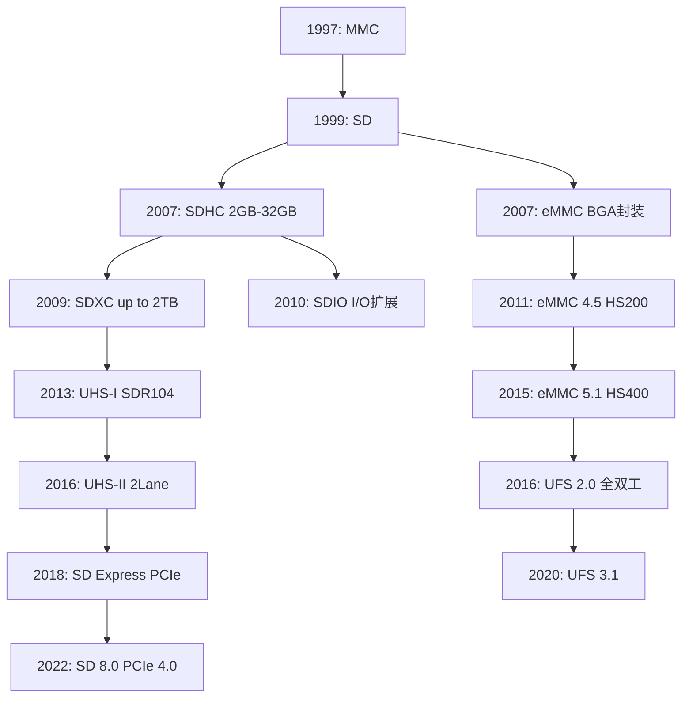

# SD基础认知与协议家族

核心概念 SD（Secure Digital）卡是嵌入式系统中最主流的 removable 存储标准，由 SD Association 维护。它定义了物理接口、电气时序、命令协议和文件系统规范，使不同厂商的存储卡能在任何支持 SD 的主机上即插即用。

---

嵌入式存储的发展曾是一片混乱：东芝的 SmartMedia、索尼的 Memory Stick、松下的 SD 各自为政。 
开发者被迫为每种格式写独立驱动，硬件接口也不统一。 
SD 的胜利在于用**标准化货柜**的思路统一了容器——无论里面装的是 NAND 闪存还是控制器， 
对外都呈现一致的 9-pin 接口和相同的命令集。

---

## 为什么需要SD

核心概念 在嵌入式领域，存储介质需要同时满足三个条件：标准化接口、热插拔能力、足够的带宽。SD 协议家族正是围绕这三点构建的。

没有统一标准之前，每款开发板都要为特定 NAND 芯片适配 FTL（Flash Translation Layer，闪存转换层）。 
SD 卡把 FTL 和 ECC（Error Correction Code，纠错码）封装到卡内，主机只需发读写命令即可。 
这相当于把“如何管理闪存”的复杂度从主机转移到了存储卡内部。

---

术语 **eMMC**（embedded MultiMediaCard）是把 SD/MMC 协议和 NAND 闪存封装到同一颗 BGA 芯片中的嵌入式存储方案。 
它不可拆卸，但电气协议与 SD 高度同源，因此驱动层可以复用大量代码。

---

## SD/MMC/eMMC/UFS家族关系

核心概念 这四个标准并非孤立存在，而是沿同一条技术演进路线逐步升级。

MMC 是 SD 的前身，采用 7-pin 接口，没有写保护开关。 
SD 向下兼容 MMC，但增加了写保护和更宽的版权保护机制（CPRM）。 
eMMC 把控制器+NAND 封装成 BGA 芯片，走并行总线。 
UFS（Universal Flash Storage，通用闪存存储）则彻底改用串行全双工和 SCSI 命令集，与 SD 分道扬镳。

---

结论/易错点 SD 卡、MMC 卡、eMMC 在物理形态上完全不同（插卡 vs BGA 焊接）， 
但 Linux 内核把它们统一收编在 `mmc` 子系统下。 
初学者常误以为 eMMC 驱动和 SD 卡驱动是两套体系，实际上它们共享 `mmc_host` 核心层。

---

## 物理层：9-pin接口、推挽输出、上电时序

核心概念 SD 物理层定义了 9 个引脚：CLK、CMD、DAT0-DAT3、VDD、VSS，采用推挽（Push-Pull）输出结构，支持 3.3V 和 1.8V 双电压。

| 引脚 | 名称 | 方向 | 说明 |
|------|------|------|------|
| 1 | DAT3 | I/O | 数据线3，初始化时兼作片选（CS） |
| 2 | CMD | I/O | 命令/响应线，双向单线 |
| 3 | VSS | PWR | 地线 |
| 4 | VDD | PWR | 电源，3.3V 或 1.8V |
| 5 | CLK | IN | 时钟，由主机驱动 |
| 6 | VSS | PWR | 地线 |
| 7 | DAT0 | I/O | 数据线0 |
| 8 | DAT1 | I/O | 数据线1，SDIO 时兼作中断线 |
| 9 | DAT2 | I/O | 数据线2 |

---

上电时序（Power-up Sequence）有严格要求： 
主机必须先供电（VDD 稳定），再拉 CLK（至少 74 个时钟周期），最后发 CMD0 复位。 
顺序错乱会导致卡进入不可预期的状态。

---

术语 **推挽输出**（Push-Pull）指输出级用一对互补晶体管（上拉 PMOS + 下拉 NMOS）驱动总线， 
相比开漏（Open-Drain）输出，推挽能提供更快的边沿速率和更强的驱动能力，适合高速时钟。

---

## 速度模式：Default到SDR104

核心概念 SD 协议定义了多种速度模式，从 25MHz 的 Default 到 208MHz 的 SDR104，电压也从 3.3V 逐步过渡到 1.8V。

| 模式 | 总线宽度 | 时钟频率 | 理论带宽 | 电压 |
|------|---------|---------|---------|------|
| Default Speed | 4-bit | 25 MHz | 12.5 MB/s | 3.3V |
| High Speed | 4-bit | 50 MHz | 25 MB/s | 3.3V |
| SDR25 | 4-bit | 50 MHz | 25 MB/s | 1.8V |
| SDR50 | 4-bit | 100 MHz | 50 MB/s | 1.8V |
| DDR50 | 4-bit | 50 MHz | 50 MB/s | 1.8V |
| SDR104 | 4-bit | 208 MHz | 104 MB/s | 1.8V |

---

结论/易错点 DDR50 在时钟双沿采样，所以 50MHz 时钟等效 100MHz 数据率。 
但 DDR 模式对信号完整性要求更高，PCB 走线长度差必须控制在 2mm 以内。

---

UHS-I（Ultra High Speed I）模式强制切换到 1.8V 信号电平。 
主机通过 ACMD41 的 CCS（Card Capacity Status）位判断卡是否支持 UHS， 
随后用 CMD6（SWITCH）命令正式切换速度模式。

---

## 与SPI模式的兼容

核心概念 当主机没有专用 SD 控制器时，SD 卡可以退化为 SPI 模式工作，用标准的 SPI 总线（CS/CLK/MISO/MOSI）访问。

进入 SPI 模式的方法很简单：上电后第一个命令必须是 CMD0，且 CS 拉低。 
卡检测到这种组合后，自动切到 SPI 协议，后续用 6-byte 命令帧和 1-byte 响应通信。

---

SPI 模式牺牲了 4-bit 并行带宽和速度模式升级能力， 
换来了任意 MCU 都能驱动的简易性。 
Arduino 读取 SD 卡就是走 SPI 模式，理论带宽约 2-3 MB/s， 
对日志记录和配置文件读取来说已经足够。

---

扩展 SD 8.0 标准引入了 PCIe 4.0 x1 和 NVMe 命令集， 
最高带宽可达 4 GB/s，物理接口却保持与早期 SD 相同的插槽外形。 
这是 SD 协会应对 NVMe SSD 冲击的策略：让 tiny 存储卡也能拥有 NVMe 性能。
