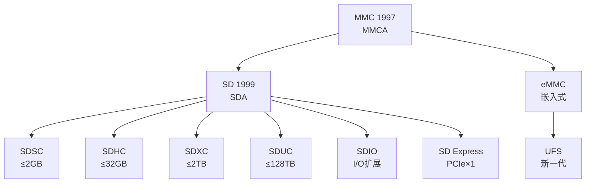

# SD是什么——存储卡协议家族与物理层

<span class="badge-b">[B]</span> <span class="badge-i">[I]</span> <span class="badge-e">[E]</span> <span class="badge-m">[M]</span>

理解 SD 协议家族，是掌握嵌入式存储扩展的第一步。<br>
本章从物理引脚到速率演进，带你认识这个"随处可见"的存储接口。

---

## 核心定义与价值

<span class="red">SD（Secure Digital）</span> 是由 SD Association 制定的非易失性存储卡标准。<br>
它脱胎于 MMC（MultiMediaCard），在物理尺寸兼容的基础上增加了安全加密和更高带宽。<br>
<br>
今天的 SD 家族已经远远超越"存储卡"的范畴：<br>
它涵盖了可插拔的 SD 卡、板载焊接的 eMMC、以及用于 I/O 扩展的 SDIO。<br>
<br>
**为什么嵌入式工程师必须精通 SD？**<br>
因为它以极低的引脚数量（9 pin）实现了从 25MB/s 到 2GB/s 的速率跨度，<br>
同时支持热插拔、即插即用、宽温工作，是消费级和工业级设备的首选存储接口。

---

### 类比：图书馆借书系统

想象一座大型图书馆：<br>
- <span class="green">CMD 线</span> 是你在柜台说的"我要查这本书"——它是控制通道<br>
- <span class="green">DAT0-3 线</span> 是传输带把书送到你手里——它是数据通道<br>
- <span class="green">CLK 线</span> 是图书馆的营业时间节奏——同步一切动作<br>
- <span class="green">VDD/VSS</span> 是图书馆的电力系统——没有它什么都停摆<br>
<br>
你可以单人排队（1-bit SPI 模式），也可以四列并行取书（4-bit SD 模式）。<br>
图书馆可以搬地址（热插拔），也可以夜间闭馆省电（低功耗模式）。

---

## 核心机制原理解析

### <strong>1. SD 协议家族的谱系关系</strong>



<br>

| 标准 | 发布年份 | 最大容量 | 最大速率 | 典型场景 |
|------|---------|---------|---------|---------|
| SDSC | 1999 | 2 GB | 25 MB/s | 早期数码相机 |
| SDHC | 2006 | 32 GB | 25 MB/s | 手机存储卡 |
| SDXC | 2009 | 2 TB | 104 MB/s | 4K 摄像机 |
| SDUC | 2018 | 128 TB | 985 MB/s | 未来 8K 视频 |
| SDIO | 2001 | — | 50 MB/s | WiFi / GPS 模组 |
| eMMC | 2007 | 128 GB | 400 MB/s | 手机主板焊死 |
| UFS | 2011 | 256 GB | 2.9 GB/s | 旗舰手机 |
| SD Express | 2018 | 128 TB | 985 MB/s | PCIe SSD 形态 |

<br>
<span class="blue">MMC 与 SD 的关键差异在于：SD 增加了写保护开关和安全加密逻辑，但物理引脚排列向下兼容。</span>

---

### <strong>2. SD 卡物理层：9-pin 接口的精确映射</strong>

<br>

SD 标准模式使用 9 根引脚，信号定义精确到每一个 bit 的方向与时序：

| 引脚号 | 名称 | 类型 | 说明 |
|--------|------|------|------|
| 1 | CD/DAT3 | I/O/PP | 卡检测 / 数据线 3 |
| 2 | CMD | PP | 命令/响应通道，双向 |
| 3 | VSS1 | S | 电源地 |
| 4 | VDD | S | 电源，2.7-3.6V（SD）/ 1.70-1.95V（UHS-II） |
| 5 | CLK | I | 时钟，Host 驱动，50-200MHz |
| 6 | VSS2 | S | 电源地 |
| 7 | DAT0 | I/O/PP | 数据线 0 |
| 8 | DAT1 | I/O/PP | 数据线 1 / SDIO 中断 |
| 9 | DAT2 | I/O/PP | 数据线 2 |

<br>
<span class="green">I/O/PP</span> 表示推挽输出、开漏输入兼容。<br>
<span class="green">PP</span> 表示纯推挽，<span class="green">I</span> 表示纯输入，<span class="green">S</span> 表示电源/地。<br>
<br>
DAT3 引脚在上电期间兼作卡检测（CD）：<br>
- 卡插入时，DAT3 通过卡内部的 50kΩ 上拉电阻拉高<br>
- Host 检测到高电平后，触发上电初始化流程<br>
<br>
CLK 信号由 Host 持续驱动，<span class="blue">SD 卡内部不输出时钟</span>。<br>
命令和数据的采样都在 CLK 上升沿进行。

---

### <strong>3. 速率演进：从 25MHz 到 156MHz×8bit</strong>

<br>

| 速度模式 | 时钟频率 | 总线宽度 | 理论峰值 | 信号电平 |
|---------|---------|---------|---------|---------|
| Default Speed | 25 MHz | 4-bit | 12.5 MB/s | 3.3V |
| High Speed | 50 MHz | 4-bit | 25 MB/s | 3.3V |
| UHS-I SDR50 | 50 MHz DDR | 4-bit | 50 MB/s | 1.8V |
| UHS-I SDR104 | 104 MHz DDR | 4-bit | 104 MB/s | 1.8V |
| UHS-II FD156 | 156 MHz | 8-bit（差分） | 312 MB/s | 0.4V |
| UHS-II FD312 | 312 MHz | 8-bit（差分） | 624 MB/s | 0.4V |
| UHS-III | 全双工 | — | 985 MB/s | — |

<br>
<span class="red">UHS-I</span> 的关键创新是 DDR（Double Data Rate）：<br>
在 CLK 的上升沿和下降沿都采样数据，<span class="blue">但 CMD 线仍然是 SDR（Single Data Rate）</span>。<br>
<br>
<span class="red">UHS-II</span> 彻底改变了物理层：<br>
- 引入了 8 根额外的差分对（Lane 0 和 Lane 1，各含 TX+/TX-/RX+/RX-）<br>
- 原 9-pin 接口变成"一排旧接口 + 一排新接口"的两排结构<br>
- 信号电平降至 0.4V 摆幅，大幅降低了 EMI 和功耗<br>
<br>
UHS-III 和 SD Express 则直接采用 PCIe 物理层，跳出传统 SD 信号范式。

---

### <strong>4. SPI 模式兼容：1-bit 总线的降维方案</strong>

<br>

SD 卡在初始化期间可以协商进入 SPI 模式，<br>
这在 MCU 资源受限的场景下极其有用。<br>
<br>
SPI 模式仅使用 4 根线：<br>
- <span class="green">CLK</span> → SPI SCK<br>
- <span class="green">CMD</span> → SPI MOSI<br>
- <span class="green">DAT0</span> → SPI MISO<br>
- <span class="green">DAT3</span> → SPI CS<br>
<br>
SPI 模式下：<br>
- 命令格式从 48-bit 变为单字节命令 + 多字节参数<br>
- 响应从多种格式统一为 R1（8-bit 状态）<br>
- 数据读取采用标准 SPI 块传输<br>
<br>
<span class="blue">SPI 模式牺牲了 4-bit 并行带宽，但换来了几乎所有 MCU 的零成本适配。</span><br>
例如 Arduino Uno 的 SD 库、ESP8266 的 SPI SD 驱动，都是基于这个模式。

---

## 技术教学与实战

### Linux 设备树绑定：mmc 节点配置

```c
/* arch/arm/boot/dts/am335x-boneblack.dts 片段 */
&mmc1 {
    vmmc-supply = <&ldo3_reg>;
    bus-width = <4>;
    cd-gpios = <&gpio0 6 GPIO_ACTIVE_LOW>;
    max-frequency = <50000000>;    /* 50MHz High Speed */
    cap-sd-highspeed;
    cap-mmc-highspeed;
    status = "okay";
};
```

<br>
<span class="green">vmmc-supply</span> 定义了 SD 卡的供电 regulator，<br>
<span class="green">cd-gpios</span> 指定了卡检测 GPIO（也可用 DAT3 内置上拉），<br>
<span class="green">bus-width</span> 决定了使用 1-bit 还是 4-bit 模式。

---

## 嵌入式专属实战场景

### 场景：在 STM32H7 上配置 SDMMC 外设

STM32H7 系列的 SDMMC 外设支持：<br>
- SD 标准模式（4-bit，CLK ≤ 50MHz）<br>
- SDMMC 专用的 IDMA（Internal DMA），不需要 CPU 参与数据传输<br>
- 硬件流控和 FIFO 缓冲<br>
<br>
关键寄存器配置流程：<br>

| 步骤 | 寄存器操作 | 目的 |
|------|-----------|------|
| 1 | SDMMC_POWER = 0x03 | 上电，等待 1ms |
| 2 | SDMMC_CLKCR = 0x100（400kHz 分频） | 初始化时钟 |
| 3 | 发送 CMD0（GO_IDLE_STATE） | 复位卡到 Idle 状态 |
| 4 | 发送 CMD8（SEND_IF_COND） | 检测 SD 卡类型（SDv2+） |
| 5 | SDMMC_CLKCR = 0x01（25MHz） | 切换工作频率 |
| 6 | 发送 ACMD41（SD_APP_OP_COND） | 等待卡就绪（OCR 查询） |
| 7 | 发送 CMD2（ALL_SEND_CID） | 获取 Card ID |
| 8 | 发送 CMD3（SEND_RELATIVE_ADDR） | 分配 RCA |
| 9 | 发送 CMD7（SELECT_CARD） | 选中卡进入 Transfer 状态 |

<br>
<span class="blue">第 2 步使用 400kHz 是强制要求</span>：SD 规范规定初始化阶段时钟不得超过 400kHz，<br>
否则部分低速卡无法正确同步。

---

## 历史演进与前沿

### 从 MMC 到 SD Express 的 25 年

<br>

| 年份 | 里程碑 | 技术意义 |
|------|--------|---------|
| 1997 | MMC 发布 | 7-pin 串行存储，奠定物理基础 |
| 1999 | SD 1.0 发布 | 增加安全机制，9-pin 兼容 MMC |
| 2000 | SDIO 1.0 | 存储卡形态做 I/O 扩展 |
| 2006 | SDHC | 突破 2GB 容量限制（FAT32） |
| 2009 | SDXC + UHS-I | exFAT + 104MB/s 高速 |
| 2011 | UFS 1.0 | 嵌入式存储走向串行全双工 |
| 2013 | UHS-II | 8-bit 差分对，312MB/s |
| 2018 | SD Express | PCIe 3.0 ×1 + NVMe 协议 |
| 2022 | SD Express 8.0 | PCIe 4.0 ×2，4GB/s |

<br>
<span class="red">SD Express</span> 是最值得关注的方向：<br>
它让 SD 卡形态的存储设备，内部走 PCIe 总线 + NVMe 协议栈，<br>
读写速度直逼 M.2 SSD，但物理尺寸仍是标准 SD 卡。<br>
<br>
<span class="blue">嵌入式工程师注意：SD Express 需要 Host 控制器支持 PCIe 物理层，传统 SDMMC 外设无法兼容。</span>

---

## 本章小结

| 主题 | 关键要点 |
|------|---------|
| 家族关系 | SD 继承 MMC 物理层，增加安全和速度；eMMC 是焊死版，UFS 是替代者 |
| 物理引脚 | 9-pin：CLK/CMD/DAT0-3/VDD/VSS；DAT3 兼卡检测 |
| 速率演进 | Default 25MHz → High Speed 50MHz → UHS-I 104MHz DDR → UHS-II 312MHz×8bit |
| SPI 兼容 | 4 线 SPI 模式让所有 MCU 零成本适配，牺牲带宽换兼容 |
| 前沿方向 | SD Express（PCIe+NVMe）让 SD 卡速度进入 SSD 级别 |

---

## 练习

1. 为什么 SD 卡的 CLK 线必须由 Host 持续驱动？SD 卡自身为什么不能输出时钟？
2. UHS-I 的 DDR 模式与 UHS-II 的 FD 模式在物理层有何本质区别？
3. 如果一个 MCU 只有 SPI 接口没有 SDMMC 外设，它最高能获得多大的 SD 卡读写速率？
4. eMMC 与 UFS 相比，在嵌入式系统中各有什么优劣？为什么旗舰手机从 eMMC 转向 UFS？
