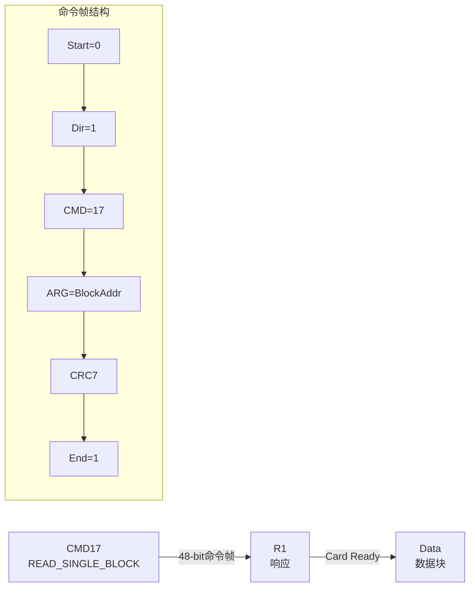
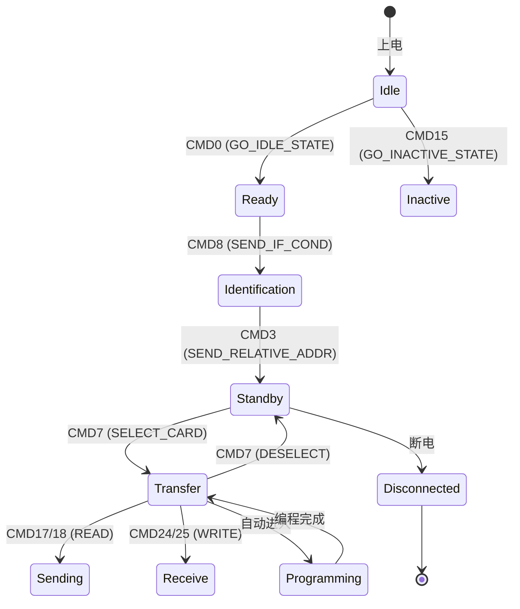

# SD 卡命令与响应协议 [I]

> **本章学习目标**：
> - 理解 <span class="red">SD 命令（CMD）</span> 的 48-bit 帧格式
> - 掌握 <span class="red">响应类型 R1/R2/R3/R6/R7</span> 的差异
> - 了解 SD 卡初始化流程与状态机

---

## SD 命令帧格式

---

### <strong>48-bit 命令帧：起始 + 方向 + 索引 + 参数 + CRC + 停止</strong>

<span class="red">SD 命令</span>使用固定的 48-bit 帧格式：

```text
CMD Frame (48 bit):

[1-bit Start] [1-bit Direction] [6-bit Command Index] [32-bit Argument] [7-bit CRC] [1-bit End]
     0              1                 CMD[5:0]            ARG[31:0]         CRC[6:0]        1

示例：CMD17 (READ_SINGLE_BLOCK)
Start=0, Direction=1, CMD=10001 (17), ARG=Block Address, CRC=calc, End=1
```

| 字段 | 长度 | 说明 |
| --- | --- | --- |
| Start | 1 bit | 固定为 0 |
| Direction | 1 bit | 1=Host→Card，0=Card→Host |
| Command Index | 6 bit | CMD0~CMD63（标准）或 ACMD（应用命令） |
| Argument | 32 bit | 命令参数（如块地址、RCA 等） |
| CRC7 | 7 bit | 前 40 bit 的 CRC 校验 |
| End | 1 bit | 固定为 1 |



---

### <strong>响应类型：R1/R1b/R2/R3/R6/R7</strong>

<span class="red">SD 卡响应</span>的长度取决于命令类型：

| 响应 | 长度 | 内容 | 典型命令 |
| --- | --- | --- | --- |
| R1 | 48 bit | 32-bit Card Status | 大多数数据命令 |
| R1b | 48 bit | R1 + Busy 信号 | 写操作命令 |
| R2 | 136 bit | 128-bit CID/CSD 寄存器 | CMD2/CMD10 |
| R3 | 48 bit | 32-bit OCR 寄存器 | CMD1（MMC）/ACMD41（SD） |
| R6 | 48 bit | 16-bit RCA + 16-bit Status | CMD3（SEND_RELATIVE_ADDR） |
| R7 | 48 bit | 8-bit VHS + 8-bit Check Pattern | CMD8（SEND_IF_COND） |

```text
R1 响应格式（48 bit）：

[Start=0] [Dir=0] [Reserved=6'b0] [32-bit Card Status] [CRC7] [End=1]

Card Status 关键位：
bit 31: OUT_OF_RANGE
bit 30: ADDRESS_ERROR
bit 22: COM_CRC_ERROR
bit 21: ILLEGAL_COMMAND
bit 19: ERASE_RESET
bit 5:  APP_CMD
bit 0:  IDLE_STATE
```

<span class="blue">R1 的 Card Status 中，高位（bit 31~24）是错误标志，低位（bit 7~0）是状态机状态。</span>
<br>

---

## SD 卡初始化状态机

---

### <strong>上电 → 识别 → 待机 → 传输：完整初始化流程</strong>

<span class="red">SD 卡初始化</span>遵循严格的状态机：



| 状态 | 可执行操作 | 典型命令 |
| --- | --- | --- |
| Idle | 复位、查询电压 | CMD0, CMD8, ACMD41 |
| Ready | 识别卡类型 | CMD2 (ALL_SEND_CID) |
| Identification | 分配 RCA | CMD3 (SEND_RELATIVE_ADDR) |
| Standby | 查询 CSD/CID | CMD9, CMD10 |
| Transfer | 读写数据 | CMD17, CMD18, CMD24, CMD25 |
| Sending | 发送数据到主机 | 读操作 |
| Receive | 接收数据 | 写操作 |
| Programming | 内部编程（Flash 写入）| 自动 |

---

### <strong>初始化代码示例：Linux mmc 核心</strong>

```c
// Linux 内核 SD 初始化流程（简化）
static int mmc_sd_init_card(struct mmc_host *host)
{
    // Step 1: GO_IDLE_STATE
    mmc_go_idle(host);  // CMD0
    
    // Step 2: 检查电压兼容性（SD 2.0+）
    err = mmc_send_if_cond(host, host->ocr_avail);  // CMD8
    
    // Step 3: 发送 OCR，等待卡就绪
    err = mmc_sd_send_op_cond(host, ocr, &rocr);  // ACMD41
    
    // Step 4: 获取 CID（卡识别信息）
    err = mmc_all_send_cid(host, cid);  // CMD2
    
    // Step 5: 分配相对地址 RCA
    err = mmc_send_relative_addr(host, &card->rca);  // CMD3
    
    // Step 6: 选中卡，进入 Transfer 状态
    err = mmc_select_card(card);  // CMD7
    
    // Step 7: 查询 CSD（卡特定数据）
    err = mmc_send_csd(card, card->raw_csd);  // CMD9
    
    // Step 8: 设置总线宽度（4-bit）
    err = mmc_app_set_bus_width(card, MMC_BUS_WIDTH_4);  // ACMD6
    
    // Step 9: 切换到高速模式（50MHz）
    err = mmc_switch(card, EXT_CSD_CMD_SET_NORMAL,
                     EXT_CSD_HS_TIMING, 1);  // CMD6
    
    return 0;
}
```

---

## 本章小结

| 概念 | 一句话总结 |
| --- | --- |
| CMD 帧 | 48-bit：Start(0) + Dir(1) + CMD[5:0] + ARG[31:0] + CRC7 + End(1) |
| R1 响应 | 32-bit Card Status + CRC7，含错误位和状态位 |
| R2 响应 | 136-bit，CID/CSD 寄存器内容 |
| ACMD | 应用命令，先发送 CMD55 再发送 ACMD |
| 初始化 | Idle → Ready → Identification → Standby → Transfer |
| RCA | 相对卡地址，Standby 状态分配 |

---

## 练习

1. 为什么 CMD8（SEND_IF_COND）是区分 SD 1.x 和 SD 2.0+ 的关键命令？
2. 画出 SD 卡从 Idle 到 Transfer 状态的完整命令序列。
3. 在 Linux 内核中，如何确认 SD 卡成功切换到 4-bit 总线模式？
