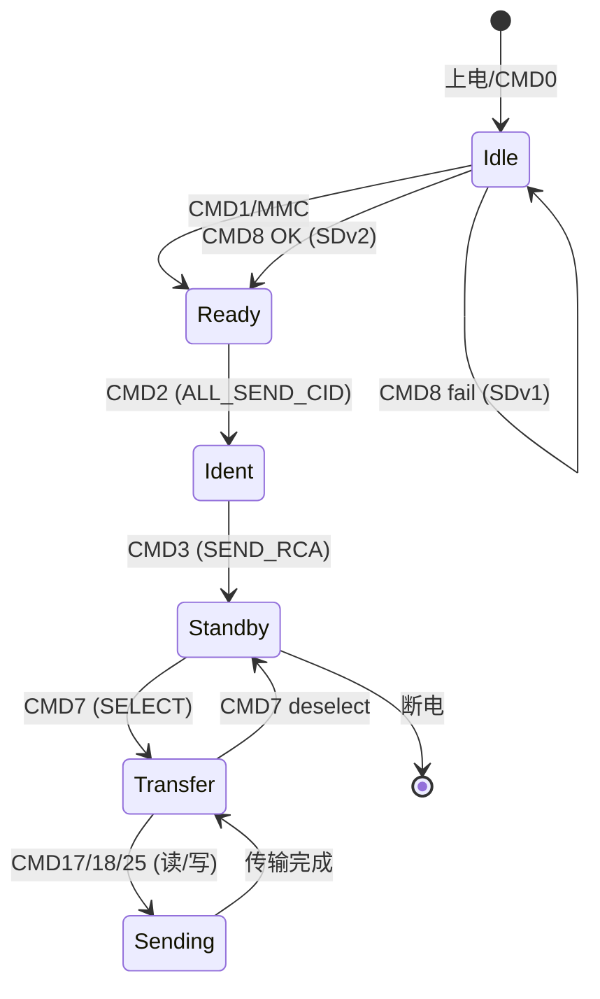

# SD怎么做——命令协议、状态机与初始化

<span class="badge-b">[B]</span> <span class="badge-i">[I]</span> <span class="badge-e">[E]</span> <span class="badge-m">[M]</span>

知道 SD 卡"长什么样"之后，<br>
本章深入命令帧格式、响应类型、RCA 分配和状态机流转。<br>
这是理解任何 SD 驱动源码的必备基础。

---

## 核心定义与价值

<span class="red">SD 命令协议</span> 是 Host 与 Card 之间的"对话语法"。<br>
所有交互都围绕 48-bit 或 136-bit 的命令/响应帧展开。<br>
<br>
状态机则定义了 Card 从"刚上电"到"能传数据"必须经过的 6 个阶段。<br>
驱动开发者的核心任务就是按正确顺序发送正确命令，让卡走完这条状态链。

---

### 类比：办银行卡流程

第一次去银行办卡，流程是固定的：<br>
- <span class="green">CMD0</span> = 取号机重置，回到 Idle<br>
- <span class="green">CMD8</span> = 出示身份证确认你活在 21 世纪（SDv2 检测）<br>
- <span class="green">ACMD41</span> = 排队等叫号，确认银行开门（电压匹配 + 就绪）<br>
- <span class="green">CMD2</span> = 报出你的身份证号（CID 读取）<br>
- <span class="green">CMD3</span> = 分配银行卡号（RCA 地址）<br>
- <span class="green">CMD7</span> = 被叫到柜台，可以办理业务（进入 Transfer 状态）<br>
<br>
每一步都有固定格式和预期响应，顺序错一个，流程就卡住。

---

## 核心机制原理解析

### <strong>1. CMD 命令格式：48-bit 帧的字段级解剖</strong>

<br>

```
Bit:  47   46   [45:40]   [39:8]      [7:1]     0
      |    |      |         |           |        |
     Start Direction  CMD Index   Argument   CRC7    Stop
      0    1      xxxx     xxxxxxxx   xxxxxxx   1
```

<br>

| 字段 | 位宽 | 值 | 说明 |
|------|------|-----|------|
| Start | 1 bit | 0 | 帧起始标记 |
| Direction | 1 bit | 1 | Host→Card（命令方向） |
| Command Index | 6 bit | 0-63 | 命令编号，如 CMD8 = 0b001000 |
| Argument | 32 bit | 任意 | 命令参数，含义因命令而异 |
| CRC7 | 7 bit | 校验 | 覆盖 [47:8] 的多项式 x⁷+x³+1 |
| Stop | 1 bit | 1 | 帧结束标记 |

<br>
<span class="blue">Direction bit 固定为 1 表示 Host→Card；Card→Host 的响应中此位为 0。</span><br>
CRC7 的计算覆盖 Start + Direction + Command Index + Argument 共 40 bit。<br>
<br>
ACMD（App Command）不是独立命令帧格式，<br>
而是先发送 CMD55（APP_CMD，Arg 含 RCA），再发送普通 CMD。<br>
卡收到 CMD55 后会设置内部状态位，下一个命令按 Application 命令解析。

---

### <strong>2. 响应类型：R1/R2/R3/R6/R7 的字段级解析</strong>

<br>

| 响应 | 位宽 | 适用命令 | 核心内容 |
|------|------|---------|---------|
| R1 | 48 bit | 大多数命令 | 32-bit Card Status + CRC |
| R2 | 136 bit | CMD2/CMD10/CMD9 | CID 或 CSD 寄存器全内容 |
| R3 | 48 bit | ACMD41 | 32-bit OCR（电压窗口） |
| R6 | 48 bit | CMD3 | 16-bit RCA + 16-bit Card Status |
| R7 | 48 bit | CMD8 | 12-bit 电压 + 8-bit 校验模式 |

<br>

**R1 详细字段（48 bit）：**

```
Bit:  47   46   [45:40]   [39:8]      [7:1]     0
      0    0    xxxxx    Status[31:0]  CRC7    1
```

<br>
R1 的 32-bit Card Status 中关键标志位：<br>

| 位 | 名称 | 含义 |
|----|------|------|
| 31 | OUT_OF_RANGE | 参数超出范围 |
| 30 | ADDRESS_ERROR | 地址对齐错误 |
| 27 | WP_VIOLATION | 写保护冲突 |
| 25 | CARD_IS_LOCKED | 卡被锁定 |
| 24 | LOCK_UNLOCK_FAILED | 解锁失败 |
| 23 | COM_CRC_ERROR | CRC 校验失败 |
| 22 | ILLEGAL_COMMAND | 非法命令 |
| 21 | CARD_ECC_FAILED | ECC 纠错失败 |
| 19 | ERROR | 通用错误 |
| 8 | READY_FOR_DATA | 可接收数据 |
| [12:9] | CURRENT_STATE | 当前状态机位置 |

<br>
<span class="blue">CURRENT_STATE [12:9] 是调试利器：读这个字段可直接知道卡处于 Idle/Ready/Ident/Standby/Transfer/Recv/Data 哪个状态。</span>

---

### <strong>3. RCA 分配：总线上的"门牌号"系统</strong>

<br>

<span class="red">RCA（Relative Card Address）</span> 是 SD 总线的核心寻址机制。<br>
初始化完成后，每张卡获得一个唯一的 16-bit RCA，后续所有指向该卡的命令都必须携带此 RCA。<br>
<br>
RCA 分配流程：<br>
- Host 发送 CMD3（SEND_RELATIVE_ADDR），Argument = 0<br>
- 卡从自己的内部计数器生成一个 RCA（通常是 0x0001 起递增）<br>
- 卡通过 R6 响应将 RCA 回传给 Host<br>
- Host 保存 RCA，后续 CMD 的 Argument [31:16] 必须填入此 RCA<br>
<br>
<span class="blue">在 1-bit 或 SPI 模式下，RCA 仍然被分配，但 SPI 模式的命令帧不包含 RCA 字段。</span><br>
多卡场景下，Host 需要维护 RCA 映射表；<br>
SD 总线支持多张卡并行挂载，但同一时刻只能有一张卡处于 Transfer 状态（CMD 独占）。

---

### <strong>4. 状态机：从 Idle 到 Data 的六步跳转</strong>

<br>



<br>

| 状态 | 可执行的命令 | 描述 |
|------|-------------|------|
| Idle | CMD0/1/5/8/55/41 | 刚上电，未识别 |
| Ready | CMD2 | 电压协商完成，等待 CID 广播 |
| Ident | CMD3 | CID 已获取，等待 RCA 分配 |
| Standby | CMD9/10/13 | RCA 已分配，未被选中 |
| Transfer | CMD7/16/17/18/24/25 | 已选中，可读写 |
| Data | — | 正在进行数据传输 |

<br>
<span class="blue">从 Idle 到 Transfer 的完整初始化流程大约需要 10-15 条命令，耗时 100-300ms。</span><br>
SD 规范要求初始化阶段时钟 ≤400kHz，这也是耗时的主要原因。

---

## 技术教学与实战

### 完整初始化流程的命令序列

```c
/* Linux mmc 核心层简化逻辑 */
int mmc_sd_init(struct mmc_host *host)
{
    int err;
    u32 ocr, rocr;

    /* 1. CMD0: GO_IDLE_STATE - 复位 */
    mmc_go_idle(host);

    /* 2. CMD8: SEND_IF_COND - 检测 SDv2 */
    err = mmc_send_if_cond(host, host->ocr_avail);
    if (err && err != -EINVAL)
        return err;

    /* 3. ACMD41: SD_APP_OP_COND - 循环等待就绪 */
    do {
        err = mmc_send_app_op_cond(host, ocr, &rocr);
        if (err)
            return err;
    } while (!(rocr & BIT(31)));   /* Power-up done? */

    /* 4. CMD2: ALL_SEND_CID - 读取 CID */
    err = mmc_all_send_cid(host, host->cid);

    /* 5. CMD3: SEND_RELATIVE_ADDR - 分配 RCA */
    err = mmc_send_relative_addr(host, &host->rca);

    /* 6. CMD7: SELECT_CARD - 进入 Transfer */
    err = mmc_select_card(host);

    /* 7. CMD6: SWITCH_FUNC - 切换高速模式 */
    err = mmc_sd_switch_hs(host);

    /* 8. CMD16: SET_BLOCKLEN = 512 */
    err = mmc_set_blocklen(host, 512);

    return 0;
}
```

<br>
<span class="green">ACMD41 的循环</span> 是初始化中最关键也最耗时的步骤：<br>
Host 反复发送 ACMD41（Argument 含期望电压窗口），<br>
卡返回 OCR 寄存器，其中 bit31 是"上电完成"标志。<br>
当 bit31 = 1 时，表示卡内部初始化完毕，可进入下一阶段。

---

## 嵌入式专属实战场景

### 场景：排查 SD 卡初始化失败的 dmesg 日志

```
[    2.345] mmc0: new high speed SDHC card at address 0001
[    2.346] mmcblk0: mmc0:0001 SD32G 29.7 GiB
[    2.350] mmcblk0: p1 p2
```

<br>
正常初始化输出。<br>
<br>

```
[    2.123] mmc0: error -84 whilst initialising SD card
[    2.124] mmc0: Card stuck in programming state!
[    2.125] mmc0: mmc_select_card: timeout
```

<br>
错误分析：<br>
- <span class="green">-84</span> = -EILSEQ，通常表示 CRC 校验失败，检查 CLK 信号完整性<br>
- "stuck in programming" = 卡内部 Flash 擦写超时，可能是劣质卡或电压不稳<br>
- "timeout" = CMD7 后卡没有响应，检查 DAT0 是否被正确拉高<br>
<br>
排查清单：<br>

| 现象 | 根因 | 修复 |
|------|------|------|
| CMD0 无响应 | DAT3 未拉高/卡未插入 | 检查卡检测 GPIO |
| CMD8 返回错误 | SDv1 老卡/卡损坏 | 降级处理或换卡 |
| ACMD41 循环超时 | 电压不匹配 | 确认 vmmc-supply 输出 3.3V |
| CMD2 返回 0xFFFFFFFF | 信号完整性差 | 缩短走线、降低 CLK 频率 |
| CMD7 后读写失败 | RCA 错误或状态机异常 | 打印 CURRENT_STATE 排查 |

---

## 历史演进与前沿

### CMD 命令集的演进

<br>

| 版本 | 新增关键命令 | 功能 |
|------|-------------|------|
| SD 1.0 | CMD0-CMD12 | 基础读写、状态查询 |
| SD 1.1 | CMD6 | SWITCH_FUNC，切换功能 |
| SD 2.0 | CMD8 | SEND_IF_COND，版本检测 |
| SD 3.0 | CMD42 | LOCK_UNLOCK，安全 |
| SD 4.0 | CMD6 扩展 | UHS-I 速度切换 |
| UHS-II | CMD0 扩展 | 进入 UHS-II 模式 |

<br>
<span class="red">CMD6（SWITCH_FUNC）</span> 是高速模式切换的核心：<br>
发送 CMD6 时，Argument 的 [31:24] 是 Mode（0=查询，1=切换），<br>
[23:20] 是 Group 编号（1=Access Mode，2=Command System，...），<br>
[19:16] 是目标功能值（0=Default Speed，1=High Speed，2=SDR50，...）。<br>
<br>
CMD6 响应是一个 512-bit 的状态页，包含了所有 Group 的当前功能值和支持功能值。

---

## 本章小结

| 主题 | 关键要点 |
|------|---------|
| CMD 格式 | 48-bit：Start(0)+Dir(1)+Index(6)+Arg(32)+CRC7(7)+Stop(1) |
| R1 响应 | 32-bit Card Status，CURRENT_STATE[12:9] 指示状态机位置 |
| RCA 机制 | CMD3 分配 16-bit 地址，后续所有命令携带 RCA |
| 状态机 | Idle→Ready→Ident→Standby→Transfer→Data |
| 初始化 | CMD0→CMD8→ACMD41→CMD2→CMD3→CMD7→CMD6→CMD16 |
| CMD6 | SWITCH_FUNC 用于切换速度模式，Arg[23:16] 决定目标速率 |

---

## 练习

1. 为什么 ACMD41 需要循环发送，而不是一次就能成功？卡内部的哪些操作导致了这个延迟？
2. 如果 Host 发送 CMD7 时携带了错误的 RCA，卡会进入什么状态？R1 响应中会体现什么错误位？
3. CMD6 的 Argument 中，Mode=0 和 Mode=1 分别代表什么操作？为什么建议先查询再切换？
4. 在 1-bit SPI 模式下，RCA 是否还有意义？SPI 模式的命令帧和响应与 SD 模式有何本质差异？
5. 为什么初始化阶段 CLK 必须 ≤400kHz？如果 Host 直接上 25MHz，会有什么后果？
