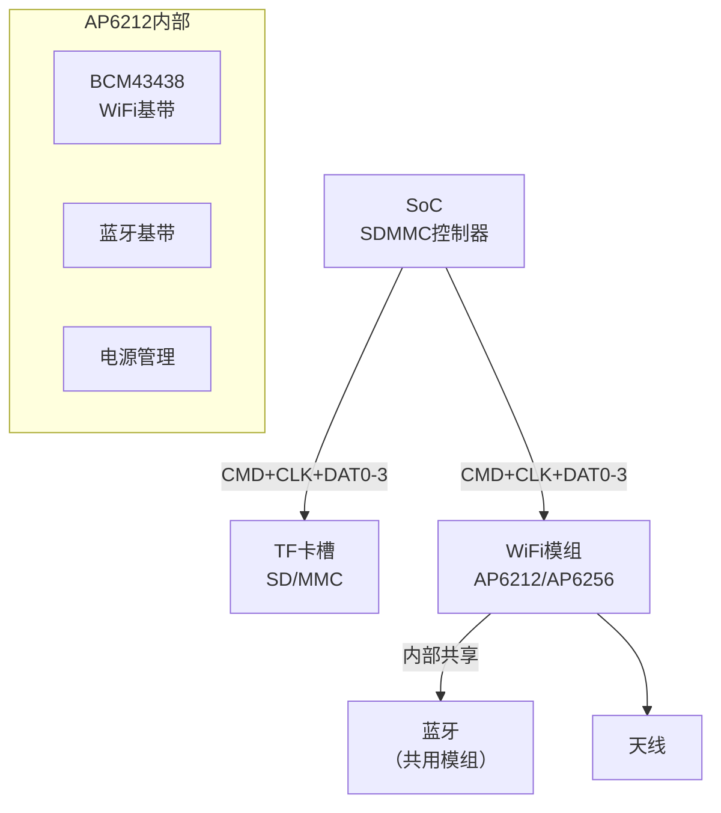
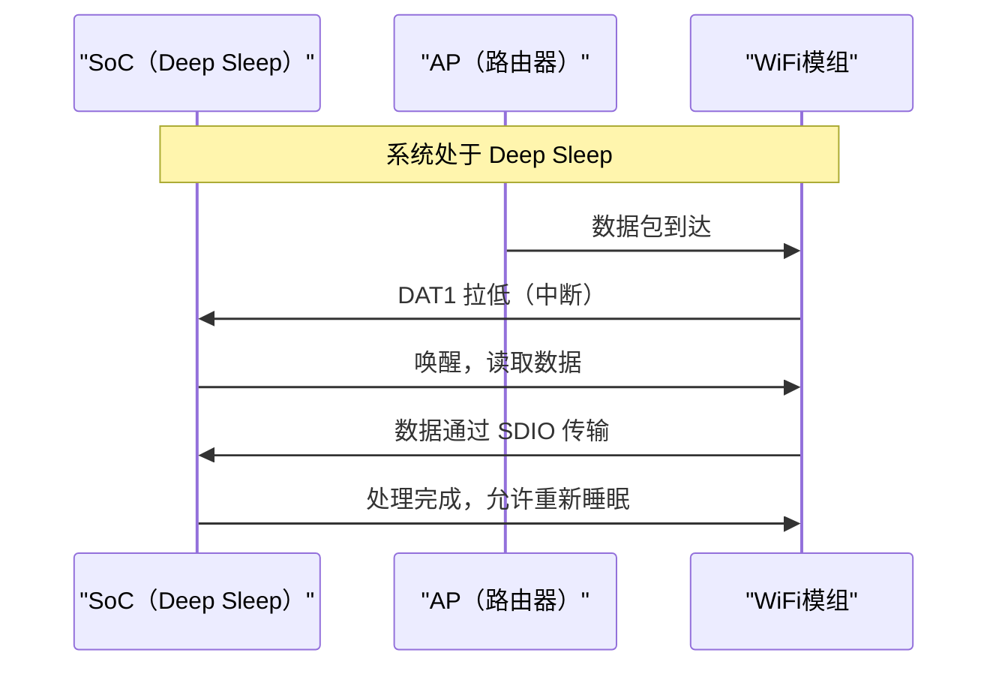

# SDIO WiFi 模组实战 [I→E]

> **本章学习目标**：
> - 理解 <span class="red">SDIO WiFi 模组</span> 的硬件连接与固件加载
> - 掌握 <span class="red">AP6212/AP6256</span> 等常见模组的 SDIO 时序
> - 了解 SDIO 中断（DAT1 复用）与低功耗设计

---

## SDIO WiFi 模组的硬件架构

---

### <strong>为什么用 SDIO 接 WiFi：省引脚 + 标准化</strong>

<span class="red">SDIO WiFi</span>是嵌入式 SoC 最常用的 WiFi 连接方式之一。

相比 USB WiFi 和 PCIe WiFi：
<br>
* <span class="green">USB WiFi</span>：需要 USB Host 控制器，占用 USB 带宽，延迟较高
<br>
* <span class="green">PCIe WiFi</span>：带宽最高，但需要 PCIe 控制器和更多引脚
<br>
* <span class="green">SDIO WiFi</span>：复用 SD 卡槽，9 pin 接口，驱动标准化（brcmfmac）
<br>

<span class="blue">类比：SDIO WiFi 如同"多功能瑞士军刀"——同一套接口既能插 TF 卡扩展存储，又能插 WiFi 模组联网，SoC 只需一个 SDMMC 控制器。</span>
<br>



---

### <strong>SDIO WiFi 的引脚定义与速率</strong>

| 引脚 | 功能 | WiFi 专用复用 |
| --- | --- | --- |
| CMD | 命令/响应 | 标准 SDIO 命令 |
| CLK | 时钟 | 0~208 MHz（UHS-I SDR104） |
| DAT0 | 数据 0 | 数据传输 |
| DAT1 | 数据 1 / IRQ | <span class="blue">中断信号（关键复用）</span> |
| DAT2 | 数据 2 / 读等待 | 数据传输 / 读等待 |
| DAT3 | 数据 3 / CS | 数据传输 / 片选 |

<span class="blue">DAT1 复用为中断线是 SDIO WiFi 的关键设计：WiFi 模组有数据包到达时，通过 DAT1 发中断通知 SoC，SoC 再发起 SDIO 读操作。这比轮询高效得多。</span>
<br>

---

### <strong>固件加载：WiFi 模组的"操作系统"</strong>

<span class="red">SDIO WiFi 模组</span>通常需要固件（Firmware）才能工作：

```text
AP6212 固件加载流程：

1. 上电复位 → 模组进入 BootROM 模式
2. SoC 通过 SDIO 接口发送固件下载命令
3. 固件分片写入模组 RAM（通常 512KB~2MB）
4. 发送启动命令，模组跳转到固件入口
5. 固件初始化后，WiFi MAC 和基带就绪
6. 加载 NVRAM 校准参数（TX 功率、天线补偿等）
7. 网络接口 wlan0 可用
```

```bash
# Linux 固件加载日志
brcmfmac: brcmf_fw_alloc_request: using brcm/brcmfmac43430-sdio for chip BCM43430/1
brcmfmac: brcmf_c_process_clm_blob: no clm_blob available (err=-2), device may have limited channels available
brcmfmac: brcmf_c_preinit_dcmds: Firmware: BCM43430/1 wl0: Oct 22 2019 16:19:37 version 7.45.98.94 (r723479 CY)
```

---

## SDIO WiFi 的低功耗设计

---

### <strong>SDIO 中断唤醒：DAT1 的两种角色</strong>

<span class="red">SDIO WiFi 的低功耗</span>依赖于 DAT1 中断：

| 模式 | DAT1 状态 | 功耗 | 唤醒机制 |
| --- | --- | --- | --- |
| Active | 数据传输 | 100~200mA | - |
| PS-Poll | 高电平 | 10~20mA | Host 轮询 |
| Deep Sleep | 高电平 | 0.5~2mA | <span class="blue">DAT1 下降沿中断唤醒</span> |



---

### <strong>STM32MP1 SDIO WiFi 配置</strong>

```c
// STM32MP1 SDMMC2 配置（SDIO WiFi）
static struct stm32_sdmmc2_pdata wifi_pdata = {
    .clk_id = CK_SDMMC2,
    .bus_width = MMC_BUS_WIDTH_4,
    .max_frequency = 50000000,  // 50MHz
    .irq = SDMMC2_IRQn,
};

// 设备树片段
&sdmmc2 {
    pinctrl-names = "default", "opendrain", "sleep";
    pinctrl-0 = <&sdmmc2_b4_pins_a>;
    pinctrl-1 = <&sdmmc2_b4_od_pins_a>;
    pinctrl-2 = <&sdmmc2_b4_sleep_pins_a>;
    bus-width = <4>;
    mmc-ddr-1_8v;
    st,neg-edge;
    status = "okay";
    
    brcmf: bcrmf@1 {
        reg = <1>;
        compatible = "brcm,bcm4329-fmac";
        interrupt-parent = <&gpioi>;
        interrupts = <0 IRQ_TYPE_LEVEL_HIGH>;  // DAT1 中断
        interrupt-names = "host-wake";
    };
};
```

---

## 本章小结

| 概念 | 一句话总结 |
| --- | --- |
| SDIO WiFi | 复用 SD 接口，9 pin，省引脚，驱动标准化 |
| DAT1 复用 | 数据 / 中断信号，WiFi 有包到达时拉低通知 Host |
| 固件加载 | 上电后 SoC 通过 SDIO 下载固件到模组 RAM |
| 低功耗 | Deep Sleep + DAT1 中断唤醒，功耗 0.5~2mA |
| brcmfmac | Linux 标准 Broadcom SDIO WiFi 驱动 |

---

## 练习

1. SDIO WiFi 的 DAT1 中断和 SPI WiFi 的 IRQ 引脚有什么区别？各有什么优劣？
2. 在 STM32MP1 上配置 SDMMC2 为 4-bit 模式、50MHz，写出完整的设备树片段。
3. WiFi 模组固件加载失败后，如何通过 SDIO 命令读取模组 BootROM 状态？
