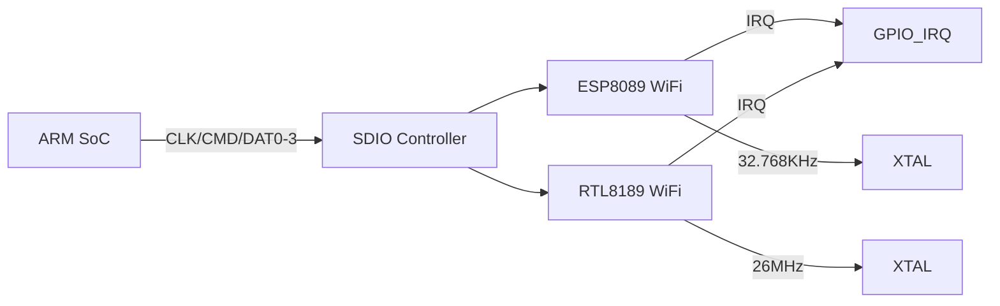

# SDIO扩展与WiFi模组

<span class="badge-i">[I]</span> <span class="badge-e">[E]</span>


<span class="red">核心概念</span> SDIO（Secure Digital Input Output，安全数字输入输出）是在 SD 物理层之上扩展的 I/O 协议，允许通过 SD 插槽连接 WiFi、蓝牙、GPS 等功能模块，而不只是存储卡。

---

SD 插槽在嵌入式设备上非常普及，但如果只用来插存储卡就浪费了 9-pin 的物理资源。
<span class="purple">扩展</span> SDIO 的设计思路是把 SD 接口变成通用 I/O 总线——
卡槽还是那个卡槽，插入的却可以是 WiFi 模组、蓝牙芯片甚至混合存储+I/O 的 Combo 卡。

---

## SDIO定位：SD协议的I/O扩展

<span class="red">核心概念</span> SDIO 保留 SD 的全部物理层和大部分命令协议，新增了 I/O 读写命令（CMD52/CMD53）和中断机制，使非存储设备也能通过 SD 接口工作。

一张 SDIO 卡内部可能包含多个功能（Function），编号从 0 开始。
<br>
Function 0 是 CIA（Common I/O Area，通用 I/O 区域），存放卡级寄存器；
<br>
Function 1-N 是各独立外设（如 WiFi MAC、蓝牙基带）。

---

主机通过 CMD5（IO_SEND_OP_COND）检测 SDIO 卡的存在，替代存储卡初始化中的 ACMD41。
<br>
CMD5 的响应格式与 R3 类似，返回的是 IO OCR，包含 I/O 就绪状态位。

---

<span class="blue">结论/易错点</span> 很多开发板标着"SD 卡槽"，实际硬件连线也支持 SDIO。
<br>
真正限制 SDIO 使用的是驱动层是否实现了 `sdio_readl/writel` 和 `sdio_claim_host`。
<br>
Linux 内核中，SDIO 驱动与 SD 存储驱动共用 mmc 子系统，但走不同的探测路径。

---

## SDIO命令：CMD52与CMD53

<span class="red">核心概念</span> CMD52 用于单字节 I/O 寄存器读写，CMD53 用于多块 DMA 级传输，两者共同构成 SDIO 的数据通道。

| 命令 | 类型 | 传输粒度 | 最大长度 | 用途 |
|------|------|---------|---------|------|
| CMD52 | 单字节 | 1 byte | 1 byte | 配置寄存器读写 |
| CMD53 | 块/流 | 1 byte ~ 512 byte | 数据块 | 数据包收发 |

---

CMD52 的 Argument 字段中，bit31 是读写方向（1=写，0=读），
<br>
bit30 是 RAW 标志（写后是否读回验证），
<br>
bit28-29 指定 Function 编号，bit9-17 是寄存器地址，bit0-7 是数据字节。

---

CMD53 支持两种传输模式：
<br>
**Block Mode**：以固定块大小传输，适合大数据量；
<br>
**Byte Mode**：以字节流方式传输，适合小数据或变长包。
<br>
Argument 中的 OP Code 位选择模式，Block Count 或 Byte Count 指定长度。

---

<span class="green">术语</span> **CCCR**（Card Common Control Registers，卡通用控制寄存器）位于 Function 0 的 CIA 区域，
<br>
包含 SDIO 版本号、总线宽度控制、电源选择、中断使能等全局配置。
<br>
主机初始化 SDIO 时，通常先读 CCCR 的 CCCR_CIS_PTR 找到 CIS（Card Information Structure）链。

---

## WiFi模组实战：ESP8089与RTL8189接口

<span class="red">核心概念</span> 市面上最常见的 SDIO WiFi 模组是 ESP8089（乐鑫）和 RTL8189（瑞昱），它们通过 SDIO 接口与主控连接，内核驱动负责把 SDIO 寄存器操作封装成 net_device。



---

ESP8089 的 SDIO 侧只用到 1-bit 或 4-bit 总线，上电后通过 CMD52 初始化内部寄存器。
<br>
它的固件通常烧录在芯片内部 Flash，上电自动加载，主机无需通过 SDIO 下载固件。
<br>
驱动重点在于正确配置 TX/RX FIFO 阈值和 DMA 门限。

---

RTL8189 则需要通过 SDIO 下载固件到芯片 RAM。
<br>
驱动启动时会先调用 `sdio_writeb()` 批量写入固件镜像，
<br>
然后通过 CCCR 的 I/O Enable 位启动 Function 1，WiFi MAC 才开始工作。

---

<span class="blue">结论/易错点</span> RTL8189 的固件下载阶段对 SDIO 时钟稳定性敏感，
<br>
如果 CLK 线有尖峰或抖动，固件 CRC 校验会失败，
<br>
芯片表现为"初始化成功但无法扫描到任何 AP"，排查方向是信号完整性而非驱动配置。

---

## 中断机制：SDIO IRQ

<span class="red">核心概念</span> SDIO 的中断信号复用 DAT1 数据线，平时 DAT1 作为数据位传输，有中断时卡将其拉低，主机检测到后通过 CMD52 读取中断标志寄存器。

这种设计避免了为每个 SDIO 功能分配独立物理 IRQ 引脚，
<br>
尤其适合引脚受限的 BGA 封装 SoC。
<br>
代价是中断响应比硬连线 GPIO 慢约 1-2 个时钟周期。

---

中断处理的标准流程：
<br>
1. 卡通过 DAT1 拉低发出中断请求
<br>
2. 主机 SD 控制器检测到电平变化，触发 SDIO IRQ handler
<br>
3. 驱动调用 `sdio_readb(func, INTR_STATUS_REG, &err)` 读取中断源
<br>
4. 根据中断源分发：TX complete、RX ready、Beacon 事件等

---

<span class="green">术语</span> **IB**（Interrupt Pending，中断挂起）是 CCCR 中 bit0 的标志位，
<br>
主机可以通过轮询 CCCR_INT_PEND 寄存器判断哪个 Function 发起了中断，
<br>
而不必依赖 DAT1 的外部中断线——这在 GPIO 匮乏的场景下是救命稻草。

---

## 代码：Linux mmc_sdio驱动片段

<span class="red">核心概念</span> Linux 内核把 SDIO 设备抽象为 `sdio_func` 结构体，驱动通过 `sdio_register_driver()` 注册，匹配后由 `probe()` 完成初始化。

```c
#include <linux/mmc/sdio_func.h>
#include <linux/mmc/sdio_ids.h>

static const struct sdio_device_id my_wifi_ids[] = {
    { SDIO_DEVICE(SDIO_VENDOR_ID_RTL, SDIO_DEVICE_ID_RTL_8189) },
    { },
};

static int my_wifi_probe(struct sdio_func *func,
                         const struct sdio_device_id *id)
{
    int err;

    /* 使能 Function */
    err = sdio_enable_func(func);
    if (err)
        return err;

    /* 设置总线宽度 */
    err = sdio_set_block_size(func, 512);
    if (err)
        goto disable;

    /* 读取芯片版本寄存器 */
    u8 chip_ver = sdio_readb(func, 0x00, &err);
    if (err)
        goto disable;
    pr_info("WiFi chip version: 0x%02x\n", chip_ver);

    /* 申请 SDIO IRQ */
    err = sdio_claim_irq(func, my_wifi_irq_handler);
    if (err)
        goto disable;

    /* 初始化 net_device 和 MAC 层 */
    ...

    return 0;

disable:
    sdio_disable_func(func);
    return err;
}

static void my_wifi_remove(struct sdio_func *func)
{
    sdio_release_irq(func);
    sdio_disable_func(func);
}

static struct sdio_driver my_wifi_driver = {
    .name     = "my_wifi_sdio",
    .id_table = my_wifi_ids,
    .probe    = my_wifi_probe,
    .remove   = my_wifi_remove,
};

module_sdio_driver(my_wifi_driver);
```

---

`sdio_enable_func()` 内部会先写 CCCR 的 I/O Enable 寄存器，
<br>
然后等待 Function Ready 标志位置位。
<br>
如果卡内部固件尚未准备好，这一步会返回 `-ETIME`。

---

<span class="purple">扩展</span> 在 RTOS（实时操作系统）环境中没有完整的 mmc 子系统，
<br>
开发者需要自己实现 SDIO 底层时序：CMD52 的 48-bit 命令帧、
<br>
CMD53 的数据块同步、DAT1 中断边沿检测。
<br>
全志 V3s / 瑞芯微 RV1106 等芯片的 SDK 通常提供裸机 SDIO 例程作为参考。
