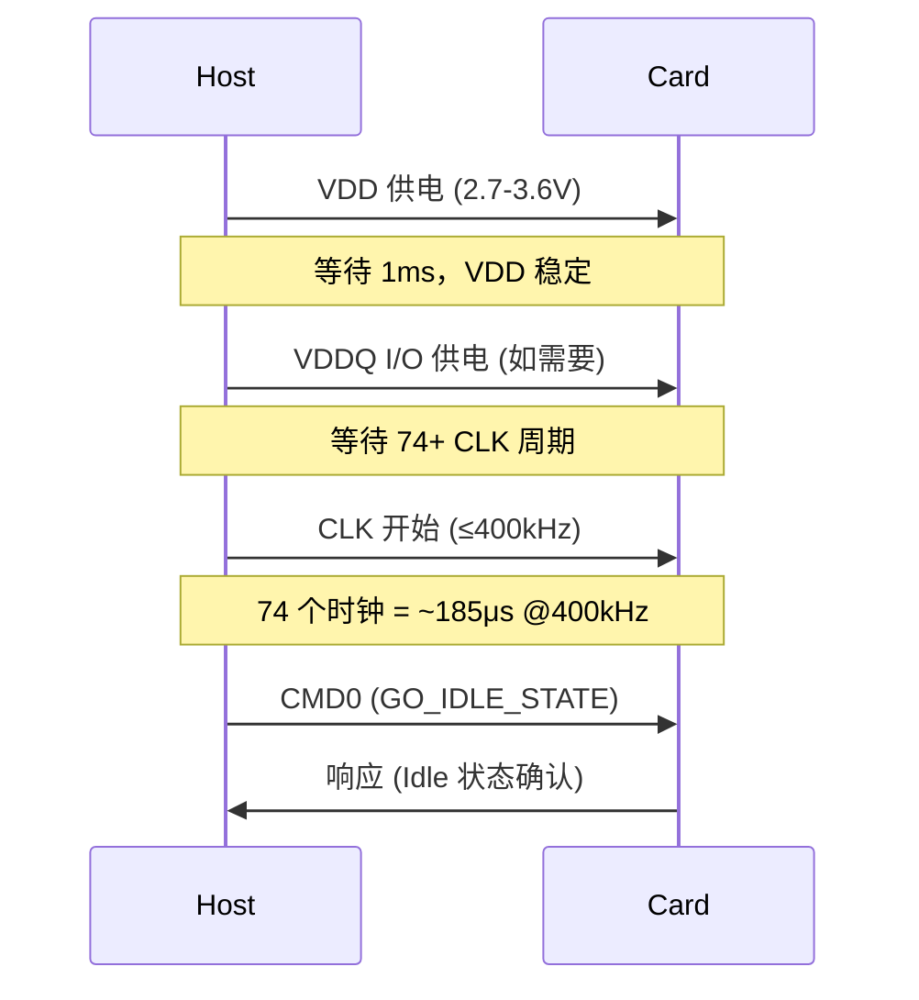

# SD为什么能热插拔——总线协议与电源管理

<span class="badge-b">[B]</span> <span class="badge-i">[I]</span> <span class="badge-e">[E]</span> <span class="badge-m">[M]</span>

SD 卡"即插即用"的魔力不是天生的。<br>
本章拆解卡检测机制、电源上电时序、写保护逻辑和低功耗模式，<br>
让你理解这 9 根线背后的可靠性设计。

---

## 核心定义与价值

<span class="red">热插拔</span> 的本质是：系统在带电运行状态下插入或移除设备，<br>
设备能被正确检测、初始化、使用，并在移除后安全释放资源。<br>
<br>
SD 卡的热插拔能力来自三层机制：<br>
- <span class="green">物理检测层</span>：DAT3/CD 引脚的高低电平变化<br>
- <span class="green">电源管理层</span>：VDD 上电时序和 CMD5 低功耗协议<br>
- <span class="green">软件响应层</span>：Linux mmc 子系统的 card-detect 中断 + 插拔回调<br>
<br>
这三层缺一不可，否则会出现"插了没反应"或"拔了还报错"的问题。

---

### 类比：酒店入住与退房

SD 卡的热插拔流程像住酒店：<br>
- <span class="green">检测插入</span> = 走到前台，前台看到你了（DAT3 被拉高）<br>
- <span class="green">上电时序</span> = 前台先开灯、开空调，再给你房卡（VDD→VDDQ→CLK→CMD）<br>
- <span class="green">初始化</span> = 刷身份证、分配房号（CMD0→CMD8→...→CMD7）<br>
- <span class="green">使用</span> = 正常入住（Transfer 状态读写）<br>
- <span class="green">检测拔出</span> = 前台发现你走了（DAT3 变低或 CD GPIO 中断）<br>
- <span class="green">安全断电</span> = 关空调、关灯、收房卡（卸载块设备→关时钟→下电）<br>
<br>
如果退房时不关空调（CLK 还在跑），酒店会报警（总线错误）。

---

## 核心机制原理解析

### <strong>1. 卡检测机制：DAT3 上拉与 CD GPIO 双保险</strong>

<br>

SD 规范定义了两种卡检测方式：<br>

| 方式 | 引脚 | 机制 | 适用场景 |
|------|------|------|---------|
| DAT3 检测 | DAT3 | 卡内部 50kΩ 上拉电阻，插入后拉高 | 标准 SD 插座 |
| CD GPIO | 专用引脚 | 机械开关或 GPIO 检测 | 自定义 PCB |

<br>

**DAT3 检测的电气细节：**<br>
- 未插入时：DAT3 由 Host 内部 50kΩ 下拉到地，电平为低<br>
- 插入后：卡内部 50kΩ 上拉电阻将 DAT3 拉高到 VDD（3.3V）<br>
- Host 检测到上升沿后，触发中断服务程序，开始初始化流程<br>
<br>
<span class="blue">DAT3 检测有一个坑：如果 Host 在 4-bit 模式下把 DAT3 当作数据线驱动，上拉电阻会被 Host 的推挽输出覆盖，导致检测失效。</span><br>
因此现代设计普遍使用 <span class="green">独立的 CD GPIO</span>，配合机械弹片开关，<br>
在 Linux 设备树中通过 <span class="green">cd-gpios</span> 属性绑定。

---

### <strong>2. 电源上电时序：从 0V 到 Ready 的精确节拍</strong>

<br>

SD 规范对上电时序有严格定义，违反时序会导致卡初始化失败或损坏：



<br>

| 时序要求 | 最小值 | 最大值 | 说明 |
|---------|--------|--------|------|
| VDD 上升时间 | — | 35 ms | 电源斜坡不能太陡也不能太慢 |
| VDD 稳定后等待 | 1 ms | — | 等待卡内部上电复位完成 |
| CLK 启动前等待 | 74 CLK | — | 给卡内部逻辑复位时间 |
| CLK 频率 | 0 kHz | 400 kHz | 初始化阶段上限 |
| CMD 发送时机 | 74 CLK 后 | — | 必须先给够时钟周期 |

<br>
<span class="blue">74 个 CLK 周期的由来：SD 规范要求卡内部有至少 74 个时钟周期来完成上电复位序列。</span><br>
在 400kHz 下，74 个周期约 185μs；实际驱动通常等待 1-10ms 以确保安全。

---

### <strong>3. 写保护机制：物理开关与软件寄存器的双重保险</strong>

<br>

全尺寸 SD 卡（非 MicroSD）在侧面有一个物理写保护开关：<br>
- 开关拨到"Lock"位置时，卡内部一个引脚被接地<br>
- Host 读取到该引脚低电平后，在 CSD 寄存器中设置 WP（Write Protect）标志<br>
- 后续所有写命令（CMD24/25）都会返回 <span class="green">WP_VIOLATION</span> 错误<br>
<br>
MicroSD 没有物理开关，但支持 <span class="green">软件写保护</span>：<br>
- 通过 CMD42（LOCK_UNLOCK）设置临时密码<br>
- 通过 CSD 寄存器的 PERM_WRITE_PROTECT 位设置永久写保护<br>
- 永久写保护一旦设置，不可逆，卡变成只读<br>
<br>
Linux 中通过 <span class="green">mmcblk0ro</span> 或 <span class="green">blockdev --setro</span> 在软件层面保护块设备，<br>
但这与 SD 卡的硬件写保护是独立的两层。

---

### <strong>4. 电源管理：CMD5 的低功耗协议</strong>

<br>

SD 卡支持两种低功耗状态：<br>

| 状态 | 进入命令 | 退出方式 | 功耗 | 数据保持 |
|------|---------|---------|------|---------|
| Standby | CMD7 deselect | CMD7 select | ~50% active | 寄存器保持 |
| Sleep | CMD5 (SLEEP) | CMD5 (AWAKE) | <1mA | 寄存器保持 |
| Power-off | 断电 | 重新上电初始化 | 0 | 全部丢失 |

<br>
CMD5 的 Argument 格式：<br>
- [31:24] = 0x00（SLEEP）或 0x01（AWAKE）<br>
- [23:0] = 保留<br>
<br>
<span class="blue">Sleep 模式的坑：并非所有 SD 卡都支持 CMD5，部分卡会返回 ILLEGAL_COMMAND。</span><br>
驱动必须先通过 CMD6 查询卡的 Power Management 功能支持情况，再决定是否使用 CMD5。

---

### <strong>5. eMMC soldered-down 与 SD 可插拔的本质差异</strong>

<br>

| 特性 | SD 卡 | eMMC |
|------|-------|------|
| 物理形态 | 可插拔 | BGA 焊死 |
| 卡检测 | DAT3/CD GPIO | 不需要 |
| 电源管理 | CMD5 Sleep/AWAKE | 深度低功耗模式 |
| 总线宽度 | 1/4 bit | 1/4/8 bit |
| 速率上限 | UHS-II 624MB/s | HS400 400MB/s |
| 可靠性 | 接触不良风险 | 焊接可靠性高 |
| 成本 | 可更换 | 板载 BOM 成本 |

<br>
<span class="red">eMMC</span> 作为焊死的存储器，不需要热插拔协议，<br>
因此初始化流程更短（不需要 CMD3 RCA 分配），<br>
总线宽度支持 8-bit（DAT0-7），<br>
并且支持 HS400 模式（200MHz DDR × 8-bit = 400MB/s）。<br>
<br>
在 Linux 中，SD 卡和 eMMC 共享 <span class="green">mmc</span> 子系统，<br>
通过 <span class="green">host->caps</span> 标志区分是否支持热插拔。

---

## 技术教学与实战

### Linux 热插拔代码路径

```c
/* drivers/mmc/core/sd.c - 卡检测中断处理 */
static void mmc_sd_detect(struct mmc_host *host)
{
    int err;

    /* 1. 读取卡检测 GPIO 状态 */
    if (!host->ops->get_cd(host)) {
        /* 卡已拔出 */
        if (!host->bus_dead()) {
            /* 卸载块设备 */
            mmc_blk_remove(host->card);
            /* 释放 RCA */
            host->card = NULL;
            host->rca = 0;
        }
        return;
    }

    /* 2. 卡插入，执行初始化 */
    err = mmc_sd_init(host);
    if (err) {
        dev_err(mmc_dev(host), "SD init failed: %d\n", err);
        return;
    }

    /* 3. 注册块设备 */
    mmc_blk_add(host->card);
}
```

<br>
<span class="blue">关键：拔卡时必须先调用 mmc_blk_remove() 卸载块设备，再释放 RCA，否则文件系统层会崩溃。</span>

---

## 嵌入式专属实战场景

### 场景：排查"SD 卡拔出后系统卡死"

常见根因和修复：<br>

| 根因 | 现象 | 修复 |
|------|------|------|
| 文件系统未卸载 | 拔卡后 dentry 指向无效 inode | 监听 uevent，自动 umount |
| RCA 未清零 | 插新卡后命令指向旧 RCA | 在 detect() 中清零 host->rca |
| CLK 未停止 | 总线悬空导致误采样 | detect() 中调用 host->ops->set_ios(clk=0) |
| 中断抖动 | 机械弹片弹跳触发多次中断 | GPIO 去抖，软件延时 100ms |

---

## 历史演进与前沿

### SD 电源管理的演进

| 版本 | 电源特性 | 功耗水平 |
|------|---------|---------|
| SD 1.0 | 无低功耗，持续全速 | ~100mA active |
| SD 2.0 | Standby 模式 | ~50mA standby |
| SD 3.0 | CMD5 Sleep | <1mA sleep |
| UHS-I | 1.8V 信号电平 | 降低动态功耗 |
| UHS-II | 0.4V 差分摆幅 | 进一步降低 EMI 和功耗 |
| SD Express | L1/L2 PCIe 电源状态 | 纳安级待机 |

---

## 本章小结

| 主题 | 关键要点 |
|------|---------|
| 卡检测 | DAT3 上拉或独立 CD GPIO；4-bit 模式下 CD GPIO 更可靠 |
| 上电时序 | VDD→稳定 1ms→74 CLK→CMD0，CLK≤400kHz |
| 写保护 | 物理开关（全尺寸 SD）+ 软件 CMD42 + CSD 永久保护 |
| 低功耗 | CMD5 SLEEP/AWAKE；需先查询功能支持 |
| eMMC 差异 | 焊死，无热插拔，8-bit 总线，HS400 模式 |

---

## 练习

1. 为什么在 4-bit 模式下使用 DAT3 做卡检测会失效？Host 的推挽输出如何覆盖卡内部的上拉电阻？
2. SD 规范要求 74 个 CLK 周期后才发 CMD0，如果 Host 只给了 50 个周期，卡会怎样表现？
3. MicroSD 没有物理写保护开关，用户如何防止误删数据？列举所有可用机制。
4. eMMC 没有热插拔，为什么初始化流程比 SD 卡更短？具体少了哪些命令？
5. 在电池供电的嵌入式设备中，如何利用 CMD5 实现"用的时候唤醒、不用的时候休眠"的策略？
