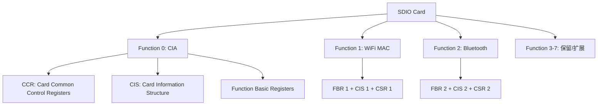

# SDIO怎么做——WiFi模组与多设备扩展

<span class="badge-b">[B]</span> <span class="badge-i">[I]</span> <span class="badge-e">[E]</span> <span class="badge-m">[M]</span>

SDIO 让 SD 总线从"存储专属"变成"通用 I/O 扩展通道"。
本章拆解 CMD52/CMD53、CIA/FBR 寄存器映射、中断机制，
并以 ESP8266 / RTL8189 WiFi 模组为例，带你完成一次真实的 SDIO 外设配置。

---

## 核心定义与价值

<span class="red">SDIO（Secure Digital I/O）</span> 是在 SD 物理层和命令协议之上定义的 I/O 扩展标准。
它让 WiFi、GPS、蓝牙等通信模组可以复用 SD 卡的物理插槽和引脚，
以存储卡的外观提供网络连接能力。

**SDIO 的核心价值：**

- 复用 SD 总线：不需要额外引脚，一块 SDIO WiFi 模组直接插进 SD 卡槽
- 多 Function 支持：单张 SDIO 卡最多支持 7 个独立 Function
- 中断支持：DAT1 引脚兼职中断线，实现异步事件通知
- Linux 生态成熟：mmc_sdio 核心层 + sdio_func 驱动模型

---

### 类比：多功能打印机

想象一台插 SD 卡槽的多功能打印机：

- <span class="green">Function 0</span> = 打印机本身的基础控制（电源、中断、版本查询）
- <span class="green">Function 1</span> = WiFi 射频模块（MAC 层、信道扫描）
- <span class="green">Function 2</span> = 蓝牙模块（经典蓝牙 LE）
- <span class="green">CMD52</span> = 逐字读写控制面板上的单个设置项
- <span class="green">CMD53</span> = 批量传输打印任务文件
- <span class="green">DAT1 中断</span> = 打印机"叮"一声提示你纸用完了

打印机的控制面板（CIA）和每个功能模块（FBR）都有自己的寄存器地址空间。

---

## 核心机制原理解析

### <strong>1. SDIO 命令层：CMD52 与 CMD53 的字段解剖</strong>

<br>

SDIO 在标准 SD 命令集基础上新增了两个核心命令：

| 命令 | 功能 | 数据粒度 | 适用场景 |
|------|------|---------|---------|
| CMD52 | 单字节读写 | 1 byte | 寄存器配置、状态查询 |
| CMD53 | 块/流读写 | 1-N byte | 大数据传输（WiFi 帧） |

<br>

**CMD52 的 48-bit 命令帧格式：**

```
Bit:  [31:31] [30:30] [29:28] [27:27] [26:26] [25:9]   [8:0]
      R/W    Function  Raw    AutoInc Address   Stuff   Data/Flag
      0/1    0-7       0/1    0/1     17-bit    bits    8-bit
```

<br>

| 字段 | 位宽 | 说明 |
|------|------|------|
| R/W Flag | 1 bit | 0=读，1=写 |
| Function Number | 3 bit | 0-7，0 表示 CIA（Common I/O Area） |
| RAW Flag | 1 bit | 1=写后回读验证（仅写操作） |
| Address | 17 bit | 寄存器地址，范围 0-0x1FFFF |
| Write Data / Read Flag | 8 bit | 写操作时是要写入的数据；读操作时忽略 |

<br>

**CMD52 响应（R5）格式：**

```
Bit:  [47:40] [39:16]  [15:8]  [7:0]
      Stuff  Address   Flags   Data
```

<br>
R5 的 Flags 字段包含关键状态位：

| 位 | 名称 | 含义 |
|----|------|------|
| 7 | COM_CRC_ERROR | CRC 错误 |
| 6 | ILLEGAL_COMMAND | 非法命令 |
| 5 | ERROR | 通用错误 |
| 3 | FUNCTION_NUMBER | Function 编号无效 |
| 2 | OUT_OF_RANGE | 地址越界 |
| 1 | 保留 | — |
| 0 | 保留 | — |

<br>

**CMD53 的 Argument 格式：**

```
Bit:  [31:31] [30:28] [27:27] [26:26] [25:9]   [8:0]
      R/W    Function  Block   OPCode  Address   Count
      0/1    0-7       0/1    0/1     17-bit    9-bit
```

<br>

| 字段 | 说明 |
|------|------|
| Block Mode | 0=字节模式，1=块模式 |
| OP Code | 0=固定地址（FIFO），1=增量地址（内存映射） |
| Count | 字节模式下为字节数（0=512），块模式下为块数（0=无限） |

<br>
<span class="blue">CMD53 块模式下，块大小由 Function 的 FBR 寄存器中的 Block Size 字段定义，默认 512 byte。</span>

---

### <strong>2. SDIO 卡内部结构：CIA + FBR + CIS</strong>

<br>



<br>

| 区域 | 全称 | 地址范围 | 内容 |
|------|------|---------|------|
| CCR | Card Common Control Registers | 0x0000-0x00FF | 版本、中断使能、I/O Ready |
| FBR | Function Basic Registers | 每个 Function 0x00-0xFF | 功能类型、Block Size、CIS 指针 |
| CIS | Card Information Structure | 由 FBR 指向 | 厂商 ID、产品 ID、固件版本、功能描述 |
| CSR | Card Specific Registers | Function 专属 | WiFi MAC 寄存器、蓝牙 HCI 接口 |

<br>

**CCR 关键寄存器：**

| 地址 | 名称 | 说明 |
|------|------|------|
| 0x00 | CCCR/SDIO Revision | SDIO 版本号（0x10=1.0, 0x20=2.0, 0x30=3.0） |
| 0x02 | I/O Enable | 按 bit 使能 Function（bit1=Func1，bit2=Func2...） |
| 0x03 | I/O Ready | 只读，显示哪些 Function 已就绪 |
| 0x04 | Int Enable | 按 bit 使能中断 |
| 0x05 | Int Pending | 只读，挂起的中断位 |
| 0x06 | I/O Abort | 写入可中止当前 CMD53 传输 |
| 0x07 | Bus Interface Control | 总线宽度、CD Disable |
| 0x08 | Card Capability | 支持的功能标志（4-bit, LSC, E4MI 等） |
| 0x09-0x0B | CIS Pointer | 指向 CIS 表的 3-byte 地址 |
| 0x0E | Bus Suspend | 总线挂起控制 |
| 0x0F | Function Select | 选择当前操作的 Function |

<br>
<span class="blue">初始化 SDIO 卡时，必须依次：读 CCR 版本→写 I/O Enable 使能 Function→读 I/O Ready 确认就绪→读 CIS 获取厂商信息。</span>

---

### <strong>3. 中断机制：1-bit 与 4-bit 模式的天壤之别</strong>

<br>

| 模式 | 中断引脚 | 机制 | 限制 |
|------|---------|------|------|
| 1-bit | DAT1 | 专属中断线，不干扰数据传输 | 带宽最低 |
| 4-bit | DAT1 | 中断与数据共享同一引脚 | 中断期间暂停数据传输 |
| SPI | 无 | 轮询或专用 IRQ 引脚 | 不标准 |

<br>

**4-bit 模式下中断的工作原理：**

- 正常数据传输时，DAT1 作为数据线之一传输 bit1
- 当 SDIO 卡需要发送中断时，在数据传输间隙将 DAT1 拉高
- Host 检测到 DAT1 持续高电平（而非数据变化）后，判定为中断事件
- Host 发送 CMD52 读取 CCR 的 Int Pending 寄存器，确认是哪个 Function 触发的中断
- 对应 Function 的驱动处理中断（如 WiFi 驱动读取接收 FIFO）

<br>
<span class="blue">4-bit 模式中断的关键：DAT1 必须保持高电平至少 1 个 CLK 周期，Host 才能与数据变化区分。</span>

---

## 技术教学与实战

### Linux mmc_sdio 核心结构体

```c
/* include/linux/mmc/sdio_func.h */
struct sdio_func {
    struct mmc_card    *card;        /* 所属 SDIO 卡 */
    struct sdio_func_tuple *tuples; /* CIS 元数据链 */
    unsigned int        num;         /* Function 编号 1-7 */
    unsigned char      class;        /* SDIO Class Code */
    unsigned short     vendor;       /* 厂商 ID（来自 CIS） */
    unsigned short     device;       /* 设备 ID（来自 CIS） */
    unsigned short     max_blksize;  /* 最大块大小 */
    unsigned short     cur_blksize;  /* 当前块大小 */
    u8                  enable;       /* I/O Enable 状态 */
    /* ... */
};

/* 驱动注册示例 */
static struct sdio_driver sdio_rtl8189_driver = {
    .name       = "rtl8189fs",
    .probe      = rtl8189fs_sdio_probe,
    .remove     = rtl8189fs_sdio_remove,
    .id_table   = rtl8189fs_sdio_ids,
};

static const struct sdio_device_id rtl8189fs_sdio_ids[] = {
    { SDIO_DEVICE(0x024c, 0xf179) },  /* Realtek RTL8189FS */
    { SDIO_DEVICE(0x024c, 0xb723) },  /* Realtek RTL8723BS */
    {},
};
```

<br>
<span class="green">sdio_driver</span> 遵循 Linux 设备模型：
mmc 核心层扫描 CIS 获取 vendor/device ID 后，
自动匹配并调用对应驱动的 probe 函数。

---

## 嵌入式专属实战场景

### 场景：配置 ESP8266 SDIO WiFi 模组

ESP8266 的 SDIO 模式将 WiFi 功能暴露为 SDIO Function 1。

初始化流程：

| 步骤 | 命令 | 操作 | 目的 |
|------|------|------|------|
| 1 | CMD52 | 读 CCR 0x00 | 确认 SDIO 版本 |
| 2 | CMD52 | 读 CCR 0x08 | 读 Card Capability |
| 3 | CMD52 | 写 CCR 0x07 | 设置 4-bit 总线宽度 |
| 4 | CMD52 | 写 CCR 0x02 | 使能 Function 1 |
| 5 | CMD52 | 读 CCR 0x03 | 确认 I/O Ready |
| 6 | CMD53 | 读 FBR1 CIS | 获取 ESP8266 固件版本 |
| 7 | CMD53 | 写 Function 1 CSR | 配置 WiFi 模式（STA/AP） |

<br>
dmesg 正常输出：

```
[    3.123] mmc1: new high speed SDIO card at address 0001
[    3.124] sdio: FUNC1: vendor=0x6666 device=0x1111
[    3.125] esp_sdio: ESP8266 SDIO WiFi probed, fw ver 3.0
[    3.200] wlan0: register 802.11 b/g/n device
```

<br>
常见故障排查：

| 现象 | 根因 | 修复 |
|------|------|------|
| "FUNC1 not ready" | Function 1 使能后未就绪 | 增加 retry 次数，检查供电 |
| "CMD53 timeout" | Block Size 不匹配 | 确认 FBR 中 Block Size 与驱动一致 |
| "interrupt storm" | DAT1 信号完整性差 | 缩短走线，串联 22Ω 电阻 |
| "probe failed" | CIS 中 vendor/device ID 不匹配 | 更新 id_table 或固件 |

---

## 历史演进与前沿

### SDIO 的版本演进

| 版本 | 年份 | 核心特性 |
|------|------|---------|
| SDIO 1.0 | 2001 | 基础 I/O，CMD52/CMD53，1-bit 模式 |
| SDIO 1.10 | 2003 | 4-bit 模式，中断支持 |
| SDIO 2.0 | 2007 | 高速模式 50MHz，SPI 兼容 |
| SDIO 3.0 | 2010 | UHS-I 支持，1.8V 信号 |
| SDIO 3.01 | 2012 | 与 SD 3.01 同步 |

<br>
现代 WiFi/BT Combo 模组普遍使用 SDIO 2.0 或 3.0：

- <span class="green">RTL8189FS</span>：SDIO 2.0，WiFi-only，低成本方案
- <span class="green">RTL8723BS</span>：SDIO 3.0，WiFi + BT Combo
- <span class="green">BCM43438</span>：SDIO 3.0，Raspberry Pi 3/Zero W 内置
- <span class="green">CYW43455</span>：SDIO 3.0，Raspberry Pi 3B+/4 内置，支持 5GHz

<br>
<span class="blue">趋势：随着 UART/SPI WiFi 模组性价比提升，纯 SDIO WiFi 在新设计中逐渐减少，但 SDIO 在 Combo 芯片和嵌入式 Linux 平台中仍不可替代。</span>

---

## 本章小结

| 主题 | 关键要点 |
|------|---------|
| CMD52 | 单字节读写，Arg[31]=R/W，[30:28]=Function，[25:9]=Address |
| CMD53 | 批量读写，Arg[27]=Block Mode，[26]=OP Code，[8:0]=Count |
| CIA | Function 0 的公共区域：CCR + CIS + FBR |
| CCR | 版本 0x00、使能 0x02、就绪 0x03、中断 0x04-0x05 |
| 中断 | 4-bit 模式下 DAT1 共享数据和中断；需持续高电平 ≥1 CLK |
| 初始化 | 读版本→设总线→使能 Function→查就绪→读 CIS→配置功能 |

---

## 练习

1. CMD52 的 RAW Flag 有什么作用？在什么场景下必须使用 RAW=1？
2. 4-bit 模式下，Host 如何区分 DAT1 上的"数据 bit1"和"中断信号"？
3. 为什么 SDIO 的 Function 0 不能通过 I/O Enable 关闭？它的特殊地位是什么？
4. 如果一个 SDIO 卡有 3 个 Function，CIS 表在内存中是如何组织的？FBR 如何指向各自的 CIS？
5. 对比 SDIO WiFi 与 SPI WiFi（如 ESP8266 SPI 模式），在引脚数量、带宽、CPU 占用方面各有什么优劣？
