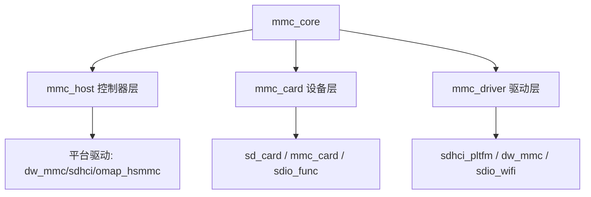

# SD热插拔与电源管理

<span class="red">核心概念</span> SD 卡槽设计天然支持热插拔，但嵌入式系统必须处理检测引脚（CD）的机械抖动、电源浪涌和上电时序，否则会导致卡识别失败甚至硬件损坏。

---

热插拔看似只是"插入就能用"，但在电路层面涉及一连串事件：
<span class="purple">扩展</span> 机械触点碰撞产生抖动，VDD 上电产生浪涌电流，
卡内部控制器需要数十毫秒完成自初始化。
主机必须在正确的时间窗口内探测这些状态，过早发命令会失败，过晚则用户感到卡顿。

---

## 热插拔检测：CD引脚与防抖

<span class="red">核心概念</span> CD（Card Detect，卡检测）引脚通常是机械开关，卡插入时闭合，拔出时断开。机械触点在接触瞬间会产生毫秒级的抖动，必须用软件或硬件消抖。

| 检测方式 | 原理 | 消抖策略 | 响应延迟 |
|----------|------|---------|---------|
| GPIO CD | 机械开关→GPIO输入 | 软件延时10-50ms | 10-50ms |
| DAT3 检测 | 卡内部上拉DAT3 | 轮询+超时 | 100-500ms |
| SDIO 探测 | 发CMD0检测响应 | 命令重试 | 100-1000ms |

---

硬件方案：在 CD 引脚上加 RC 低通滤波（典型 10kΩ + 100nF），
把抖动脉冲平滑掉，再配合施密特触发器整形。
<br>
软件方案：在中断或轮询中检测到 CD 变化后，延迟 50ms 再确认状态。
<br>
Linux mmc 核心层的 `mmc_detect_change()` 默认带有防抖处理。

---

<span class="blue">结论/易错点</span> 很多开发者看到 CD 引脚电平变化就立刻开始初始化流程，
结果卡还没完全插入到位，CMD0 无响应导致探测失败。
<br>
正确做法是 CD 有效后再延时 200ms，等 VDD 稳定和卡内部上电完成。

---

## 电源管理：上电时序与电压切换

<span class="red">核心概念</span> SD 卡对电源上电有严格时序要求：VDD 必须先于或同时与 CMD/DAT/CLK 稳定，且上电过程中 CLK 必须保持低电平或至少 74 个时钟周期。

标准上电流程：
<br>
1. 主机拉高 VDD（3.3V 或 1.8V），等待电源稳定（>1ms）
<br>
2. 驱动 CLK 至少 74 个周期（>1ms at 100KHz），让卡完成内部复位
<br>
3. 发送 CMD0（GO_IDLE_STATE），Argument=0
<br>
4. 进入 Idle 状态，开始正常初始化

---

电压切换是 UHS-I 模式的关键步骤。
<br>
主机先以 3.3V 初始化，发 CMD0→CMD8→ACMD41 确认卡支持 UHS，
<br>
然后发 CMD6（SWITCH）选择速度模式，同时通知卡即将切换电压。
<br>
卡准备就绪后，主机硬件切换电平转换器到 1.8V。

---

<span class="green">术语</span> **S18R**（Switching to 1.8V Request，请求切换1.8V）是 ACMD41 响应中 bit24 的标志。
<br>
如果 S18A（Switching to 1.8V Accepted）返回为 1，主机才能执行电压切换。
<br>
强行切换电压而卡未准备好，会导致通信完全中断，需要重新上电恢复。

---

## UHS-I与UHS-II电压要求

<span class="red">核心概念</span> UHS-I 的所有速度模式（SDR50/DDR50/SDR104）都要求 1.8V 信号电平；UHS-II 则引入第二排触点，在 1.8V 基础上使用 LVDS 差分信号。

| 标准 | 信号电平 | 总线宽度 | 时钟/数据率 | 最大带宽 |
|------|---------|---------|------------|---------|
| UHS-I SDR104 | 1.8V CMOS | 4-bit | 208MHz | 104 MB/s |
| UHS-II FD | 1.8V LVDS | 2 Lane×4-bit | 156MHz | 312 MB/s |
| UHS-III | 1.8V LVDS | 2 Lane×4-bit | 624MHz | 624 MB/s |

---

1.8V 电平的噪声容限比 3.3V 小得多，对 PCB 走线阻抗和串扰控制提出更高要求。
<br>
UHS-II 的 LVDS 差分对需要 100Ω 端接，且走线必须等长控制在 ±0.5mm 以内。
<br>
消费级读卡器通常不支持 UHS-II，因为需要额外的 PHY 芯片。

---

<span class="blue">结论/易错点</span> 某些主板声称支持 UHS-I，但只把 1.8V 切换做在 SD 卡槽附近，
<br>
CPU 侧的 SDIO 控制器仍然跑在 3.3V。
<br>
这种情况下虽然能识别 UHS 卡，但速度只能达到 High Speed（25MB/s），无法启用 SDR50 以上模式。

---

## Linux mmc核心：host/card/driver三层模型

<span class="red">核心概念</span> Linux 内核把 SD/MMC/SDIO 子系统抽象为三层：mmc_host（控制器）、mmc_card（设备）、mmc_driver（驱动），由 mmc_core 中间层协调。



---

mmc_host 代表 SD 控制器硬件，注册时声明支持的电压范围、总线宽度、速度模式。
<br>
mmc_card 是探测到的卡对象，包含 CID/CSD/SCR 等寄存器缓存。
<br>
mmc_driver 是具体功能驱动，如块设备层（mmc_block）、SDIO WiFi 驱动。

---

<span class="green">术语</span> **SDHCI**（Secure Digital Host Controller Interface，安全数字主机控制器接口）是 Intel 提出的标准寄存器级接口规范。
<br>
市面上绝大多数 SDHCI 兼容控制器（Synopsys DesignWare、Arasan、OMAP 等）
<br>
都可以直接用 `sdhci.c` 通用驱动，只需平台层做少量适配。

---

## 命令：mmc utils实战输出

<span class="red">核心概念</span> BusyBox 和 util-linux 提供 `mmc` 工具集，可以直接在 Shell 中读写 SD/eMMC 寄存器和数据块，是调试硬件问题的利器。

```bash
# 查看卡状态和基本信息
$ mmc status read /dev/mmcblk0
VOLTAGE: 3.3V
BUS_WIDTH: 4-bit
SPEED_MODE: HS (50MHz)
CARD_TYPE: SDHC
RCA: 0x1234
```

---

```bash
# 读取 CSD 寄存器
$ mmc read CSD /dev/mmcblk0
CSD_STRUCTURE: 1 (SDv2+)
TRAN_SPEED: 0x5A (50MHz)
READ_BL_LEN: 9 (512 bytes)
C_SIZE: 0x3A7F
CAPACITY: 7.45 GiB
```

---

```bash
# 读取 CID 寄存器
$ mmc read CID /dev/mmcblk0
MID: 0x03 (SanDisk)
OID: SD
PNM: SU08G
PSN: 0x12345678
MDT: 2023/08
```

---

<span class="purple">扩展</span> eMMC 还额外支持 `ext_csd` 读取，其中包含 Boot 分区配置、
<br>
擦除计数、Health 状态、RPMB（Replay Protected Memory Block，重放保护内存块）配置等高级信息。
<br>
`mmc extcsd read /dev/mmcblk0` 是判断 eMMC 寿命和坏块趋势的首选命令。
