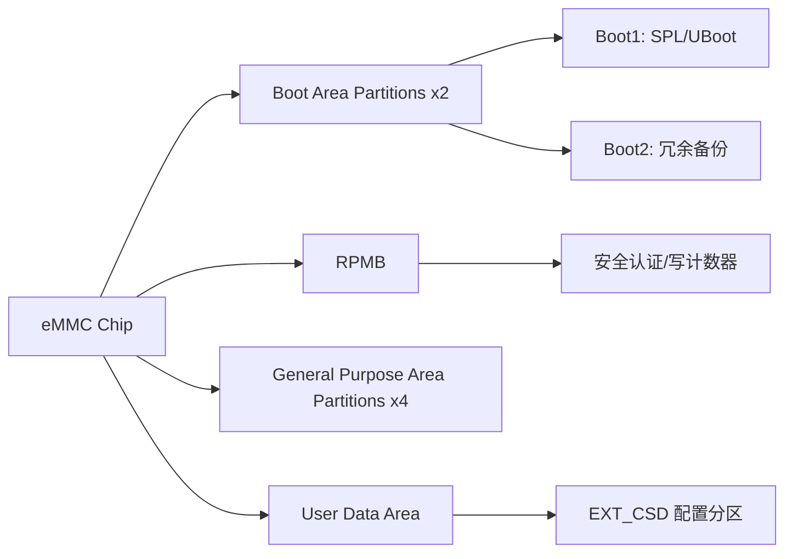
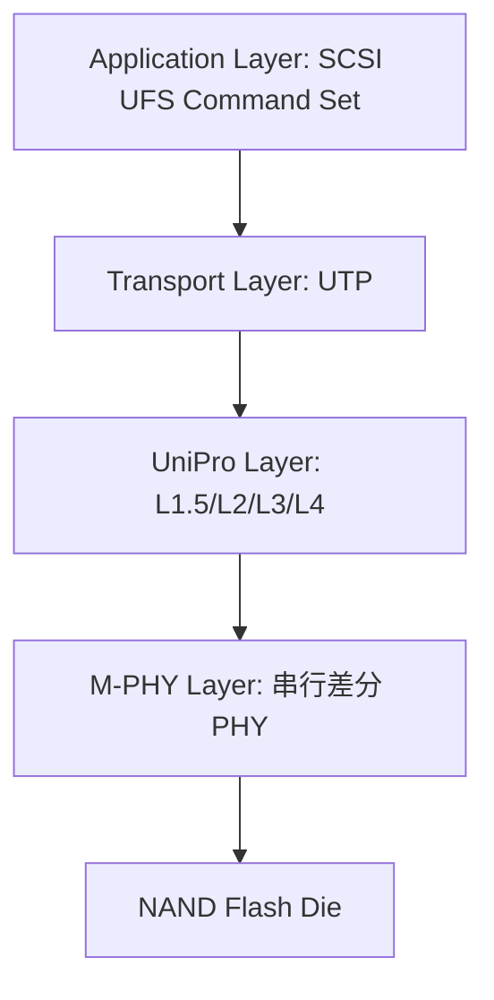

# SD往哪去——eMMC/UFS 与前沿演进

<span class="badge-b">[B]</span> <span class="badge-i">[I]</span> <span class="badge-e">[E]</span> <span class="badge-m">[M]</span>

SD 协议的演进没有停止。
本章从 eMMC 到 UFS，从 SD Express 到车载工业级扩展，
梳理嵌入式存储的未来方向。

---

## 核心定义与价值

<span class="red">eMMC</span> 和 <span class="red">UFS</span> 代表了 SD 家族在嵌入式领域的两条演进路径：
eMMC 是 MMC 协议的"焊死版"终极形态，而 UFS 是彻底抛弃旧协议的新架构。
<br>
SD Express 则是 SD 卡形态的"借尸还魂"——用 PCIe + NVMe 协议栈替代传统 SD 信号层。

---

### 类比：从书架到快递分拣中心

- <span class="green">SD 卡</span> = 图书馆书架上的书（可插拔，单本取阅）
- <span class="green">eMMC</span> = 固定在墙上的嵌入式书架（焊死，8 列并行取阅，速度翻倍）
- <span class="green">UFS</span> = 全自动快递分拣中心（全双工，双通道，读写互不干扰）
- <span class="green">SD Express</span> = 伪装成书架的快递柜（外表是 SD 卡，内部是 PCIe 物流系统）

---

## 核心机制原理解析

### <strong>1. eMMC：embedded MultiMediaCard 的终极形态</strong>

<br>

eMMC = NAND Flash + MMC 控制器 + 标准 BGA 封装，三者焊死在主板上。
Host 看到的永远是一个标准的 MMC 接口，NAND 的坏块管理、ECC、磨损均衡全部由 eMMC 内部控制器处理。

| 特性 | eMMC 4.51 | eMMC 5.0 | eMMC 5.1 |
|------|-----------|----------|----------|
| 发布年份 | 2011 | 2013 | 2015 |
| 速率模式 | HS200 | HS200 | HS400 |
| 时钟频率 | 200 MHz | 200 MHz | 200 MHz |
| 总线宽度 | 8-bit | 8-bit | 8-bit |
| 数据采样 | SDR | SDR | DDR |
| 理论峰值 | 200 MB/s | 200 MB/s | 400 MB/s |
| 关键新增 | Cache | Cache + RPMB | Command Queue |

<br>

**HS400 模式的关键参数：**

- 时钟：200 MHz
- 总线：8-bit DDR（上升沿 + 下降沿各传 8 bit）
- 峰值：200M × 2 × 8bit = 400 MB/s
- 数据选通：eMMC 输出 <span class="green">DS（Data Strobe）</span> 信号，Host 用 DS 边缘采样数据而非 CLK
- <span class="blue">DS 信号是 HS400 的灵魂：NAND Flash 的读写延迟不稳定，DS 提供了与数据对齐的精确采样点。</span>

<br>

**eMMC 分区结构：**



<br>

| 分区 | 大小 | 用途 |
|------|------|------|
| Boot Area Partition 1 | 128KB-4MB | 主引导镜像（SPL、U-Boot） |
| Boot Area Partition 2 | 同 BAP1 | 冗余备份 |
| RPMB | 128KB-16MB | 安全存储，Replay Protected |
| GPAP 1-4 | 可配置 | 通用目的分区 |
| User Data Area | 剩余全部 | 文件系统、用户数据 |

<br>
<span class="blue">RPMB（Replay Protected Memory Block）通过写计数器和 HMAC-SHA256 防止回滚攻击，是移动设备安全启动的关键。</span>

---

### <strong>2. UFS：Universal Flash Storage 的协议革命</strong>

<br>

UFS 不是 MMC 的升级版，而是彻底的重构。
它抛弃了并行总线和半双工 CMD/DAT 架构，采用串行全双工的 M-PHY + UniPro 协议栈。

| 特性 | UFS 2.0 | UFS 2.1 | UFS 3.0 | UFS 3.1 | UFS 4.0 |
|------|---------|---------|---------|---------|---------|
| 发布年份 | 2013 | 2016 | 2018 | 2020 | 2022 |
| M-PHY 速率 | HS-G2 | HS-G2 | HS-G3 | HS-G3 | HS-G5 |
| 单通道速率 | 5.8 Gbps | 5.8 Gbps | 11.6 Gbps | 11.6 Gbps | 23.2 Gbps |
| 通道数 | 2 | 2 | 2 | 2 | 2 |
| 理论峰值 | 1.2 GB/s | 1.2 GB/s | 2.4 GB/s | 2.9 GB/s | 4.6 GB/s |
| 关键新增 | — | — | — | WriteBooster | — |

<br>

**UFS 协议栈分层：**



<br>

| 层次 | 协议 | 功能 |
|------|------|------|
| Application | SCSI UFS | 读/写命令、属性查询、功率模式 |
| Transport | UTP (UFS Transport Protocol) | UPIU 包封装、任务管理 |
| UniPro | L1.5-L4 | 流控、差错控制、链接建立、电源管理 |
| PHY | M-PHY | 差分串行信号、8b/10b 或 128b/132b 编码 |

<br>
<span class="red">UFS 的核心设计差异：</span>

- <span class="green">全双工</span>：两对差分线分别用于读和写，读写可同时进行
- <span class="green">SCSI 命令集</span>：摒弃了 MMC 的 CMD/RESPONSE 模型，采用 CDB（Command Descriptor Block）
- <span class="green">多队列</span>：原生支持 32 个独立任务队列，随机读写性能远超 eMMC
- <span class="green">WriteBooster</span>：UFS 3.1 引入的 SLC Cache 模式，临时提升写入速度

---

### <strong>3. SD Express：PCIe 借壳的 SD 卡</strong>

<br>

SD Express 是 SD 卡物理形态 + PCIe 内部协议的混合体。

| 版本 | PCIe 版本 | 通道数 | 峰值速率 | NVMe 支持 |
|------|-----------|--------|---------|-----------|
| SD Express 7.0 | PCIe 3.0 ×1 | 1 | 985 MB/s | NVMe 1.3 |
| SD Express 7.1 | PCIe 3.0 ×1 | 1 | 985 MB/s | NVMe 1.3 |
| SD Express 8.0 | PCIe 4.0 ×2 | 2 | 4 GB/s | NVMe 1.4 |

<br>

**SD Express 的引脚重定义：**

传统 SD 的 9-pin 在 SD Express 中被重新分配：

| 引脚 | 传统 SD | SD Express |
|------|---------|-----------|
| 1-3 | DAT3/DAT2/DAT1 | PCIe REFCLK+/REFCLK-/PERST# |
| 4 | VDD | VDD |
| 5-7 | CLK/CMD/DAT0 | PCIe PETp0/PETn0/PERp0 |
| 8-9 | — | PERn0/VSS |

<br>
<span class="blue">SD Express 完全放弃了传统 SD 的信号协议，只保留物理尺寸和部分引脚定义。</span>
因此：
- SD Express 卡可以插入传统 SD 插槽（但只能以 UHS-I 模式工作）
- 传统 SD 卡不能插入 SD Express 插槽（引脚定义不兼容，可能损坏）
- 需要 Host 控制器同时支持 PCIe 和 SD 双协议栈

---

### <strong>4. 车载/工业级 SD 的温度与可靠性扩展</strong>

<br>

消费级 SD 卡的工作温度范围是 0°C 到 70°C。
工业级和车规级扩展了这一范围：

| 等级 | 温度范围 | 典型应用 |
|------|---------|---------|
| 消费级 | 0°C ~ 70°C | 手机、相机 |
| 工业级 | -40°C ~ 85°C | 工业控制器、户外设备 |
| 车规级 A2 | -40°C ~ 105°C | 车载信息娱乐 |
| 车规级 A1 | -40°C ~ 125°C | ADAS、域控制器 |

<br>
工业级 SD 的关键增强：

- <span class="green">SLC/pSLC NAND</span>：牺牲容量换取 10 倍以上的擦写寿命
- <span class="green">增强 ECC</span>：支持 120-bit/1KB 纠错能力
- <span class="green">掉电保护</span>：板载钽电容，确保写入缓存数据在断电前刷入 Flash
- <span class="green">TFM（Targeted Flash Management）</span>：智能磨损均衡，预测坏块

---

## 技术教学与实战

### Linux eMMC 分区工具

```bash
# 读取 EXT_CSD 寄存器
mmc extcsd read /dev/mmcblk0

# 输出片段：
===========================================
Extended CSD rev 1.8 (MMC 5.1)
===========================================
Boot configuration [PARTITION_CONFIG: 0x48]
  BOOT_ACK:      0x00
  BOOT_PARTITION_ENABLE: 0x01  (Boot1)
  PARTITION_ACCESS:      0x00
Boot bus width [BOOT_BUS_WIDTH]: 0x02  (x8 + SDR)
Cache control [CACHE_CTRL]: 0x01  (Cache ON)
Command Queue Support [CMDQ_SUPPORT]: 0x01  (Supported)
```

<br>
<span class="blue">mmc extcsd read 是诊断 eMMC 问题的必备工具。</span>
通过它可以确认：
- 当前引导分区配置（从 Boot1 还是 Boot2 启动）
- 总线宽度和速率模式
- Cache 和 Command Queue 是否启用

---

## 嵌入式专属实战场景

### 场景：从 eMMC 迁移到 UFS 的驱动适配

Android 手机从 eMMC 5.1 迁移到 UFS 2.1/3.0 时，驱动层需要做以下修改：

| 层次 | eMMC 驱动 | UFS 驱动 |
|------|----------|----------|
| 核心层 | mmc_core | scsi/ufshcd |
| 块设备 | mmcblk | sda/sdb |
| 命令 | CMD17/18/24/25 | SCSI READ(10)/WRITE(10) |
| 速率控制 | set_ios(clock, bus_width) | ufshcd_config_pwr_mode |
| 启动加载 | mmc read | scsi read |
| 固件更新 | mmc write | bsg/ufshcd-update |

<br>
U-Boot 中 UFS 启动配置：

```c
/* drivers/ufs/ufs.c */
/* UFS 链路初始化 */
ufshcd_hba_enable(hba);
ufshcd_link_startup(hba);
ufshcd_verify_dev_init(hba);

/* 查询设备容量 */
ufs_get_device_info(hba, &dev_info);
printf("UFS Device: %s, Capacity: %llu GB\n",
       dev_info.product_id, dev_info.capacity >> 30);
```

---

## 历史演进与前沿

### 嵌入式存储协议的终极对决

<br>

| 维度 | SD 卡 | eMMC | UFS | NVMe SSD |
|------|-------|------|-----|----------|
| 形态 | 可插拔 | BGA 焊死 | BGA 焊死 | M.2/mSATA |
| 协议 | SD 串行 | MMC 并行 | M-PHY+UniPro+SCSI | PCIe+NVMe |
| 总线宽度 | 1/4 bit | 1/4/8 bit | 2×差分对×2通道 | 4×PCIe lanes |
| 峰值速率 | 624 MB/s | 400 MB/s | 4.6 GB/s | 7+ GB/s |
| 随机读 IOPS | ~3K | ~10K | ~100K | ~500K |
| 功耗 | 低 | 中 | 中 | 高 |
| 热插拔 | 支持 | 不支持 | 不支持 | 部分支持 |
| 成本 | 最低 | 低 | 中 | 高 |
| 典型场景 | 相机/IoT | 中低端手机 | 旗舰手机 | 笔记本/服务器 |

<br>
<span class="red">趋势预测：</span>

- eMMC 将在 2025-2027 年逐步退出旗舰手机，被 UFS 全面取代
- UFS 4.0 及以后的版本将进一步逼近 NVMe SSD 的性能
- SD Express 在专业摄影和工业边缘计算中找到定位
- 车规级存储将成为下一个技术制高点（温度、振动、寿命）

---

## 本章小结

| 主题 | 关键要点 |
|------|---------|
| eMMC HS400 | 200MHz × 8-bit DDR + DS 选通 = 400MB/s |
| eMMC 分区 | Boot1/Boot2/RPMB/User Data，RPMB 用于安全 |
| UFS | M-PHY + UniPro + SCSI，全双工双通道，4.6GB/s @ UFS4.0 |
| UFS WriteBooster | SLC Cache 临时加速写入 |
| SD Express | PCIe 借壳 SD 卡形态，985MB/s~4GB/s |
| 工业级 | -40°C~125°C，SLC/pSLC，增强 ECC，掉电保护 |

---

## 练习

1. 为什么 UFS 的全双工架构在随机读写场景中大幅优于 eMMC？从总线竞争和队列深度两个角度分析。
2. eMMC HS400 的 Data Strobe（DS）信号解决了什么问题？为什么 HS200（SDR）不需要 DS？
3. SD Express 卡插入传统 SD 插槽会发生什么？为什么？从引脚和协议两个层面解释。
4. 车载/工业级 SD 卡的 pSLC 模式牺牲了 3/4 的容量，换来了什么？在什么场景下这个牺牲是值得的？
5. 假设你要为一款新手机选择存储方案，目标售价 2000 元档位，你会选择 eMMC 5.1、UFS 2.2 还是 UFS 3.1？权衡因素是什么？
