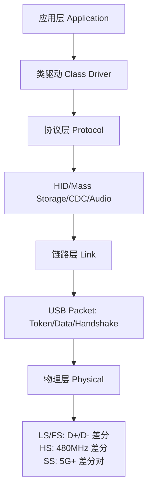
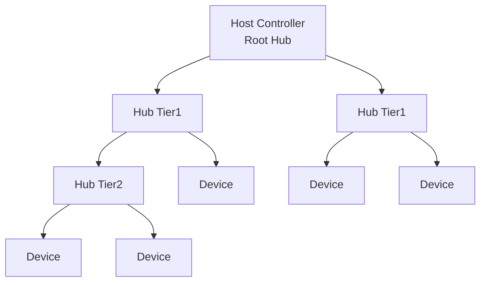

# USB基础认知与分层架构

核心概念 USB（Universal Serial Bus，通用串行总线）是嵌入式和PC领域最通用的外设接口标准，用统一的4线物理层连接键盘、鼠标、U盘、摄像头、串口、网卡等几乎所有外设。

---

## 为什么USB通用

核心概念 在USB出现之前，每种外设都有专属接口：键盘用PS/2、鼠标用RS-232、打印机用并口、摄像头用专有接口。接口碎片化导致主板布满各种端口，驱动开发也是重复的体力活。

USB的设计理念是**万能插座**：
 
无论外设功能多么不同，物理上都是同一个Type-A/B/C插头，
 
协议上都走相同的枚举流程，驱动上都通过统一的描述符识别设备类型。
 
就像墙上的电源插座不关心插的是台灯还是充电器，USB不关心接的是键盘还是硬盘。

---

这种通用性的代价是协议栈的复杂度：
 
USB把"通用"的复杂性转移到协议层，由主机控制器和Hub芯片消化，
 
外设端只需实现最简单的端点响应逻辑。
 
对嵌入式开发者来说，这意味着做USB Device比做USB Host容易得多。

---

## 分层架构：物理层/链路层/协议层/应用层

核心概念 USB协议栈分为四层，每层有明确的职责边界，层间通过标准接口交互，这种分层是USB能兼容如此多设备类型的根本。

---

**物理层**定义电气信号、连接器形状、电缆规格：
 
Full Speed用D+/D-差分对，电平0V和3.3V；
 
High Speed在FS基础上提升边沿速率到480Mbps；
 
Super Speed新增两对差分线（SSTX+/-和SSRX+/-），与FS/HS线独立。

---

**链路层**定义包的格式和传输规则：
 
每个USB传输由Token包、Data包、Handshake包组成三段式握手；
 
CRC校验保证数据完整性，ACK/NAK/STALL握手包控制流；
 
Hub负责包转发和时隙分配，设备只响应发给自己的Token。

---

**协议层**定义设备类型和功能语义：
 
HID（Human Interface Device，人机接口设备）类用于键盘鼠标；
 
Mass Storage类用于U盘和移动硬盘；
 
CDC（Communications Device Class，通信设备类）用于串口和网卡；
 
Audio类用于声卡和麦克风。同类设备共享相同的描述符结构和驱动框架。

---

**应用层**就是操作系统中的类驱动：
 
`usbhid`处理键盘输入事件，`usb-storage`把Mass Storage设备映射为SCSI磁盘，
 
`cdc_acm`创建`/dev/ttyUSB0`串口节点。应用开发者不需要知道底层是USB。

---

## USB速度演进

核心概念 USB从1.0的1.5Mbps到4.0的40Gbps，经历了五代速度跃升，每一代都保持向下兼容，但也带来了更复杂的物理层设计。

| 版本 | 速率 | 编码 | 信号线 | 最大电流 | 发布时间 |
|------|------|------|--------|---------|---------|
| USB 1.0 LS | 1.5 Mbps | NRZI | D+/D- | 100 mA | 1996 |
| USB 1.1 FS | 12 Mbps | NRZI | D+/D- | 500 mA | 1998 |
| USB 2.0 HS | 480 Mbps | NRZI | D+/D- | 500 mA | 2000 |
| USB 3.0 SS | 5 Gbps | 8b/10b | +SSTX/SSRX | 900 mA | 2008 |
| USB 3.1 SS+ | 10 Gbps | 128b/132b | +SSTX/SSRX | 900 mA | 2013 |
| USB 3.2 SS++ | 20 Gbps | 128b/132b | ×2 Lane | 1.5 A | 2017 |
| USB4 Gen3 | 40 Gbps | 128b/132b | ×2 Lane | 1.5 A | 2019 |

---

结论/易错点 USB 3.0的Super Speed线（SSTX/SSRX）与USB 2.0的D+/D-在物理上是独立的线对。
 
这意味着一个USB 3.0 Type-A插头实际上有两套信号系统：
 
如果USB 3.0线对接触不良，设备会默默降级到USB 2.0（480Mbps），
 
用户看到"U盘变慢了"却不知道是物理接触问题。

---

NRZI编码（Non-Return-to-Zero Inverted，非归零翻转）是USB 2.0及以下的线路编码：
 
数据0翻转电平，数据1保持电平。
 
长串的1会导致没有边沿，接收端失去同步，因此需要Bit Stuffing（强制插入翻转）。
 
Super Speed以上改用更高效的8b/10b或128b/132b编码。

---

## Hub拓扑：Tiered Star

核心概念 USB采用分层星型拓扑（Tiered Star），最多支持127个设备和7层Hub级联，Root Hub集成在主机控制器内。

---

每个USB包都从Host发出，经过各级Hub转发到目标设备，
 
设备的响应也经原路Hub回传到Host。
 
Hub内部有上游端口（连接Host或上级Hub）和多个下游端口（连接设备或下级Hub）。

---

Hub的核心职责是时隙管理（微帧分割）和包路由：
 
收到SOF（Start of Frame，帧起始）包后，Hub启动1ms帧定时；
 
收到IN/OUT Token时，Hub根据地址匹配决定是否向下游转发；
 
收到设备响应后，Hub向上游回传。Hub自己也有描述符和端点，参与枚举。

---

## USB Type-A/B/C接口差异

核心概念 USB接口形态经历了Type-A（主机端）、Type-B（设备端）、Mini/Micro（移动设备）、Type-C（统一 reversible）的演进，Type-C是最终形态。

| 接口 | 引脚数 | 可翻转 | 最大功率 | 主要用途 |
|------|--------|--------|---------|---------|
| Type-A | 4 | 否 | 2.5W (5V/500mA) | 主机端口、U盘 |
| Type-B | 4 | 否 | 2.5W | 打印机、外置硬盘 |
| Mini-AB | 5 | 否 | 2.5W | 老式数码相机 |
| Micro-AB | 5 | 否 | 2.5W | 老Android手机 |
| Type-C | 24 | 是 | 100W (20V/5A) | 统一接口、笔记本 |

---

Type-C的24个引脚中只有4对差分信号线用于USB数据传输（TX1+/-, RX1+/-, TX2+/-, RX2+/-），
 
其余引脚用于CC（Configuration Channel，配置通道）检测插入方向、
 
SBU（Sideband Use，边带使用）用于Alternate Mode（DP/HDMI视频输出）、
 
和Vbus/Gnd供电。

---

CC引脚是Type-C的灵魂：
 
插头的CC引脚只有一侧连接，插座两侧都有CC。
 
主机端通过检测哪一侧CC被拉低，判断插头方向，
 
然后内部交换数据线方向，实现"怎么插都对"的reversible体验。
 
对嵌入式开发者来说，这简化了布线，但增加了USB控制器复杂度。

---

扩展 USB4要求Type-C接口，并兼容Thunderbolt 3协议。
 
这意味着一条USB4线缆可以同时传输40Gbps数据、8K视频、100W电力。
 
在嵌入式领域，Type-C + USB4正在取代传统的HDMI + DC电源 + USB数据的多接口设计，
 
使轻薄设备只需一个端口就能连接所有外设和显示器。
