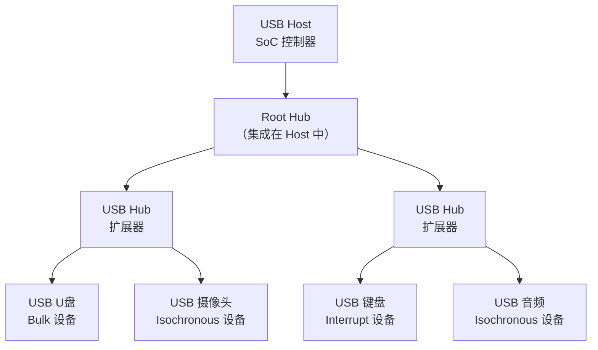
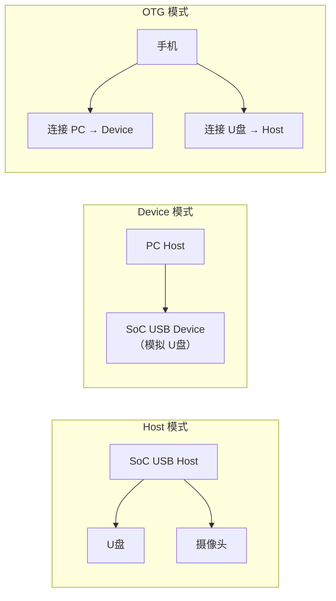

# USB 基础认知与描述符 [I→E]

> **本章学习目标**：
> - 理解 <span class="red">USB（Universal Serial Bus）</span> 的设计哲学与拓扑结构
> - 掌握 <span class="red">描述符（Descriptor）</span> 链与端点（Endpoint）配置
> - 了解 USB 在嵌入式系统中的 Host/Device/OTG 三种模式

---

## USB 的诞生：统一外设接口的革命

---

### <strong>为什么需要 USB：外设接口的"巴别塔"</strong>

<span class="red">USB</span>由 <span class="green">Intel、Microsoft、IBM、Compaq、DEC、NEC、Northern Telecom</span> 七家公司于 <span class="green">1994 年</span>联合提出，
<br>
1996 年发布 USB 1.0（1.5Mbps）。
<br>

在 USB 出现之前，PC 外设接口混乱：
<br>
* <span class="green">串口（RS-232）</span>：鼠标、调制解调器，速率低
<br>
* <span class="green">并口（LPT）</span>：打印机，不支持热插拔
<br>
* <span class="green">PS/2</span>：键盘鼠标，每个设备独占一个接口
<br>
* <span class="green">专用接口</span>：扫描仪、摄像头各用各的
<br>

<span class="blue">USB 的设计目标是"一个接口连接所有外设"：统一连接器、统一协议、支持热插拔、即插即用、可供电。</span>
<br>

<span class="blue">类比：USB 如同"万能插座"——无论你用什么电器（外设），只要插头形状对（USB Type-A/C），就能供电和通信。</span>
<br>

---

### <strong>USB 的拓扑结构：Tiered Star 分层星型</strong>

<span class="red">USB 总线</span>采用分层星型拓扑：
<br>



<span class="blue">USB 拓扑限制：最多 127 个设备、最多 7 层（Tier）、Hub 级联不超过 5 个。根节点是 Root Hub，每个 Hub 扩展 4 个下行端口。</span>
<br>

---

### <strong>USB 描述符链：设备的"身份证"和"能力清单"</strong>

<span class="red">USB 描述符</span>是设备向 Host 汇报自身信息的结构化数据：
<br>

| 描述符类型 | 层级 | 说明 |
| --- | --- | --- |
| Device Descriptor | 顶层 | 设备全局信息（VID/PID、协议版本、端点数） |
| Configuration Descriptor | 配置层 | 设备支持几种工作模式 |
| Interface Descriptor | 接口层 | 每个配置下的功能接口（如音频+视频） |
| Endpoint Descriptor | 端点层 | 每个接口下的数据传输通道 |
| String Descriptor | 字符串 | 厂商名、产品名、序列号（多语言支持） |

```c
// USB Device Descriptor（18 byte）
struct usb_device_descriptor {
    __u8  bLength;           // 18
    __u8  bDescriptorType;   // 0x01
    __le16 bcdUSB;           // USB 版本（如 0x0200 = USB 2.0）
    __u8  bDeviceClass;      // 设备类（0x00=接口指定，0x09=Hub）
    __u8  bDeviceSubClass;
    __u8  bDeviceProtocol;
    __u8  bMaxPacketSize0;   // EP0 最大包长
    __le16 idVendor;         // VID（如 0x0781=SanDisk）
    __le16 idProduct;        // PID（如 0x5567=U盘）
    __le16 bcdDevice;        // 设备版本
    __u8  iManufacturer;     // 厂商字符串索引
    __u8  iProduct;          // 产品字符串索引
    __u8  iSerialNumber;     // 序列号字符串索引
    __u8  bNumConfigurations;// 配置描述符数量
} __attribute__ ((packed));
```

<span class="blue">Host 枚举流程：插入 → 复位 → 获取 Device Descriptor → 分配地址 → 获取 Configuration Descriptor → 选择配置 → 加载驱动。</span>
<br>

---

### <strong>USB 传输类型：四种端点匹配四种场景</strong>

<span class="red">USB 端点</span>支持四种传输类型：
<br>

| 类型 | 特点 | 典型应用 | 带宽保证 |
| --- | --- | --- | --- |
| Control | 双向、可靠 | 枚举、配置 | 10% 带宽保留 |
| Bulk | 大数据量、可靠 | U盘、网卡 | 不保证 |
| Interrupt | 小数据、定时轮询 | 键盘、鼠标 | 保证延迟 |
| Isochronous | 实时、不可靠 | 音频、视频 | 保证带宽 |

<span class="blue">枚举阶段只用 Control 传输（EP0）；U盘用 Bulk 传输大数据；摄像头用 Isochronous 传输实时视频帧。</span>
<br>

---

### <strong>USB 在嵌入式中的三种角色</strong>

| 角色 | 功能 | 典型场景 |
| --- | --- | --- |
| Host | 控制总线，管理设备 | 工控机、PC、平板 |
| Device | 响应 Host 请求 | U盘模式、USB 网卡模式 |
| OTG（On-The-Go） | Host/Device 动态切换 | 手机、便携式设备 |



---

## 本章小结

| 概念 | 一句话总结 |
| --- | --- |
| USB | 1994 年七巨头联合提出的通用串行总线 |
| 描述符链 | Device → Configuration → Interface → Endpoint |
| 枚举 | 插入 → 复位 → 获取描述符 → 分配地址 → 加载驱动 |
| 四种传输 | Control/Bulk/Interrupt/Isochronous |
| OTG | 动态切换 Host/Device 角色 |
| Hub | 扩展 USB 端口，最多 127 设备 |

---

## 练习

1. USB 枚举过程中，Host 如何确定设备的驱动程序？VID/PID 的作用是什么？
2. 为什么 USB 音频用 Isochronous 传输而不用 Bulk？如果音频包丢失会怎样？
3. 在 STM32 USB OTG 控制器上配置 Device 模式，模拟一个 8MB 的 U盘。需要设置哪些描述符？
