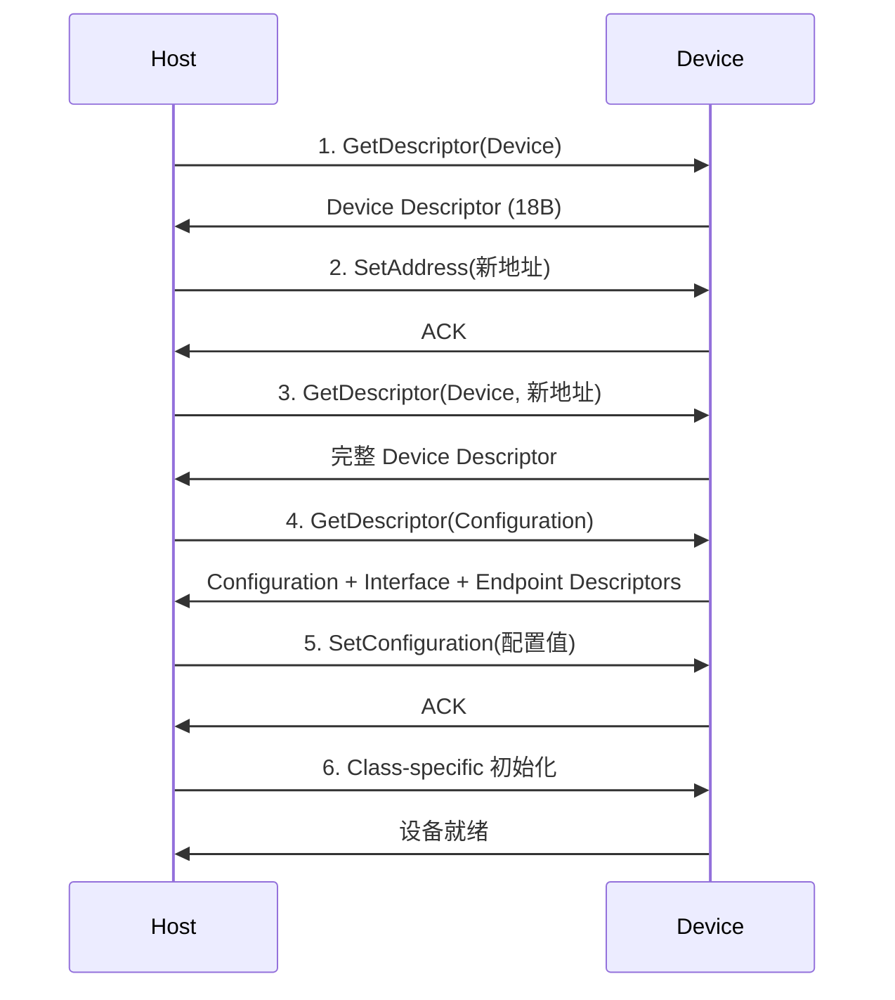
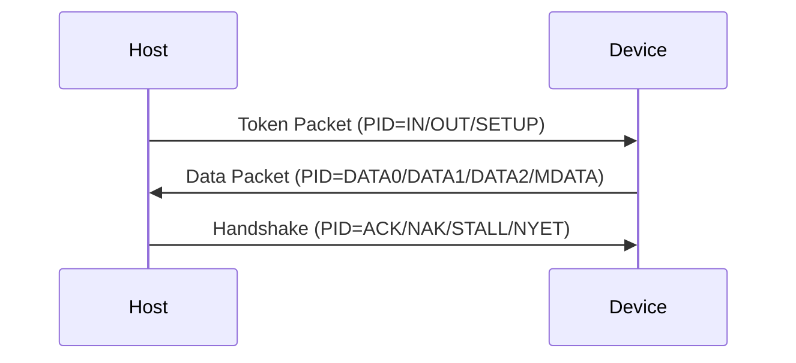

# USB怎么做——端点、描述符与传输类型

<span class="badge-b">[B]</span> <span class="badge-i">[I]</span> <span class="badge-e">[E]</span> <span class="badge-m">[M]</span>

USB 的通信模型围绕端点（Endpoint）和描述符（Descriptor）展开。
本章拆解 4 种端点类型、描述符链结构、枚举流程和包格式，
这是理解任何 USB 驱动源码的基石。

---

## 核心定义与价值

<span class="red">端点（Endpoint）</span> 是 USB 设备中实际收发数据的缓冲区。
每个端点有唯一的地址、方向和传输类型。

<span class="red">描述符（Descriptor）</span> 是设备向 Host 汇报自身能力的"简历"，
Host 通过枚举过程中读取的描述符链，了解设备支持哪些功能。

---

### 类比：公司的部门架构和名片

USB 设备像一家公司：

- <span class="green">Device</span> = 公司整体
- <span class="green">Configuration</span> = 公司的运营模式（可以同时有"国内业务"和"海外业务"两种模式，但同一时间只能运行一种）
- <span class="green">Interface</span> = 部门（销售部、技术部、财务部）
- <span class="green">Endpoint</span> = 部门内的具体岗位（每个岗位负责一种类型的业务）
- <span class="green">描述符链</span> = 公司名片夹（从总公司名片到各部门名片的层级结构）
- <span class="green">枚举</span> = HR 逐一查看名片，建立通讯录（获取地址、分配资源）

---

## 核心机制原理解析

### <strong>1. 端点类型：Control / Bulk / Interrupt / Isochronous</strong>

<br>

| 类型 | 方向 | 带宽保证 | 典型应用 | 错误重传 |
|------|------|---------|---------|---------|
| Control | 双向 | 无（突发） | 枚举、命令、状态查询 | 有 |
| Bulk | 双向 | 无（尽力而为） | U 盘、网卡、打印机 | 有 |
| Interrupt | IN 单向 | 保证延迟（≤规定间隔） | 鼠标、键盘、传感器 | 有 |
| Isochronous | 单向 | 保证带宽 | 摄像头、音频、麦克风 | 无 |

<br>

**端点地址编码：**

```
[7]   Direction: 0=OUT (Host→Device), 1=IN (Device→Host)
[3:0] Endpoint Number: 0-15
```

<br>

- Endpoint 0 是强制性的 <span class="green">Control Endpoint</span>，用于枚举和所有标准请求
- 一个 Interface 最多可以有 15 个非零端点（受控制器 FIFO 限制）
- 全速设备最多 16 个 IN + 16 个 OUT；高速设备最多 16 IN + 16 OUT

---

### <strong>2. 描述符链：Device → Configuration → Interface → Endpoint</strong>

<br>

```mermaid
graph TD
    A[Device Descriptor] -- 1 个 --
    B[Configuration Descriptor 1]
    A -- N 个 --
    C[Configuration Descriptor N]
    B -- 1+ 个 --
    D[Interface Descriptor 0]
    B -- 1+ 个 --
    E[Interface Descriptor M]
    D -- 0+ 个 --
    F[Endpoint Descriptor 0]
    D -- 0+ 个 --
    G[Endpoint Descriptor K]
    D -- 可选 --
    H[Class-Specific Descriptor]
```

<br>

**Device Descriptor（18 byte）：**

| 偏移 | 字段 | 大小 | 说明 |
|------|------|------|------|
| 0 | bLength | 1 | 18 |
| 1 | bDescriptorType | 1 | 0x01 = Device |
| 2 | bcdUSB | 2 | USB 版本，如 0x0200 = USB 2.0 |
| 4 | bDeviceClass | 1 | 设备类别（0=在 Interface 中定义） |
| 5 | bDeviceSubClass | 1 | 子类别 |
| 6 | bDeviceProtocol | 1 | 协议 |
| 7 | bMaxPacketSize0 | 1 | EP0 最大包大小（8/16/32/64） |
| 8 | idVendor | 2 | 厂商 ID |
| 10 | idProduct | 2 | 产品 ID |
| 12 | bcdDevice | 2 | 设备版本 |
| 14 | iManufacturer | 1 | 厂商字符串索引 |
| 15 | iProduct | 1 | 产品字符串索引 |
| 16 | iSerialNumber | 1 | 序列号字符串索引 |
| 17 | bNumConfigurations | 1 | 配置描述符数量 |

<br>

**Configuration Descriptor（9 byte + 子描述符）：**

| 偏移 | 字段 | 大小 | 说明 |
|------|------|------|------|
| 0 | bLength | 1 | 9 |
| 1 | bDescriptorType | 1 | 0x02 = Configuration |
| 2 | wTotalLength | 2 | 该配置下所有描述符总长度 |
| 4 | bNumInterfaces | 1 | 接口数量 |
| 5 | bConfigurationValue | 1 | 配置 ID（SetConfiguration 参数） |
| 6 | iConfiguration | 1 | 配置字符串索引 |
| 7 | bmAttributes | 1 | [7]=Bus Powered, [6]=Self Powered, [5]=Remote Wakeup |
| 8 | bMaxPower | 1 | 最大功耗（单位 2mA，如 50=100mA） |

<br>

**Interface Descriptor（9 byte）：**

| 偏移 | 字段 | 说明 |
|------|------|------|
| 0 | bLength | 9 |
| 1 | bDescriptorType | 0x04 = Interface |
| 2 | bInterfaceNumber | 接口编号（0 起） |
| 3 | bAlternateSetting | 备用设置编号 |
| 4 | bNumEndpoints | 该接口的端点数（不含 EP0） |
| 5 | bInterfaceClass | 接口类别（如 0x08=Mass Storage, 0x02=CDC） |
| 6 | bInterfaceSubClass | 子类别 |
| 7 | bInterfaceProtocol | 协议 |
| 8 | iInterface | 接口字符串索引 |

<br>

**Endpoint Descriptor（7 byte）：**

| 偏移 | 字段 | 说明 |
|------|------|------|
| 0 | bLength | 7 |
| 1 | bDescriptorType | 0x05 = Endpoint |
| 2 | bEndpointAddress | [7]=Dir, [3:0]=EP Num |
| 3 | bmAttributes | [1:0]=Transfer Type（00=Control, 01=Isoch, 10=Bulk, 11=Interrupt） |
| 4 | wMaxPacketSize | 最大包大小 |
| 6 | bInterval | 轮询间隔（Interrupt/Isoch 用） |

<br>
<span class="blue">描述符链的读取顺序是严格的：Host 先读 Device Descriptor（18 byte），
从中获取 bNumConfigurations，然后对每个 Configuration 发送 GetDescriptor，
Configuration Descriptor 的 wTotalLength 字段告诉 Host 需要读取多少字节才能获得该配置下的全部描述符。</span>

---

### <strong>3. 枚举流程：从插入到可用的 6 步</strong>

<br>



<br>

| 步骤 | 请求 | 方向 | 目的 |
|------|------|------|------|
| 1 | GetDescriptor(Device) | D→H | 获取 Device Descriptor，特别是 bMaxPacketSize0 |
| 2 | SetAddress | H→D | 分配 1-127 的地址，之后 Device 用此地址响应 |
| 3 | GetDescriptor(Device) | D→H | 用新地址重新获取完整描述符 |
| 4 | GetDescriptor(Configuration) | D→H | 获取 Configuration + Interface + Endpoint 链 |
| 5 | SetConfiguration | H→D | 激活选中的配置 |
| 6 | Class Init | H→D | 如 Mass Storage 的 GetMaxLUN、CDC 的 SetLineCoding |

<br>
<span class="blue">步骤 1 和 3 重复获取 Device Descriptor 的原因：
第一次获取时设备仍使用默认地址 0，且不知道 EP0 的包大小；
第二次获取时地址已分配，Host 可以请求更大的数据包。</span>

---

### <strong>4. USB 包格式：Token + Data + Handshake 三段式</strong>

<br>

USB 事务（Transaction）由三个阶段组成：



<br>

**PID（Packet Identifier）类型：**

| PID 组 | PID 值 | 名称 | 用途 |
|--------|--------|------|------|
| Token | 0x01 | OUT | Host 向 Device 发送数据 |
| Token | 0x09 | IN | Host 从 Device 请求数据 |
| Token | 0x0D | SETUP | 控制传输的设置阶段 |
| Token | 0x05 | SOF | Start of Frame |
| Data | 0x03 | DATA0 | 偶数数据包 |
| Data | 0x0B | DATA1 | 奇数数据包 |
| Data | 0x07 | DATA2 | 高速 Isochronous |
| Data | 0x0F | MDATA | 高速 Split |
| Handshake | 0x02 | ACK | 接收成功 |
| Handshake | 0x0A | NAK | 暂时无法接收 |
| Handshake | 0x0E | STALL | 端点停止/错误 |
| Handshake | 0x06 | NYET | 尚未准备好（高速） |
| Special | 0x0C | PRE | 低速前导 |

<br>

**完整包结构（以 OUT Token 为例）：**

```
Sync (8 bit) + PID (8 bit) + ADDR (7 bit) + ENDP (4 bit) + CRC5 (5 bit) + EOP
```

<br>

**Data Packet 结构：**

```
Sync (8) + PID (8) + DATA (0-1024 byte) + CRC16 (16) + EOP
```

<br>
<span class="blue">DATA0/DATA1 的切换机制是 USB 的错误恢复核心：
发送方发送 DATA0，接收方 ACK 后，发送方切换到 DATA1；
如果发送方没收到 ACK（线路错误），它会重发相同 PID 的数据包；
接收方通过 PID 判断是重传（相同 PID=重传，不同 PID=新包）。</span>

---

## 技术教学与实战

### Linux USB 设备树绑定与 Gadget 框架

```c
/* USB Mass Storage Gadget 配置 */
static struct usb_function_instance *fi_mss;
static struct usb_function *f_mss;

fi_mss = usb_get_function_instance("mass_storage");
if (IS_ERR(fi_mss))
    return PTR_ERR(fi_mss);

f_mss = usb_get_function(fi_mss);
if (IS_ERR(f_mss)) {
    usb_put_function_instance(fi_mss);
    return PTR_ERR(f_mss);
}

/* 配置 LUN */
struct fsg_opts *mss_opts;
mss_opts = container_of(fi_mss, struct fsg_opts, func_inst);
mss_opts->common->luns[0].removable = 1;
mss_opts->common->luns[0].inquiry_string = "Linux Gadget";

/* 绑定到配置 */
usb_add_function(c, f_mss);
```

<br>
Gadget 配置通过 configfs 动态管理：

```bash
# 挂载 configfs
mount -t configfs none /sys/kernel/config

# 创建 Gadget
cd /sys/kernel/config/usb_gadget
g1
echo 0x1d6b > idVendor   # Linux Foundation
echo 0x0104 > idProduct  # Multifunction Composite Gadget
echo 0x0100 > bcdDevice
echo 0x0200 > bcdUSB

# 创建字符串
echo "1234567890" > strings/0x409/serialnumber
echo "MyCompany" > strings/0x409/manufacturer
echo "MyGadget" > strings/0x409/product

# 创建配置
mkdir configs/c.1
echo 120 > configs/c.1/MaxPower

# 绑定 Mass Storage Function
mkdir functions/mass_storage.0
echo /dev/mmcblk0 > functions/mass_storage.0/lun.0/file
ln -s functions/mass_storage.0 configs/c.1/

# 绑定 UDC
echo "musb-hdrc" > UDC
```

---

## 嵌入式专属实战场景

### 场景：通过 lsusb 解析 USB 摄像头描述符

```bash
lsusb -v -d 046d:0825

Bus 001 Device 003: ID 046d:0825 Logitech, Inc. Webcam C270
Device Descriptor:
  bLength                18
  bDescriptorType         1
  bcdUSB               2.00
  bDeviceClass          239 Miscellaneous Device
  bDeviceSubClass         2
  bDeviceProtocol         1 Interface Association
  bMaxPacketSize0        64
  idVendor           0x046d Logitech, Inc.
  idProduct          0x0825 Webcam C270
  bcdDevice            0.12
  iManufacturer           1 Logitech
  iProduct                2 Webcam C270
  bNumConfigurations      1
  Configuration Descriptor:
    bLength                 9
    bDescriptorType         2
    wTotalLength          317
    bNumInterfaces          2
    bConfigurationValue     1
    Interface Association:
      bLength                 8
      bDescriptorType        11
      bFirstInterface         0
      bInterfaceCount         2
      bFunctionClass         14 Video
      bFunctionSubClass       3 Video Interface Collection
    Interface Descriptor:
      bLength                 9
      bDescriptorType         4
      bInterfaceNumber        0
      bAlternateSetting       0
      bNumEndpoints           1
      bInterfaceClass        14 Video
      bInterfaceSubClass      1 Video Control
      Endpoint Descriptor:
        bLength                 7
        bDescriptorType         5
        bEndpointAddress     0x81  EP 1 IN
        bmAttributes            3
          Transfer Type            Interrupt
          Synch Type               None
          Usage Type               Data
        wMaxPacketSize     0x0010  1x 16 bytes
        bInterval               8
    Interface Descriptor:
      bLength                 9
      bDescriptorType         4
      bInterfaceNumber        1
      bAlternateSetting       0
      bNumEndpoints           0
      bInterfaceClass        14 Video
      bInterfaceSubClass      2 Video Streaming
      Endpoint Descriptor:
        bLength                 7
        bDescriptorType         5
        bEndpointAddress     0x82  EP 2 IN
        bmAttributes            5
          Transfer Type            Isochronous
          Synch Type               Asynchronous
          Usage Type               Data
        wMaxPacketSize     0x00c0  1x 192 bytes
        bInterval               1
```

<br>

解读：

| 字段 | 值 | 含义 |
|------|-----|------|
| IAD | Class=14, SubClass=3 | UVC（USB Video Class）视频接口集合 |
| Interface 0 | Video Control | 控制接口，1 个 Interrupt IN 端点（EP1） |
| Interface 1 | Video Streaming | 数据接口，1 个 Isochronous IN 端点（EP2） |
| EP1 | Interrupt, 16B, 间隔 8ms | 状态查询（亮度、对比度等控制） |
| EP2 | Isochronous, 192B, 间隔 1ms | 视频数据传输 |

---

## 历史演进与前沿

### USB 类规范的演进

| 类代码 | 名称 | 典型设备 | 驱动 |
|--------|------|---------|------|
| 0x01 | Audio | 声卡、耳机 | snd-usb-audio |
| 0x02 | CDC-Control | 调制解调器 | cdc-acm |
| 0x03 | HID | 键盘、鼠标、手柄 | usbhid |
| 0x05 | Physical | 力反馈设备 | — |
| 0x06 | Image | 扫描仪、相机 | usblp / gphoto2 |
| 0x08 | Mass Storage | U 盘、移动硬盘 | usb-storage |
| 0x09 | Hub | USB Hub | hub |
| 0x0A | CDC-Data | 网卡 | cdc-ether |
| 0x0B | Smart Card | 读卡器 | — |
| 0x0E | Video | 摄像头 | uvcvideo |
| 0x0F | Personal Healthcare | 血糖仪、血压计 | — |
| 0xDC | Diagnostic | OBD、调试器 | — |
| 0xE0 | Wireless | Bluetooth | btusb |
| 0xEF | Miscellaneous | RNDIS、NCM | usbnet |

---

## 本章小结

| 主题 | 关键要点 |
|------|---------|
| 端点类型 | Control（枚举）、Bulk（U 盘）、Interrupt（HID）、Isoch（音视频） |
| 描述符链 | Device(18B) → Configuration(9B+wTotalLength) → Interface(9B) → Endpoint(7B) |
| 枚举 | GetDescriptor(Device)→SetAddress→GetDescriptor(Config)→SetConfiguration→Class Init |
| 包格式 | Sync + PID + Payload + CRC + EOP；Token→Data→Handshake |
| PID | DATA0/DATA1 切换用于错误恢复；ACK/NAK/STALL 握手 |
| Gadget | configfs 动态配置，function 绑定到 config，UDC 使能 |

---

## 练习

1. 为什么 USB 的 Configuration 描述符中有 bNumInterfaces，而 Interface 描述符中没有 bNumConfigurations？
   这种不对称设计反映了什么使用场景？
2. 一个 USB 设备有 2 个 Configuration，每个 Configuration 有 3 个 Interface。
   Host 在枚举时需要发送多少次 GetDescriptor 请求？分别请求什么？
3. DATA0/DATA1 切换机制如何检测丢包？如果发送方连续两次发送 DATA0，接收方如何判断哪一个是重传？
4. 某 USB 摄像头使用 Isochronous 端点传输视频。如果该端点的 wMaxPacketSize=3072 byte，bInterval=1，
   在 High Speed 模式下，该端点的最大理论带宽是多少？
5. Linux Gadget 框架中，configfs 和传统静态编译的 Gadget 驱动（如 g_mass_storage）相比，
   有什么优势和劣势？在什么场景下必须使用 configfs？
