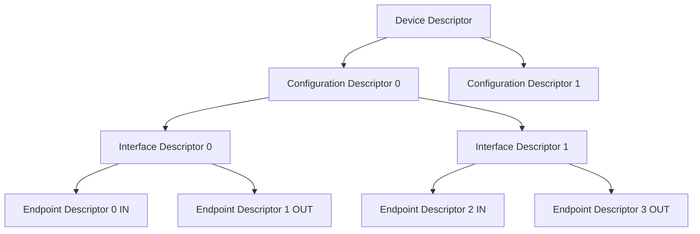

# USB端点与描述符

<span class="red">核心概念</span> USB 设备的功能抽象为端点（Endpoint），端点的属性（方向、类型、带宽）通过描述符（Descriptor）链声明给主机。驱动在枚举阶段读取描述符，建立设备能力视图。

---

## 端点类型：Control/Bulk/Interrupt/Isochronous

<span class="red">核心概念</span> USB 定义了四种端点类型，分别对应不同的传输语义和带宽保证，没有哪种类型的端点能在所有场景下通吃。

| 类型 | 方向 | 带宽保证 | 错误重传 | 典型应用 |
|------|------|---------|---------|---------|
| Control | 双向 | 10% 帧带宽 | 是 | 枚举、配置、类请求 |
| Bulk | 双向 | 无（余量时隙） | 是 | U盘、网卡、打印机 |
| Interrupt | IN 为主 | 每帧 1-N 次轮询 | 是 | 键盘、鼠标、HID |
| Isochronous | 双向 | 固定带宽预留 | 否 | 音频、视频流 |

---

Control 端点是每个设备必须实现的默认端点（Endpoint 0），
用于枚举阶段的设备发现和配置。
<br>
它用双向传输完成 Setup-Data-Status 三段式握手，
每个 USB 帧（1ms/125μs）预留 10% 带宽给 Control 传输。

---

Bulk 端点没有带宽承诺，利用帧中剩余时隙传输。
<br>
它是"尽力而为"的，但保证数据正确（CRC+重传），
适合对延迟不敏感、对吞吐量要求高的场景。
U盘的读写走 Bulk，网卡的以太网帧也走 Bulk。

---

Interrupt 端点名字有误导性：它不会主动中断主机，
而是主机按固定周期轮询设备是否有数据。
<br>
键盘每 1-8ms 被主机问一次"有按键吗"，有就返回按键码，没有就回 NAK。
<br>
这种轮询机制决定了 Interrupt 的最低延迟就是轮询间隔。

---

Isochronous 端点为实时音视频设计，预留固定带宽，
不保证数据正确（无重传），但保证时序。
<br>
丢一帧音频数据比延迟一帧更不可接受，
因此 Isochronous 宁可丢包也不重传。
<br>
USB 音频设备和摄像头视频流都走 Isochronous。

---

## 描述符链：Device到Endpoint

<span class="red">核心概念</span> USB 设备通过层级描述符链向主机声明自身结构，从 Device 到 Configuration 到 Interface 到 Endpoint，每层描述符包含下一层的位置和数量信息。



---

**Device Descriptor**（18 byte）：
<br>
bDescriptorType=0x01，包含 Vendor ID、Product ID、设备类、协议版本、
最大包大小（Endpoint 0 的 MPS）。
<br>
一个设备只有一个 Device Descriptor。

---

**Configuration Descriptor**（9 byte + 后续接口/端点）：
<br>
bDescriptorType=0x02，包含该配置下的总功耗、远程唤醒能力、接口数量。
<br>
一个设备可以有多个 Configuration（如自供电/总线供电两种模式），
但同一时间只能激活一个。

---

**Interface Descriptor**（9 byte）：
<br>
bDescriptorType=0x04，包含接口编号、备用设置（Alternate Setting）、
端点数量、类/子类/协议代码。
<br>
一个 Interface 代表一个功能单元，如音频设备可能有
Audio Control Interface + Audio Streaming Interface。

---

**Endpoint Descriptor**（7 byte）：
<br>
bDescriptorType=0x05，包含端点地址（方向+编号）、端点类型、
最大包大小（MaxPacketSize）、轮询间隔（bInterval）。
<br>
Endpoint 0 没有独立的 Endpoint Descriptor，其属性固定写在 Device Descriptor 中。

---

## 标准设备请求：GET_DESCRIPTOR/SET_ADDRESS/SET_CONFIGURATION

<span class="red">核心概念</span> USB 枚举依赖标准请求完成设备发现和配置，这些请求都是控制传输，通过 Setup 包发送 8-byte 请求头。

Setup 包结构（8 byte）：

| 字段 | 偏移 | 长度 | 说明 |
|------|------|------|------|
| bmRequestType | 0 | 1 | 方向+类型+接收者 |
| bRequest | 1 | 1 | 请求码 |
| wValue | 2 | 2 | 参数，如描述符类型+索引 |
| wIndex | 4 | 2 | 参数，如接口号/端点号 |
| wLength | 6 | 2 | 数据阶段长度 |

---

GET_DESCRIPTOR 的 bRequest=0x06，wValue 高 8 位是描述符类型（1=Device, 2=Configuration），
低 8 位是索引。
<br>
主机在枚举第一阶段发 GET_DESCRIPTOR 读 Device Descriptor，
获取 VID/PID 和 Endpoint 0 MPS。

---

SET_ADDRESS 的 bRequest=0x05，wValue 是新分配的 7-bit 地址（1-127）。
<br>
设备收到后进入 Addressed 状态，此后主机用新地址访问设备。
<br>
地址 0 是枚举前的默认地址，只能有一个设备同时用地址 0。

---

SET_CONFIGURATION 的 bRequest=0x09，wValue 是 Configuration Value。
<br>
设备进入 Configured 状态，端点被激活，类驱动开始加载。
<br>
这是枚举的最后一步，之前设备的所有功能端点都处于未使能状态。

---

## USB枚举流程

<span class="red">核心概念</span> USB 枚举是主机发现新设备、分配资源、加载驱动的标准流程，所有 USB 设备都必须遵循这一流程。

```mermaid
stateDiagram-v2
    [*] --> Powered: 插入/Vbus有效
    Powered --> Default: 总线复位
    Default --> Address: SET_ADDRESS
    Address --> Configured: SET_CONFIGURATION
    Configured --> Suspended: 3ms 无活动
    Suspended --> Configured: Resume 信号
    Configured --> [*]: 断开
```

---

枚举的完整时序：
<br>
1. 设备插入，主机检测到 Vbus 和 D+/D- 上拉，触发连接事件；
<br>
2. 主机发总线复位（SE0 持续 10ms+），设备进入 Default 状态；
<br>
3. 主机用地址 0 发 GET_DESCRIPTOR 读 Device Descriptor；
<br>
4. 主机发 SET_ADDRESS 分配唯一地址（1-127）；
<br>
5. 主机用新地址发 GET_DESCRIPTOR 读 Configuration Descriptor；
<br>
6. 主机发 SET_CONFIGURATION 激活配置；
<br>
7. 如果需要，发类特定请求初始化功能（如 SET_LINE_CODING 配置波特率）；
<br>
8. 枚举完成，功能端点可用。

---

<span class="blue">结论/易错点</span> 如果设备在 GET_DESCRIPTOR 阶段返回的长度小于主机请求的长度，
主机可能认为设备异常而停止枚举。
<br>
正确的做法是返回实际描述符长度，即使小于 wLength。
<br>
很多裸机 USB Device 栈的 bug 就出在这里：直接把 wLength 作为返回长度，
导致缓冲区溢出或描述符截断。

---

## 代码：libusb读取设备描述符

<span class="red">核心概念</span> libusb 是跨平台的用户态 USB 访问库，不依赖内核驱动，可以直接打开设备、发送控制传输、读写端点。

```c
#include <libusb.h>

int main(void)
{
    libusb_context *ctx = NULL;
    libusb_device **devs;
    libusb_device_handle *handle;
    struct libusb_device_descriptor desc;
    ssize_t cnt;
    int r;

    r = libusb_init(&ctx);
    if (r < 0)
        return r;

    /* 列出所有设备 */
    cnt = libusb_get_device_list(ctx, &devs);
    if (cnt < 0)
        goto out;

    for (ssize_t i = 0; i < cnt; i++) {
        r = libusb_get_device_descriptor(devs[i], &desc);
        if (r < 0)
            continue;

        printf("Device %zd: VID=0x%04x PID=0x%04x\n",
               i, desc.idVendor, desc.idProduct);
        printf("  Class=%d SubClass=%d Protocol=%d\n",
               desc.bDeviceClass,
               desc.bDeviceSubClass,
               desc.bDeviceProtocol);
        printf("  MaxPacketSize0=%d Configurations=%d\n",
               desc.bMaxPacketSize0,
               desc.bNumConfigurations);

        /* 打开设备读字符串描述符 */
        r = libusb_open(devs[i], &handle);
        if (r == 0) {
            unsigned char str[256];
            if (desc.iProduct) {
                r = libusb_get_string_descriptor_ascii(
                        handle, desc.iProduct, str, sizeof(str));
                if (r > 0)
                    printf("  Product: %s\n", str);
            }
            libusb_close(handle);
        }
    }

    libusb_free_device_list(devs, 1);
out:
    libusb_exit(ctx);
    return 0;
}
```

---

编译运行：
<br>
`gcc -o usb_enum usb_enum.c $(pkg-config --cflags --libs libusb-1.0)`
<br>
需要 root 权限或 udev 规则授权才能访问设备。

---

<span class="purple">扩展</span> libusb 的异步 API（libusb_submit_transfer / libusb_handle_events）
适合高并发场景，如同时读写多个 Bulk 端点。
<br>
同步 API（libusb_bulk_transfer / libusb_interrupt_transfer）适合简单脚本工具。
<br>
在嵌入式 Linux 上，libusb 依赖内核的 usbfs（/dev/bus/usb/BBB/DDD），
确保内核启用了 CONFIG_USB_DEVICEFS。
