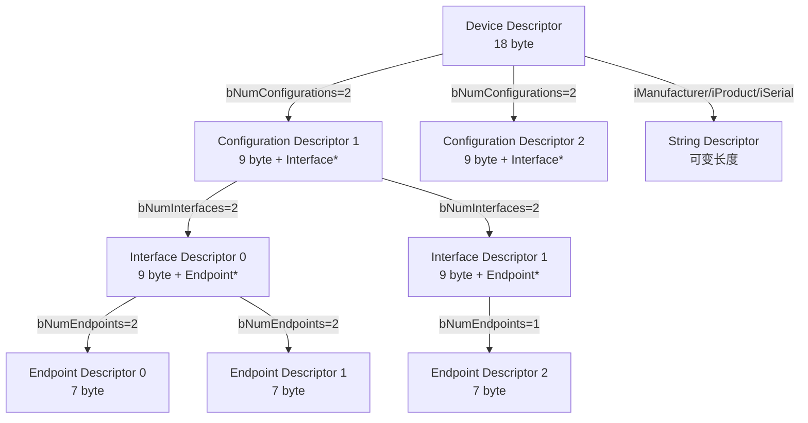
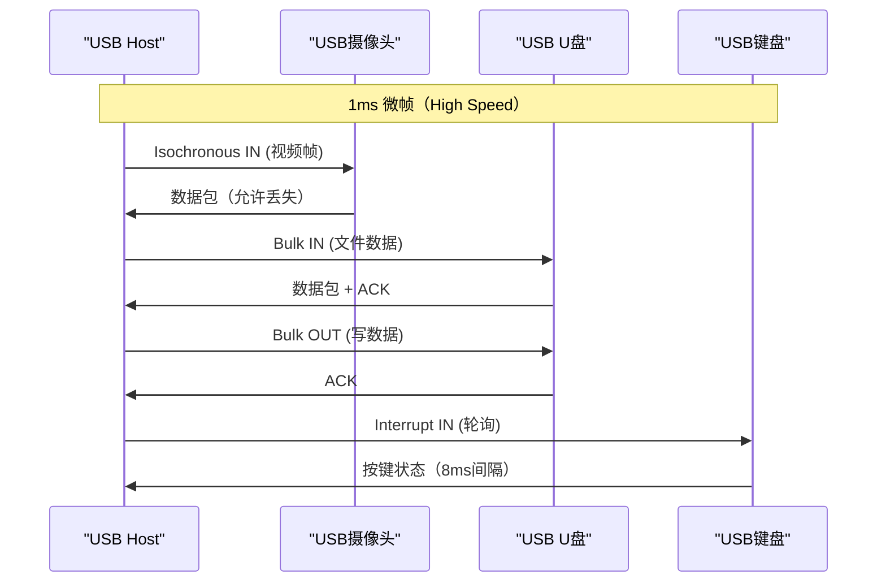
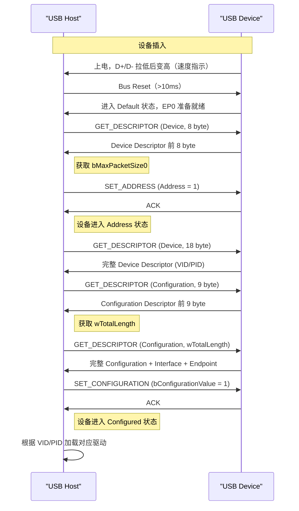

# USB 端点配置与描述符链 [I]

> **本章学习目标**：
> - 理解 <span class="red">USB 描述符链</span> 的层级关系（Device → Configuration → Interface → Endpoint）
> - 掌握 <span class="red">端点（Endpoint）</span> 的四种传输类型与带宽分配
> - 了解 USB 枚举过程的完整时序与 Linux 内核处理

---

## USB 描述符链：设备的自我说明

---

### <strong>为什么需要描述符：即插即用的基础</strong>

<span class="red">USB 描述符</span>是设备向 Host 汇报自身信息的结构化数据。

在 USB 出现之前，设备驱动需要手动配置：
<br>
* 串口设备：手动设置波特率/数据位/停止位
<br>
* 并口设备：手动设置 IO 地址/中断号
<br>
* 每个新设备都需要专门的手动配置
<br>

<span class="blue">USB 通过标准化的描述符链，让操作系统自动识别设备类型、加载对应驱动，实现真正的即插即用。</span>
<br>

<span class="blue">类比：USB 描述符如同"个人简历"——设备一连接就递上简历（描述符），操作系统根据简历内容（VID/PID/类/子类/协议）匹配合适的岗位（驱动程序）。</span>
<br>

---

### <strong>描述符层级：俄罗斯套娃结构</strong>

<span class="red">USB 描述符</span>采用层级嵌套结构：



| 描述符 | 大小 | 关键字段 | 作用 |
| --- | --- | --- | --- |
| Device | 18 byte | VID/PID/bcdUSB/bMaxPacketSize0 | 设备全局信息 |
| Configuration | 9 byte + n | bNumInterfaces/bConfigurationValue | 一种工作模式 |
| Interface | 9 byte + n | bInterfaceClass/bInterfaceSubClass | 一个功能（如音频+控制） |
| Endpoint | 7 byte | bEndpointAddress/bmAttributes/wMaxPacketSize | 一个数据传输通道 |
| String | 可变 | bString（Unicode） | 厂商名、产品名 |

---

## USB 端点：四种传输类型详解

---

### <strong>Control 端点：EP0 的特权地位</strong>

<span class="red">EP0（Endpoint 0）</span>是每个 USB 设备必须支持的 Control 端点：
<br>
* 双向（IN/OUT），用于枚举和配置
<br>
* 最大包长：低速 8 byte，全速 8/16/32/64 byte，高速 64 byte
<br>
* 带宽保留：总线带宽的 10% 预留给 Control 传输
<br>

```text
EP0 控制传输的 3 个阶段：

Setup Stage:  8-byte Setup Packet
              [bmRequestType] [bRequest] [wValue] [wIndex] [wLength]
                 1 byte         1 byte    2 byte   2 byte   2 byte

Data Stage:   可选，Data IN 或 Data OUT
              最大 wLength 字节

Status Stage:  零长度包（ZLP）表示完成
              IN → OUT 或 OUT → IN
```

<span class="blue">Setup Packet 是 USB 控制传输的核心，定义了标准请求（GET_DESCRIPTOR、SET_ADDRESS、SET_CONFIGURATION 等）。</span>
<br>

---

### <strong>Bulk/Interrupt/Isochronous：三种数据端点</strong>

| 类型 | 方向 | 包大小 | 带宽保证 | 错误处理 | 典型应用 |
| --- | --- | --- | --- | --- | --- |
| Bulk | 双向 | 8~512 byte | 不保证 | 重传 | U盘、网卡 |
| Interrupt | IN/OUT | 1~64 byte | 保证延迟 | 重传 | 键盘、鼠标 |
| Isochronous | IN/OUT | 0~1024 byte | 保证带宽 | 不重传 | 音频、视频 |



<span class="blue">Isochronous 的关键设计：允许丢包但不重传。因为音频/视频的实时性要求高于可靠性，重传会引入不可接受的延迟。</span>
<br>

---

## USB 枚举过程：从插入到就绪

---

### <strong>枚举时序：8 步标准流程</strong>

<span class="red">USB 枚举</span>是 Host 识别设备的标准流程：



| 步骤 | 请求 | 目的 |
| --- | --- | --- |
| 1 | Bus Reset | 设备复位，进入 Default 状态 |
| 2 | GET_DESCRIPTOR (Device, 8) | 获取 bMaxPacketSize0 |
| 3 | SET_ADDRESS | 分配唯一地址 |
| 4 | GET_DESCRIPTOR (Device, 18) | 获取完整 Device Descriptor |
| 5 | GET_DESCRIPTOR (Config, 9) | 获取 Configuration 大小 |
| 6 | GET_DESCRIPTOR (Config, 全) | 获取完整描述符链 |
| 7 | SET_CONFIGURATION | 激活配置 |
| 8 | 加载驱动 | 操作系统匹配驱动 |

---

## 本章小结

| 概念 | 一句话总结 |
| --- | --- |
| 描述符链 | Device → Configuration → Interface → Endpoint，嵌套结构 |
| EP0 | Control 端点，枚举和配置专用，双向 |
| Bulk | 大数据量，可靠传输，不保证带宽 |
| Interrupt | 小数据量，定时轮询，保证延迟 |
| Isochronous | 实时传输，保证带宽，允许丢包 |
| 枚举 | Reset → GET_DESCRIPTOR → SET_ADDRESS → SET_CONFIGURATION |

---

## 练习

1. 为什么 USB 枚举时先获取 8 byte Device Descriptor，而不是一次性获取 18 byte？
2. 一个 USB 复合设备（U盘 + 串口）需要几个 Interface Descriptor？画出描述符层级。
3. Isochronous 传输允许丢包但不重传，如何在应用层处理音频丢包？
