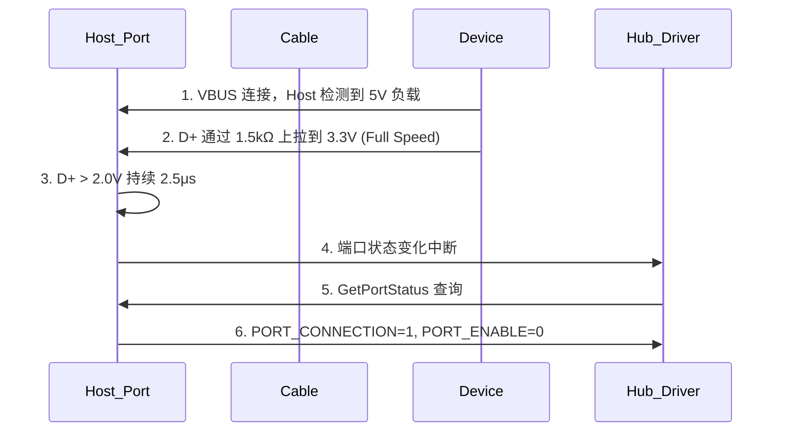

# USB为什么能热插拔——总线枚举与电源管理

<span class="badge-b">[B]</span> <span class="badge-i">[I]</span> <span class="badge-e">[E]</span> <span class="badge-m">[M]</span>

USB 的"即插即用"不是魔法，而是精确的电气检测、枚举流程和电源管理协议。
本章拆解热插拔检测机制、Suspend/Resume、USB PD 供电，
并与 PCIe 热插拔做对比，建立轻量级热插拔的认知模型。

---

## 核心定义与价值

<span class="red">USB 热插拔</span> 的核心是：Host 能在设备插入或拔出时自动检测、
分配资源、加载驱动，并在拔出时安全释放资源。

**USB 热插拔的三层机制：**

- <span class="green">电气检测层</span>：VBUS 检测 + D+/D- 上拉电阻变化
- <span class="green">枚举响应层</span>：Hub 状态变化通知 → Hub 驱动查询端口状态 → 核心层分配地址
- <span class="green">电源管理层</span>：Suspend/Resume/Remote Wakeup + USB PD 动态供电

---

### 类比：酒店自动入住系统

USB 热插拔像无人酒店的自动入住：

- <span class="green">检测插入</span> = 客人走到前台，摄像头识别到人脸（VBUS 电压变化）
- <span class="green">速度识别</span> = 系统判断客人是 VIP 还是普通会员（D+ 或 D- 上拉）
- <span class="green">枚举</span> = 分配房号、绑定身份证（SetAddress + GetDescriptor）
- <span class="green">激活配置</span> = 发房卡、开权限（SetConfiguration）
- <span class="green">使用</span> = 正常入住（数据传输）
- <span class="green">Suspend</span> = 客人出门，房间进入节能模式（总线空闲 3ms 自动挂起）
- <span class="green">Resume/Remote Wakeup</span> = 客人回来刷卡，或房间有异常自动呼叫前台
- <span class="green">检测拔出</span> = 客人退房，摄像头检测到人走了（VBUS 跌落 + SE0 检测）

---

## 核心机制原理解析

### <strong>1. 热插拔检测：VBUS + 数据线上拉的电气机制</strong>

<br>

USB 设备插入的电气检测流程：



<br>

**速度识别机制：**

| 设备速度 | D+ 上拉 | D- 上拉 | 检测方式 |
|---------|---------|---------|---------|
| Low Speed | — | 1.5kΩ 上拉 | D- > 2V |
| Full Speed | 1.5kΩ 上拉 | — | D+ > 2V |
| High Speed | 1.5kΩ 上拉（初始） | — | D+ > 2V → Chirp K/J 握手确认 |

<br>

**High Speed 检测的特殊握手：**

1. 设备插入后，D+ 上拉使 Host 检测到 Full Speed 设备
2. Host 发送 SE0（D+ 和 D- 同时拉低）持续 10ms 进行复位
3. 复位期间，设备在 D- 上发送 Chirp K（持续 1-7ms）
4. Host 检测到 Chirp K 后，交替发送 Chirp K 和 Chirp J
5. 设备确认 Host 支持 High Speed，断开 D+ 上拉，切换到 HS 模式

<br>
<span class="blue">没有 Chirp K/J 握手 → 设备以 Full Speed 运行；握手成功 → 设备以 High Speed 运行。
这就是为什么 USB 2.0 Hub 可以兼容 USB 1.1 设备：Hub 在端口层面进行速度隔离。</span>

---

### <strong>2. 电源管理：Suspend / Resume / Remote Wakeup</strong>

<br>

USB 定义了三种低功耗状态：

| 状态 | 进入条件 | 功耗 | 唤醒方式 |
|------|---------|------|---------|
| Active | 正常传输 | 500mA（USB 2.0） | — |
| Suspend | 总线空闲 > 3ms | < 2.5mA | Resume 信号（SE0→J） |
| USB3 U0/U1/U2/U3 | 链路空闲 | 渐减 | U0 恢复 |

<br>

**Suspend 的电气行为：**

- Host 停止发送 SOF（Start of Frame）
- 总线进入 Idle 状态（J 状态：D+ 高 D- 低）
- 3ms 后，设备必须进入 Suspend 状态，电流降至 < 2.5mA
- Host 驱动 D+ 和 D- 同时拉低 20ms（Resume 信号），然后回到 J 状态
- 设备检测到这个变化，恢复 Active 状态

<br>

**Remote Wakeup：**

- 挂起状态下，设备可以主动唤醒 Host（如键盘按键、鼠标移动）
- 设备在 D+ 或 D- 上驱动 K 状态（与自身速度对应的数据线）持续 1-15ms
- Host 检测到后发送 Resume 完成握手
- <span class="blue">Remote Wakeup 需要在 Configuration 描述符中声明 bmAttributes[5]=1（Remote Wakeup 支持）</span>

---

### <strong>3. USB PD（Power Delivery）：从 5V/500mA 到 20V/5A</strong>

<br>

USB PD 通过 Type-C 的 CC（Configuration Channel）引脚进行供电协商：

| 版本 | 最大电压 | 最大电流 | 最大功率 | 协商方式 |
|------|---------|---------|---------|---------|
| USB 2.0 | 5V | 500mA | 2.5W | 固定 |
| USB 3.0 | 5V | 900mA | 4.5W | 固定 |
| USB BC 1.2 | 5V | 1.5A | 7.5W | D+/D- 短接检测 |
| USB PD 2.0 | 5/9/15/20V | 3A | 60W | CC 引脚 BMC 编码 |
| USB PD 3.0 | 5/9/15/20V | 3A | 60W | PPS（可编程电源） |
| USB PD 3.1 | 5/9/15/28/36/48V | 5A | 240W | EPR（扩展功率范围） |

<br>

**PD 协商的 SOP（Start of Packet）序列：**

```
SOP:   000 000 000  111 111 111  000 111 000  111 000 111  00 0 11
SOP':  000 000 000  111 111 111  010 111 000  111 000 111  00 0 11
SOP'': 000 000 000  111 111 111  011 111 000  111 000 111  00 0 11
```

<br>

**CC 引脚的功能：**

| 功能 | 机制 |
|------|------|
| 方向检测 | 上拉/下拉电阻判断哪端是 Source/Sink |
| 插入检测 | CC 引脚电压变化 |
| 供电能力 | Rp（上拉电阻值）表示 Source 能力 |
| PD 通信 | BMC（Biphase Mark Coding）编码的 PD 消息 |
| Alternate Mode | PD 消息协商 DP/PCIe 隧道化 |

<br>
<span class="blue">USB PD 3.1 的 240W 功率让 USB 可以驱动高性能笔记本和游戏显卡，
这是 Type-C 统一所有接口的关键一步。</span>

---

### <strong>4. 与 PCIe 热插拔的对比</strong>

<br>

| 维度 | USB 热插拔 | PCIe 热插拔 |
|------|-----------|-------------|
| 检测机制 | VBUS + D+/D- 上拉 | PERST# + PRSNT# 引脚 |
| 枚举复杂度 | 轻量：地址分配 + 描述符读取 | 重载：配置空间 + BAR 分配 + MSI 配置 |
| 电源管理 | Suspend/Resume/Remote Wakeup | ASPM L0s/L1/L2/L3 |
| 供电能力 | 2.5W → 240W（PD） | 75W（插槽），600W（辅助供电） |
| 驱动加载 | 动态匹配 Class Driver | 需要预先分配资源窗口 |
| 错误恢复 | 简单重枚举 | 复杂的 AER 错误处理 |
| 适用场景 | 消费级外设 | 企业级扩展卡 |

<br>
<span class="blue">USB 热插拔的"轻量"是其普及的关键：
不需要复杂的配置空间枚举，不需要预分配 BAR，
只需要地址 + 描述符 + Class Driver 匹配。
这使得 USB 可以支持数百种不同类别的设备，而 PCIe 热插拔主要用于少数标准化扩展卡。</span>

---

## 技术教学与实战

### Linux USB 电源管理调试

```bash
# 查看 USB 设备电源状态
for d in /sys/bus/usb/devices/*/power/runtime_status; do
    echo "$d: $(cat $d)"
done

# 输出：
/sys/bus/usb/devices/1-1/power/runtime_status: active
/sys/bus/usb/devices/1-1.2/power/runtime_status: suspended
/sys/bus/usb/devices/2-1/power/runtime_status: active

# 手动挂起 USB 设备
echo auto > /sys/bus/usb/devices/1-1/power/control

# 查看唤醒能力
cat /sys/bus/usb/devices/1-1/power/wakeup
enabled
```

<br>

**autosuspend 延迟配置：**

```bash
# 设置 5 秒无活动后自动挂起
echo 5000 > /sys/bus/usb/devices/1-1/power/autosuspend_delay_ms
```

---

## 嵌入式专属实战场景

### 场景：排查 USB 设备插入后反复掉线

某 ARM 开发板的 USB 口插入 U 盘后，设备频繁断开重连。

排查流程：

| 步骤 | 命令 | 发现 |
|------|------|------|
| 1 | dmesg \| grep -i usb | "usb 1-1: USB disconnect, address 2" 反复出现 |
| 2 | cat /sys/kernel/debug/usb/devices | 地址每次递增，说明反复枚举 |
| 3 | 测量 VBUS | 插入瞬间 VBUS 从 5V 跌至 4.2V |
| 4 | 检查供电设计 | USB 端口供电仅 500mA，U 盘启动电流 1A+ |
| 5 | 更换供电 | 增加独立 5V/2A LDO，问题解决 |

<br>
<span class="blue">U 盘/移动硬盘在启动瞬间（电机启动或 NAND 初始化）需要大电流，
如果 VBUS 电压跌落超过 5%（4.75V 以下），Host 控制器会判定设备断开。
嵌入式设计中必须为 USB 端口预留足够的电流裕量。</span>

---

## 历史演进与前沿

### USB 供电的演进

| 年份 | 标准 | 功率 | 意义 |
|------|------|------|------|
| 1996 | USB 1.0 | 2.5W | 键盘鼠标供电 |
| 2000 | USB 2.0 | 2.5W | 保持不变 |
| 2008 | USB 3.0 | 4.5W | 移动硬盘供电 |
| 2012 | USB BC 1.2 | 7.5W | 手机快充萌芽 |
| 2014 | USB PD 2.0 | 60W | Type-C 100W 愿景 |
| 2017 | USB PD 3.0 | 60W | PPS 可编程电压 |
| 2021 | USB PD 3.1 | 240W | 笔记本/显示器/显卡供电 |

<br>
<span class="red">USB PD 3.1 的 240W 使得 Type-C 可以替代：
- 笔记本的 DC 圆口电源
- 显示器的 AC-DC 适配器
- 台式机显卡的 PCIe 供电线
这实现了"一根 Type-C 线走天下"的终极目标。</span>

---

## 本章小结

| 主题 | 关键要点 |
|------|---------|
| 检测 | VBUS 负载 + D+/D- 上拉；HS 设备额外 Chirp K/J 握手 |
| Suspend | 总线空闲 3ms → 设备进入低功耗（<2.5mA） |
| Resume | Host 驱动 SE0→J 20ms；或设备 Remote Wakeup |
| PD 协商 | CC 引脚 BMC 编码；电压阶梯 5→9→15→20→28→36→48V |
| PD 3.1 | EPR 扩展至 240W，可驱动高性能笔记本和显卡 |
| 与 PCIe 对比 | USB 轻量枚举 vs PCIe 重载配置；USB 更适合消费级外设 |

---

## 练习

1. USB High Speed 设备在插入后，D+ 上拉让 Host 先识别为 Full Speed。
   Chirp K/J 握手成功后，设备如何"切换"到 High Speed？上拉电阻是否断开？
2. USB Suspend 状态下，设备电流必须 < 2.5mA。如果一个 USB 鼠标在 Suspend 时仍然每 8ms 发送一次数据，
   它会如何表现？Host 会怎样处理？
3. USB PD 的 CC 引脚如何区分"哪端是 Source，哪端是 Sink"？如果两端都是 Source 或都是 Sink，会发生什么？
4. 对比 USB Remote Wakeup 和 PCIe PME（Power Management Event）：两者的电气机制有何不同？
   为什么 USB 的 Remote Wakeup 实现更简单？
5. 某嵌入式设备的 USB 端口在插入大电流设备时反复掉线。除了增加供电能力，还有什么软件/硬件手段可以缓解？
