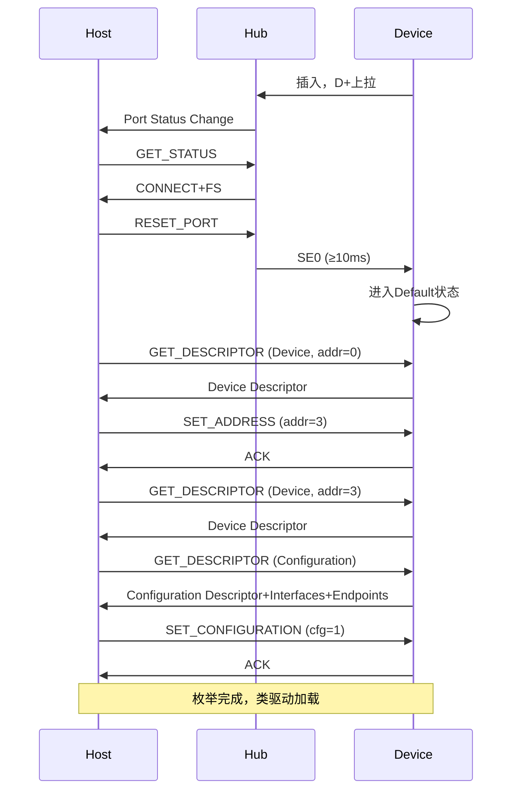

# USB枚举与电源管理

<span class="red">核心概念</span> USB枚举不仅是地址分配和描述符读取，还包含速度协商、电源预算分配和配置激活。电源管理则贯穿设备全生命周期，从活跃态到挂起态再到远程唤醒，每步都有精确的电气时序要求。

---

## 热插拔检测：Vbus与D+/D-上拉电阻

<span class="red">核心概念</span> USB热插拔的物理检测依赖Vbus供电和D+/D-线上的上拉电阻，不同速度的设备上拉不同数据线，主机由此判断设备类型。

| 速度 | 上拉电阻位置 | 电阻值 | 主机识别方式 |
|------|-------------|--------|-------------|
| 低速 LS | D- 上拉 | 1.5kΩ→3.3V | D- 被拉高 |
| 全速 FS | D+ 上拉 | 1.5kΩ→3.3V | D+ 被拉高 |
| 高速 HS | D+ 上拉（初识FS） | 1.5kΩ→3.3V | 先识别为FS，再协商升速 |

---

设备插入时，Vbus先接触，D+/D-后接触（由于插座内部引脚长度差异）。
<br>
Vbus到达后设备上电，内部复位电路工作，等待D+/D-接触完成后拉高相应线路。
<br>
主机Hub检测到数据线电平变化，向主机报告连接事件（Port Status Change）。

---

高速设备的欺骗策略：
<br>
高速设备一开始也在D+上挂1.5kΩ上拉，主机先把它当作全速设备。
<br>
枚举开始后，主机发Chirp K/J序列，高速设备检测到后断开D+上拉，
<br>
改用差分电流驱动，双方确认后切换到480Mbps模式。
<br>
如果主机不支持高速，设备就留在全速模式工作。

---

<span class="blue">结论/易错点</span> 自制USB设备时，上拉电阻必须接在设备端，不能接在主机端。
<br>
如果上拉电阻接反或阻值错误（如用10kΩ代替1.5kΩ），
主机可能检测不到设备，或间歇性断开。
<br>
低速设备上拉D-、全速/高速设备上拉D+，这是最基础也最容易搞错的硬件设计点。

---

## 枚举完整流程：连接→复位→地址分配→配置

<span class="red">核心概念</span> USB枚举是一个精确的时序过程，主机和设备在微秒级精度上交互，任何一步超时或响应错误都会导致枚举失败。



---

总线复位（Bus Reset）是枚举的关键转折点：
<br>
主机通过Hub向设备发送SE0状态（D+和D-同时拉低）持续10ms以上，
<br>
设备收到后必须：复位内部状态机、回到Default状态、准备用地址0通信、
<br>
如果是高速设备则开始Chirp握手。

---

地址分配后设备进入Addressed状态，但功能端点仍然关闭。
<br>
只有SET_CONFIGURATION成功后，设备才进入Configured状态，
<br>
Interface和Endpoint描述符中声明的端点才真正可用。
<br>
在此之前，任何非Endpoint0的访问都会被设备回STALL。

---

## 电源管理：Suspend/Resume/Remote Wakeup

<span class="red">核心概念</span> USB电源管理通过总线状态控制设备功耗，Suspend状态下设备电流不能超过2.5mA，Resume恢复后恢复正常工作。

| 状态 | 总线条件 | 最大电流 | 恢复方式 |
|------|---------|---------|---------|
| 活跃 Active | 正常通信 | 500mA (FS/HS) / 900mA (SS) | - |
| 挂起 Suspend | 3ms 无活动 | 2.5mA | Host 发 Resume |
| 远程唤醒 | 挂起中设备发信号 | 2.5mA | Device 发 Remote Wakeup |

---

进入Suspend的条件是总线空闲超过3ms（FS）或125μs（HS）。
<br>
主机可以主动停发SOF包，Hub会向下游传播Suspend状态。
<br>
设备检测到总线空闲后，关闭大部分内部电路，只保留唤醒检测逻辑。

---

Resume过程：
<br>
主机驱动Hub向上游端口发送Resume信号（K状态持续20ms），
<br>
Hub向下游传播，设备收到后恢复时钟和内部状态，
<br>
随后正常通信恢复。
<br>
Resume信号结束后必须有低速EOP（End of Packet）标志帧边界。

---

Remote Wakeup允许设备从挂起状态主动唤醒主机。<br>
例如笔记本合盖休眠后，插入USB鼠标可以唤醒系统，这就是Remote Wakeup。<br>
设备必须在Device Descriptor中声明bRemoteWakeup=1，
且主机在SET_FEATURE中使能该功能。

---

## USB PD：Power Delivery电压协商

<span class="red">核心概念</span> USB PD（Power Delivery，电力传输）是Type-C接口上的扩展电源协议，通过CC线进行BMC（Biphase Mark Coding，双相标记编码）通信，实现5V到20V的电压协商和最高100W供电。

| PDO（Power Data Object） | 电压 | 最大电流 | 功率 |
|-------------------------|------|---------|------|
| Fixed 5V | 5V | 3A | 15W |
| Fixed 9V | 9V | 3A | 27W |
| Fixed 15V | 15V | 3A | 45W |
| Fixed 20V | 20V | 5A | 100W |
| PPS（可编程电源） | 3.3-21V | 3A/5A | 100W |

---

PD协商流程（Source→Sink）：
<br>
1. Source发送Source_Capabilities消息，声明支持的PDO列表；
<br>
2. Sink分析后选择最合适的PDO，发Request消息；<br>
3. Source确认并切换电压，发PS_RDY消息；
<br>
4. 双方开始高电压供电。

---

PPS（Programmable Power Supply，可编程电源）是PD 3.0的杀手特性：
<br>
Sink可以请求3.3V到21V之间以20mV步进任意电压，
<br>
配合手机快充实现"微步进调压"，降低充电发热。
<br>
高通QC、联发科PE、三星AFC等私有快充协议正逐步统一到PD PPS上。

---

<span class="blue">结论/易错点</span> USB PD和Type-C的CC检测是两套独立的子系统：
<br>
CC检测只判断插入方向和设备角色（Source/Sink/DRP）；
<br>
PD协商是在CC线上通过数字通信完成的电压/电流协商。
<br>
很多嵌入式Type-C接口只做了CC检测，没有PD控制器，
因此只能提供5V/500mA，无法快充。

---

## Linux usbcore：usb_device / usb_driver / urb

<span class="red">核心概念</span> Linux的usbcore子系统把USB设备抽象为三层对象：usb_device（物理设备）、usb_driver（功能驱动）、urb（USB Request Block，USB请求块，传输单元）。

```c
#include <linux/usb.h>

/* USB设备结构体 */
struct usb_device {
    int devnum;                 /* 总线地址 1-127 */
    struct usb_device_descriptor descriptor;
    struct usb_host_config *config;
    int configs;
    struct usb_host_config *actconfig;
    struct usb_host_endpoint ep0;
    struct usb_host_endpoint ep_in[16];
    struct usb_host_endpoint ep_out[16];
    /* ... */
};

/* URB - USB传输的基本单元 */
struct urb {
    struct usb_device *dev;     /* 目标设备 */
    unsigned int pipe;          /* 端点管道 */
    unsigned int transfer_flags;/* 传输标志 */
    void *transfer_buffer;      /* 数据缓冲区 */
    u32 transfer_buffer_length; /* 缓冲区长度 */
    u32 actual_length;          /* 实际传输长度 */
    usb_complete_t complete;    /* 完成回调 */
    /* ... */
};
```

---

驱动提交URB的流程：<br>
1. `usb_alloc_urb()` 分配URB结构；<br>
2. 填充`transfer_buffer`、管道、回调函数；<br>
3. `usb_submit_urb()` 提交到usbcore；<br>
4. usbcore通过Host Controller Driver（HCD）把URB转化为硬件传输；<br>
5. 传输完成后，HCD回调`usbcore`，usbcore调用驱动的`complete()`回调。

---

<span class="purple">扩展</span> USB 3.0引入了Stream协议，Bulk端点可以维护多个并行Stream，<br>
适合UASP（USB Attached SCSI Protocol）协议，让Bulk端点接近SCSI的并发能力。
<br>
UASP相比旧的BOT（Bulk Only Transport）协议，传输效率提升30%以上，
<br>
但要求主机和设备双方都支持USB 3.0 Stream。
