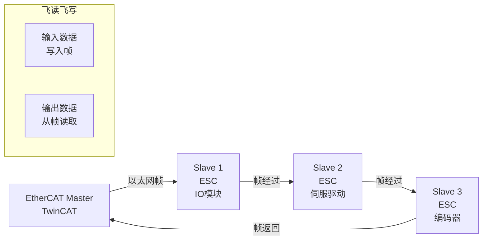

# EtherCAT 基础认知与"飞读飞写" [E→M]

<span class="badge-i">[I]</span> <span class="badge-e">[E]</span>


> **本章学习目标**：
> - 理解 <span class="red">EtherCAT</span> 从 Beckhoff 内部项目到 IEC 61158 标准的历程
> - 掌握 ESC（EtherCAT Slave Controller） 的帧处理机制
> - 了解分布时钟（DC）实现纳秒级同步的原理

---

## EtherCAT 的诞生：以太网的"工业革命"

---

### <strong>为什么需要 EtherCAT：超越 PROFIBUS 的带宽需求</strong>

<span class="red">EtherCAT</span>由 <span class="green">Beckhoff</span>在 <span class="green">2003 年</span>发布，
<span class="green">2005 年</span>成为 IEC 61158 标准。

在 EtherCAT 之前，工业总线面临瓶颈：
<br>
* <span class="green">PROFIBUS</span>：12Mbps 上限，运动控制不够
<br>
* <span class="green">工业以太网</span>：标准以太网帧处理延迟高（μs 级）
<br>
* <span class="green">多轴同步</span>：1000 轴伺服需要 μs 级周期
<br>

<span class="blue">EtherCAT 的核心创新：帧"飞读飞写"（Processing on the Fly）。以太网帧经过从站时，ESC 芯片在硬件层面直接读写帧中的数据，不缓冲整帧，延迟仅 1μs/节点。</span>
<br>

<span class="blue">类比：EtherCAT 如同"高速列车不下车换乘"——列车（以太网帧）经过每个车站（从站）时，站台上的人（ESC 芯片）直接把行李（数据）扔进/拿出车厢，列车不用停靠。</span>
<br>

---

### <strong>ESC 芯片：帧处理的硬件魔法</strong>

<span class="red">EtherCAT Slave Controller</span>是从站的核心芯片：

| 功能 | 说明 | 延迟 |
| --- | --- | --- |
| 帧接收 | 从 EtherCAT 端口接收帧 | 0 |
| 数据提取 | 从帧中读取输出数据 | < 1μs |
| 数据插入 | 将输入数据写入帧 | < 1μs |
| 帧转发 | 从另一端口转发帧 | 0 |



---

### <strong>分布时钟：纳秒级多轴同步</strong>

<span class="red">EtherCAT 分布时钟（DC）</span>实现纳秒级同步：

```text
DC 同步流程：

1. 主站广播一个参考时钟帧
2. 每个从站记录帧到达的本地时间戳 T1, T2, T3...
3. 从站将时间戳写入帧返回给主站
4. 主站计算各从站的时钟偏移和传输延迟
5. 主站发送时钟校准命令，各从站调整本地时钟
6. 所有从站时钟与参考时钟对齐（误差 < 100ns）
```

<span class="blue">DC 的关键：第一个从站的时钟成为系统参考时钟，其他从站的时钟通过硬件 PLL 锁定到参考时钟。这意味着 1000 个伺服轴可以在 1μs 内同时动作。</span>
<br>

---

## 本章小结

| 概念 | 一句话总结 |
| --- | --- |
| EtherCAT | Beckhoff 2003 年发布，帧飞读飞写，1μs/节点 |
| ESC | EtherCAT 从站控制器芯片，硬件处理帧 |
| 菊花链 | 从站串联，帧经过每个节点 |
| DC | 分布时钟，纳秒级多轴同步 |
| CiA402 | 伺服驱动协议，基于 EtherCAT |
| 1000 轴同步 | EtherCAT DC 的典型应用场景 |

---

## 练习

1. 为什么 EtherCAT 能实现 1μs/节点的延迟？标准以太网交换机为什么做不到？
2. EtherCAT 的分布时钟和 TSN 的 gPTP 在同步原理上有什么异同？
3. 设计一个 EtherCAT 运动控制系统：6 轴机器人，要求 1ms 周期，画出拓扑。
