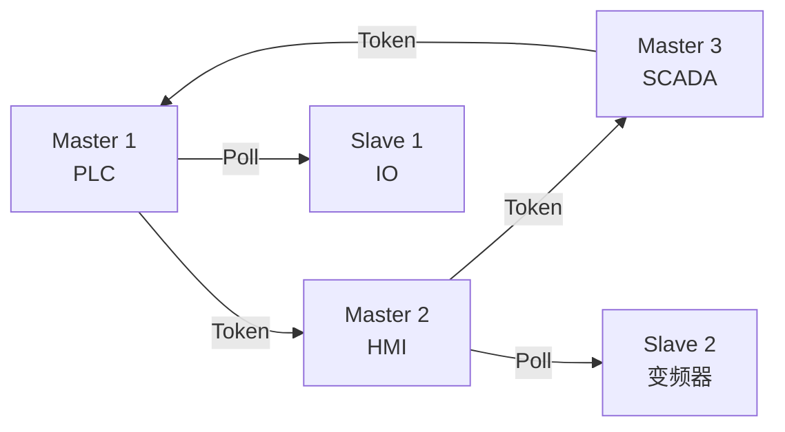

# PROFIBUS DP 基础认知与令牌环 [I→E]

[I] [E]

> **本章学习目标**：
> - 理解 PROFIBUS 从德国标准 DIN 19245 演进的历程
> - 掌握 PROFIBUS DP（Decentralized Peripherals） 的主从轮询机制
> - 了解 GSD 文件与设备配置的标准化方法

---

## PROFIBUS 的诞生：德国工业自动化的标准

---

### <strong>为什么需要 PROFIBUS：超越 Modbus 的性能需求</strong>

PROFIBUS由 Siemens 等德国公司在 1989 年推出，
1996 年成为欧洲标准 EN 50170。

Modbus 虽然简单开放，但在复杂工业场景有局限：
 
* 速率限制：Modbus RTU 最高 115.2Kbps，大型工厂不够
 
* 主从限制：Modbus 单主，PROFIBUS 支持多主令牌环
 
* 配置标准化：Modbus 寄存器映射各厂商不同，PROFIBUS 用 GSD 统一描述
 

PROFIBUS DP 速率最高 12Mbps，支持 126 个设备，周期通信（DP-V0）+ 非周期参数访问（DP-V1），是西门子生态的核心总线。
 

类比：PROFIBUS 如同"高级商务会所的会员制"——入会（GSD 认证）严格，但入会后的服务标准化、高效；Modbus 如同"开放集市"——谁都能来，但规矩各家自定。
 

---

### <strong>PROFIBUS DP-V0/V1/V2：三代演进</strong>

| 版本 | 年份 | 功能 | 典型应用 |
| --- | --- | --- | --- |
| DP-V0 | 1993 | 周期数据交换、诊断 | 简单 IO |
| DP-V1 | 1997 | 非周期参数读写、报警 | 变频器参数配置 |
| DP-V2 | 2002 | 从站间直接通信、等时同步 | 运动控制 |

---

### <strong>令牌环：多主访问的公平机制</strong>

PROFIBUS使用令牌环（Token Ring）实现多主：

令牌在多个主站之间循环传递，持有令牌的主站才能轮询从站。令牌丢失时有超时和恢复机制。
 

---

## 本章小结

| 概念 | 一句话总结 |
| --- | --- |
| PROFIBUS | 1989 年德国工业总线，Siemens 主导 |
| DP | Decentralized Peripherals，分布式外设 |
| 令牌环 | 多主访问机制，公平轮询 |
| GSD | 电子设备数据库文件，描述设备能力 |
| DP-V0 | 周期数据交换 |
| DP-V1 | 非周期参数访问 |

---

## 练习

1. PROFIBUS 的令牌环和 CAN 的仲裁机制各有什么优劣？
2. GSD 文件中通常包含哪些信息？为什么需要标准化设备描述？
3. PROFIBUS DP-V2 的从站间直接通信（DXB）如何减少主站负载？
