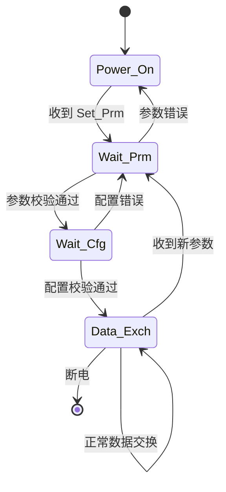
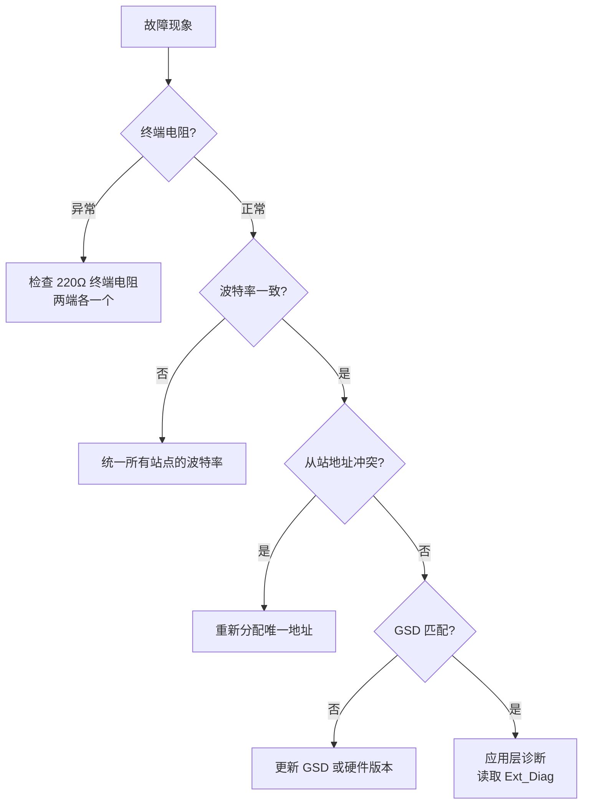

# PROFIBUS 嵌入式实战 [E]

> **本章学习目标**：
> - 掌握 Siemens S7 系列 PLC 与 DP 从站的通信配置步骤
> - 理解从站开发中的状态机设计与 GSD 集成
> - 了解 PROFIBUS 网络故障排查的系统化方法

---

## Siemens S7 通信

---

### <strong>S7-300/400 DP 主站配置</strong>

<span class="badge-e">E</span><br>
<span class="red">S7 PLC</span> 作为 PROFIBUS DP 主站，通过 STEP7 软件配置从站网络与 I/O 映射。<br>

**表 4-1：STEP7 配置步骤**

| 步骤 | 操作 | 说明 |
| --- | --- | --- |
| 1 | 硬件组态 | 插入 CPU 与 DP 主站模块（如 CP342-5） |
| 2 | 网络设置 | 创建 PROFIBUS 子网，设置波特率 |
| 3 | 从站导入 | 安装从站 GSD 文件，拖入硬件目录 |
| 4 | 地址分配 | 为每个从站分配 PROFIBUS 地址 |
| 5 | I/O 映射 | 配置从站模块的输入/输出地址 |
| 6 | 参数下载 | 编译并下载硬件配置至 PLC |

<span class="orange"><strong>1. CP342-5 配置要点</strong></span><br>
* CP342-5 是 S7-300 的 PROFIBUS 通信处理器，支持 DP-V0/V1。<br>
* 需在 STEP7 中设置 "Operating Mode" 为 DP-Master。<br>
* 通过 FC1 (DP_SEND) 与 FC2 (DP_RECV) 函数块读写 I/O。<br>

```stl
// S7-300 DP 通信程序片段
// 调用 DP_SEND 发送输出数据
CALL "DP_SEND"
     CPLADDR  := W#16#0100    // CP342-5 起始地址
     SEND     := P#DB1.DBX0.0 BYTE 32  // 发送数据区
     DONE     := M10.0
     ERROR    := M10.1
     STATUS   := MW12
```

<span class="orange"><strong>2. 诊断中断处理</strong></span><br>
* OB82（诊断中断组织块）：处理从站模块的诊断报警。<br>
* OB86（机架故障）：处理从站掉线/离线事件。<br>

---

## 从站开发

---

### <strong>DP 从站状态机</strong>

<span class="badge-e">E</span><br>
<span class="red">DP 从站</span> 遵循标准状态机：Power_On → Wait_Prm → Wait_Cfg → Data_Exch。<br>



**表 4-2：状态机状态定义**

| 状态 | 代码 | 行为 |
| --- | --- | --- |
| Power_On | 0x00 | 初始化，等待参数化 |
| Wait_Prm | 0x01 | 已收到参数请求，等待有效参数 |
| Wait_Cfg | 0x02 | 参数化完成，等待配置（I/O 长度） |
| Data_Exch | 0x03 | 正常数据交换 |

<span class="orange"><strong>3. 状态机代码框架</strong></span><br>

```c
// DP 从站状态机实现
// 文件：dp_slave_fsm.c

typedef enum {
    DP_POWER_ON,
    DP_WAIT_PRM,
    DP_WAIT_CFG,
    DP_DATA_EXCH
} dp_state_t;

dp_state_t dp_state = DP_POWER_ON;

void dp_slave_process(uint8_t *req, uint8_t *resp) {
    switch (dp_state) {
    case DP_POWER_ON:
        if (req[0] == SAP_SET_PRM) {
            if (check_parameters(req))
                dp_state = DP_WAIT_PRM;
        }
        break;
    case DP_WAIT_PRM:
        if (req[0] == SAP_CHK_CFG) {
            if (check_configuration(req))
                dp_state = DP_WAIT_CFG;
        }
        break;
    case DP_WAIT_CFG:
        if (req[0] == SAP_SLAVE_DIAG) {
            dp_state = DP_DATA_EXCH;
            resp[0] = DP_STATE_DATA_EXCH;
        }
        break;
    case DP_DATA_EXCH:
        if (req[0] == SAP_RD_INP || req[0] == SAP_RD_OUTP) {
            memcpy(resp, dp_input_data, dp_input_len);
        }
        break;
    }
}
```

---

## 故障排查

---

### <strong>系统化诊断流程</strong>

<span class="badge-e">E</span><br>
<span class="red">PROFIBUS 故障排查</span> 遵循"物理层 → 数据链路层 → 应用层"的分层方法。<br>



**表 4-3：常见故障与排查**

| 故障现象 | 可能原因 | 排查方法 |
| --- | --- | --- |
| BF 灯常亮 | 终端电阻缺失/短路 | 测量总线两端电阻，应为 110Ω |
| 从站无法上线 | 地址冲突或 GSD 不匹配 | 检查 STEP7 硬件目录与实际模块 |
| 偶发数据错误 | 电缆屏蔽不良/接地环流 | 单点接地，检查屏蔽层连续性 |
| 数据交换延迟 | Ttr 设置过大 | 减小 Ttr，增加轮询频率 |
| 非周期通信失败 | Tslot 设置过小 | 根据 MaxTSDR 重新计算 Tslot |

---

## 本章小结

| 小节 | 核心要点 |
| --- | --- |
| Siemens S7 通信 | STEP7 硬件组态→GSD导入→地址分配→FC1/FC2编程 |
| 从站开发 | Power_On→Wait_Prm→Wait_Cfg→Data_Exch 四状态机 |
| 故障排查 | 终端电阻→波特率→地址冲突→GSD匹配→Ext_Diag 分层法 |

---

## 练习

1. **配置实践**：在 STEP7 中配置一个 S7-300 + CP342-5 的 PROFIBUS 网络，波特率 1.5 Mbps，挂载 2 个 ET200S 从站（地址 3 和 4）。写出关键配置参数。

2. **状态机分析**：某 DP 从站上电后收到 Set_Prm 但参数校验失败。分析状态迁移路径及主站侧的错误提示。

3. **故障定位**：某 PROFIBUS 网络 BF 灯闪烁，从站偶发掉线。设计完整的排查清单（从物理层到应用层至少 5 项）。
