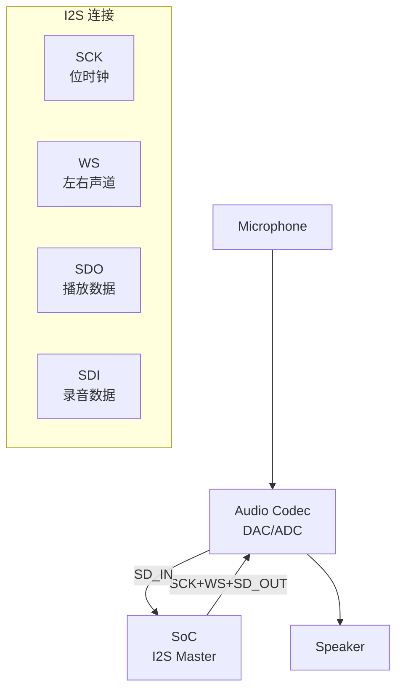

# I2S 与 PCM 基础认知与数字音频 [B→I]

> **本章学习目标**：
> - 理解 I2S（Inter-IC Sound） 从 Philips 1986 年提出的原始标准
> - 掌握 PCM（Pulse Code Modulation） 的时隙复用与主从模式
> - 了解 TDM/PDM 在多通道音频中的应用

---

## I2S 的诞生：芯片间音频传输的标准

---

### <strong>为什么需要 I2S：数字音频的芯片互联</strong>

I2S由 Philips（现为 NXP）在 1986 年提出，
定位是芯片间传输数字音频的标准接口。

在 I2S 之前，数字音频传输方式各异：
 
* 并行接口：引脚多，PCB 走线复杂
 
* SPI：通用但非音频优化
 
* 各厂商私有：NEC、Sony、Toshiba 互不兼容
 

I2S 用 3~4 根线传输立体声音频：串行时钟（SCK）、字选择（WS）、串行数据（SD），可选主时钟（MCLK）。
 

类比：I2S 如同"数字音频的专线电话"——专门设计用来传输音频，不需要额外的协议握手，接上就能出声。
 

---

### <strong>I2S 的物理层：3 线标准接口</strong>

I2S信号定义：

| 信号 | 方向 | 说明 |
| --- | --- | --- |
| SCK（BCLK） | 主机→从机 | 位时钟，采样率 × 位深 × 通道 |
| WS（LRCK） | 主机→从机 | 字选择，0=左声道，1=右声道 |
| SD | 双向 | 串行音频数据（MSB 先） |
| MCLK | 主机→从机 | 主时钟，256×Fs 或 384×Fs（可选） |

---

### <strong>PCM 与 I2S 的关系：父子标准</strong>

PCM是更广泛的概念，I2S 是 PCM 的一种物理层实现：

| 接口 | 标准 | 位深 | 时钟 | 应用 |
| --- | --- | --- | --- | --- |
| I2S | Philips | 16/24/32 bit | 专用 SCK/WS | 芯片间 |
| PCM | ITU-T | 8/16 bit | 复用时钟 | 电信/语音 |
| TDM | 扩展 | 多通道 | 时分复用 | 多声道 |
| PDM | 扩展 | 1 bit | 高频过采样 | 麦克风 |

PCM 时隙复用：多个通道共享同一对数据线，通过时隙（Time Slot）区分。PCM 的 FS（Frame Sync）信号标识帧边界，每个时隙传输一个通道的采样值。
 

---

## 本章小结

| 概念 | 一句话总结 |
| --- | --- |
| I2S | Philips 1986 年，3 线数字音频接口 |
| SCK | 位时钟，采样率 × 位深 × 通道 |
| WS | 字选择，左右声道切换 |
| PCM | 脉冲编码调制，I2S 是其物理层实现之一 |
| TDM | 时分复用，多通道共享数据线 |
| PDM | 脉冲密度调制，1-bit 过采样，MEMS 麦克风 |

---

## 练习

1. 计算 48KHz 采样率、24-bit 位深、立体声的 I2S SCK 频率。
2. PCM 的时隙复用和 I2S 的 WS 信号各有什么优劣？什么时候选 PCM，什么时候选 I2S？
3. PDM MEMS 麦克风为什么用 1-bit 过采样而不是直接输出 PCM？画出 PDM→PCM 的转换流程。
