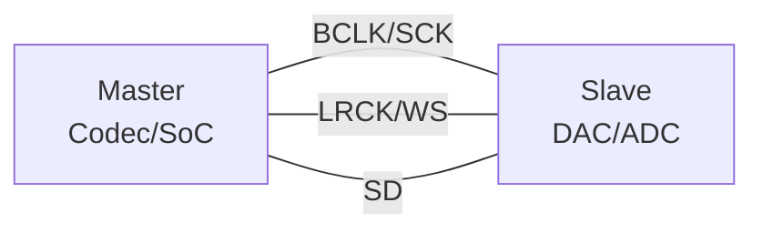

# I2S 时序与配置 [B]

> **本章学习目标**：
> - 理解 <span class="red">I2S 信号时序</span> 中 SCK/WS/SD 的相位关系与采样时刻
> - 掌握采样率的计算方法与 MCLK/BCLK/LRCK 分频关系
> - 了解主从模式的时钟输出与输入差异及应用场景

---

## SCK/WS/SD 时序

---

### <strong>I2S 总线信号定义</strong>

<span class="badge-b">B</span><br>
<span class="red">I2S（Inter-IC Sound）</span> 是飞利浦定义的数字音频串行接口标准，由 SCK（位时钟）、WS（字选择）和 SD（串行数据）三根信号线组成。<br>



<span class="blue">I2S 如同数字音频的"摩斯电码"——SCK 是节拍器（每 bit 一个滴答），WS 是左右手切换信号（高=右声道，低=左声道），SD 是实际的声音比特流。</span><br>

<span class="orange"><strong>1. BCLK（Bit Clock / SCK）</strong></span><br>
* 每个 BCLK 周期传输 1 bit 音频数据。<br>
* 频率 = 采样率 × 位深 × 通道数。<br>
* 例如：48 kHz × 16 bit × 2 ch = 1.536 MHz。<br>

<span class="orange"><strong>2. WS（Word Select / LRCK）</strong></span><br>
* 标识当前传输的是左声道还是右声道数据。<br>
* 频率 = 采样率，占空比严格 50%。<br>
* WS=低：左声道（Left/Channel 1）；WS=高：右声道（Right/Channel 2）。<br>

<span class="orange"><strong>3. SD（Serial Data）</strong></span><br>
* 串行传输音频样本，MSB 优先。<br>
* 数据在 BCLK 的一个边沿变化，在另一个边沿被采样。<br>
* I2S 标准规定：数据在 BCLK 下降沿变化，上升沿采样。<br>

---

### <strong>标准 I2S 时序图</strong>

<span class="badge-b">B</span><br>

```
        BCLK  _|‾|_|‾|_|‾|_|‾|_|‾|_|‾|_|‾|_|‾|_|‾|_|‾|_
        WS    ‾‾‾‾‾‾‾‾‾‾‾‾‾‾‾‾‾‾‾‾‾‾‾‾‾‾‾‾‾‾‾‾‾‾‾‾‾‾‾‾‾‾‾‾
              |←——左声道——→|←——右声道——→|
        SD    D15 D14 ... D0  D15 D14 ... D0
              ↑采样         ↑采样
              
        （WS低=左，WS高=右，MSB在WS翻转后第2个BCLK出现）
```

**表 2-1：I2S 时序参数**

| 参数 | 符号 | 最小值 | 典型值 | 单位 |
| --- | --- | --- | --- | --- |
| BCLK 频率 | f_BCLK | — | 1.536~6.144 | MHz |
| WS 频率 | f_WS | — | 32~192 | kHz |
| WS 占空比 | D_WS | 45 | 50 | 55 | % |
| BCLK 高电平 | t_BH | 32 | — | ns |
| BCLK 低电平 | t_BL | 32 | — | ns |
| SD 建立时间 | t_su | 10 | — | ns |
| SD 保持时间 | t_h | 10 | — | ns |

<span class="orange"><strong>4. I2S vs PCM 时序差异</strong></span><br>
* I2S：MSB 在 WS 翻转后的第 2 个 BCLK 出现，有 1 个 bit 的延迟。<br>
* PCM（DSP Mode A）：MSB 与 WS 翻转同步，无延迟。<br>
* PCM（DSP Mode B）：MSB 在 BCLK 第 2 个周期出现，类似 I2S。<br>

---

## 采样率计算

---

### <strong>时钟分频关系</strong>

<span class="badge-b">B</span><br>
<span class="red">采样率</span> 的推导从系统主时钟（MCLK）开始，经过多级分频得到 BCLK 与 LRCK。<br>

**表 2-2：标准音频采样率**

| 采样率 | 标准 | 应用场景 |
| --- | --- | --- |
| 8 kHz | 电话/VoIP | 语音通话 |
| 16 kHz | 宽带语音 | 高清语音 |
| 22.05 kHz | — | 早期音频 |
| 32 kHz | 数字广播 | FM 广播 |
| 44.1 kHz | CD 标准 | 音乐播放 |
| 48 kHz | 专业音频 | 影视制作 |
| 96 kHz | 高清音频 | Hi-Res 音乐 |
| 192 kHz | 超高清 | 母带处理 |

<span class="orange"><strong>5. 采样率计算公式</strong></span><br>

```
MCLK = 采样率 × 分频系数

常见 MCLK 频率：
- 44.1 kHz 系列: MCLK = 11.2896 MHz (= 256 × 44.1k)
- 48 kHz 系列:   MCLK = 12.2880 MHz (= 256 × 48k)

BCLK = 采样率 × 位深 × 通道数
     = 48 kHz × 16 × 2 = 1.536 MHz

LRCK = 采样率 = 48 kHz
```

<span class="blue">MCLK 如同乐团的"总谱节拍"——BCLK 是小节内的"拍子"，LRCK 是"换声部的信号"，三者精确整数倍关系确保音乐不走调。</span><br>

---

## 主从模式

---

### <strong>主模式与从模式对比</strong>

<span class="badge-b">B</span><br>
<span class="red">I2S 主从模式</span> 决定了谁生成 BCLK 和 LRCK，通常 SoC/Codec 为主，DAC/ADC 为从。<br>

**表 2-3：主从模式对比**

| 特性 | 主模式 | 从模式 |
| --- | --- | --- |
| BCLK 来源 | 本设备 | 外部设备 |
| LRCK 来源 | 本设备 | 外部设备 |
| 时钟精度 | 依赖本设备晶振 | 依赖外部时钟质量 |
| 复杂度 | 需配置 PLL/分频 | 仅需接收时钟 |
| 典型应用 | SoC 输出音频 | 外置 DAC 接收 |

<span class="orange"><strong>6. 主模式配置代码</strong></span><br>

```c
// Linux ASoC I2S 主模式配置
// 文件：sound/soc/xxx/xxx-i2s.c

static int i2s_set_dai_sysclk(struct snd_soc_dai *dai,
                              int clk_id, unsigned int freq, int dir) {
    struct i2s_dev *dev = snd_soc_dai_get_drvdata(dai);
    
    // 配置 MCLK = 12.288 MHz
    clk_set_rate(dev->mclk, 12288000);
    
    // 配置 BCLK 分频：MCLK / 8 = 1.536 MHz (48kHz, 16bit, stereo)
    writel(BCLK_DIV_8, dev->regs + I2S_BCLK_DIV);
    
    // 配置 LRCK 分频：BCLK / 32 = 48 kHz
    writel(LRCK_DIV_32, dev->regs + I2S_LRCK_DIV);
    
    // 设置为主模式
    writel(I2S_CTRL_MASTER, dev->regs + I2S_CTRL);
    
    return 0;
}
```

<span class="orange"><strong>7. 从模式配置要点</strong></span><br>
* 关闭内部 BCLK/LRCK 生成器。<br>
* 配置输入时钟极性与边沿。<br>
* 确保 FIFO 深度足以吸收时钟抖动。<br>

---

## 本章小结

| 小节 | 核心要点 |
| --- | --- |
| SCK/WS/SD 时序 | BCLK=位时钟，WS=左右切换，SD=MSB优先，下降沿变化上升沿采样 |
| 采样率计算 | MCLK=256×Fs，BCLK=Fs×位深×通道，LRCK=Fs |
| 主从模式 | 主模式输出时钟，从模式接收时钟，PLL/分频 vs FIFO 缓冲 |

---

## 练习

1. **时序计算**：某 I2S 系统采样率 96 kHz，24-bit，立体声。计算所需的 BCLK 频率。若 MCLK 为 24.576 MHz，计算 MCLK→BCLK 的分频比。

2. **模式设计**：某便携设备使用外置 DAC（从模式），SoC（主模式）输出音频。分析若 SoC 进入低功耗模式暂停 MCLK，DAC 应如何处理以避免爆音。

3. **信号分析**：示波器显示 WS 占空比为 48%，BCLK 高电平 30 ns。判断是否符合 I2S 标准，若不符合给出可能原因。
