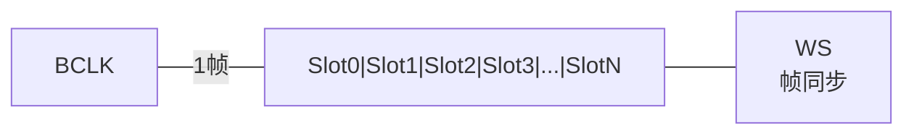
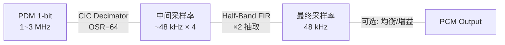

# TDM 与 PDM 麦克风 [I]

> **本章学习目标**：
> - 理解 <span class="red">TDM 时隙分配</span> 的帧结构与多通道扩展机制
> - 掌握 PDM 过采样原理与 PDM→PCM 的 CIC/半带滤波流程
> - 了解 MEMS 麦克风的工作原理与数字输出特性

---


---

## 需求分析：为什么需要 TDM 与 PDM

---

### <strong>为什么 TDM 与 PDM 成为行业刚需</strong>

<span class="red">TDM 与 PDM</span>的出现回应了嵌入式音频场景中的多通道与小型化需求。传统 I2S 仅支持双声道，无法满足阵列麦克风与多声道音响的通道数量；模拟麦克风则需要 ADC 与复杂布线，体积和噪声均受限。
<br>

<span class="blue">为何选择 TDM/PDM：TDM 通过时隙复用将多通道音频压缩至一对数据线，大幅降低 PCB 层数与走线密度；PDM 以 1-bit 高频过采样替代传统多位 ADC，使 MEMS 麦克风直接输出数字信号，省去片外 ADC 与抗混叠滤波器。</span>
<br>

## TDM 时隙分配

---

### <strong>TDM 帧结构</strong>

<span class="badge-i">I</span><br>
<span class="red">TDM（Time Division Multiplexing）</span> 在 I2S 基础上扩展为单根数据线上传输多个通道的音频样本。<br>



<span class="blue">TDM 如同一条多车道高速公路——BCLK 是总车道数，每个 Slot 是一条专用车道，WS 是收费站（标记帧起点）。</span><br>

<span class="orange"><strong>1. TDM 帧格式</strong></span><br>
* 每帧由 N 个 Slot 组成，每个 Slot 传输一个通道的样本。<br>
* Slot 宽度通常为 8/16/32 bit，与 BCLK 周期对齐。<br>
* WS 标识帧起始，持续 1 个 BCLK 周期或 1 个 Slot 宽度。<br>

**表 3-1：TDM 模式对比**

| 模式 | Slot 数 | 位宽 | 总通道 | 典型应用 |
| --- | --- | --- | --- | --- |
| I2S | 2 | 16/32 | 2 | 立体声 |
| DSP_A | 4 | 16 | 4 | 车载音频 |
| DSP_B | 8 | 16 | 8 | 会议系统 |
| TDM128 | 4 | 32 | 4 | 专业音频 |
| TDM256 | 8 | 32 | 8 | 多麦克风阵列 |

<span class="orange"><strong>2. 时隙分配示例</strong></span><br>

```
TDM 帧结构（8 Slot，16-bit）：

WS ____|‾‾‾‾‾‾‾‾‾‾‾‾‾‾‾‾‾‾‾‾‾‾‾‾‾‾‾‾‾‾‾‾‾‾‾‾‾‾‾‾‾‾‾‾‾‾‾‾‾‾‾‾‾‾‾‾‾‾‾‾‾‾‾‾‾‾‾‾‾‾‾‾‾‾‾‾‾‾
Slot 0 [CH0-15:0] | CH0 样本
Slot 1 [CH1-15:0] | CH1 样本
Slot 2 [CH2-15:0] | CH2 样本
Slot 3 [CH3-15:0] | CH3 样本
Slot 4 [CH4-15:0] | CH4 样本
Slot 5 [CH5-15:0] | CH5 样本
Slot 6 [CH6-15:0] | CH6 样本
Slot 7 [CH7-15:0] | CH7 样本
```

---

## PDM 过采样

---

### <strong>PDM 调制原理</strong>

<span class="badge-i">I</span><br>
<span class="red">PDM（Pulse Density Modulation）</span> 是 MEMS 麦克风常用的数字输出格式，以极高频率的 1-bit 脉冲密度表示模拟信号幅度。<br>

<span class="blue">PDM 如同"撒豆成兵"——豆子（脉冲）越密集的地方，声音越响亮；稀疏的地方，声音越轻柔。单颗豆子只有"有/无"两种状态，但密度可以表达任意灰度。</span><br>

<span class="orange"><strong>3. PDM 过采样率</strong></span><br>
* PDM 时钟频率通常为 1.0~3.25 MHz。<br>
* 目标采样率通常为 16~48 kHz。<br>
* 过采样率（OSR）= PDM 时钟 / 目标采样率，通常为 64× 或 128×。<br>

**表 3-2：PDM 参数示例**

| 目标采样率 | PDM 时钟 | OSR | 应用场景 |
| --- | --- | --- | --- |
| 16 kHz | 1.024 MHz | 64× | 语音 |
| 48 kHz | 3.072 MHz | 64× | 音乐 |
| 48 kHz | 6.144 MHz | 128× | 高清音频 |

---

### <strong>PDM→PCM 滤波</strong>

<span class="badge-i">I</span><br>
<span class="red">PDM→PCM 转换</span> 需经过 CIC（级联积分梳状）抽取滤波器与半带（Half-Band）FIR 滤波器两级。<br>



**表 3-3：滤波器级联参数**

| 级 | 类型 | 抽取比 | 通带 | 阻带衰减 |
| --- | --- | --- | --- | --- |
| 1 | CIC | 32× | 宽 | 低 |
| 2 | CIC Compensator | 1× | 修正 | 中 |
| 3 | Half-Band FIR | 2× | 精确 | 高 |

<span class="orange"><strong>4. CIC 滤波器结构</strong></span><br>
* N 级 CIC 由 N 个积分器（Integrator）+ N 个梳状器（Comb）+ 抽取器组成。<br>
* 优点：无需乘法器，仅使用加法器和延迟单元，硬件实现极简。<br>
* 缺点：通带内有 droop（衰减），需补偿滤波器修正。<br>

```c
// 简化的 CIC 滤波器（N=3, R=32, M=1）
// 文件：pdm_cic_filter.c

int32_t cic_integrator[3] = {0};
int32_t cic_comb[3] = {0};
int32_t cic_delay[3][2] = {{0}};

int32_t cic_filter(int32_t input) {
    int i;
    // 3 级积分器
    for (i = 0; i < 3; i++) {
        if (i == 0)
            cic_integrator[i] += input;
        else
            cic_integrator[i] += cic_integrator[i-1];
    }
    
    // 抽取后 3 级梳状器
    for (i = 0; i < 3; i++) {
        int32_t diff = cic_integrator[2] - cic_delay[i][1];
        cic_delay[i][1] = cic_delay[i][0];
        cic_delay[i][0] = cic_integrator[2];
        cic_comb[i] = diff;
    }
    
    return cic_comb[2] >> (3 * 5);  // 增益归一化
}
```

---

## MEMS 麦克风

---

### <strong>MEMS 麦克风工作原理</strong>

<span class="badge-i">I</span><br>
<span class="red">MEMS 麦克风</span> 基于微机电系统技术，将声波引起的振膜形变转换为电容变化，再经 ASIC 调制为 PDM 数字输出。<br>

**表 3-4：MEMS 麦克风关键参数**

| 参数 | 典型值 | 说明 |
| --- | --- | --- |
| 灵敏度 | -26 dBFS | 94 dB SPL 下输出 |
| 频率响应 | 20 Hz ~ 20 kHz | 全频段 |
| 信噪比 | 64 dB | A-weighted |
| 电源电压 | 1.8~3.6 V | 数字 MEMS |
| 功耗 | 0.8 mA | 正常工作 |
| 封装 | 3.76×2.95 mm | 底部进声 |

<span class="orange"><strong>5. 数字 MEMS 接口</strong></span><br>
* CLK：PDM 时钟输入，1~3.25 MHz。<br>
* DATA：PDM 数据输出，单线或双线（ stereo ）。<br>
* L/R 选择：通过引脚电平选择 DATA 在 CLK 的哪一边沿有效。<br>
* VDD/GND：电源与地。<br>

---

## 本章小结

| 小节 | 核心要点 |
| --- | --- |
| TDM 时隙分配 | 8/16 Slot 帧结构，每 Slot 一个通道，WS 标识帧起始 |
| PDM 过采样 | 1-bit 脉冲密度，64×/128× OSR，CIC+Half-Band 滤波转 PCM |
| MEMS 麦克风 | 电容式传感+ASIC调制，PDM 输出，CLK/DATA/VDD 三线接口 |

---

## 练习

1. **TDM 设计**：设计一个 8 麦克风阵列的 TDM 帧结构，目标采样率 48 kHz，位深 16-bit。计算所需的 BCLK 频率。

2. **滤波计算**：某 PDM 麦克风时钟 3.072 MHz，目标 48 kHz，OSR=64。设计一个 N=4 的 CIC 滤波器，写出积分器与梳状器的差分方程。

3. **灵敏度分析**：某 MEMS 麦克风灵敏度 -26 dBFS，输入 100 dB SPL 正弦波。计算输出 PDM 脉冲密度的理论峰值（假设满幅为 ±1）。


---

## 历史演进与发展趋势

<span class="red">TDM</span>（时分复用）技术起源于电信领域的 PCM 多路复用标准，将多路语音压缩到同一物理链路。进入嵌入式音频领域后，TDM 被扩展为支持 4~8 通道甚至更多声道的数字音频接口。<span class="red">PDM</span>（脉冲密度调制）则伴随 MEMS 麦克风产业兴起，Knowles、STMicroelectronics 等厂商在 2010 年前后推动 PDM 成为小型麦克风的主流数字输出格式。PDM→PCM 的滤波与抽取算法随后被集成至 SoC 音频前端，形成完整的信号链。
<br>

<span class="blue">未来趋势：TDM 在多声道智能音箱与车载 DSP 中不可替代；PDM MEMS 麦克风凭借低成本、小体积，在 TWS 耳机与语音助手中渗透率持续攀升。</span>
<br>