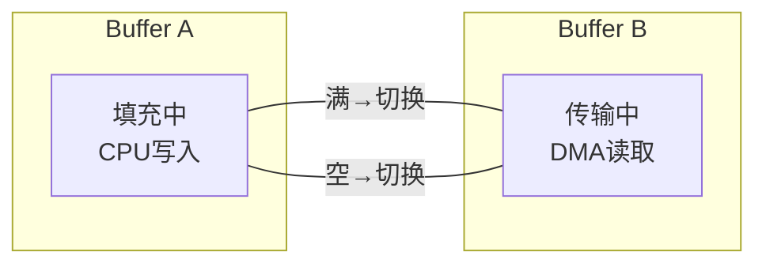

# I2S 嵌入式实战 [I]

> **本章学习目标**：
> - 掌握 Linux ALSA 的 DAI/Codec/Platform 三要素配置方法
> - 理解 DMA 双缓冲机制在音频采集回放中的作用
> - 了解音频采集回放的缓冲区管理与 xrun 恢复策略

---

## ALSA 配置

---

### <strong>ASoC 架构与设备树配置</strong>

<span class="badge-i">I</span><br>
<span class="red">ALSA（Advanced Linux Sound Architecture）</span> 的 ASoC（ALSA System on Chip）框架将音频系统拆分为 DAI、Codec 与 Platform 三个独立驱动。
<br>

<span class="blue">ASoC 如同乐高积木——DAI 是"连接器"（SoC 侧），Codec 是"功能模块"（DAC/ADC），Platform 是"底板"（DMA/时钟），三者组合成完整音频系统。</span><br>

**表 4-1：ASoC 三要素**

| 组件 | 功能 | 典型驱动 | 设备树节点 |
| --- | --- | --- | --- |
| DAI | 数字音频接口控制器 | snd-soc-xxx-i2s | i2s@xxx |
| Codec | 编解码器 | snd-soc-wm8960 | wm8960@1a |
| Platform | DMA 与 PCM 逻辑 | snd-soc-dmaengine-pcm | — |
| Machine | 板级连接 | snd-soc-xxx-board | sound |

<span class="orange"><strong>1. 设备树配置示例</strong></span><br>

```dts
// 设备树音频配置
// 文件：arch/arm/boot/dts/xxx.dts

sound {
    compatible = "simple-audio-card";
    simple-audio-card,name = "XXX-Audio";
    simple-audio-card,format = "i2s";
    simple-audio-card,bitclock-master = <&dailink0_master>;
    simple-audio-card,frame-master = <&dailink0_master>;

    simple-audio-card,cpu {
        sound-dai = <&i2s0>;
    };

    dailink0_master: simple-audio-card,codec {
        sound-dai = <&wm8960>;
        clocks = <&clks 201>;
    };
};

&i2c1 {
    wm8960: wm8960@1a {
        compatible = "wlf,wm8960";
        reg = <0x1a>;
        clocks = <&clks 202>;
        clock-names = "mclk";
    };
};
```

<span class="orange"><strong>2. ALSA 用户态配置</strong></span><br>

```bash
# 查看音频设备
$ aplay -l
**** List of PLAYBACK Hardware Devices ****
card 0: XXXAudio [XXX-Audio], device 0: WM8960 HiFi wm8960-hifi-0
  Subdevices: 1/1
  Subdevice #0: subdevice #0

# 配置混音器
$ amixer sset 'Headphone' 80%
$ amixer sset 'PCM' 0dB

# 播放测试
$ aplay -D hw:0,0 -f S16_LE -r 48000 -c 2 test.wav

# 采集测试
$ arecord -D hw:0,0 -f S16_LE -r 48000 -c 2 -d 10 rec.wav
```

---

## DMA 双缓冲

---

### <strong>双缓冲原理与配置</strong>

<span class="badge-i">I</span><br>
<span class="red">DMA 双缓冲</span> 是音频实时性的关键保障，CPU 填充一个缓冲区的同时，DMA 从另一缓冲区传输数据。
<br>



**表 4-2：DMA 双缓冲参数**

| 参数 | 典型值 | 说明 |
| --- | --- | --- |
| 周期大小 | 1024~4096 frames | 每次中断处理的样本数 |
| 缓冲区周期数 | 2~4 | 双缓冲或多缓冲 |
| 总缓冲区 | period_size × periods | 如 2048 × 2 = 4096 frames |
| 中断频率 | 采样率 / period_size | 48k/1024 = 46.9 Hz |

<span class="orange"><strong>3. ALSA 缓冲区配置代码</strong></span><br>

```c
// ALSA PCM 双缓冲配置
// 文件：alsa_pcm_setup.c

snd_pcm_t *pcm_handle;
snd_pcm_hw_params_t *hw_params;

snd_pcm_open(&pcm_handle, "hw:0,0", SND_PCM_STREAM_PLAYBACK, 0);
snd_pcm_hw_params_alloca(&hw_params);
snd_pcm_hw_params_any(pcm_handle, hw_params);

// 设置参数
snd_pcm_hw_params_set_access(pcm_handle, hw_params,
    SND_PCM_ACCESS_RW_INTERLEAVED);
snd_pcm_hw_params_set_format(pcm_handle, hw_params,
    SND_PCM_FORMAT_S16_LE);
snd_pcm_hw_params_set_channels(pcm_handle, hw_params, 2);
snd_pcm_hw_params_set_rate(pcm_handle, hw_params, 48000, 0);

// 设置周期大小与缓冲区大小（双缓冲）
snd_pcm_uframes_t period_size = 1024;
snd_pcm_uframes_t buffer_size = period_size * 2;
snd_pcm_hw_params_set_period_size_near(pcm_handle, hw_params,
    &period_size, 0);
snd_pcm_hw_params_set_buffer_size_near(pcm_handle, hw_params,
    &buffer_size);

snd_pcm_hw_params(pcm_handle, hw_params);
```

---

## 音频采集回放

---

### <strong>采集回放流程与 xrun 处理</strong>

<span class="badge-i">I</span><br>
<span class="red">音频采集回放</span> 涉及环形缓冲区管理、DMA 中断处理与 xrun（underrun/overrun）恢复。
<br>

<span class="orange"><strong>4. 回放数据流</strong></span><br>
* 应用层写入 → ALSA 环形缓冲 → DMA 传输 → I2S → DAC → 模拟输出。
* 中断周期：每完成一个 period_size 的 DMA 传输触发一次。

<span class="orange"><strong>5. xrun 类型与恢复</strong></span><br>

| 类型 | 原因 | 现象 | 恢复方法 |
| --- | --- | --- | --- |
| Underrun | CPU 填充不及 DMA 消耗 | 播放断续/爆音 | snd_pcm_prepare() |
| Overrun | CPU 读取不及 DMA 填充 | 采集丢帧 | snd_pcm_prepare() |
| Drift | 时钟频率偏差 | 长期速度偏差 | 动态重采样 |

<span class="orange"><strong>6. xrun 恢复代码</strong></span><br>

```c
// xrun 恢复处理
// 文件：alsa_xrun_recovery.c

int xrun_recovery(snd_pcm_t *handle, int err) {
    if (err == -EPIPE) {        // Underrun
        fprintf(stderr, "Underrun occurred\n");
        err = snd_pcm_prepare(handle);
        if (err < 0)
            fprintf(stderr, "Prepare failed: %s\n", snd_strerror(err));
        return err;
    } else if (err == -ESTRPIPE) {  // 挂起
        while ((err = snd_pcm_resume(handle)) == -EAGAIN)
            sleep(1);
        if (err < 0)
            err = snd_pcm_prepare(handle);
        return err;
    }
    return err;
}
```

---

## 本章小结

| 小节 | 核心要点 |
| --- | --- |
| ALSA 配置 | ASoC DAI+Codec+Platform+Machine 四组件，设备树 simple-audio-card |
| DMA 双缓冲 | period_size × periods，CPU 填充与 DMA 传输并行，中断切换 |
| 采集回放 | 环形缓冲数据流，Underrun/Overrun/Drift 三类 xrun，prepare 恢复 |

---

## 练习

1. **设备树设计**：为某板卡设计 ASoC 设备树节点：SoC I2S0 连接外置 WM8960 Codec，MCLK 来自 PLL2，采样率支持 8~96 kHz。写出 sound 节点与 codec 节点。

2. **缓冲区计算**：某音频系统采样率 48 kHz，16-bit 立体声，period_size=2048，periods=2。计算每周期中断间隔时间（ms）及总缓冲区字节数。

3. **故障排查**：某 ALSA 播放出现 periodic click 噪声。分析可能原因（硬件/驱动/应用层各一种），并给出排查命令与修复方法。
