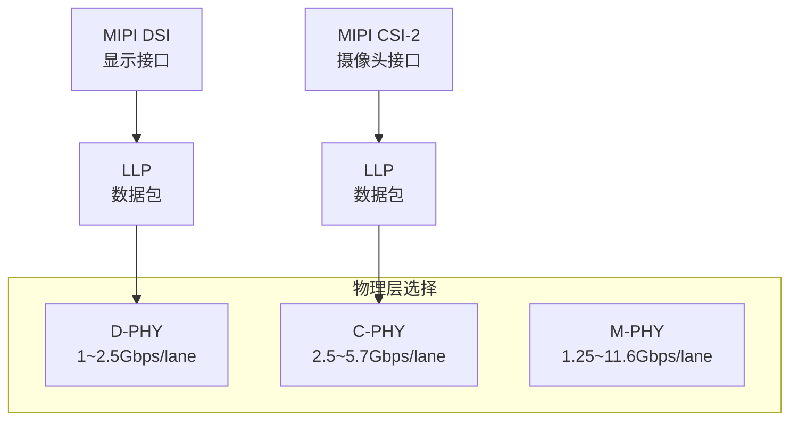

# MIPI Alliance 系列协议基础认知 [I→E]

> **本章学习目标**：
> - 理解 MIPI Alliance 作为移动生态标准组织的角色
> - 掌握 DSI/CSI/D-PHY/C-PHY/M-PHY 的分层架构与速率
> - 了解 D-PHY 的 HS/LP 双模式与 C-PHY 的三相编码

---

## MIPI Alliance 的诞生：统一移动接口

---

### <strong>为什么需要 MIPI：移动设备的接口"巴别塔"</strong>

MIPI Alliance成立于 2003 年，
由 ARM、Intel、Nokia、Samsung、TI 等公司发起。

在 MIPI 之前，移动设备的接口混乱：
 
* 显示屏：各厂商用私有的并行 RGB 接口
 
* 摄像头：并行接口，引脚多，EMI 差
 
* RF 射频：DigRF、SLIMbus 各不兼容
 

MIPI 定义了移动设备的全套接口标准：DSI（显示）、CSI（摄像头）、D-PHY/C-PHY/M-PHY（物理层）、SLIMbus/I3C/SoundWire（控制/音频）。
 

类比：MIPI 如同"手机接口的 USB 组织"——就像 USB 统一了 PC 外设接口，MIPI 统一了手机内部所有芯片之间的接口。
 

---

### <strong>MIPI 协议栈：物理层 + 协议层 + 应用层</strong>

| 层级 | 协议 | 功能 |
| --- | --- | --- |
| 应用层 | DSI / CSI-2 / I3C | 显示、摄像头、传感器 |
| 协议层 | Low Level Protocol | 打包、ECC、CRC |
| 物理层 | D-PHY / C-PHY / M-PHY | 高速串行传输 |

---

### <strong>D-PHY：HS 与 LP 双模式</strong>

D-PHY是 MIPI 最常用的物理层：

| 模式 | 速率 | 电压 | 用途 |
| --- | --- | --- | --- |
| HS（High Speed） | 80Mbps~2.5Gbps/lane | 200mV 差分 | 数据传输 |
| LP（Low Power） | 10Mbps | 1.2V 单端 | 控制、节能 |

D-PHY 的关键设计：HS 和 LP 复用同一对线，通过电平切换（200mV vs 1.2V）自动切换模式。LP 模式下功耗极低（μW 级），HS 模式下带宽极高。
 

---

## 本章小结

| 概念 | 一句话总结 |
| --- | --- |
| MIPI | 2003 年成立的移动接口标准组织 |
| DSI | 显示串行接口，手机屏 |
| CSI-2 | 摄像头串行接口，2/4 lane |
| D-PHY | HS/LP 双模式，4 lane |
| C-PHY | 三相编码，3 lane，更高带宽 |
| M-PHY | 最高速率，UFS/PCIe 替代 |

---

## 练习

1. 为什么 D-PHY 需要 HS 和 LP 两种模式？不能一直用 HS 吗？
2. C-PHY 的三相编码相比 D-PHY 的二进制编码有什么优势？
3. 计算 4-lane D-PHY v2.0（2.5Gbps/lane）传输 4K@60fps 视频（12bit 色深）的理论带宽是否够用。
