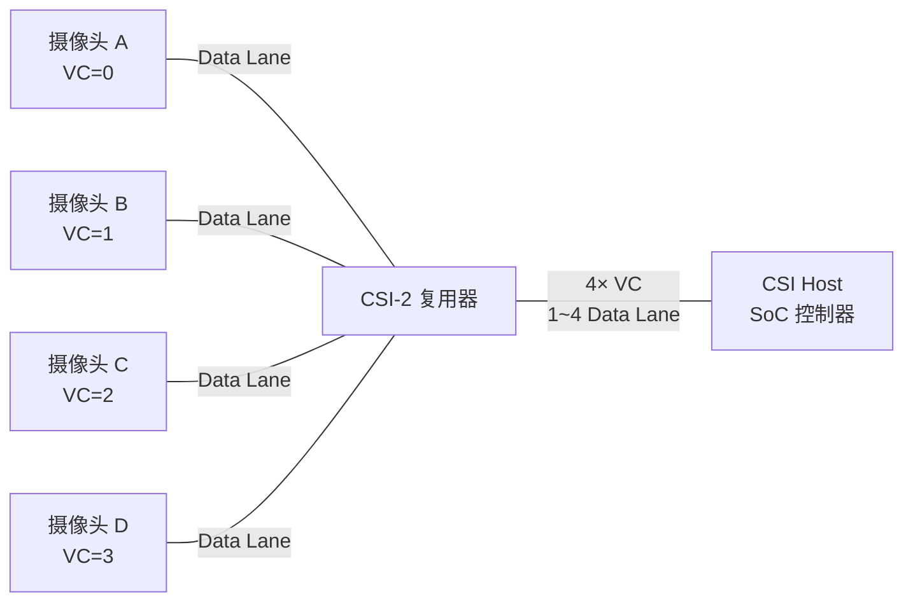
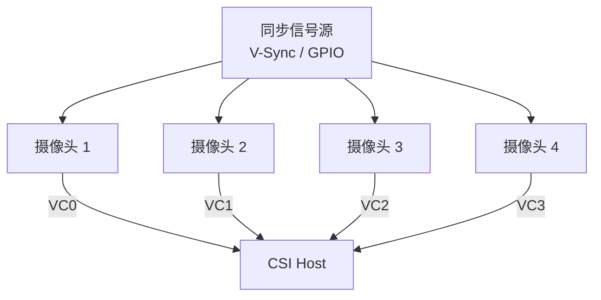

# MIPI-CSI-2 摄像头接口 [I]

> **本章学习目标**：
> - 理解 CSI-2 数据类型 的编码规则与像素格式映射
> - 掌握虚拟通道（Virtual Channel）的多摄像头复用机制
> - 了解多摄像头系统的同步设计与带宽分配策略

---

## CSI-2 数据类型

---

### <strong>数据类型编码体系</strong>

I 
CSI-2（Camera Serial Interface 2） 定义了丰富的数据类型编码，标识不同格式的像素数据与嵌入式控制信息。 

CSI-2 数据类型如同快递公司的包裹分类标签——0x2A 是"生鲜 RGB888"，0x1E 是"急件 YUV422"，0x00 是"内部通知（帧同步）"。 

**表 3-1：CSI-2 数据类型表**

| 数据类型 | 代码 | 说明 | 每像素位数 |
| --- | --- | --- | --- |
| Null | 0x10 | 填充数据 | — |
| Blank | 0x11 | 空白数据 | — |
| Embeded | 0x12 | 嵌入式非图像数据 | — |
| YUV420 8-bit | 0x18 | YUV420 8-bit | 12 |
| YUV420 10-bit | 0x19 | YUV420 10-bit | 15 |
| YUV422 8-bit | 0x1E | YUV422 8-bit | 16 |
| YUV422 10-bit | 0x1F | YUV422 10-bit | 20 |
| RGB565 | 0x22 | RGB565 | 16 |
| RGB666 | 0x23 | RGB666 | 18 |
| RGB888 | 0x24 | RGB888 | 24 |
| RAW6 | 0x28 | RAW6 | 6 |
| RAW7 | 0x29 | RAW7 | 7 |
| RAW8 | 0x2A | RAW8 | 8 |
| RAW10 | 0x2B | RAW10 | 10 |
| RAW12 | 0x2C | RAW12 | 12 |
| RAW14 | 0x2D | RAW14 | 14 |
| Frame Start | 0x00 | 帧起始码 | — |
| Frame End | 0x01 | 帧结束码 | — |
| Line Start | 0x02 | 行起始码 | — |
| Line End | 0x03 | 行结束码 | — |

<strong>1. RAW 数据类型</strong> 
* RAW8/10/12/14 是 Bayer 格式原始数据，直接来自传感器 ADC。 
* RAW10 和 RAW12 是最常用的工业/车载场景格式，平衡精度与带宽。 

<strong>2. 帧同步码</strong> 
* Frame Start (0x00) 和 Frame End (0x01) 标记帧边界。 
* Line Start (0x02) 和 Line End (0x03) 标记行边界。 
* 同步码帮助接收端解析像素流，恢复二维图像。 

---

## 虚拟通道

---

### <strong>虚拟通道多路复用</strong>

I 
虚拟通道（Virtual Channel, VC） 允许在同一条物理 CSI-2 链路上复用最多 4 路独立数据流。 

**表 3-2：虚拟通道分配**

| VC | 二进制 | 典型用途 | 应用场景 |
| --- | --- | --- | --- |
| 0 | 00 | 主摄像头（后置广角） | 手机拍照 |
| 1 | 01 | 副摄像头（前置自拍） | 视频通话 |
| 2 | 10 | 深度摄像头（ToF/结构光） | 人脸识别 |
| 3 | 11 | 辅助摄像头（长焦/微距） | 变焦拍摄 |

<strong>3. VC 标识机制</strong> 
* 每个 CSI-2 短包/长包的 Data Identifier 高 2 bit 为 VC 标识。 
* 接收端根据 VC 分离数据，送入独立的图像处理流水线。 

<strong>4. 虚拟通道仲裁</strong> 
* 固定优先级：VC0 优先级最高，VC3 最低。 
* Round Robin：各 VC 轮流占用总线。 
* 可配置权重：根据应用场景动态调整带宽分配。 

---

## 多摄像头

---

### <strong>多摄像头同步设计</strong>

I 
多摄像头系统 需要帧级同步，确保多路图像在相同时间戳采集，用于立体视觉、全景拼接或融合算法。 

**表 3-3：多摄像头带宽分配**

| 配置 | 摄像头数 | 分辨率 | 帧率 | 数据类型 | 总带宽 | 所需 Lane |
| --- | --- | --- | --- | --- | --- | --- |
| 双目立体 | 2 | 1920×1080 | 30fps | RAW12 | ~1.5 Gbps | 4 |
| 四目全景 | 4 | 1280×720 | 30fps | RAW10 | ~2.2 Gbps | 4 |
| 手机三摄 | 3 | 4000×3000 | 30fps | RAW10 | ~7.2 Gbps | 4+4 |
| 车载 ADAS | 4 | 1920×1080 | 60fps | RAW12 | ~6.0 Gbps | 4+4 |

<strong>5. 帧同步实现</strong> 
* 外部 V-Sync：所有摄像头共享同一垂直同步信号。 
* MIPI 帧起始码对齐：Host 检测各 VC 的 Frame Start 时间戳差。 
* 软件同步：ISP 流水线根据时间戳对齐多路图像缓冲。 

<strong>6. 带宽优化策略</strong> 
* 动态分辨率切换：低光场景降采样，节省带宽。 
* VC 分时复用：非关键摄像头降低帧率，错峰传输。 
* RAW 压缩：部分 SoC 支持 Line-based 压缩（如 Samsung LLWPC）。 

---

## 本章小结

| 小节 | 核心要点 |
| --- | --- |
| CSI-2 数据类型 | 0x00~0x2D 编码，RAW8/10/12/14 + RGB + YUV + 同步码 |
| 虚拟通道 | VC[1:0] 标识，4 路复用，优先级/RR/权重三种仲裁 |
| 多摄像头 | 帧同步（V-Sync/GPIO），带宽分配，动态降采样优化 |

---

## 练习

1. **数据类型分析**：某车载摄像头输出 1920×1080@30fps，Bayer RGGB，12-bit ADC。计算每帧 RAW12 数据量，并选择正确的 CSI-2 数据类型代码。

2. **VC 设计**：设计一个手机三摄系统的 VC 分配方案：主摄 48MP、超广角 12MP、长焦 8MP。分析是否需要多条 CSI-2 链路，以及如何分配 VC。

3. **同步精度**：双目立体系统要求左右帧时间差 < 1 ms。给出 3 种同步实现方案（硬件/协议/软件层面各一种），并比较精度与实现复杂度。
