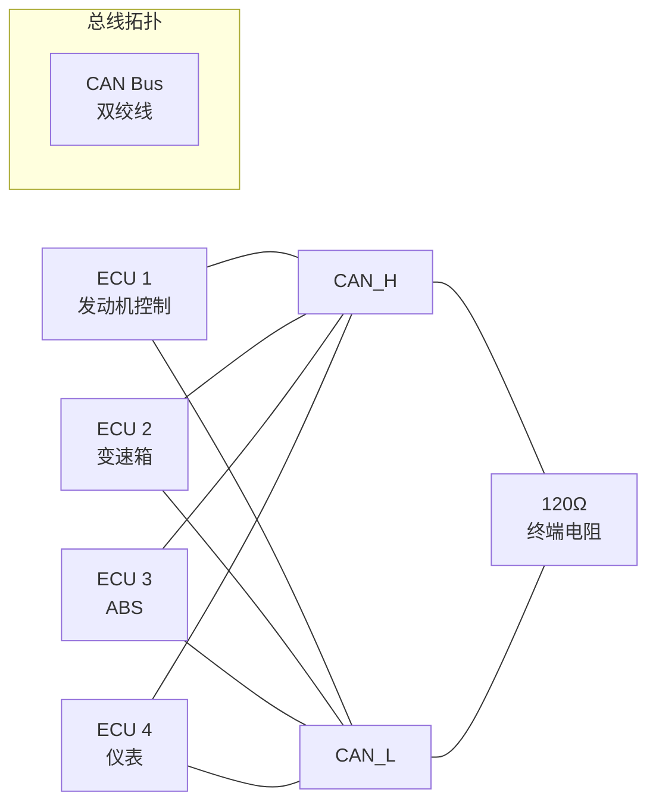

# CAN 总线基础认知与帧格式 [I→E]

> **本章学习目标**：
> - 理解 <span class="red">CAN（Controller Area Network）</span> 的差分仲裁机制
> - 掌握 <span class="red">标准帧/扩展帧</span> 的位域结构与 CRC 校验
> - 了解 CAN FD 的加速与双速率机制

---

## CAN 的诞生：汽车电子的通信标准

---

### <strong>为什么需要 CAN：汽车线束的"减重手术"</strong>

<span class="red">CAN</span>由 Bosch 在 <span class="green">1986 年</span>提出，
<span class="green">1991 年</span>首次用于 Mercedes-Benz W140。

在 CAN 出现之前，汽车使用点对点布线：
<br>
* 每个传感器/执行器单独拉线到 ECU
<br>
* 一辆高端车可能有 <span class="blue">2 公里以上的铜线、30kg 线束</span>
<br>
* 增加一个功能需要增加一整组线束
<br>

<span class="blue">CAN 用一根双绞线连接所有 ECU，采用广播方式通信。一辆现代车的 CAN 网络只需几十米双绞线，替代了数公里的点对点线束。</span>
<br>

<span class="blue">类比：CAN 如同"小区微信群"——所有业主（ECU）都在同一个群里，谁有事（传感器数据）直接广播，所有人都能看到，不需要单独打电话（点对点）。</span>
<br>

---

### <strong>CAN 的物理层：差分信号与终端电阻</strong>

<span class="red">CAN</span>使用 ISO 11898-2 标准物理层：

| 信号 | 显性（Dominant） | 隐性（Recessive） | 说明 |
| --- | --- | --- | --- |
| CAN_H | 3.5V | 2.5V | 差分正端 |
| CAN_L | 1.5V | 2.5V | 差分负端 |
| 差分电压 | 2.0V | 0V | 显性 = 逻辑 0，隐性 = 逻辑 1 |



<span class="blue">CAN 的关键电气特性：显性位（0）会覆盖隐性位（1）。这是仲裁机制的基础——如果两个节点同时发送，发 0 的节点赢得总线。</span>
<br>

---

### <strong>CAN 帧格式：标准帧与扩展帧</strong>

<span class="red">CAN 2.0A 标准帧</span>（11-bit ID）：

```text
标准帧位域（不含填充位）：

SOF [1] + ID[11] + RTR[1] + IDE[1] + r0[1] + DLC[4] + Data[0~64] + CRC[15] + ACK[2] + EOF[7] + IFS[3]

总计：44 bit（最小，无数据）~ 132 bit（最大，8 byte 数据）
```

| 字段 | 长度 | 说明 |
| --- | --- | --- |
| SOF | 1 bit | 起始帧（显性位，同步） |
| ID | 11 bit | 标识符，决定优先级 |
| RTR | 1 bit | 0=数据帧，1=远程帧 |
| IDE | 1 bit | 0=标准帧，1=扩展帧 |
| DLC | 4 bit | 数据长度码（0~8） |
| Data | 0~64 bit | 有效数据 |
| CRC | 15 bit | CRC15 校验 |

<span class="blue">CAN 的 ID 越小优先级越高：ID=0x000 最高优先级，ID=0x7FF 最低。仲裁期间所有节点同时发 ID，逐位比较，发 1 但检测到 0 的节点自动退让。</span>
<br>

---

### <strong>CAN FD：更快的 CAN</strong>

<span class="red">CAN FD（Flexible Data-rate）</span>由 Bosch 在 <span class="green">2012 年</span>发布：

| 特性 | CAN 2.0 | CAN FD | 差异 |
| --- | --- | --- | --- |
| 数据段速率 | 1 Mbps | 最高 8 Mbps | 加速数据段 |
| 仲裁段速率 | 1 Mbps | 1 Mbps（不变） | 保证兼容性 |
| 数据长度 | 8 byte | 64 byte | 大包减少开销 |
| CRC | 15 bit | 17/21 bit | 更强的校验 |

---

## 本章小结

| 概念 | 一句话总结 |
| --- | --- |
| CAN | Bosch 1986 年提出的汽车总线，差分仲裁 |
| 显性/隐性 | 0=显性（2.0V差分），1=隐性（0V差分） |
| 标准帧 | 11-bit ID，0~8 byte 数据 |
| 扩展帧 | 29-bit ID，0~8 byte 数据 |
| CAN FD | 2012 年发布，数据段最高 8Mbps，64 byte |
| 仲裁 | ID 越小优先级越高，逐位比较 |

---

## 练习

1. 为什么 CAN 的显性位能覆盖隐性位？画出两个节点同时发送时的总线电平。
2. CAN 标准帧的 ID=0x123 和 ID=0x200 同时发送，谁会赢得仲裁？为什么？
3. CAN FD 为什么要保持仲裁段速率不变，只加速数据段？
