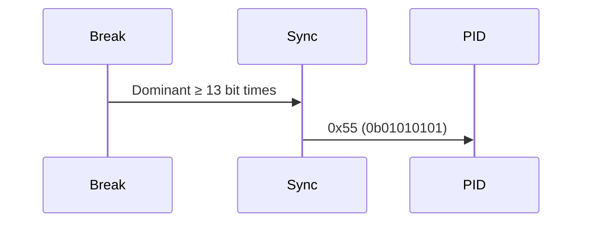

# LIN 帧格式与校验和 [B]

> **本章学习目标**：
> - 理解<span class="red">LIN 帧格式</span>各字段的电气特征与功能
> - 掌握 Break 字段、Sync 字节、PID 的时序要求
> - 了解校验和（Checksum）的经典型与增强型计算规则

---

## Break 字段

---

### <strong>Break 字段的电气定义</strong>

<span class="badge-b">B</span><br>
<span class="red">Break 字段</span>是 LIN 帧的起始标志，由一个显性电平持续至少 13 位时间（Dominant）组成。
<br>

<span class="blue">Break 字段如同课堂上的"安静"口令——13 个拍子的持续低音，让所有节点停下当前事务，准备接收新指令。</span><br>



<span class="orange"><strong>1. Break 字段结构</strong></span><br>
* Break 域（Dominant）：至少 13 个连续的显性位，最长可达数个毫秒。
<br>
* Break 定界符（Delimiter）：至少 1 个隐性位，标识 Break 结束。
<br>

**表 2-1：Break 字段时序参数**

| 参数 | 最小值 | 典型值 | 最大值 | 单位 |
| --- | --- | --- | --- | --- |
| Break 长度 | 13 | 13~15 | — | Tbit |
| Break 定界符 | 1 | 1 | — | Tbit |
| 总线空闲 | — | — | — | — |

<span class="orange"><strong>2. Break 检测机制</strong></span><br>
* 从节点持续监听总线，检测到 ≥ 11 个连续显性位即判定为 Break。
<br>
* 检测后从节点复位帧接收状态机，准备接收 Sync 字节。
<br>

---

## Sync 字节

---

### <strong>同步机制与波特率校准</strong>

<span class="badge-b">B</span><br>
<span class="red">Sync 字节</span>固定为 0x55（二进制 01010101），用于从节点校准自身波特率。
<br>

<span class="blue">Sync 字节如同钢琴调音叉——5 个高低交替的明确节拍，让从节点精确测算主节点的"演奏速度"。</span><br>

<span class="orange"><strong>1. Sync 字节结构</strong></span><br>
* 固定值 0x55，即显性-隐性-显性-隐性交替的 5 个下降沿。
<br>
* 从节点测量相邻下降沿的时间间隔，推算出 1 位时间（Tbit）。
<br>

**表 2-2：Sync 字节时序分析**

| 边沿 | 时刻 | 累积时间 | 说明 |
| --- | --- | --- | --- |
| Start bit 下降沿 | T0 | 0 | 帧起始 |
| Bit1→Bit2 下降沿 | T1 | 2 × Tbit | 第 2 个下降沿 |
| Bit3→Bit4 下降沿 | T2 | 4 × Tbit | 第 3 个下降沿 |
| Bit5→Bit6 下降沿 | T3 | 6 × Tbit | 第 4 个下降沿 |
| Bit7→Bit8 下降沿 | T4 | 8 × Tbit | 第 5 个下降沿 |

<span class="orange"><strong>2. 波特率计算</strong></span><br>
* 从节点测量 T4 - T0 的时间差，该差值理论上等于 8 × Tbit。
<br>
* 实测波特率 = 8 / (T4 - T0)。
<br>
* 允许 ±14% 的初始偏差，Sync 校准后需达到 ±1.5% 以内。
<br>

---

## PID + 数据 + 校验

---

### <strong>受保护标识符（PID）</strong>

<span class="badge-b">B</span><br>
<span class="red">PID（Protected Identifier）</span>是 LIN 帧的标识符字段，由 6 位 ID 与 2 位校验组成。
<br>

**表 2-3：PID 字段结构**

| 位域 | 位宽 | 说明 |
| --- | --- | --- |
| ID[5:0] | 6 bit | 帧标识符，取值 0x00~0x3F |
| P0 | 1 bit | ID[0] ⊕ ID[1] ⊕ ID[2] ⊕ ID[4] |
| P1 | 1 bit | ¬(ID[1] ⊕ ID[3] ⊕ ID[4] ⊕ ID[5]) |

<span class="orange"><strong>1. PID 校验计算</strong></span><br>
* P0 = ID0 ⊕ ID1 ⊕ ID2 ⊕ ID4。
<br>
* P1 = ¬(ID1 ⊕ ID3 ⊕ ID4 ⊕ ID5)。
<br>
* 该设计可检测所有单 bit 错误与多数双 bit 错误。
<br>

<span class="orange"><strong>2. 数据字段</strong></span><br>
* 数据域长度由 PID 隐式决定，固定为 1、2、4 或 8 字节。
<br>
* 发送顺序：低位字节先发（LSB first），每字节低位 bit 先发。
<br>

---

### <strong>校验和计算</strong>

<span class="badge-b">B</span><br>
<span class="red">LIN 校验和</span>有两种类型：经典型（Classic，LIN 1.x）与增强型（Enhanced，LIN 2.x）。
<br>

**表 2-4：校验和类型对比**

| 类型 | 覆盖范围 | 适用版本 | 安全性 |
| --- | --- | --- | --- |
| Classic | 仅数据字节 | LIN 1.x | 低 |
| Enhanced | 数据字节 + PID | LIN 2.x+ | 高 |

<span class="orange"><strong>3. 校验和计算示例</strong></span><br>

```c
// 经典型校验和计算（仅数据）
// 数据: {0x01, 0x02, 0x03, 0x04}
uint8_t classic_checksum(uint8_t *data, uint8_t len) {
    uint16_t sum = 0;
    for (int i = 0; i < len; i++) {
        sum += data[i];
        if (sum >= 0x100) sum -= 0xFF;  // 进位回卷
    }
    return (uint8_t)(0xFF - sum);  // 取反
}
// 结果: 0xE9

// 增强型校验和计算（数据 + PID）
// PID = 0x2C, 数据: {0x01, 0x02, 0x03, 0x04}
uint8_t enhanced_checksum(uint8_t pid, uint8_t *data, uint8_t len) {
    uint16_t sum = pid;
    for (int i = 0; i < len; i++) {
        sum += data[i];
        if (sum >= 0x100) sum -= 0xFF;
    }
    return (uint8_t)(0xFF - sum);
}
// 结果: 0xC5
```

<span class="blue">增强型校验和覆盖 PID，可检测标识符传输错误，防止数据被写入错误寄存器。</span><br>

---

## 本章小结

| 小节 | 核心要点 |
| --- | --- |
| Break 字段 | ≥13 bit 显性 + 1 bit 隐性定界符，从节点检测后复位状态机 |
| Sync 字节 | 固定 0x55，5 个下降沿用于从节点波特率校准，目标精度 ±1.5% |
| PID+数据+校验 | 6-bit ID + 2-bit 奇偶校验，数据 1/2/4/8 byte，Classic/Enhanced 两种校验和 |

---

## 练习

1. **波特率校准**：某从节点晶振标称 20 MHz，实际偏差 +12%。主节点发送 Sync 字节后，从节点测得 T4-T0 = 38.4 μs。计算从节点应调整后的分频系数，使波特率达到 19.2 kbps。

2. **PID 校验**：给定 ID = 0x15（二进制 010101），计算 P0 与 P1。若传输中 ID[2] 发生翻转，接收端能否检测？

3. **校验和验证**：某 LIN 2.x 帧 PID=0x2C，数据={0x11, 0x22, 0x33, 0x44}。使用增强型校验和算法计算 Checksum 字节值，并验证。
